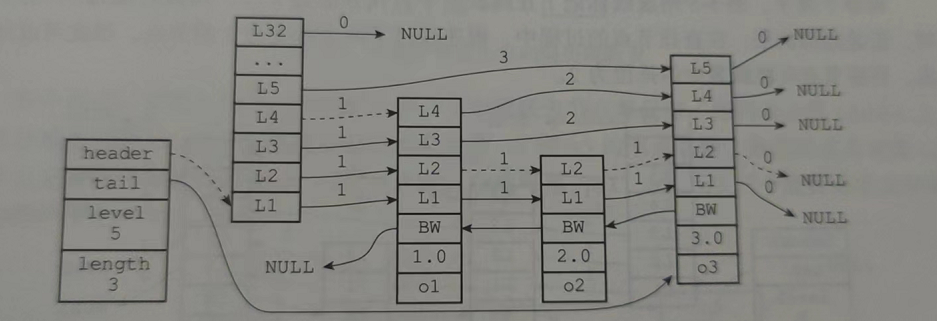
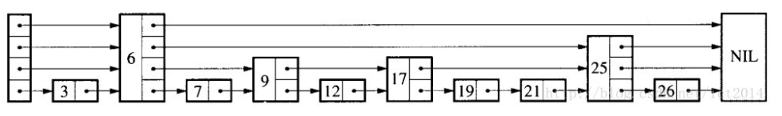
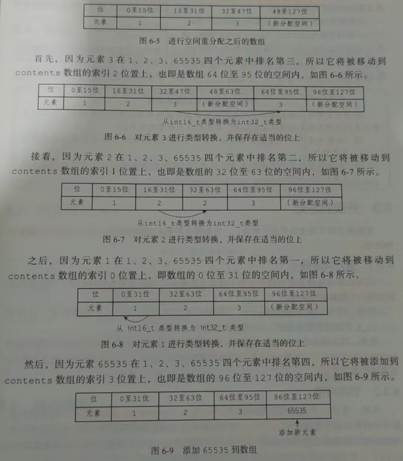

## 1. SDS动态字符串:

```c
struct sdshdr {
    int len;
    int free;
    char buf[];
}
```

上面这串代买就是Redis中动态字符串的定义代码, redis虽然是由c语言开发的, 但是redis并没有直接使用c语言传统字符串作为默认的字符串表示, 而是自己实现了一种`动态字符串`的抽象类型用作redis中默认字符串表示.

> 传统c字符串只会作为字符串字面量, 在某些无须对字符串值进行修改的地方. 而当redis需要一个可以被修改的字符串值时, redis就会使用SDS来表示字符串值, 比如: 所有包含字符串的键值对在底层都是由SDS实现的

**`举个例子:`**

```sh
redis > set msg "hello world"
```

- key: 底层是一个保存着字符串`msg`的sds
- value: 底层是一个保存着字符串`hello world`的sds

```sh
redis> RPUSH fruits "apple" "banana" "cherry"
```

- key: 底层是一个保存着字符串`msg` 的sds
- value: 底层是一个列表对象, 该列表对象含有三个分别保存着`apple`, `banana`, `cherry` 的sds元素

**`SDS使用在哪些地方:`**

1. 字符串值: 
2. 缓冲区: AOF模块的AOF缓冲区, 客户端状态中的输入缓冲区.

### 1.1 SDS的定义:

每个`sds.h/sdshdr`结构体表示一个SDS值:


- free: 0表示该sds中, buf数组没有剩余空间
- len: 5表示buf数组中保存了一个5字节长度的字符串.`'\0'是传统c字符串中结束标记符号, 是个1字节的空字符串, 并不会算在len里面`

- buf: buf是一个char类型的数组, 图中buf数组前五个字节分别保存了 `'R'`, `'e'`, `'d'`, `'i'`,`'s'`5个字符.

> 为什么要使用'\0'来表示sds字符的结束?
>
> 主要是为了复用c语言中对字符串的一些操作函数, 例如`printf`等函数

### 1.2 c字符串和SDS的区别:

SDS和c都采用长度为`N+1`的字符数组来表示长度为`N`的字符串, 并且总是`'\0'`标志字符串的结束.

c字符串无法在`安全性`, `效率`, `功能`等方面满足`Redis的需求`

#### 1.2.1 参数复杂度获取字符串的长度:

- `由于传统c语言字符串没有记录有效字符长度` , 所以在获取字符串长度时, 需要一次遍历整个字符串, 直到遇到结束标志`'\0'`, `时间复杂度为O(N)`.

- 对于SD而言, 其保存了有效字符长度`即len属性`, 所以在获取字符串长度时, 只需要读取len属性, `时间复杂度为O(1)`.

#### 1.2.2 防止缓冲区溢出:

缓冲区指的是字符串剩余空间长度.

- `由于c字符串不记录字符串剩余空间长度`, 在进行字符串拼接的时候, 需要手动分配足够的空间给目标字符串, 以确保目标字符串有足够的空间拼接源字符串.

  

- `SDS字符串记录了buf数据剩余字节数, 在进行拼接之前, SDS会检测剩余空间是否足够, 如果不够会先扩展SDS的buf数组`.

#### 1.2.3 减少修改字符串时带来的内存重分配次数:

内存重分配涉及复杂的算法, 并且可能需要重新执行系统调用, 这是一个比较耗时的操作:

- 对于传统c字符串而言, 由于其不记录剩余空间, 且c字符串底层实现总是一个`N+1`个字符长度的数组, 所以 `在增长字符串的操作时`, 首先需要通过内存重分配来扩展底层数组的空间大小, 以保证能够存放新字符串. `在缩短字符串操作时`, 需要通过内存重分配来释放字符串不再需要的底层数组空间.

- SDS字符串通过`未使用空间(free)`属性, 解除了字符串长度和底层数组之间的关联关系 --- SDS中, `buf数组的长度不一定是SDS字符串的长度+1`, 因为buf数组还包含了未使用的空间长度.

  - **`空间预分配`**: 空间预分配是用于减少`增长`字符串时的内存重分配操作, 在SDS字符串进行增长字符串操作时, 程序不仅仅会为SDS分配修改所需要的空间, 还会为SDS分配额外的未使用空间. 额外分配的未使用空间数量计算公式

    - 如果对SDS字符串进行修改之后, SDS的长度小于(也就是len属性)`小于1MB`, 那么程序分配和len属性一样大小的未使用空间. 即`free 属性等于len属性`.

      > 如果进行修改之后， SDS 的 len 将变成 13 字节， 那么程序也会分配 13 字节的未使用空间， SDS 的 buf 数组的实际长度将变成 13 + 13 + 1 = 27 字节（额外的一字节用于保存空字符）。

    - 如果对SDS字符串进行修改之后, SDS的长度`大于等于1MB`, 那么程序将固定分配`1MB`的未使用空间, 即`free属性为1MB`

      > 如果对 SDS 进行修改之后， SDS 的长度将大于等于 1 MB ， 那么程序会分配 1 MB 的未使用空间。 举个例子， 如果进行修改之后， SDS的 len 将变成 30 MB ， 那么程序会分配 1 MB 的未使用空间， SDS 的 buf 数组的实际长度将为 30 MB + 1 MB + 1 byte 。

    未使用空间计算公式伪代码:

    ```java
    newLen = len + addLen;
    if (newLen < 1027 * 1024) {
        newLen *= 2;
    } else {
        newLen += 1024 * 1024;
    }
    
    sds.setFree(newLen - len);
    ```

    在扩展SDS空间之前, SDS会先去检查未使用空间是否足够, 如过足够就会直接使用未使用空间, 无需进行内存重新分配. 所以 `连续执行N次增长操作, 累充重分配次数从必定N次减少到最多N次`

- **`惰性空间释放`**: 惰性空间释放是用于减少`缩短`字符串时的内存重分配操作. 当执行缩短字符串操作的时候, 缩短后多出来的空间(buf数组中不再被字符占用的空间), 会被记录在`free属性`上, 而不是立刻进行内存重分配去释放这些多出来的空间.

  

  > SDS有响应的API, 在需要时真正的释放SDS未使用的空间, 不会造成内存浪费.

#### 1.2.4 二进制安全:

数据库一般都是用来保存文本数据, 但是用数据库存放二进制数据的场景并不少见.

- c字符串中字符必须符合某种编码格式(比如ASCⅡ), 并且除了字符串末尾之外, 字符串里面不能含有空字符, 否则会被认为这是字符串结束的标志. 这些限制造成c字符串只能存放文本数据, 不能存放`图像`, `音频`, `视频`, `压缩文件`等二进制数据.
- SDS的API都是二进制安全的, 所有API都会以处理二进制的方式来处理存放在buf数组里面的数据, 程序不会对数据进行任何的限制, 过滤或者假设 --- 所见即所得. 因为SDS使用len属性来保存使用字节数量, 所以不会存在像c字符串哪样因为特殊字符被截断的情况.

#### 1.2.5 兼容部分C字符串函数:

SDS的所有API都是二进制安全的, 并且与c字符串一样以`空字符结尾`. SDS的API总是会将SDS中保存的数据的末尾设置为空字符, 并且总是会在为buf数组分配空间时, 多分配一个字节来容纳结束表示`空字符`. 

这样设计的目的的是为了让那些保存文本数据的SDS可用复用`<string.h>`库里面的函数.

#### 1.2.6 总结:

c字符串与SDS的区别:

| c字符串                                | SDS                                    |
| -------------------------------------- | -------------------------------------- |
| 获取字符串长度的时间复杂度为O(N)       | 获取字符串长度的时间复杂度为O(1)       |
| API不安全, 可能造成buf数组溢出         | API安全, 不会造成buf数组溢出           |
| 修改字符串长度N次就会造成N次内存重分配 | 修改字符串长度N次最多造成N次内存重分配 |
| 只能保存文本数据                       | 可以保存文本和二进制数据               |
| 可以使用<string.h>中全部函数           | 可以使用<string.h>中部分函数           |


## 2. 链表:

链表提供了高效的节点重排能力, 以及顺序性的节点访问方式, 并且可以通过增删节点来灵活的调整链表的长度.

**`链表在redis中的应用:`**

- list的底层时间之一就是链表. 当一个list包含了数量较多的元素, 或者元素都是较长的字符串时, redis就会采用链表作为列表键的底层实现
- 发布订阅, 慢查询, 监视器等功能使用到了链表
- Redis服务器使用链表来保存多个客户端的状态信息
- 使用链表来构建客户端输出缓冲区

### 2.1 链表的定义:

`adlist.h/listNode`, `adlist.sh/list`

**1. 节点定义:**

```c
typedef struct listNode {

    // 前置节点
    struct listNode *prev; //如果是list的头结点，则prev指向NULL

    // 后置节点
    struct listNode *next;//如果是list尾部结点，则next指向NULL

    // 节点的值
    void *value;

} listNode;
```

**2. 链表持有对象定义:**

```c
typedef struct list {

    // 表头节点
    listNode *head;

    // 表尾节点
    listNode *tail;

    // 节点值复制函数
    void *(*dup)(void *ptr);

    // 节点值释放函数
    void (*free)(void *ptr);

    // 节点值对比函数
    int (*match)(void *ptr, void *key);

    // 链表所包含的节点数量
    unsigned long len;

} list;
```

> 虽然通过多个listNode就能够构成链表, 但是为了操作方便通过list来持有链表.

list结构为链表提供了头尾指针, 以及链表长度计数器, 以及一些特殊功能函数:

- dup函数 : 用于复制链表节点所保存的值.
- free函数 : 用于释放链表节点锁保存的值:
- match函数 : 用于对比链表节点所保存的值, 和另外一个输入值是否相等.

大致结构如图:


### 2.2 链表的特点:

1. 双端: 链表节点包含prev和next指针, 获取某个节点的前驱节点和后继节点的复杂度都是O(1).
2. 无环: 头节点的prev, 尾结点的next, 都指向null, 对链表的访问以null为终点.
3. 带头节点和尾结点: 通过list结构的head指针和tail指针, 程序在获取头尾节点的时间复杂度为O(1).
4. 带链表长度计数器: list结构的len属性来对list持有的链表节点进行计数, 获取链表中节点数量的时间复杂度为O(1).
5. 多态: 链表节点使用 `Void * `来保存节点的值, 并且可以通过list结构的dup, free, match三个属性来设置类型对应的特定函数, 因此链表可以保存不同的值.


## 3. 字典表:

`dict.h/dictEntry`, `dict.h/dictht`, `dict.h/dict`, `dict.h/dictType`

Redis的字典使用哈希表作为底层实现, 一个哈希表里面可以有多个哈希表节点, 而每一个哈希表节点就保存了一个字典表中的键值对.

### 3.1 字典的实现:

#### 3.1.1 哈希表节点:

```c
typedef struct dictEntry { 
    // 键
    void *key; //对应一个robj
    
    // 值
    union {
        void *val;
        uint64_t u64;
        int64_t s64;//一般记录的是过期键db->expires中每个键的过期时间  单位ms
    } v;//对应一个robj

    // 指向下个哈希表节点，形成链表
    struct dictEntry *next;

} dictEntry;
```


- key : 保存键值对中的键.
- v: 保存键值对保存键值对中的值, 该值可以是一个指针, uint64_t整数, 或者int64_t整数.
- next: 指向下一个哈希表节点, redis中的哈希冲突是`通过链地址法来解决的, 并且是头插法`

> dictEntry结构在哈希表中类比于 HashMap中的node节点.

#### 3.1.2 hash表:

hash表实际上就是一个hash节点数组.

```c
typedef struct dictht {

    //每个具体table[i]中的节点数据类型是dictEntry 结构表示， 每个 dictEntry 结构都保存着一个键值对：
    // 哈希表节点指针数组（俗称桶，bucket）
    // 哈希表数组
    dictEntry **table;//table[idx]指向的是首个dictEntry节点，见dictAddRaw  创建初始化table桶见dictExpand

    // 哈希表大小
    unsigned long size;//表示该hash中实际桶的个数, 即hash数组的大小
    
    // 哈希表大小掩码，用于计算索引值
    // 总是等于 size - 1 // 指针数组的长度掩码，用于计算索引值   生效见_dictKeyIndex
    unsigned long sizemask; //sizemask = size-1 因为具体的桶是从0到size-1

    // 该哈希表已有hash节点数量
    unsigned long used;

} dictht;
```


- table: 是一个指针数组, 每个元素都是指向dictEntry的指针.
- size: table数组的长度
- used: hash表目前已有dictEntry的数量
- sizemask: 索引掩码, 用来计算dictEntry应该放在table数组的哪个下标上的, `总是等于size-1`.

#### 3.1.3 字典:

```c
typedef struct dict {

    // 类型特定函数
    dictType *type;

    // 私有数据 
    void *privdata;

    // 哈希表
    dictht ht[2];   

    // rehash进度标记, 记录的是当前rehash进行到了哪个下标
    int rehashidx; 

    // 目前正在运行的安全迭代器的数量
    int iterators; /* number of iterators currently runn	ing */

} dict;
```

- ht[2]: 是一个包含两个`hash表数组`元素的数组. 通常, `ht[1]`只会在`对ht[0]进行rehash的时候`, 将元素移动到`ht[1]`上.
- rehashidx: 在进行rehash的时候, 记录当前正在进行rehash的hash表下标.

type和privdata属性是针对不同类型的键值对, 为创建多态字典而设置的

- type: 是一个指向dictType结构的指针, 每个dictType结构保存了一簇用于操作特定类型键值对的函数, redis会为用途不同的字典设置不同的类型特定函数

  ```c
  typedef struct dictType {//函数privdata参数从dict->privdata中获取
  
      // 计算哈希值的函数 // 计算键的哈希值函数, 计算key在hash table中的存储位置，不同的dict可以有不同的hash function.
      unsigned int (*hashFunction)(const void *key);//dictHashKey中执行该函数
  
      // 复制键的函数
      void *(*keyDup)(void *privdata, const void *key);//dictSetKey
  
      // 复制值的函数 //也就是以key为键值计算出一个值来选出对应的hash桶，把key节点放入桶中，同时执行valdup来分配空间存储key对应的value
      void *(*valDup)(void *privdata, const void *obj); //dictSetVal  保存在dictEntry->v->value中，然后在
  
      // 对比键的函数
      int (*keyCompare)(void *privdata, const void *key1, const void *key2);//dictCompareKeys
  
      // 销毁键的函数
      void (*keyDestructor)(void *privdata, void *key);//dictFreeKey
      
      // 销毁值的函数 // 值的释构函数  dictFreeVal  删除hash中的key节点的时候会执行该函数进行删除value
      void (*valDestructor)(void *privdata, void *obj);//dictFreeVal
  
  } dictType;
  ```

- privdata: 保存了需要传给那些类型特定函数的可选参数


### 3.2 hash算法:

redis中hash算法是 除数取余算法, 只不过使用 位运算 进行了优化.

大致流程:

```c
hash = dict->type->hashFunction(k0);
// 假设hash为8, 此时hash表有4个位置
index = hash & dict->ht[0].sizemask = 8 & 3 = 0
```

当字典被用作数据库的底层实现, 或者hash键的底层实现, redis用的hash算法是MurmurHash2算法来计算hash值


### 3.3 解决hash冲突:

当使用hash & sizemask计算出来的下标相同时, 称为hash冲突. redis采用了链地址法来处理hash冲突, 就是当发生hash冲突时, 将相同下标的dictEntry通过next指针连接成一个链表, 并且为了插入的效率, 链表新元素总是添加到表头的位置.


### 3.4 rehash:

随着hash表dictEntry节点的不断增多或者减少, redis为了保持hash表的负载因子(决定元素均匀分布的一个元素)维持在一个合适范围内, 需要对hash表进行适当的扩缩容.

rehash的步骤:

1. 为字典的ht[1]hash表分配空间, 该空间大小取决于要执行的操作, 以及ht[0].size的值:
   - 如果是扩容, 那么ht[1]的大小为`第一个大于等于ht[0].used * 2的2的n次方幂`.
   - 如果是缩容, 那么ht[0]的大小为`第一个大于等ht[0].used的 2^n`.
2. 重新计算键的哈希值和索引值, 将键从ht[0]移动到ht[1]对应的下标上, 该成链的成链.
3. 当ht[0]上所有的dictEntry都移动到了ht[1]后, 将ht[1]赋值给ht[0], 并将ht[1]重新创建一个空hash表.

**`hash表的扩展与收缩:`**

- 扩展: 

  当下列条件任意满足时, hash表会自动进行扩展:

  1. 服务器目前没有执行`BGSAVE`和`BFREWRITEAOF`命令, 并且hash表的负载因子大于等于1
  2. 服务器正在执行`BGSAVE`和`BGREWRITEAOF`命令, 并且hash表的负载因子大于等5.

  > 负载因子计算公式: `load_factor = ht[0].used / ht[0].size`
  >
  > 在执行`BGSAVE`和`BGREWRITEAOF`命令的时候, redis需要创建当前服务器进程的子进程, 而大多数操作系统都采用写时复制(copy-on-write)技术来优化子进程的使用效率. 因此为了避免子进程存在期间进行hash表的扩展操作, 避免不必要的内存写入操作, 最大限度地节约内存, 所以需要提高执行扩展操作负载因子限制范围

- 缩容: 

  当hash表的负载因子小于0.1时, hash表会自动执行缩容操作.


### 3.5 渐进式hash:

扩展和收缩时需要将ht[0]上的节点全部rehash到ht[1]中, 但是rehash的过程并不是一次性完成的, 而是分多次, 渐进式地完成的

>原因: 当hash表节点数量是几百万, 几亿的话, 一次性rehash全部到ht[1], 庞大的计算量可能会导致服务器在一段时间内停止服务(cpu使用率过高). 

***`rehash具体步骤`***:

1. 为ht[1]分配空间
2. 将dict.rehashidx置为0, 表示rehash操作开始, 正在rehash ht[0] 表的0下标
3. 在rehash进行期间, 每次对字典执行`添加`, `删除`, `查找`或者`更新`操作时, 程序除了执行指定的操作外, `还会顺带将ht[0]hash表在rehashidx索引上的所有键值对rehash到ht[1],并将rehashidx值增加1`
4. 随着字典操作的不断进行, 最终在某个时刻ht[0]上的节点会全部移动到ht[1]上去.

>  `在渐进式hash执行期间(rehashidx 不为 -1)`:
>
> 1. 所有的`新增`操作只能在`ht[1]`上执行 --- 保证ht[0]包含的键值对数量只减不增.
> 2. `删除`, `查询`, `更新`会在`ht[0], ht[1]`上执行 --- 首先去ht[0]找, 没有再去ht[1]上找.


## 4. 跳跃表:

跳跃表始终有序数据结构, 他通过每个节点中维持多个指向其他节点的指针从而达到快速访问其他节点的目的

跳跃表支持平均O(logN)最坏O(N)复杂度的节点查找, 还可以通过顺序性操作来做批量节点处理.

**`跳跃表在redis中的使用:`** 

- 跳跃表是有序集合键的底层实现之一, 如果一个有序集合包含的元素数量比较多, 又或者有序集合中元素的成员是比较长的字符串时, redis就会使用跳跃表作为有序集合的底层实现.
- 集群节点中redis将跳跃表作为内部数据结构使用.

### 4.1 跳跃表的实现:

`redis.h/zskiplistNode`,`redis.h/zskiplist`.

#### 4.1.1 跳跃表节点:

```c
typedef struct zskiplistNode {

    // member 对象      节点所保存的成员对象。
    robj *obj;

    // 分值
    double score;

    // 后退指针
    struct zskiplistNode *backward;

    // 层
    struct zskiplistLevel {

        // 前进指针
        // 前进指针 
        struct zskiplistNode *forward;

        // 跨度
        unsigned int span;

    } level[];

} zskiplistNode;
```

**`成员介绍:`**

- `sorce`: double类型的浮点数, 跳跃表节点排序的首要依据, `可以相同`

- `obj`: 是一个指针, 指向一个字符串对象, 而字符串对象则保存着一个SDS值. `同一个跳跃表中, obj所指向的成员对象必须是唯一的.`

  > 为什么成员对象必须要是唯一的: 因为跳跃表中节点是按照顺序排列的, 首先按score从小到大依次排列, 当score相同时, 按照成员对象在字典序中的大小从小到大依次排列.

- `backward`: 回退指针, 用于从表尾方向, 向表头方向遍历节点, `backward`总是指向前一个节点(即回退时只能一个一个节点的访问, 不能跳跃式访问).

- `level[]`: 跳跃表节点的level数组可以包含多个元素, 每个元素都包含一个指向其他节点的`前进指针`和一个表示节点之间跨越了多少个几点的`跨度属性`.

  - `forward`: 前进指针, 指向表尾方向的下一个节点.
  - `span`: 跨度, 用于记录两个节点之间的距离. 
    - 节点之间的跨度越大,表示他们距离越远 
    - 指向null的所有前进指针的跨度都为0
    - `跨度实际上是用来计算rank值的`: 在查找某个节点的过程中, 将沿途所访问过的所有层的跨度累计起来, 得到的结果就是目标节点在跳跃表中的rank值. 

  > 每次创建一个新跳跃表节点的时候, 程序都根据幂次定律(越大的数出现的概率越小), 随机生成一个1~32之间的的值作为level数组的大小.
  >
  > level数组的大小就表示层高. 并且level[0]总是第一层, level[1]总是第二层.

**`特殊的跳跃表节点:`**

在跳跃表中, 表头节点是比较特殊的, 他实际上是一个普通的`zskiplist`结构, 说他特殊的是因为他虽然含有`回退指针, 分值, 成员对象`, 但是这些成员属性不会使用到, 并且`表头节点的层高不参与整个跳跃表最大层高的计算, 即跳跃表的最大层高指的是除表头节点后, 其他节点最高有多少层`.


#### 4.1.2 跳跃表:

```c
typedef struct zskiplist { //zslCreate

    // 表头节点和表尾节点 // 头节点，尾节点  注意在创建zskiplist的时候默认有创建一个头节点，见zslCreate
    struct zskiplistNode *header, *tail;

    // 表中节点的数量
    unsigned long length;

    // 目前表内节点的最大层数 level 属性则用于在 O(1) 复杂度内获取跳跃表中层高最大的那个节点的层数量， 注意表头节点的层高并不计算在内。
    int level; 

} zskiplist;
```

**`成员介绍:`**

- `header`: 指向表头节点
- `tail`: 指向表尾节点
- `lenth`: 除去表头节点后, 跳跃含有多少个节点.
- `level`: 除去表头节点后, 跳跃表层高最大的那个节点的层数 


### 4.2 遍历整个跳表:



1. 首先访问表头节点, 然后从第四层的前进指针移动到第二个节点
2. 在第二个节点的时候, 程序沿着第二层的前进指针移动到表中的第三个节点
3. 在第三个节点的时候, 程序沿着第二层的前进指针移动到表中的第四个节点
4. 当程序到达第四个节点的时候, 前进指针指向null, 此次遍历结束

**`更为清晰的跳跃表结构:`**



跳跃表curd博客: [跳跃表浅析](http://blog.csdn.net/ict2014/article/details/17394259)


## 5. 整数集合

整数集合是集合键的底层实现之一, 当一个集合只包含整数值元素, 并且这个集合的元素不多时, redis就会使用整数集合作为集合键的底层实现.

整数集合作为集合键的抽象数据结构, 他可以保存类型为: `int16_t`, `int32_t`, `int64_t`的整数值, 并且保证集合中`不会出现重复的元素`.

### 5.1  整数集合的实现:

`intset.h/intset`

```c
typedef struct intset {

    // 编码方式 // 保存元素所使用的类型的长度
    uint32_t encoding;

    // 集合包含的元素数量
    uint32_t length; 

    // 保存元素的数组
    int8_t contents[];

} intset;
```

**`成员介绍:`**

- `contents[]`: 真正存放整数值得地方, 每个元素`按照值的大小从小到大有序排列`, 并且数组中`不会出现重复的元素`
- `length:` contents包含的元素个数

- `encoding`: 虽然contents数组被定义为`int8_t`类型的数组, 但是contents不会保存该类型的元素. encoding属性的值决定了contents数组元素的类型.
  - `INTSET_ENC_INT16`: 表示contents是一个`int16_t`类型的数组, 数组里面的每个元素都是一个`int16_t`类型的整数值(取值范围: [-32768,32768])
  - `INTSET_ENC_INT32`: 表示contents是一个`int32_t`类型的数组, 数组里面的每个元素都是一个`int32_t`类型的整数值(取值范围: [-2147483648,2147483647])
  - `INTSET_ENC_INT64`: 表示contents是一个`int64_t`类型的数组, 数组里面的每个元素都是一个`int64_t`类型的整数值(取值范围: [-9223372036854775808,9223372036854775807])


### 5.2 类型升级:

每当我们要添加一个新元素到整数集合里面, `如果新元素的类型比整数集合现有所有元素的类型都要长的时候`, 整数集合就要进行类型提升, 然后才能将元素存放到整数集合里面

具体步骤:

1. 根据新元素的类型, 扩展整数集合底层数组的空间大小, 并且为新元素分配空间.
2. 将底层数组现有的元素都转换成与新元素相同的类型, 并将类型转换后的元素放置到正确的位置上, 且在放置元素的过程中, 需要保证有序性不变
3. 将新元素添加到底层数组里面

老元素如何摆放到正确的位置上:

假设老元素类型为int16_t, 新元素为int32_t类型, 那么老元素就要从原本占用16字节变为占用32字节, 所以需要从没有插入新元素之前的最后一位, 开始移动到占用32位的空间上, 然后一次占用32位空间存放元素.



升级后新元素摆放的位置:

- 新元素小于所有现有元素的情况下, 新元素总是被放在最开头的位置上.
- 新元素大于所有现有元素的情况下, 新元素总是被放在最末尾的位置上.


### 5.3 升级的好处:

1. 提升灵活性:

   c是静态类型语言, 为了避免类型错误, 通常不会讲两种类型的数据放置在同一个数据结构里面. 通过升级操作, 在放置新元素的时候, 可以随意将`int16_t`, `int32_t`, `int64_t`

   类型的整数存放进整数集合, 且不会造成类型错误, 这相当灵活.

2. 节约内存:

   动态提升类型, 按需选择底层数组元素占用的空间, 可以尽可能的节约空间.


### 5.4 降级:

整数集合不支持降级操作, 一但对数组进行类升级, 编码就会一直保持升级后的状态, 即使将大类型的元素删除了, 数组仍然是大类型, 不会变成小类型.