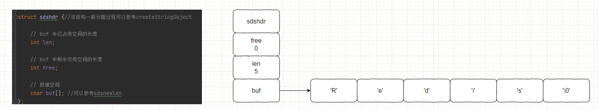
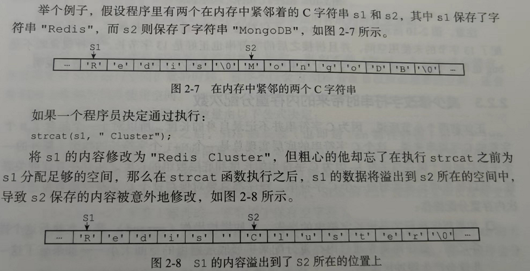
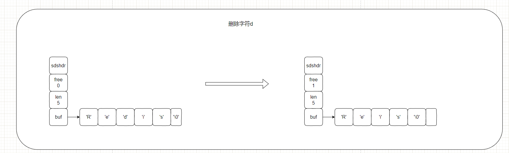

```c
struct sdshdr {
    int len;
    int free;
    char buf[];
}
```

上面这串代买就是Redis中动态字符串的定义代码, redis虽然是由c语言开发的, 但是redis并没有直接使用c语言传统字符串作为默认的字符串表示, 而是自己实现了一种`动态字符串`的抽象类型用作redis中默认字符串表示.

> 传统c字符串只会作为字符串字面量, 在某些无须对字符串值进行修改的地方. 而当redis需要一个可以被修改的字符串值时, redis就会使用SDS来表示字符串值, 比如: 所有包含字符串的键值对在底层都是由SDS实现的

**`举个例子:`**

```sh
redis > set msg "hello world"
```

- key: 底层是一个保存着字符串`msg`的sds
- value: 底层是一个保存着字符串`hello world`的sds

```sh
redis> RPUSH fruits "apple" "banana" "cherry"
```

- key: 底层是一个保存着字符串`msg` 的sds
- value: 底层是一个列表对象, 该列表对象含有三个分别保存着`apple`, `banana`, `cherry` 的sds元素

**`SDS使用在哪些地方:`**

1. 字符串值: 
2. 缓冲区: AOF模块的AOF缓冲区, 客户端状态中的输入缓冲区.


## 2.1 SDS的定义:

每个sds.h/sdshdr结构体表示一个SDS值:



- free: 0表示该sds中, buf数组没有剩余空间
- len: 5表示buf数组中保存了一个5字节长度的字符串.`'\0'是传统c字符串中结束标记符号, 是个1字节的空字符串, 并不会算在len里面`

- buf: buf是一个char类型的数组, 图中buf数组前五个字节分别保存了 `'R'`, `'e'`, `'d'`, `'i'`,`'s'`5个字符.

> 为什么要使用'\0'来表示sds字符的结束?
>
> 主要是为了复用c语言中对字符串的一些操作函数, 例如`printf`等函数


## 2.2 c字符串和SDS的区别:

SDS和c都采用长度为`N+1`的字符数组来表示长度为`N`的字符串, 并且总是`'\0'`标志字符串的结束.

c字符串无法在`安全性`, `效率`, `功能`等方面满足`Redis的需求`

### 2.2.1 参数复杂度获取字符串的长度:

- `由于传统c语言字符串没有记录有效字符长度` , 所以在获取字符串长度时, 需要一次遍历整个字符串, 直到遇到结束标志`'\0'`, `时间复杂度为O(N)`.

- 对于SD而言, 其保存了有效字符长度`即len属性`, 所以在获取字符串长度时, 只需要读取len属性, `时间复杂度为O(1)`.

### 2.2.2 防止缓冲区溢出:

缓冲区指的是字符串剩余空间长度.

- `由于c字符串不记录字符串剩余空间长度`, 在进行字符串拼接的时候, 需要手动分配足够的空间给目标字符串, 以确保目标字符串有足够的空间拼接源字符串.

  

- `SDS字符串记录了buf数据剩余字节数, 在进行拼接之前, SDS会检测剩余空间是否足够, 如果不够会先扩展SDS的buf数组`.


### 2.2.3 减少修改字符串时带来的内存重分配次数:

内存重分配涉及复杂的算法, 并且可能需要重新执行系统调用, 这是一个比较耗时的操作:

- 对于传统c字符串而言, 由于其不记录剩余空间, 且c字符串底层实现总是一个`N+1`个字符长度的数组, 所以 `在增长字符串的操作时`, 首先需要通过内存重分配来扩展底层数组的空间大小, 以保证能够存放新字符串. `在缩短字符串操作时`, 需要通过内存重分配来释放字符串不再需要的底层数组空间.

- SDS字符串通过`未使用空间(free)`属性, 解除了字符串长度和底层数组之间的关联关系 --- SDS中, `buf数组的长度不一定是SDS字符串的长度+1`, 因为buf数组还包含了未使用的空间长度.

  - **`空间预分配`**: 空间预分配是用于减少`增长`字符串时的内存重分配操作, 在SDS字符串进行增长字符串操作时, 程序不仅仅会为SDS分配修改所需要的空间, 还会为SDS分配额外的未使用空间. 额外分配的未使用空间数量计算公式

    - 如果对SDS字符串进行修改之后, SDS的长度小于(也就是len属性)`小于1MB`, 那么程序分配和len属性一样大小的未使用空间. 即`free 属性等于len属性`.

      > 如果进行修改之后， SDS 的 len 将变成 13 字节， 那么程序也会分配 13 字节的未使用空间， SDS 的 buf 数组的实际长度将变成 13 + 13 + 1 = 27 字节（额外的一字节用于保存空字符）。

    - 如果对SDS字符串进行修改之后, SDS的长度`大于等于1MB`, 那么程序将固定分配`1MB`的未使用空间, 即`free属性为1MB`

      > 如果对 SDS 进行修改之后， SDS 的长度将大于等于 1 MB ， 那么程序会分配 1 MB 的未使用空间。 举个例子， 如果进行修改之后， SDS的 len 将变成 30 MB ， 那么程序会分配 1 MB 的未使用空间， SDS 的 buf 数组的实际长度将为 30 MB + 1 MB + 1 byte 。

    未使用空间计算公式伪代码:

    ```java
    newLen = len + addLen;
    if (newLen < 1027 * 1024) {
        newLen *= 2;
    } else {
        newLen += 1024 * 1024;
    }
    
    sds.setFree(newLen - len);
    ```

    在扩展SDS空间之前, SDS会先去检查未使用空间是否足够, 如过足够就会直接使用未使用空间, 无需进行内存重新分配. 所以 `连续执行N次增长操作, 累充重分配次数从必定N次减少到最多N次`

- **`惰性空间释放`**: 惰性空间释放是用于减少`缩短`字符串时的内存重分配操作. 当执行缩短字符串操作的时候, 缩短后多出来的空间(buf数组中不再被字符占用的空间), 会被记录在`free属性`上, 而不是立刻进行内存重分配去释放这些多出来的空间.

  

  > SDS有响应的API, 在需要时真正的释放SDS未使用的空间, 不会造成内存浪费.

### 2.2.4 二进制安全:

数据库一般都是用来保存文本数据, 但是用数据库存放二进制数据的场景并不少见.

- c字符串中字符必须符合某种编码格式(比如ASCⅡ), 并且除了字符串末尾之外, 字符串里面不能含有空字符, 否则会被认为这是字符串结束的标志. 这些限制造成c字符串只能存放文本数据, 不能存放`图像`, `音频`, `视频`, `压缩文件`等二进制数据.
- SDS的API都是二进制安全的, 所有API都会以处理二进制的方式来处理存放在buf数组里面的数据, 程序不会对数据进行任何的限制, 过滤或者假设 --- 所见即所得. 因为SDS使用len属性来保存使用字节数量, 所以不会存在像c字符串哪样因为特殊字符被截断的情况.


### 2.2.5 兼容部分C字符串函数:

SDS的所有API都是二进制安全的, 并且与c字符串一样以`空字符结尾`. SDS的API总是会将SDS中保存的数据的末尾设置为空字符, 并且总是会在为buf数组分配空间时, 多分配一个字节来容纳结束表示`空字符`. 

这样设计的目的的是为了让那些保存文本数据的SDS可用复用`<string.h>`库里面的函数.

### 2.2.6 总结:

c字符串与SDS的区别:

| c字符串                                | SDS                                    |
| -------------------------------------- | -------------------------------------- |
| 获取字符串长度的时间复杂度为O(N)       | 获取字符串长度的时间复杂度为O(1)       |
| API不安全, 可能造成buf数组溢出         | API安全, 不会造成buf数组溢出           |
| 修改字符串长度N次就会造成N次内存重分配 | 修改字符串长度N次最多造成N次内存重分配 |
| 只能保存文本数据                       | 可以保存文本和二进制数据               |
| 可以使用<string.h>中全部函数           | 可以使用<string.h>中部分函数           |

