## 9. 数据库:

### 9.1 服务器中的数据库:

redis服务器将所有数据库都保存在服务器状态`redis.h/redisServer结构`的db属性, db属性是一个数组每个元素都是一个`redis.h/redisDb`结构, 每一个redisDB结构代表一个数据库.

```c
struct redisServer {
    // ...
    
    // redisDb数组, 保存着服务器中的所有数据库
    redisDb *db;
    // 初始化的时候, 决定创建多少个数据库
    int dbnum;
    // ...
}
```

初始化服务器的时候, 程序会根据服务器状态的dbnum属性, 来决定应该创建多少个数据库, 即 创建多少个redisDb元素.

`dbnum属性`由服务器配置文件中`databases` 配置项来决定, 默认为16.

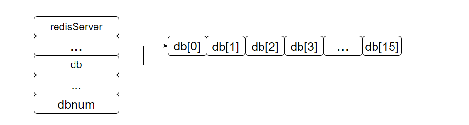


### 9.2 切换数据库的实现:

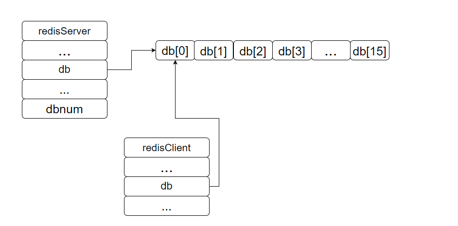

默认情况下, 客户端是连接在0号数据库上的, 客户端可用通过`SELECT`命令来切换数据库.

```sh
redis> SET msg "hello world"
redis> GET msg
"hello world"
redis> SELECT 2
redis[2]> GET msg
(nil)
```

> redis命令行不带下标表示0号库, 带下标表示几号库
>
> cluster模式中不支持select命令

**实现**

在服务器内部, 客户端状态`redisClient结构`的db属性记录了客户端当前所处的数据库, 

```c
typedef struct redisClient {
    // ...
    
    // 记录客户端当前所处的数据库
    redisDb *db
    // ...
}
```

- db属性指向redisServer.db数组其中一个元素, 默认指向下标为0的元素, select命令就是将redisClient

> 注意: `redisClient`中db属性不再是一个数组, 只是一个指向redisDb结构的指针.

**客户端从零号库切换到15号库**

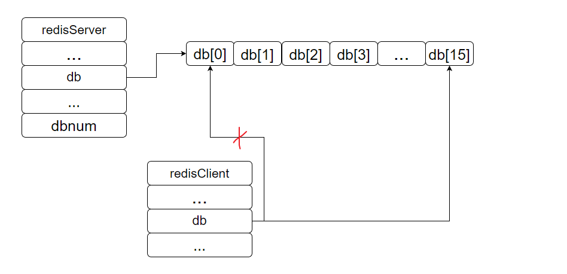


### 9.3 数据库键空间:

redis的每个数据库都是由`redis.h/redisDb结构`表示, 其中, redisDb结构中`dict属性`保存了该数据库中所有的键值对, 通常将dict属性称为`键空间`.

```c
typedef struct redisDb {
    // ...
    // 键空间, 保存了数据库中所有的键值对
    dict *dict;
    // ...
}
```

**`键空间和用户所看见的数据库是直接对应的:`**

- 键空间的键也就是数据库的键, 每一个键都是一个字符串对象.
- 键空间的值也就是数据库的值, 每一个值都可以是`字符串对象`, `列表对象`, `哈希对象`, `集合对象`, `有序集合对象`其中的一种.

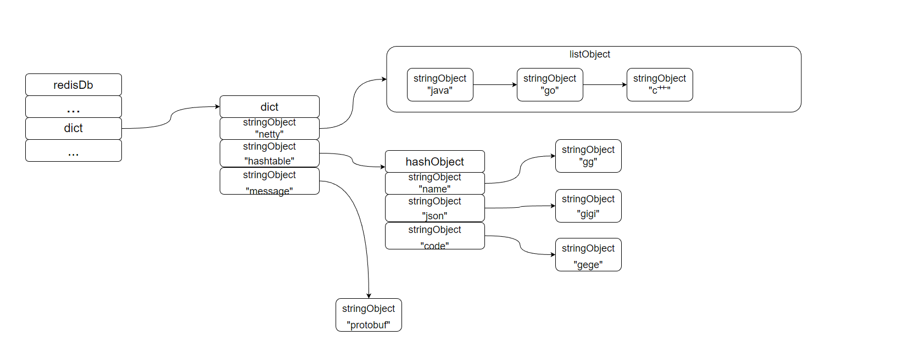

> 因为数据库实际上就是一个字典, 所以针对数据库的操作, crud实际上就是通过键空间字典的crud api来操作的

#### 9.3.1 添加新键:

添加新键值对到数据库, `实际上就是在键空间字典上新增一个entry对象`, key为字符串对象, value为任意redis对象.

```sh
redis> SET date "2013.12.1"
OK
```

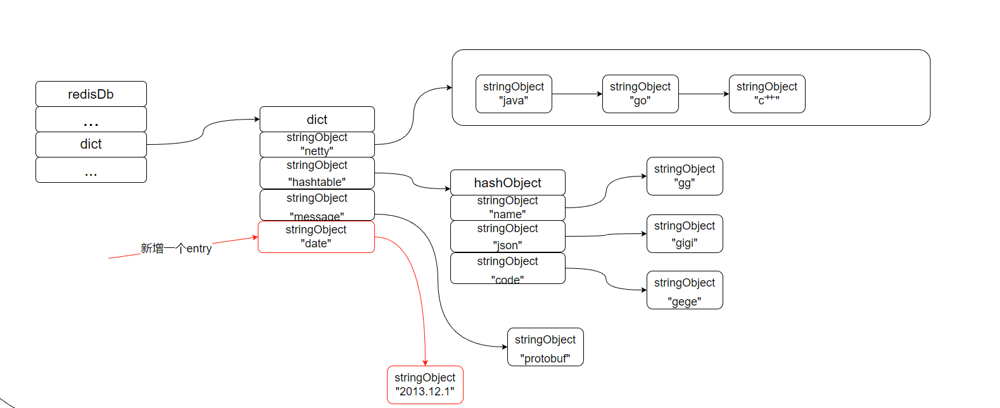

#### 9.3.2 删除键:

删除数据库的一个键, 实际上就是`删除字典中key为指定值得entry`.

```sh
redis> del hashtable
OK
```

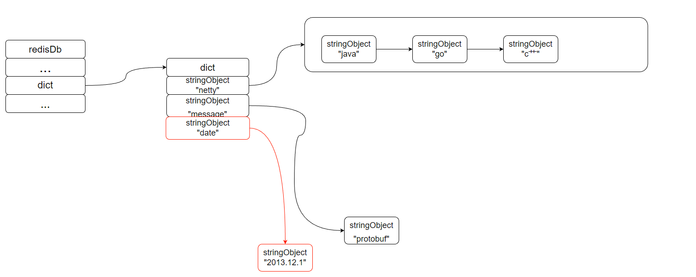

#### 9.3.3 更新键:

更新一个数据库的键, 实际上`就是对key为指定值的entry中值对象进行修改`, 根据值对象的不同, 更新的具体方法有所不同.

比如:

- 值对象为字符串对象, 新值直接覆盖
- 值对象为哈希对象, 如果给定的hash对象的key不存在, 那么这个更新操作实际上是在哈希对象上新增节点, 如果hash对象的key存在, 那么这个更新操作实际上是修改hash对像key所对应值.

#### 9.3.4 对键取值:

对一个数据库键进行取值, 实际上就是在键空间字典中取出键所对应的值对象, 根据值对象的类型不同, 取值方法也会有所不同.

#### 9.3.5 其他键空间操作:

除了日常的crud操作外, 还有很多redis命令是对键空间进行处理来完成的.比如:

- `FLUSHDB`: 实际上就是删除键空间中所有的键值对
- `RANDOOMKEY`: 在键空间上随机返回一个键来实现的
- `DBSIZE`: 返回键空间键值对的数量

#### 9.3.6 读写键空间时的维护操作:

当使用Redis命令对数据库进行crud时, 服务器不仅会对键空间执行读写操作, 还会进行一些维护操作, 就是记录一些性能相关的数据.

- 在读取一个键之后(读写都会对键空间进行读取操作), 服务器会根据键是否存在更新服务器的键空间 `命中次数` 或者 `不命中次数`.

  `INFO stats命令`返回结果中`keyspace_hits`命中次数, `keyspace_misses`不命中次数

- 在读取一个键之后, 服务器会更新键的`lru`属性, 这个值使用用于计算键的闲置时间的

- 如果服务器读取一个键时, 发现该键已经过期, 那么服务器会先删除这个键.

- 如果有客户端使用`WATCH命令`监听某个键, 那么服务器在对被监听的键进行修改之后, 会将这个键标记为`dirty`, 从而让事务程序注意到这个件已经被修改过.

- 服务器每次修改过一个键之后, 都会对dirty键计数器的值增1, 这个计数器会触发服务器的持久化以及复制操作.

- 如果服务器开启了数据库通知功能, 那么在对键进行修改之后, 服务器将按照配置发送相应的通知


### 9.4 设置键的过期时间:

`EXPIRE`,`PEXPIRE`命令, 可以以秒或者毫秒精度为数据库中的某个键设置生存时间, 在经过指定的秒数或者毫秒数之后, 服务器就会自动删除生存时间为0的键.

`EXPIREAT`, `PEXPIREAT`命令, 以秒或者毫秒进度给数据库中的某个键设置过期时间, 过期时间是个UNIX时间戳, 当键的过期时间到了, 服务器就会自动从数据库中删除这个键.

#### 9.4.1 设置过期时间:

`EXPIREAT` <key> <timestamp>  将键key的过期时间设置为timestamp指定的秒数时间戳.

`PEXPIREAT`<key> <timestamp>  将键key的过期时间设置为timestamp指定的毫秒数时间戳.

`EXPIRE` <key> <ttl>  将键key的生存时间设置为ttl秒,

`PEXPIRE` <key> <ttl>  将键key的生存时间设置为ttl毫秒

> 本质上其他三个命令都是通过转化为`PEXPIREAT`命令来实现的


#### 9.4.2 保存过期时间:

redisDb结构中的`expire字典`保存了数据库中所有键的过期时间, 通常成`expire字典`为过期字典:

- 过期字典的键是一个指针, 这个指针指向键空间中的某个键对象(即数据库键), `过期字典的键和键空间的键实际上是指向同一个地址的`
- 过期字典的值是一个long long类型的整数, 这个整数保存了键所指向的数据库键的过期时间 --- 一个精确到毫秒的unix时间戳.

```c
typedef struct redisDb {
    // ...
    // 过期字典, 保存着键的过期时间
    dict *expire;
    // ...
} redisDb;
```

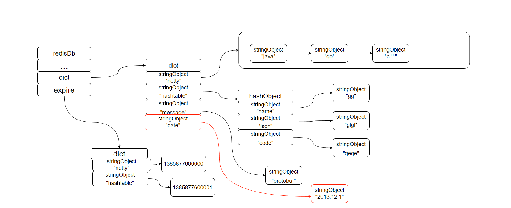


#### 9.4.3 移除过期时间:

移除过期时间就是将expire字典上, 键为指定key的entry删除掉.


#### 9.4.4 计算并返回剩余生存时间:

剩余过期时间的计算, 就是在过期字典中找到指定key, 拿到value代表的过期时间, 用过期时间减去当前时间, 结果就是剩余过期时间.


#### 9.4.5 过期键的判定:

通过过期字典, 程序检查给定key是否过期的步骤为:

1. 检查给定key是否存在于过期字典中, 如果存在, 那么获得键的过期时间
2. 检查当前时间的unix时间戳是否大于过期时间: 大于则该key已经过期, 小于则没有过期

伪代码就是:

```java
public boolean isExpired(String key) {
    expireTimeMs = redisDb.expire.get(key)
	if (null == expireTimeMs) {
        return false;
    }
    if(Systen.currentTimeMs() > expirTimeMs) {
        return true;
    }
    return false
}
```

### 9.5 过期策略:

redis中存在三中不同的过期键删除策略:

- `定时删除`: 在设置键的过期时间的同时, 创建一个定时器, 让定时器在键的过期时间来临时, 立即执行对键的删除操作
- `惰性删除`: 即使键的过期时间到了也不会删除键, 只有在获取键的时候, 判断键是否过期, 如果过期了就删除; 没有过期就返回该键
- `定期删除`: 每隔一段时间, 程序就会对数据库进行一次扫描, 删除里面的过期键.


#### 9.5.1 定期删除:

定期删除是`对内存最友好`, 但是对`CPU最不友好`的, 是一种时间换空间的删除策略. 

优缺点:

- 优点: 键的过期时间一到立即删除, 也就是立即释放过期键所占用的内存空间
- 缺点: 在过期键比较的情况下, 删除过期键可能会占用很长时间的cpu来执行删除操作, 从而会对服务器的响应和吞吐量造成影响.


#### 9.5.2 惰性删除:

惰性删除是`对cpu最友好的`, 但是对`内存最不友好`的, 是一种空间换时间的策略.

优缺点:

- 优点: 删除操作只会对当前处理的键执行, 保证cpu不会在不需要处理的键上浪费时间,
- 缺点: 由于只有键被访问才会判断键是否过期, 如果一个键一直不被访问, 那么该键一直不会被删除, 即使已经过期了, 从而该键所占用的空间一直不会被释放, 这样的情况甚至可以说是内存泄露.


#### 9.5.3 定期删除:

定期删除是 惰性删除 和 定时删除 之间的一种这种的方案:

1. 通过限制删除操作执行时长和频率来控制删除操作占用cpu的时间
2. 通过主动遍历过期字典, 判断键是否过期, 并将其删除, 从而减少过期键占用的内存空间


### 9.6 Redis的过期删除策略:

redis实际上使用的是`惰性删除`和`定期删除`两种策略搭配, 通过两种删除策略的搭配, 在cpu使用时间和避免浪费内存空间之间取得平衡.

#### 9.6.1 惰性删除实现:

`db.c/expireIfNeeded函数`

```c
int expireIfNeeded(redisDb *db, robj *key) {

    // 取出键的过期时间
    mstime_t when = getExpire(db,key);
    mstime_t now;

    // 没有过期时间
    if (when < 0) return 0; /* No expire for this key */

    // 如果服务器正在进行载入，那么不进行任何过期检查
    if (server.loading) return 0;

    // 当我们正在执行lua脚本的时候, 程序认为在lua脚本开始执行时时间就被阻塞了.
    // 所以一个只有在lua脚本刚开始执行的时候被访问才会过期, 在lua执行过程中并不会删除key
    // 以确保传递给从节点/AOF的一致性
    now = server.lua_caller ? server.lua_time_start : mstime();
    
	// 从节点并不会对key进行任何过期删除操作, 只有在master节点传递del命令的时候才会删除key
    // 但是为了逻辑上正确, 程序仍然会返回正确的过期信息给调用方.
    // 即0代表没有过期, 1代表过期了.
    if (server.masterhost != NULL) return now > when;

    // 运行到这里，表示键带有过期时间，并且服务器为主节点
    // 如果未过期，返回 0
    if (now <= when) return 0;

    /* Delete the key */
    server.stat_expiredkeys++;

    // 向 AOF 文件和从节点传播过期信息
    propagateExpire(db,key);

    // 发送事件通知
    notifyKeyspaceEvent(REDIS_NOTIFY_EXPIRED,
        "expired",key,db->id);

    // 将过期键从数据库中删除
    return dbDelete(db,key);
}
```

总结:

- 如果节点为master, 且当前时间大于过期时间, 表示该key已经过期了, 会删除key
- `如果节点为slave, 即使当前时间大于了过期时间也不会删除key, 只能等待master节点同步del命令, 才会删除key`
- 如果key没有过期时间不会删除key.

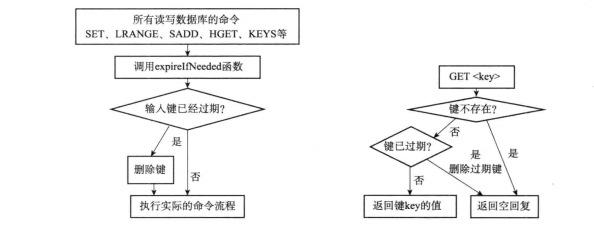


#### 9.6.2 定期删除的实现:

`redis.c/actoveExpireCycle函数`: 一但`redis.c/serverCorn函数`执行该函数就会执行

```c
void activeExpireCycle(int type) { //过期键的定期删除 
    //只有master才会做定时过期清理操作，从是不会做定时过期清理的，slave是依靠主过期后发送del命令给从来进行过期，见activeExpireCycleTryExpire->propagateExpire

    // 静态变量，用来累积函数连续执行时的数据
    static unsigned int current_db = 0; // 上次执行的数据库编号
    static int timelimit_exit = 0;      // 上一次函数执行是否因为超时终止
    static long long last_fast_cycle = 0; // 上一次函数执行的时间
	// 在某个数据库遍历过期key遍历了多少次
    unsigned int j, iteration = 0;
    // 默认每次处理的数据库数量
    unsigned int dbs_per_call = REDIS_DBCRON_DBS_PER_CALL;// REDIS_DBCRON_DBS_PER_CALL = 16
    // 函数开始的时间
    long long start = ustime(), 
        timelimit; //最多在该函数中消耗timelimit us时间

    // 快速模式
    if (type == ACTIVE_EXPIRE_CYCLE_FAST) { 
    //只有上次执行该函数是因为在该函数中耗时超过了指定时间，并且现在离上次执行该函数的时间超过2ms的时候才会启用fast模式
        /* Don't start a fast cycle if the previous cycle did not exited
         * for time limt. Also don't repeat a fast cycle for the same period
         * as the fast cycle total duration itself. */
        // 如果上次函数没有触发 timelimit_exit ，那么不执行处理
        if (!timelimit_exit) return; //如果上次执行该函数不是因为执行该函数的时间超过指定时间引起的，则无效fast处理
        // 如果距离上次执行未够一定时间，那么不执行处理
        if (start < last_fast_cycle + ACTIVE_EXPIRE_CYCLE_FAST_DURATION*2) return;
        // 运行到这里，说明执行快速处理，记录当前时间
        last_fast_cycle = start;
    }

    /* We usually should test REDIS_DBCRON_DBS_PER_CALL per iteration, with
     * two exceptions:
     *
     * 一般情况下，函数只处理 REDIS_DBCRON_DBS_PER_CALL 个数据库，
     * 除非：
     *
     * 1) Don't test more DBs than we have.
     *    当前数据库的数量小于 REDIS_DBCRON_DBS_PER_CALL
     * 2) If last time we hit the time limit, we want to scan all DBs
     * in this iteration, as there is work to do in some DB and we don't want
     * expired keys to use memory for too much time. 
     *     如果上次处理遇到了时间上限，那么这次需要对所有数据库进行扫描，
     *     这可以避免过多的过期键占用空间
     */
    if (dbs_per_call > server.dbnum || timelimit_exit)
        dbs_per_call = server.dbnum;

    /* We can use at max ACTIVE_EXPIRE_CYCLE_SLOW_TIME_PERC percentage of CPU time
     * per iteration. Since this function gets called with a frequency of
     * server.hz times per second, the following is the max amount of
     * microseconds we can spend in this function. */
    // 函数处理的微秒时间上限
    // ACTIVE_EXPIRE_CYCLE_SLOW_TIME_PERC 默认为 25 ，也即是 25 % 的 CPU 时间
    timelimit = 1000000*ACTIVE_EXPIRE_CYCLE_SLOW_TIME_PERC/server.hz/100; //25ms  25000us
    timelimit_exit = 0;
    if (timelimit <= 0) timelimit = 1;

    // 如果是运行在快速模式之下
    // 那么最多只能运行 FAST_DURATION 微秒 
    // 默认值为 1000 （微秒）
    if (type == ACTIVE_EXPIRE_CYCLE_FAST)
        timelimit = ACTIVE_EXPIRE_CYCLE_FAST_DURATION; /* in microseconds. */ //1MS

    // 遍历数据库
    for (j = 0; j < dbs_per_call; j++) {
        int expired; //过期键删除的个数
        // 指向要处理的数据库
        redisDb *db = server.db+(current_db % server.dbnum);

        /* Increment the DB now so we are sure if we run out of time
         * in the current DB we'll restart from the next. This allows to
         * distribute the time evenly across DBs. */
        // 为 DB 计数器加一，如果进入 do 循环之后因为超时而跳出
        // 那么下次会直接从下个 DB 开始处理
        current_db++;

        /* Continue to expire if at the end of the cycle more than 25%
         * of the keys were expired. */
        do {
            // num 设置了过期key的数量, slots过期字典中entry的数量.
            unsigned long num, slots;
            //now当前时间, 
            long long now, ttl_sum;
            int ttl_samples;

            /* If there is nothing to expire try next DB ASAP. */
            // 获取数据库中带过期时间的键的数量
            // 如果该数量为 0 ，直接跳过这个数据库
            if ((num = dictSize(db->expires)) == 0) { //num获取桶个数
                db->avg_ttl = 0;
                // 这里break出do.., while循环继续下一个库进行一样的操作
                break;
            }
            // 获取数据库中键值对的数量  获取所有桶中成员数
            slots = dictSlots(db->expires);
            // 当前时间
            now = mstime();

            /* When there are less than 1% filled slots getting random
             * keys is expensive, so stop here waiting for better times...
             * The dictionary will be resized asap. */
            // 这个数据库的使用率低于 1% ，扫描起来太费力了（大部分都会 MISS）
            // 跳过，等待字典收缩程序运行
            if (num && slots > DICT_HT_INITIAL_SIZE &&
                (num*100/slots < 1)) break;  //也就是每个具体桶中平均有至少100个成员在里面，因此扫描起来很慢，因此需要增加桶个数来提示扫描遍历速递

            /* The main collection cycle. Sample random keys among keys
             * with an expire set, checking for expired ones. 
             *
             * 样本计数器
             */
            // 已处理过期键计数器
            expired = 0;
            // 键的总 TTL 计数器
            ttl_sum = 0;
            // 总共处理的键计数器
            ttl_samples = 0;

            // 每次最多只能检查 LOOKUPS_PER_LOOP 个键
            if (num > ACTIVE_EXPIRE_CYCLE_LOOKUPS_PER_LOOP) //20
                num = ACTIVE_EXPIRE_CYCLE_LOOKUPS_PER_LOOP;

            // 开始遍历当前数据库的过期字典
            while (num--) {
                dictEntry *de;
                long long ttl;

                // 从 expires 中随机取出一个带过期时间的键
                if ((de = dictGetRandomKey(db->expires)) == NULL) break;
                // 计算 TTL
                ttl = dictGetSignedIntegerVal(de)-now;
                // 如果键已经过期，那么删除它，并将 expired 计数器增一
                //key-value键过期真正从内存中删除就是该activeExpireCycleTryExpire函数
                if (activeExpireCycleTryExpire(db,de,now)) expired++;
                if (ttl < 0) ttl = 0;
                // 累积键的 TTL
                ttl_sum += ttl;
                // 累积处理键的个数
                ttl_samples++;
            }

            /* Update the average TTL stats for this database. */
            // 为这个数据库更新平均 TTL 统计数据
            if (ttl_samples) {
                // 计算当前平均值
                long long avg_ttl = ttl_sum/ttl_samples;
                
                // 如果这是第一次设置数据库平均 TTL ，那么进行初始化
                if (db->avg_ttl == 0) db->avg_ttl = avg_ttl;
                /* Smooth the value averaging with the previous one. */
                // 取数据库的上次平均 TTL 和今次平均 TTL 的平均值
                db->avg_ttl = (db->avg_ttl+avg_ttl)/2;
            }

            /* We can't block forever here even if there are many keys to
             * expire. So after a given amount of milliseconds return to the
             * caller waiting for the other active expire cycle. */
            // 我们不能用太长时间处理过期键，
            // 所以这个函数执行一定时间之后就要返回

            // 更新遍历次数
            iteration++;

            // 在当前数据库遍历过期字典16次, 即在当前数据库进行了16次过期时间, 且执行时间超过了每次执行定期时间的限制.
            // 就认为本次定期删除是因为超时而结束
            if ((iteration & 0xf) == 0 && 
                (ustime()-start) > timelimit)
            {
                timelimit_exit = 1;
            }

            // 已经超时了，返回
            if (timelimit_exit) return;

            /* We don't repeat the cycle if there are less than 25% of keys
             * found expired in the current DB. */
            // ACTIVE_EXPIRE_CYCLE_LOOKUPS_PER_LOOP 20
            
            // 如果已删除的过期键占本次挑选出来的键数量的 25 %，
            //那么继续遍历，直到在该函数中执行时间超过25ms(fast模式1ms，普通模式25ms)或者本次随机挑选出的20个KV中，过期的小于5个，则退出该函数
        } while (expired > ACTIVE_EXPIRE_CYCLE_LOOKUPS_PER_LOOP/4); //随机抽取20个K，如果发现至少有5个KEY过期了，则继续进行过期抽样删除
    }
}
```

### 9.7 AOF、RDB和复制功能对过期键的处理:

#### 1. 生成RDB文件：

在执行SAVE命令文件或者BGSAVE命令文件创建一个新的RDH文件时， 程序会对数据库中的键进行检查， `已经过期的键是不会被保存到新创建的RDB文件`中。

`举个例子：`

当前数据库中存在key1， key2， key3， key1过期了， 在生成RDB文件的时候， 只会讲key2， key3保存进RDB文件中。

#### 2. 载入RDB文件:

在启动Redis服务器时, 如果服务器开启了RDB功能, 那么服务器将对RDB文件进行载入:

- 如果服务器以`master`模式运行, 那么载入RDB文件时, 程序会对文件中保存的键进行检查, `未过期的键会被载入到数据库中, 而过期键则会被忽略`.
- 如果服务器以`slave`模式运行, 那么载入RDB文件时, 文件中`保存的所有键,不论是否过期, 都会被载入到数据库中`. 不过, 因为主从服务器在进行数据同步的时候, 从服务器的数据库就会被清空. 

#### 3. AOF写入:

当服务器以AOF持久化模式运行时, 如果数据库中的某个键已经过期, 但它还没有被惰性删除或者定期删除, 因为AOF文件记录的时修改操作命令, 所以此时生成AOF文件不会对过期的键产生任何的影响. `当过期键被惰性删除或者定期删除之后, 程序会向AOF文件追加一条DEL命令, 来显示的记录该键已被删除`.

`举个例子:`

当客户端试用 `GET message`命令, 视图访问过期的message, 那么服务器将执行下面三个动作:

1. 从数据库删除message键
2. 追加一条`DEL message`命令到AOF文件
3. 向执行GET命令的客户端返回空回复

#### 4. AOF重写:

在执行AOF重写的过程中, `程序会对数据库中的键进行检查, 已经过期的键不会被保存到重写后的文件中`.

`举个例子:`

如果数据库中包含三个键 `key1,key2,key3`, 且`key2过期了`. 那么在重写工作时, 程序只会对key1, key3进行重写, key2会被忽略.

#### 5. 复制:

当服务器运行在复制模式下, `从服务器的过期键删除动作由主服务器控制`:

- `主服务器`在删除过期键之后, 会显示的向从服务器发送一个`DEL命令`, 告知从服务器删除这个过期键.
- `从服务器`在执行客户端发送读命令时, 即使碰到过期键也不会将过期键删除, 而时继续`像处理未过期键一样处理`过期键.
- `从服务器`只有在接收到`主服务器`发来的DEL命令之后, 才会删除过期键.

> todo 需要梳理下主从模式下, 读写操作是如果分配的, 这里不太理解slave接到读命令之后, 仍然会被给客户端返回数据, 这里是不是有数据不一致的情况.


### 9.8 数据库通知:

数据库通知是Redis 2.8版本新增加的功能, 这个功能可以让客户端通过订阅给定的频道或者模式, 来获取数据库中键的变化, 以及数据库中命令的执行情况.

- `键空间通知:` 关注数据库中某个键执行了什么命令.

  `SUBSCRIBE __keyspace@数据库编号:键名称`

  ```shell
  127.0.0.1:6379>SUBSCRIBE __keyspace@0__:message
  Reading messages...(press Ctrl-C to quit)
  1) "subscribe"
  2) "__keyspace@0__:message"
  3) (integer) 1
  
  1) "message"
  2) "__keyspace@0__:message"
  3) "set"
  
  1) "message"
  2) "__keyspace@0__:message"
  3) "expire"
  
  1) "message"
  2) "__keyspace@0__:message"
  3) "del"
  ```

  通知显示: 服务器先后对键`message`执行了`SET`,`EXPIRE`,`DEL`命令

- `键事件通知:` 关注某个命令执行在了什么键上.

  `SUBSCRIBE __keyevent@数据库编号__:操作名称`

  ```shell
  127.0.0.1:6379>SUBSCRIBE __keyspace@0__:message
  Reading messages...(press Ctrl-C to quit)
  1) "subscribe"
  2) "__keyevent@0__:del"
  3) (integer) 1
  
  1) "message"
  2) "__keyevent@0__:del"
  3) "message"
  
  1) "message"
  2) "__keyevent@0__:del"
  3) "number"
  
  1) "message"
  2) "__keyevent@0__:del"
  3) "redis"
  ```

  通知显示: 服务器先后在`message`, `number`, `redis` 上执行了`DEL 命令`.


**`服务器配置中notify-keyspace-events选项决定了服务器发送通知的类型:`**

1. `AKE`: 服务器会发送所有类型的键空间通知和键事件通知.
2. `AK`: 服务器会发送所有类型的间空间通知.
3. `AE`: 服务器会发送所有类型的键事件通知.
4. `K$`: 服务器只发送和字符串键有关的键空间通知.
5. `El`: 服务器只发送和列表键有关的键事件通知.

> 这个配置还有很多的可选值, 详见: [3.0redis配置文件](https://raw.githubusercontent.com/redis/redis/3.0/redis.conf)


#### 1. 发送通知:

发送通知功能由 `notify.c/notifyKeyspaceEvent`函数实现:

```c
void notifyKeyspaceEvent(int type, char *event, robj *key, int dbid)
```

- type: 发送通知的类型, 程序根据这个值来判断该通知是否是服务器配置notify-keyspace-events选项所配置的通知类型, 从而`决定是否发送通知`
- event: 时间名称
- key: 产生时间的键.
- dbid: 数据库编号

> 每当一个Redis命令需要发送数据库事件的时候, 就会调用一次这个函数.

***`实现:`***

```c
void notifyKeyspaceEvent(int type, char *event, robj *key, int dbid) {
    sds chan;
    robj *chanobj, *eventobj;
    int len = -1;
    char buf[24];

    /* If notifications for this class of events are off, return ASAP. */
    // 如果服务器配置为不发送 type 类型的通知，那么直接返回
    if (!(server.notify_keyspace_events & type)) return;

    // 事件的名字
    eventobj = createStringObject(event,strlen(event));

    /* __keyspace@<db>__:<key> <event> notifications. */
    // 发送键空间通知
    if (server.notify_keyspace_events & REDIS_NOTIFY_KEYSPACE) {

        // 构建频道对象
        chan = sdsnewlen("__keyspace@",11);
        len = ll2string(buf,sizeof(buf),dbid);
        chan = sdscatlen(chan, buf, len);
        chan = sdscatlen(chan, "__:", 3);
        chan = sdscatsds(chan, key->ptr);

        chanobj = createObject(REDIS_STRING, chan);

        // 通过 publish 命令发送通知
        pubsubPublishMessage(chanobj, eventobj);

        // 释放频道对象
        decrRefCount(chanobj);
    }

    /* __keyevente@<db>__:<event> <key> notifications. */
    // 发送键事件通知
    if (server.notify_keyspace_events & REDIS_NOTIFY_KEYEVENT) {

        // 构建频道对象
        chan = sdsnewlen("__keyevent@",11);
        // 如果在前面发送键空间通知的时候计算了 len ，那么它就不会是 -1
        // 这可以避免计算两次 buf 的长度
        if (len == -1) len = ll2string(buf,sizeof(buf),dbid);
        chan = sdscatlen(chan, buf, len);
        chan = sdscatlen(chan, "__:", 3);
        chan = sdscatsds(chan, eventobj->ptr);

        chanobj = createObject(REDIS_STRING, chan);

        // 通过 publish 命令发送通知
        pubsubPublishMessage(chanobj, key);

        // 释放频道对象
        decrRefCount(chanobj);
    }

    // 释放事件对象
    decrRefCount(eventobj);
}
```

## 10 RDB持久化:

由于redis是内存数据库, 它将自己的数据库状态存储在内存里面, 所以如果不想办法将数据持久化到磁盘里面, 那么一单服务器进程退出, 服务器中的数据库状态也会消失不见.

`RDB持久化`, 就是为了解决服务器进程退出数据库状态可以保存到磁盘里面, 避免数据丢失.

`RDB持久化`, 可以手动执行, 也可以在`redis.conf`配置文件中配置定期执行, 该功能可以将`某个时间点上的数据库状态(全量数据)保存到一个RDB文件中`.

`RDB文件是一个经过压缩的二进制文件, 通过该文件可以还原生成RDB文件时的数据库状态.`

### 10.1 RDB文件的创建和载入:

***`创建RDB文件:`***

- 手动

  通过`SAVE`和`BGSAVE`这两个命令, 可以生成redis服务器的RDB文件.

  - `SAVE命令`: 该命令会阻塞Redis服务器进程, 直到所有数据都写入到RDB文件里面后, 服务器才能处理客户端的请求.
  - `BGSAVE命令`: BGSAVE和SAVE同的点在于, `BGSAVE不会阻塞Redis服务进程`, BGSAVE命令会派生出一个子进程, 然后由子进程负责创建RDB文件, 服务器进程继续处理客户端的命令请求.

- 自动:

  通过redis.conf配置文件中save配置项, 就可以让Redis服务器每个一段时间自动执行一次`BGSAVE命令`来创建RDB文件.

  `save 间隔时间 修改次数`, 默认save配置:

  ```c
  save 900 1 // 服务器在900秒之内, 对数据库进行了1次修改
  save 300 10 // 服务器在300秒之内, 对数据库进行了10次修改
  save 60 10000 // 服务器在60秒之内, 对数据库进行了10000次修改
  ```

  >  `只要上面配置中任意一个条件被满足, 服务器就会执行BGSAVE命令`

***`加载RDB文件:`***

Redis并没有给RDB文件载入设置专门的命令, 而是在Redis服务器启动的时候, 只要检测到有RDB文件存在就会自动加载RDB文件.

> 由于AOF文件的更新频率通常比RDB文件更高, 因此:
>
> - 如果服务器开启了AOF持久化功能, 那么服务器会优先使用AOF文件来还原数据库状态.
> - 只有在AOF持久化功能处于关闭的状态时, 服务器才会使用RDB文件来还原数据库状态.

#### 1. save命令执行时服务器状态:

save命令会阻塞服务器主进程, 但save命令执行的时候, 客户端发送的所有命令请求都会被拒绝.

只有在服务器执行完save命令后, 重新开始接受请求之后, 客户端发送的命令才会被处理.

#### 2. bgsave命令执行时服务器状态:

bgsave命令在执行的时候, 会fork出一个子进程来处理RDB文件的保存工作, Redis服务器的主进程仍然可以处理客户端的命令请求.

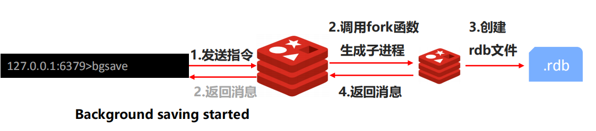

但是, BGSAVE命令在执行时, 服务器会采用与BGSAVE命令没有执行时不同的方式处理`SAVE`, `BGSAVE`,`BGREWRITEAOF`三个命令:

- `SAVE`: 在BGSAVE执行期间, `服务器会拒绝执行SAVE命令`.目的是为了防止主进程执行的save操作与子进程执行的bgsave同时调用rdbSave, 产生竞争条件.

- `BGSAVE`: 在BGSAVE执行期间, `服务器会拒绝执行BGSAVE命令`. 目的是为了防止fork出来的两个子进程同时调用rdbSave, 产生竞争条件.

- `BGREWRITEAOF`: 

  - 如果服务器接收到BGREWRITEAOF时, BGSAVE正在执行, 那么BGREWRITEAOF命令会被延迟到BGSAVE命令执行完毕之后执行
  - 如果服务器接收到BGSAVE命令时, BGREWRITEAOF正在执行, 那么服务器会拒绝执行BGSAVE.

  > BGSAVE和BGREWRITEAOF都会fork出一个子进程进行持久化操作, 处于性能方面考虑 --- 并发出两个子进程同时执行大量的磁盘操作效率不高.

#### 3. RDB文件载入时服务器的状态:

服务器在载入RDB文件期间, `会一直处于阻塞状态`, 直到载入工作完成为止.


### 10.2 自动间隔性保存实现:

通过redis.conf配置文件中save配置项, 可以配置如果某个时间段内服务器对数据库执行了多少次修改, 服务器自动执行BGSAVE. 下面就是如何实现的.

#### 1. 设置保存条件:

redis.conf配置文件中save配置项, 用户如果没有配置的话, 会采用如下的默认配置:

```c
save 900 1 // 服务器在900秒之内, 对数据库进行了1次修改
save 300 10 // 服务器在300秒之内, 对数据库进行了10次修改
save 60 10000 // 服务器在60秒之内, 对数据库进行了10000次修改
```

在表示服务器的结构体中`redisServer`结构的saveparams属性, 就会将`save`配置项保存起来.

```c
struct redisServer {
    // ...
	// 记录save配置项的值
    struct saveparam *saveparams;
    // ...
}
```

saveparams是一个数组, 每一个元素都是一个`saveparam结构`:

```c
struct saveparam {
    // 描述
    time_t seconds;
    // 修改次数
    int changes;
}
```


#### 2. dirty计数和lastsave属性:

除了saveparams数组之外, redisServer还维护着一个dirty计数器, 以及一个lastsave属性:

```c
struct redisServer {
    // ...
	// 修改计数器
    long long dirty;
    // 上一次成功执行保存命令的时间:
    time_t lastsave;
    // ...
}
```

- dirty计: 记录的时距离上次成功执行save命令或者bgsave命令之后, 服务器对数据库状态(所有数据库) 进行了多少次修改(写入删除更新)
- lastsave: 是一个UNIX时间戳, 记录了服务器上一次成功执行save或者bgsave命令的时间 


#### 3. 检查是否满足条件:

Redis的服务器周期性操作函数serverCron默认每隔100毫秒就会执行一次, 该函数用于对redis服务器进行维护.检查是否满足条件的伪代码:

```c
for (j = 0; j < server.saveparamslen; j++) {
            struct saveparam *sp = server.saveparams+j;

            /* Save if we reached the given amount of changes,
             * the given amount of seconds, and if the latest bgsave was
             * successful or if, in case of an error, at least
             * REDIS_BGSAVE_RETRY_DELAY seconds already elapsed. */
            // 检查是否有某个保存条件已经满足了
    		// 1. 服务器修改数据库的次数 > save配置项的修改次数
    		// 2. 现在距离上次完成save的时间间隔 > save配置项的时间间隔
    		// 3. 现在距离上次尝试save的时间间隔 > save失败延迟常量 或者 最后一次执行 SAVE 的状态 为 REDIS_OK(0)
            if (server.dirty >= sp->changes &&
                server.unixtime-server.lastsave > sp->seconds &&
                (server.unixtime-server.lastbgsave_try >
                 REDIS_BGSAVE_RETRY_DELAY ||
                 server.lastbgsave_status == REDIS_OK))
            {
                redisLog(REDIS_NOTICE,"%d changes in %d seconds. Saving...",
                    sp->changes, (int)sp->seconds);
                // 执行 BGSAVE
                rdbSaveBackground(server.rdb_filename);
                break;
            }
         }
```


### 10.3 RDB文件:

主要介绍RDB文件的结构和意义.

主体结构如下:


- `REDIS`: RDB文件的最开头时`REDIS`部分, 这个部分的长度为5字节, 保存着`REDIS`五个字符. 通过这五个字符, 程序可以在载入文件时, 快速检查所载入的文件是否是RDB文件.

  > RDB文件存储的是二进制数据, 而不是c字符串, 只是为了方便理解, 采用c字符串.

- `db_version`: 长度为4字节, 它的值时一个字符串表示的证书, 这个整数记录了RDB文件的版本号, 比如"0006"就代表RDB文件的版本为第六版. `后面所讲的都是第六版的结构`.

- `database`部分包含着领个或者任意多个数据库, 以及各个数据库中的键值对数据:

  - 如果服务器的数据库状态为空(所有数据库都是空的), 那么这个部分也为空, 长度为0字节．
  - 如果服务器的数据库状态为非空(有至少一个数据库非空), 那么这个部分也非空, 根据数据库所保存键值对的数量, 类型和内容不同, 这部分的长度也不同.

- `EOF`: EOF常量的长度为1字字节, 这个常量标志着RDB文件正文内容的结束, 当读入程序遇到这个值的时候, 程序就知道所有数据库的所有键值对都已经载入完毕.

- `check_sum`: 是一个8字节长度的无符号证书, 保存着一个校验和, 这个校验和是通过前面四个部分的内容计算得到的. `主要时用来检查数据RDB文件是否损坏`.


#### 1. databases部分:

一个RDB文件的databases部分可以保存任意多个非空数据库.

举个例子:

服务器的0,3号数据库为非空, 那么RDB文件结构如图:


`每个非空数据库在RDB文件中都可以保存为SELECTDB, db_number, key_value_pairs三部分`:


- `SELECTDB`: 是个常量长度为1字节, 当读入程序遇到这个值的时候, 就明白接下来将要读入的僵尸一个数据库号码.
- `db_number`: 保存着一个数据库号码, 根据号码的大小不同, 这个部分长度可以是1字节, 2字节, 或者5字节. 读入db_number部分之后, 服务器调用select命令, 根据读入的数据库号码进行数据库切换, 从而将读入的键值对可以加载到对应的rdb文件的数据库结构中
- `key_value_pairs`: 保存了数据库中所有的键值对数据, 如果键值对带有过期时间, 那么过期时间也会和键值对保存在一起.


**`完整RBD结构`**


#### 2. key_value_pairs部分:

RDB文件中每个`key_value_pairs`部分都保存了一个或以上数据的键值对, 如果键值对带有过期时间的话, 那么过期时间也会一起记录


- `TYPE`: 记录了value的类型, 长度为1字节, 值可以是以下常量中的一个:

  ```c
  #define REDIS_RDB_TYPE_STRING 0
  #define REDIS_RDB_TYPE_LIST   1
  #define REDIS_RDB_TYPE_SET    2
  #define REDIS_RDB_TYPE_ZSET   3
  #define REDIS_RDB_TYPE_HASH   4
  #define REDIS_RDB_TYPE_LIST_ZIPLIST  10
  #define REDIS_RDB_TYPE_SET_INTSET    11
  #define REDIS_RDB_TYPE_ZSET_ZIPLIST  12
  #define REDIS_RDB_TYPE_HASH_ZIPLIST  13
  ```

  这些常量代表的是一种对象类型或者底层编码, 当服务器读入RDB文件中的键值对数据时, 程序会`根据TYPE的值来决定如何读入和解释`value的数据.

- `key`: key总是一个字符串对象, 它的编码方式和`REDIS_RDB_TYPE_STRING`的value是一样的, 内容长度不同, key部分的长度也会不同.

- `value`: 根据TYPE类型不同, 以及保存内容长度的不同, 保存vlaue的结构和长度也会有所不同.

- `EXPIRETIME_MS`: 是个常量, 长度为1字节, 作用是`告知读入程序, 接下来要读入的将是一个以毫秒为单位的过期时间`.

- `ms`: 是一个8字节长度的带符号整数, 记录着一个以毫秒为单位的UNIX时间戳, 这个字段表示的就是`键值对的过期时间`.

> key, value, type三个字段时一定有的. `EXPIRETIME_MS`, `ms`只有键值对带有过期时间的时候才会存在


#### 3. value的编码:

RDB文件中的每个value部分都保存了一个值对象, 每个值对象的类型都由与之对应的TYPE记录, TYPE不同value部分的结构, 长度也会有所不同.

**1. 字符串对象:**

`TYPE`字段的值为 `REDIS_RDB_TYPE_STRING(即0)` 那么value保存的就是一个字符串对象, 该对象的编码方式可以是 `REDIS_ENCODING_INT` 或者 `REDIS_ENCODING_RAW`

- `REDIS_ENCODING_INT` : 结构如图下图

  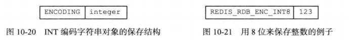

  其中: encoding可以是 `REDIS_RDB_ENC_INT8`, `REDIS_RDB_ENC_INT16`, 或者 `REDIS_RDB_ENC_INT32`, 分别表示RDB文件使用8位, 16位, 32位来保存整个integer.

- `REDIS_ENCODING_RAW`: 会根据字符串长度判断是否需要对字符串进行压缩后, 再存入文件

  - 字符串的长度小于等于20字节, 不会压缩字符串, 直接原样保存. rdb文件中的结构:

    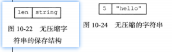

  - 字符串的长度大于20字节, 那么这个字符串会被压缩之后再保存.

    

    - `REDIS_RDB_ENC_LZF`: 是个常量, 表示该字符串已经被压缩过.
    - `compressed_len`: 表示字符串经过压缩之后的长度
    - `orgin_len`: 表示字符串原来的长度
    - `compressed_string`: 表示经过压缩过后的字符串内容

    > 配置文件中`rdbcompression`, 如果这个配置项打开了, 字符串就会被压缩, 否则不会.

**2. 列表对象:** 

`TYPE`字段为 `REDIS_RDB_TYPE_LIST(即1)`, 那么value保存的就是一个列表对象, 该对象的编码方式是 `REDIS_ENCODING_LINKEDLIST`.

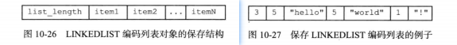

- `list_length`: 表示列表的长度, 记录列表保存了多少个元素.

**3. 集合对象:**

`TYPE`字段为 `REDIS_RDB_TYPE_SET(即2)`, 那么value保存的就是一个集合对象, 该对象的编码方式是 `REDIS_ENCODING_HT`.

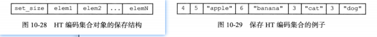

- `set_size`: 表示集合中保存了多少个元素.

**4. 哈希表对象:**

`TYPE`字段为 `REDIS_RDB_TYPE_HASH(即4)`, 那么value保存的就是一个哈希对象, 该对象的编码方式是 `REDIS_ENCODING_HT`.

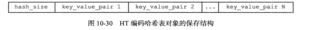

- `hash_size`: 记录了哈希表的大小, 即hash表中存放了多少个元素.
- `key_value_pair`: 记的是哈希表中的键值对, 键值对的键和值都是字符串对象, `因此程序会按照字符串对象的方式来保存和读入键值对`

结构中, 键值对都以紧挨着的方式排列在一起, 实际的存放结构如图:

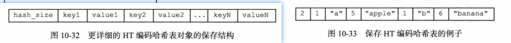

**5. 有序集合对象:**

`TYPE`字段为 `REDIS_RDB_TYPE_ZSET(即3)`, 那么value保存的就是一个哈希对象, 该对象的编码方式是 `REDIS_ENCODING_SKIPLIST`.

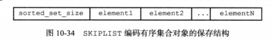

- `sorted_set_size`: 记录了有序集合的大小, 即这个有序集合保存了多少元素.
- `element`: 表示zset的元素, 同时又包含两部分`成员`和`分数`

有序集合中的每个元素都以成员, 分数紧挨着的方式排列:


**6. INTSET编码的集合:**

`TYPE`字段为 `REDIS_RDB_TYPE_SET_INTSET(即11)`, 那么value保存的就是一个整数集合对象, `RDB文件保存整数集合这种对象的方式是, 先将整数集合转换为字符串对象, 然后将这个字符串对象保存进RDB文件中`.

**7. ZIPLIST编码的对象**

`TYPE`字段为 `REDIS_RDB_TYPE_LIST_ZIPLIST(即10)`, `REDIS_RDB_TYPE_ZSET_ZIPLIST(即12)`, `REDIS_RDB_TYPE_HASH_ZIPLIST(即13)`, 那么value保存的就是一个压缩列表对象.

RDB文件处理这种对象的方式:

写入过程:

1. 将压缩列表对象转换成字符串对象
2. 将所得的字符串对象存入RDB文件中

读取过程:

1. 读取字符串对象, 并将它转换成压缩列表对象.
2. 根据TYPE的值, 设置压缩列表对象的类型.


#### 4 分析RDB文件:

REDIS自身带有RDB文件检查工具, redis-check-dump.


### 10.4 RDB相关配置:

```yaml
# 自动保存的间隔时间和在这期间发生写操作次数
save 900 1
save 300 10
save 60 10000

# bgsave发生异常就不再写入文件
stop-writes-on-bgsave-error yes
# 数据压缩, 设置为yes, 如果字符串大于限制, 将会压缩后存放, 设置为no可以节约cpu运行时间, 但是文件会比较大
rdbcompression yes
# 是否生成rdb格式校验, 设置为no, 节约读写10%时间消耗, 存在数据损坏的风险
rdbchecksum yes
# rdb文件的名称, 通常设置为dump-端口号.rdb
dbfilename dump.rdb
# 设置.rdb文件的路径, 通常设置成存储空间较大的目录中
dir ./
```


### 10.5 RDB优缺点总结:

优点:

1. RDB是一个紧凑压缩的二进制文件, 存储效率较高.
2. RDB文件内存储的是redis在某个时间点的数据快照(即全量数据), 非常适合用于数据备份, 全量复制等场景.
3. RDB恢复数据的速度要比AOF快很多.
4. 应用: 服务器中每x小时执行bgsave备份, 并将RDB文件拷贝到远程机器中, 用于灾难恢复

缺点:

1. RDB方式无论是执行指令还是利用配置, 无法做到实时持久化, 具有较大的可能性丢失数据
2. bgsave命令每次运行要fork出一个子进程, 在fork的时候会阻塞服务器进程, 会牺牲一定的性能.
3. Redis的众多版本中未进行RDB文件格式版本统一, 有可能出现Redis版本不同, RDB文件无法兼容的情况.

## 11. AOF持久化:

`AOF(Append Only File)`: 与RDB持久化通过保存某个时刻数据库中的键值对来记录数据库的状态不同, `AOF持久化`是通过保存服务器所执行的写命令(SET,SADD,RPUSH,DEL等)来记录数据库状态的.

举个例子: 

```shell
redis> set msg "hello"
OK
redis> SADD AAAA "apple" "banana" "cherry"
(integer)3
redis> RPUSH bbbbb 128 111 123
(integer)3
```

RDB是将这三个key的键值对数据保存到RDB文件中, 而aof保存的是`set`, `sadd`, `rpush`这三条命令.

在AOF文件中, 所有的写入命令都是`以Redis的命令请求协议格式(纯文本格式)保存的`, AOF文件内容如图:

 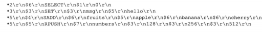

在这个AOF文件中, 除了第一条指定数据库的select命令是服务器自动添加的之外, 其他命令都是通过客户端发送的命令.

服务器在启动的时候, 可以通过载入和执行AOF文件中保存的命令来还原服务器关闭之前的数据库状态, 服务器载入AOF文件并还原数据库状态的日志如图:

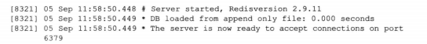


### 11.1 AOF持久化的实现:

AOF持久化功能实现分为`命令追加(append)`, `文件写入`, `文件同步(sync)`三个步骤

#### 1. 命令追加:

当AOF持久化功能处于打开状态时, 服务器在执行一个`写入命令之后`, 会以`协议格式`将被执行的写入命令追加到服务器状态的`aof_buf缓冲区的末尾`:

```c
struct redisServer {
    // ....
    
    // aof缓冲区:
    sds aof_buf;
    
    // ....
}
```

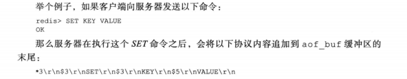

#### 2. AOF文件的写入和同步:

> `写入缓冲区`: 在现代操作系统中, 当用户调用write函数, 将一些数据写入到文件的时候, 操作系统通常会采取将数据保存到一个内存缓冲区里面, 等到这个缓冲区被填满了, 或者超过了指定时间限制后, 才真正的键缓冲区的数据写入到磁盘里面. `对于操作系统用户来说, 写入缓冲区的过程可以成为写入AOF文件`.
>
> `同步(落盘)`: 写入缓冲区替代直接写入磁盘的问题在于, 如果在写入磁盘之前机器宕机了, 会造成数据丢失, 所以操作系统提供了`fsync`和 `fdatasync`两个函数, 让用户强制操作系统立刻将缓冲区中的数据吸入了到磁盘里面.`对于文件来说, 落盘才是真正的写入了, 所以叫同步`

Redis的服务器进程就是一个`事件循环(eventLoop)`, 这个事件循环的文件事件负责接收客户端的命令请求, 以及向客户端响应请求结果. 而时间事件则负责执行像serverCron函数这样需要定时运行的函数.

服务器在处理文件事件时可能会执行写入命令, 为了保证写入命令会被存入`aof_buf`里面, 所以在服务器每次结束一个事件循环之前, 他都会调用`flushAppendOnlyFile函数`, 考虑是否需要将`aof_buf缓冲区中的内容写入和保存到AOF文件中`.

```java:
// 伪代码:
public void eventLoop() {
	while (true) {
		// 客户端事件, 将写命令写入到aof_buf缓冲区
		processFileEvents();
		
		// 处理时间事件
		processTimeEvents();
		
		// aof函数
		flushAppedOnlyFile();
	}
}
```

`flushAppendOnlyFile函数`的行为在`redis.conf/appendfsync配置项`来决定:

- `appendfsync always` : 总是将aof_buf中的内容写入AOF文件, 并立即同步到AOF文件中 

  特点: 最安全, 但是是最慢的一个(最慢指的是aof持久化的过程)

- `appendfsync everysec(默认)` : 总是将aof_buf中的内容写入到aof文件中, 如果此时距离上次同步AOF文件的时间超过了1秒, 那么再次对AOF文件进行同步(同步操作由另外的线程执行)

  特点: 效率较快, 但是可能丢失从上次同步aof文件之后一秒内的数据

- `appendfsync no`: 总是将aof_buf中的内容写入到aof文件中, 但是同步到AOF文件的过程由操作系统控制.

  特点: 速度最快 , 但是可能丢失从上次同步aof文件之后的所有数据(隔了很久不同步文件)

### 11.2 AOF文件的载入和数据还原:

AOF持久化的数据还原过程, 实际上就是`REDIS命令的重放过程`.

**`详细过程:`**

1. 创建一个不带网络连接的伪客户端(因为redis的命令只能在客户端的上下文中执行), 数据还原过程中的命令来源于aof文件不需要网络连接, 所以服务器使用`一个没有网络连接的伪客户端执行命令的效果和带网络连接的客户端执行命令的效果完全一样`.
2. 从aof文件中读取出一条redis命令.
3. 使用伪客户端执行命令.
4. 重复2,3步骤, 直到aof文件所有命令执行完毕.


### 11.3 AOF重写:

随着服务器的运行, 越来越多的写命令写入aof文件中, 文件的体积会随之变大, 如果不控制的话会对redis服务器, 宿主机造成影响, 且在`还原数据库状态的时候所需要的时间就越长`.

#### 1. aof重写的实现:

为了解决AOF文件随着服务器运行膨胀的问题, redis提供了`aof文件重写`的功能, `通过创建一个新的aof文件来替换现有的aof文件, 两个aof文件保存的数据库状态是相同的, 但是新的aof文件不会包含任何浪费空间的命令, 因此新aof文件的体积要比旧aof文件的体积小很多`.


**`实现原理`**: 首先从redis数据库中读取键当前的值, 然后用一条命令去记录键值对, 代替之前记录这个键值对的多条命令


在创建新aof文件替换旧aof文件的过程中, redis的实现方式`不是`通过对旧aof文件进行读取,分析,写入操作来实现, `而是通过读取当前服务器的状态来实现的`.

**`举个例子`**: 执行下面这一串redis命令.

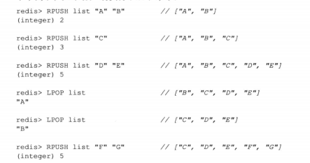

- `旧aof文件中`: 会将这六条命令全部记录下来.
- `新aof文件中`: 通过读取当前数据库中键list的值, 然后用一条 `RPUSH list "c" "D" "E" "F" "G"`来替代旧文件中的六条写命令.

> 在实际实现中, 为了避免redis客户端输入缓冲区溢出, 重写程序会在处理 `list`, `set`, `zset`, `hash`这四种可能含有多个元素的键时, 会检查键多包含的元素数量. 如果超过了`reids.h/REDIS_AOF_REWRETE_ITEMS_PER_CMD常量`的值(redis 3.0版本为64)时, 会对新文件中原本一条写命令进行分割, 分割成多条写命令来完成对该键的记录. 如下图所示: 
>
> 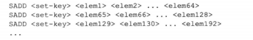

#### 2. aof后台重写:

redis是单线程处理命令请求, 如果使用服务器线程来直接调用aof重写函数的话, `由于aof重写涉及到大量的写入操作, 那么服务器线程会被长时间阻塞而无法处理客户端发来的命令请求`.

因此, redis将aof重写操作放在子进程里面执行, 主要是为了一下两个目的:

1. 子进程进行aof重写期间, 服务器进程可以继续对客户端的请求进行处理
2. 子进程带有服务器进程的数据副本, 使用子进程而不是线程, 可以在不加锁的情况下, 保证数据的安全.

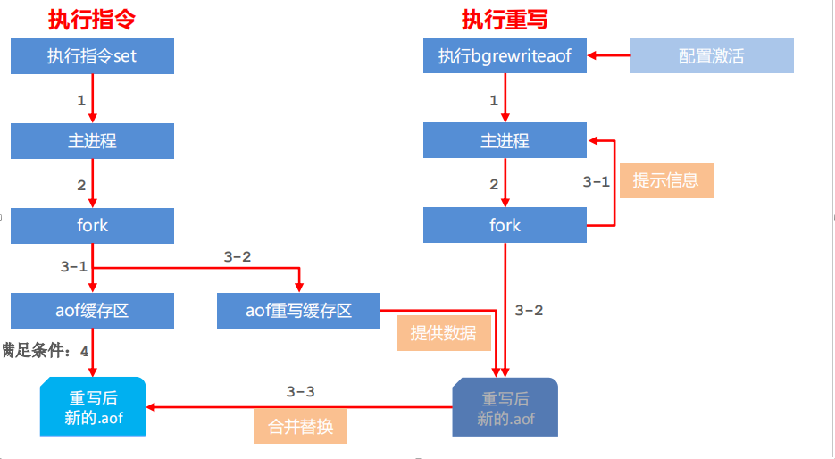

3-1, 3-2补充:

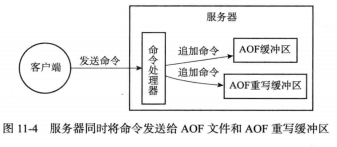

3-3 合并替换: `合并的是重写缓冲区`

**`使用子进程会出现的问题:`**

在子进程执行aof重写过程期间, 服务器进程继续对客户端请求进行处理, 但是子进程持有的数据是服务器进程fork子进程那一个时刻的副本, fork出来子进程后的数据是没有从而造成子进程和服务器进程持有的数据库状态时不一致的.

**`解决办法:`**

为了解决这个问题, redis服务器设置了一个aof重写缓冲区, 这个缓冲区在服务器进程fork出子进程之后, 开始使用, 当redis服务器执行完一个写命令之后, 服务器进程会同时将这个写命令发送给`aof缓冲区`和`aof重写缓冲区`.

这样一来可以保证:

- AOF缓冲区的内容会定期被写入和同步到AOF文件, 对现有AOF文件的处理工作会正常进行.
- 从创建子进程开始, 服务器进程执行的所有写入命令都会被记录到AOF重写缓冲区里面去.


#### 3. aof后台重写条件:

```yaml
# 自动BGREWRITEAOF的配置项: 
# percentage表示当前aof文件的大小和上次重写后aof文件大小的比例, 如果超过这个配置项就自动重写
# min-size表示当前aof文件大小超过这个配置项就自动重写.
# 任意满足就重写
auto-aof-rewrite-percentage 100
auto-aof-rewrite-min-size 64mb
```

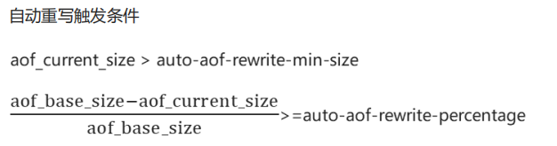


### 11.4 AOF相关配置:

```yaml

# 是否开启aof持久化, aof开启redis在启动的时候会读aof文件, 而不会读rdb文件
appendonly no

# The name of the append only file (default: "appendonly.aof")

appendfilename "appendonly.aof"

# 对于操作系统来讲, 写入文件是先写入缓冲区中, 等缓冲区满了才会将数据刷盘
# 通过这个配置可以控制刷盘时机.
# appendfsync always # 只要有写操作就刷盘一次
appendfsync everysec # 默认配置, 每隔一秒刷盘一次
# appendfsync no # 由操作系决定什么时候刷盘aof文件

# 子进程在BGSAVE或者BGREWRITEAOF期间, aof文件是否落盘.
# 配置为yes可以提高请求的响应速度, 配置为no数据更安全, 数据保存更好
no-appendfsync-on-rewrite no

# 自动BGREWRITEAOF的配置项: 
# percentage表示当前aof文件的大小和上次重写后aof文件大小的比例, 如果超过这个配置项就自动重写
# min-size表示当前aof文件大小超过这个配置项就自动重写.
# 任意满足就重写
auto-aof-rewrite-percentage 100
auto-aof-rewrite-min-size 64mb

aof-load-truncated yes
# 是否开启混合持久化, 在重写aof文件的时候, 新的aof文件在前半段是RDB格式, 后半段是AOF格式.
aof-use-rdb-preamble yes
```

混合持久化开启时, aof文件:


## 12. 事件:

redis服务器是一个事件驱动程序, 主要是处理下面两类事件:

- `文件事件`: redis服务器通过socket与客户端(或者其他redis服务器进行通信), 而文件事件就是socket的抽象. 服务器与客户端通信就会产生相应的文件事件, 服务器通过监听并处理这些事件来完成网络通信操作. 
- `时间事件`: redis服务器中的一些操作(`serverCron`)需要在指定时间点执行, 而时间时间就是服务器对这类定时操作的抽象.


### 12.1 文件事件:

redis基于`Reactor模式`开发了自己的`网络事件处理器(文件事件处理器)`, 职责:

- 文件事件处理器使用I/O多路复用程序来同时监听多个socket, 并且根据socket目前执行的任务来为socket关联不同的事件处理器.
- 当被监听的socket准备好执行`accept`, `read`, `write`, `close`等操作的时候, 就会产生对应的事件, 此时文件处理器就会调用socket之前关联好的事件处理器来处理这些时间.

#### 1. 文件事件处理器的构成:

3.0版本redis的文件事件处理器以单线程运行, 通过I/O多路复用程序以达到单线程监听过个socket的目的, 即实现了高效的网络通信模型, 也方便与redis中其他同样以单线程运行的模块进行对接.


文件事件处理器由四个部分构成: `socket`, `I/O多路复用程序`, `文件事件派发器(图中的队列)`, `事件处理器(一个个的函数)`.

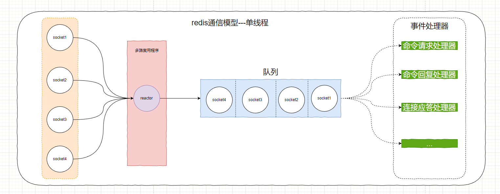

**`Redis6.0的多线程模式:`**

redis6.0开始redis的通信模型变成了多线程模型, 即主从reactor. 与单线程的异同同点:

- 相同:
  - 与单线程一样, `执行redis命令的线程仍然只有主reactor一个线程`, 所以6.0 的redis仍然是一个单线程程序.
- 不同:
  - 采用了主从reactor模型, `主reactor`负责处理socket中的`链接事件和命令执行`, `从reactor`负责已经建立连接的socket中的`数据收集与分发`(主要作用是提高网络I/O效率).

**`加入多线程之后读流程:`**

1. 主reactor接收socket中的建立连接请求, 读事件到来将socket放置到一个等待队列里面.
2. 主reactor处理完读事件后, 通过算法将等待队列中的socket分配给从reator, 然后主reator进入(spinlock效果)等待状态
3. 从reactor将socket中的数据读取并解析完成
4. 主reator等待所以从reactor完成数据读取与解析后, 执行所有命令并清空整个读队列.

> 1. 数据出站时,同样会等待所有的从reactor完成往socket里面写数据后由主reactor一起发送.
>
> 2. 从reactor要么是全部在执行读操作, 要么是执行全部写操作


#### 2. I/O多路复用程序的选择:

I/O多路复用程序的实现有很多种, `epoll`, `select`, `kqueue`等等. redis对各种I/O多路复用库都实现了相同的API, 所以底层是可以互换的.

redis通过定义宏根据实际情况来选择不同的I/O多路复用器:

```c
# ifdef HAVE_EVPORT
# include "ae_evport.c"
# else
	# ifdef HAVE_EPOLL
	# include "ae_epoll.c"
	# else
		# ifdef HAVE_KQUEUE
		# inclue "ae_kqueue.c"
		# else
		# include "ae_select.c"
		# endif
	# endif
# endif
```


#### 3. 事件的类型:

多路复用程序可以监听多个socket的`ae.h/AE_READABLE` 事件和 `ae.h/AE_WRITABLE`事件, 这两类事件对应的socket操作为:

- `AE_READABLE`事件:
  - 客户端对socket执行写操作, 对服务器来说是数据入站 (`对应java NIO的read事件`)
  - 客户端关闭socket
  - 新客户端连接到来, 即客户端连接服务器(`对应java NIO的connect事件`)
- `AE_WRITABLE`事件:
  - 客户端对socket执行read操作.

> 多路复用器允许服务器同时监听读写事件, 如果一个socket同时产生两种事件, `文件事件分发器会优先处理读事件`, 等到读事件处理完之后, 再处理写事件. 即`对于同一个socket, 同时触发读写事件, 会先读后写`.

