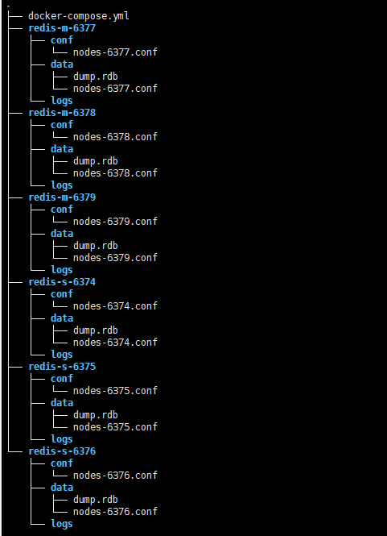
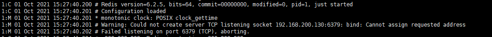
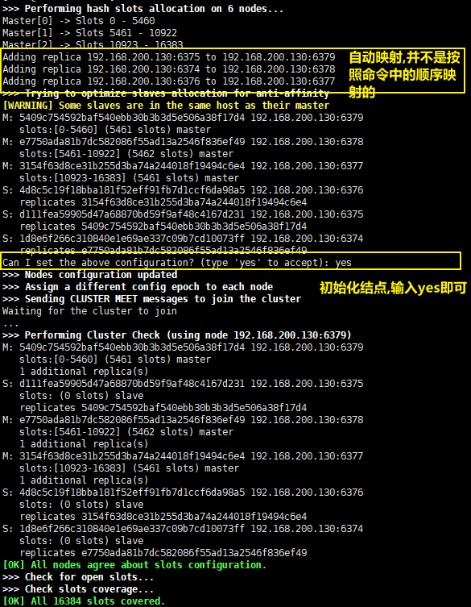

## 1. 下载配置文件:

[官网github](https://github.com/antirez/redis/blob/unstable/redis.conf)

## 2. 创建文件夹:

这里的文件夹是用来做文件映射的



> data文件夹下面的 dump.rdb, nodes-xxx.conf是redis集群搭好后出来的

## 3. 修改配置文件:

按照需要修改配置文件就行:

几点说明:

1. `bind` : 这个配置表示的是 将redis服务绑定到redis程序所在的机器上某个ip地址上,让外界可以通过这个ip地址来访问redis服务.

   即 bind的ip地址是redis程序所在机器网卡对应ip地址

   如果是通过容器创建的redis服务, 那么ip地址是容器对应的ip地址,不能是容器宿主机的ip地址

   

   这张图片就是将bind设置成了 容器宿主机的ip,导致容器无法启动

2. `protected-mode `: 限制redis是否可以通过ip访问

   如果保护模式开启, 并且出现下列情况:

   1. 没有bind redis实例被外界访问的ip地址
   2. 没有配置密码

   redis实例就只能通过 127.0.0.1(ipv6 为::1)或者unit域名套接字来访问

## 4. 编写docker-compose:

```yml
version: '3.5'
# 定义服务，可以多个
services:
  redis-m-6379: # 服务名称
    image: redis # 创建容器时所需的镜像
    container_name: redis-m-6379 # 容器名称
    restart: always # 容器总是重新启动
    volumes: # 数据卷，目录挂载
      - ./redis-m-6379/conf/nodes-6379.conf:/usr/local/etc/redis/redis.conf
      - ./redis-m-6379/data:/data
    ports:
      - 6379:6379 # redis服务端口
      - 16379:16379 # redis集群监控端口
    command:
      redis-server /usr/local/etc/redis/redis.conf

  redis-m-6378:
    image: redis
    container_name: redis-m-6378
    restart: always
    volumes:
      - ./redis-m-6378/conf/nodes-6378.conf:/usr/local/etc/redis/redis.conf
      - ./redis-m-6378/data:/data
    ports:
      - 6378:6378
      - 16378:16378
    command:
      redis-server /usr/local/etc/redis/redis.conf

  redis-m-6377:
    image: redis
    container_name: redis-m-6377
    restart: always
    volumes:
      - ./redis-m-6377/conf/nodes-6377.conf:/usr/local/etc/redis/redis.conf
      - ./redis-m-6377/data:/data
    ports:
      - 6377:6377
      - 16377:16377
    command:
      redis-server /usr/local/etc/redis/redis.conf
      
  redis-s-6376:
    image: redis
    container_name: redis-s-6376
    restart: always
    volumes:
      - ./redis-s-6376/conf/nodes-6376.conf:/usr/local/etc/redis/redis.conf
      - ./redis-s-6376/data:/data
    ports:
      - 6376:6376
      - 16376:16376
    command:
      redis-server /usr/local/etc/redis/redis.conf

  redis-s-6375:
    image: redis
    container_name: redis-s-6375
    restart: always
    volumes:
      - ./redis-s-6375/conf/nodes-6375.conf:/usr/local/etc/redis/redis.conf
      - ./redis-s-6375/data:/data
    ports:
      - 6375:6375
      - 16375:16375
    command:
      redis-server /usr/local/etc/redis/redis.conf

  redis-s-6374:
    image: redis
    container_name: redis-s-6374
    restart: always
    volumes:
      - ./redis-s-6374/conf/nodes-6374.conf:/usr/local/etc/redis/redis.conf
      - ./redis-s-6374/data:/data
    ports:
      - 6374:6374
      - 16374:16374
    command:
      redis-server /usr/local/etc/redis/redis.conf
```

主要注意一下各个端口映射,然后运行docker-compose执行该文件

```bash
docker-compose -f docker-compose.yml up -d
```

## 5. 将redis结点加入到集群中:

随便找有有redis-cli可执行文件的机器,输入下列命名

```bash
redis-cli --cluster create 192.168.200.130:6379 192.168.200.130:6378 192.168.200.130:6377 192.168.200.130:6376 192.168.200.130:6375 192.168.200.130:6374 --cluster-replicas 1
```



注意: 

1. 主从比例一定要与 `--cluster-replicas`参数一致
2. 主从映射也不是按照顺序映射的