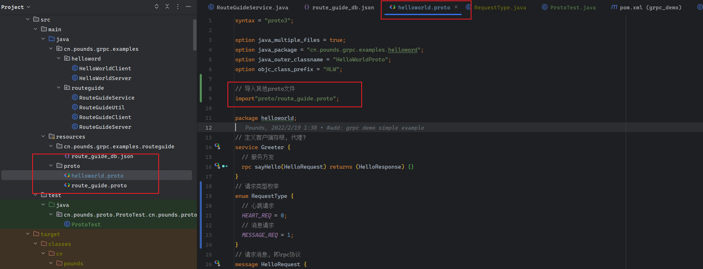
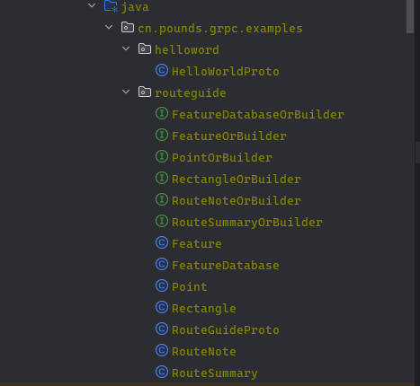
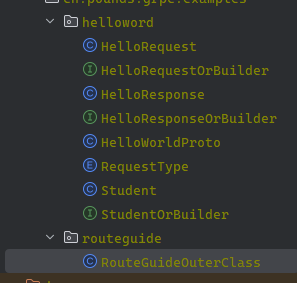

## 参考文章:  

穆书伟译文 https://juejin.cn/post/6844903687089831944#heading-11

 原文 https://developers.google.com/protocol-buffers/docs/overview#enum

在.proto文件中,第一行需要声明使用的proto语法版本, 比如 `syntax = "proto3"` 

## 1.1定义消息类型: 
```protobuf
    syntax = "proto3";
    message SearchRequest {
      string query = 1;
      int32 page_number = 2;
      int32 result_per_page = 3;
    }
```
### 1.1.1 指定字段标识号:

在上面示例代码中, 在消息定义中, 每个字段等号后面的数字就是`字段的标识号`. 这些标识号是用于 `在消息的二进制格式中识别各个字段的, 一旦指定了就不能改变`

- [1,15]以内的标识号在编码时只会占用一个字节
- [16,2047]以内的标识号会占用两个字节 

- 标识号的范围: [1, 536,870,911(即2^29-1)], 其中 [19000－19999] 的标识号是protobuf预留号段, 不可以使用.

> ps: 记得为将来可能出现的, 频繁使用的标识号预留一些标识号

### 1.1.2 指定字段的类型:  

1. 值类型:

   proto buffer 支持的消息类型见 : [字段类型](https://developers.google.com/protocol-buffers/docs/proto3#scalar)

   | proto类型 | 默认值   | java类型   | go类型  | 解释                                                         |
   | --------- | -------- | ---------- | ------- | ------------------------------------------------------------ |
   | double    | 0        | double     | float64 |                                                              |
   | float     | 0        | float      | float32 |                                                              |
   | int32     | 0        | int        | int32   | 使用可变长度编码, 编码负数的效率低, 如果存在负数, 建议使用sint32 |
   | int64     | 0        | long       | int64   | 使用可变长度编码, 编码负数的效率低, 如果存在负数, 建议使用sint32 |
   | uint32    | 0        | int        | uint32  | 使用可变长度编码                                             |
   | uint64    | 0        | long       | uint64  | 使用可变长度编码                                             |
   | sint32    | 0        | int        | int32   | 使用可变长度编码, 在编译负数的效率上比int32更高效            |
   | sint64    | 0        | long       | int64   | 使用可变长度编码, 在编译负数的效率上比int64更高效            |
   | fixed32   | 0        | int        | uint32  | 总是占用4字节, 如果数值总是比2^28更大的话, 要比uint32更高效一些 |
   | fixed64   | 0        | long       | uint64  | 总是占用8字节, 如果数值总是比2^56更大的话, 要比uint64更高效一些 |
   | sfixed32  | 0        | int        | int32   | 总是占用4字节                                                |
   | sfixed64  | 0        | long       | int64   | 总是占用8字节                                                |
   | bool      | false    | bolean     | bool    |                                                              |
   | string    | 空字符串 | String     | string  | 字符串必须由UTF-8编码或者7字节ASCII文本, 并且字符串长度不能超过2^32 |
   | bytes     | 空字节   | ByteString | []byte  | 可以包含任意字节序列, 但是长度不能超过2^32                   |

2. 枚举:

   ```protobuf
   // 请求类型枚举
   enum RequestType {
     // 心跳请求
     HEART_REQ = 0;
     // 消息请求
     MESSAGE_REQ = 1;
   }
   // 请求消息, 即rpc协议
   message HelloRequest {
     string name = 1;
     // 引入枚举
     RequestType request_type = 2;
   }
   ```

   枚举类型中 字段`=`后面不是字段唯一编号, 而是枚举的默认值, 并且第一个字段的默认值必须是0, 原因如下:

   1. 必须有一个零值，以便我们可以使用0作为元素值的`数值默认值`
   2. 零值必须是第一个元素，以便与[proto2](https://link.juejin.cn/?target=https%3A%2F%2Fdevelopers.google.com%2Fprotocol-buffers%2Fdocs%2Fproto)语义兼容，其中第一个枚举值始终是默认值。

   枚举中可以给枚举项设置别名, 需要通过`option allow_alias = true`来开启这个特性, 如果没有开启但是又给枚举项设置了相同的值, protobuffer编译器在便宜的时候会报错

   ```protobuf
   enum EnumAllowingAlias {
     option allow_alias = true;// 不写这一行, 编译时会报错
     EAA_UNSPECIFIED = 0;
     EAA_STARTED = 1;
     EAA_RUNNING = 1;
     EAA_FINISHED = 2;
   }
   ```

3. 使用其他消息类型作为字段类型:

   在protobuffer, 可以使用其他消息类型作为消息的字段类型. 

   - 使用相同`.proto`文件中定义的消息

     ```protobuf
     message HelloRequest {
       string name = 1;
       // 引入枚举
       RequestType request_type = 2;
       // 使用其他消息作为字段值
       Student stu = 3;
     }
     message Student {
       string name = 1;
       int32 age = 2;
     }
     ```

   - 使用其他`.proto`文件中定义的消息

     ```protobuf
     import“myproject / other_protos.proto”;
     ```

     

## 1.2 代码生成:

以JAVA为例子:

### 1.2.1 常用option:

#### 1. java_multiple_files:

```protobuf
option java_multiple_files = true;
```

默认情况下这个选项是关闭的, 即默认值为false, 如果设置为true, 就会为`proto`文件中的每个message,enum, service单独生成一个`java`文件, 如果没有就为只会生成一个`java文件`. 如图: 其中`helloWorldProto`就没有开启这个选项:



#### 2. java_outer_classname:

```protobuf
option java_outer_classname = "Foo";
```

这个选项是在`java_multiple_files`选项没有开启的时候, 用来指定生成的`java`文件名称的选项, 如果没有指定这个选项那么`proto`编译器会按照`proto`文件名称转化成`驼峰命名`的java文件, 比如: 




> 如果proto文件中存在 message, enum, service与proto文件转化后的名字相同, 那么生成的java文件就会在名字后面加上`OuterClass`.


#### 3. java_package:

```proto
package foo.bar;
option java_package = "com.example.foo.bar";
```

`java_package`: 定义java文件的包名.

> `option java_package`的优先级要高于`package`

#### 4. optimize_for:

```protobuf
option optimize_for = CODE_SIZE;
```

`optimize_for`: 优化编译器生成java代码的复杂程度, `即生成的代码只会实现必要的接口, 不会实现冗余接口, 但是会影响效率`

> --java_out=lite:project/protos 在执行编译器程序的时候, 添加前面这个参数, 也能构起到生成最小java类的效果, 生成的java类, 该类尽可能少的实现父类的方法, 并且实现的接口不是`Message`而是`MessageLite`接口, MessageLite接口只是Message接口方法的一个子集. 生成的类不支持反射和描述器.

### 1.2.2 message:

```protobuf
message Student {
  string name = 1;
  int32 age = 2;
}
```

编译器会生成一个`final`修饰, 实现了`Message`接口的`Student`类. 并且还继承了 `GeneratedMessage` 类. 默认情况下, 为了更好的性能`Studennt`类重写了 `GeneratedMessage` 类很多的方法.

`Message`接口定义了一些检查, 操作, 读, 写消息的接口.除此之外, 生成的`Student`类还定义了以下静态方法:

-  `static Foo getDefaultInstance()`: 返回`Student`类的`单例对象`, 与接口`Student.newBuilder().build()` 返回的是同一个对象. 
-  `static Descriptor getDescriptor()`: 返回`Student`类的类型描述器, 类型描述器的作用是 包含了`Student`类所含有什么字段, 以及字段类型等信息, 可以用于反射, 比如`Mesage`的getField()方法
-  `static Student parseFrom(...)`: 将给定的source解析成`Student`对象.`Message.Builder接口`里面有一个对应的方法`mergeFrom()`.当被解析的消息没有必要字段的时候, `parseFrom`只会抛出`InvalidProtocolBufferException`, 永远不会抛出`UninitializedMessageException`. `Student.newBuilder().mergeFrom(...).build()`与`parseFrom`方法又微妙的区别.
-  `static Parser parser()`: 返回实现了多种`parseFrom()`方法的解析器
-  `Student.Builder newBuilder()`: 获取builder
-  `Student.Builder newBuilder(Student protoType)`: 创建一个新builder, 所有字段都是与protoType含有相同值. 由于内嵌message和字符串对象是不可变的, 因此内嵌message和字符串对象可以在protoType和 builder创建出来新`Student`对象之间共享.

#### 1. Builders:

以`Student`为例子, `Message对象`是不可变的, 就如同java的String对象. 为了构造一个消息对象, 需要使用builder. 每一个`Message`类都有它自己的builder类,`Student`类中protobuf编译器编译时就给它内嵌了一个用来创建`Student`实例的builder类.  

```java
static final class Builder extends
    com.google.protobuf.GeneratedMessageV3.Builder<Builder> implements
    // @@protoc_insertion_point(builder_implements:helloworld.Student)
    cn.pounds.grpc.examples.helloword.StudentOrBuilder 
```

与`Student`类实现`Message`接口一样, 应该根据实际需求来考虑`builder`的实现细节, 默认是集成`GeneratedMessage.Builder`类, 实现了`Message.Builder`接口.与 `Student` 一样，`Student.Builder` 可能依赖于 `GeneratedMessage.Builder` 中的通用方法实现，或者，当使用 `optimize_for` 选项时，生成的自定义代码要快得多。

`Student.Builder`没有定义任何静态方法. `Student.Builder`接口定义与`Message.builder`完全一样, 只是返回的类型更为具体, `Student.Builder`中与builder相关的方法都返回`Student.Builder`类型, 并且`build()`方法返回`Studner`类型.

`Buidler`中修改字段值得方法(包括setter), 总是返回`Builder`类型. 这样就支持链式调用方法. 比如`builder.mergeFrom(obj).setFoo(1).setBar("abc").clearBaz();`

> builder是线程不安全类, 在并发修改同一个builder对象的时候, 要注意并发安全问题

#### 2. Sub-Builder:

因为Message可能内嵌message, 编译器同样也会生成内嵌builder. 这个特性使得修改内嵌message更为简单.比如:

```protobuf
message Foo {
  optional int32 val = 1;
  // some other fields.
}

message Bar {
  optional Foo foo = 1;
  // some other fields.
}

message Baz {
  optional Bar bar = 1;
  // some other fields.
}
```

在初始化Baz.Builder的时候, 同时在Baz.Builder内部生成, Bar.Builder和Foo.Builder 对象. 在需要修改Foo.Builder 或者 Bar.Builder字段值得时候可以这样写:

```java
  Baz.Builder builder = baz.toBuilder();
  builder.getBarBuilder().getFooBuilder().setVal(10);
  baz = builder.build();
```

#### 3. Fields:

protoBuffer编译器在生成java类的时候, 还为message类的字段生成了一些列访问器方法. Message 字段的读方法在Message对象和Message.Builder对象里面都有定义, 但是写方法只在Message.Builder对象里面定义, `即如果要想修改Message属性值就需要通过builder对象来修改, 并且builder对象不是线程安全的, 所以在修改message对象属性值得时候需要注意线程安全问题`

protoBuffer在生成java类的属性名称的时候, 始终采用的是`驼峰命名法`, 即便是`.proto`文件中使用的是`lower_case`这种格式, 也会变成驼峰命名法. 字母转换的原则:

1. 首先会取出掉属性名中的下划线`_`, 并且第二个单词的首字符大写.
2. 如果属性名称需要前缀, 比如`get`, 那么第一个单词的首字符大写.否则就是全小写.

举个例子: `foo_bar_baz` 转换之后 `fooBarBaz`, 如果存在前缀`get`, 那么转换的结果就是 `getFooBarBaz`.