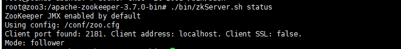

## 1. 创建相关文件夹:

```bash
mkdir -p node1/data &&
mkdir -p node1/logs &&
mkdir -p node1/conf &&
mkdir -p node2/data &&
mkdir -p node2/logs &&
mkdir -p node2/conf &&
mkdir -p node3/data &&
mkdir -p node3/logs &&
mkdir -p node3/conf &&
```


## 2. 编写docker-compose:

```yml
version: '3' #版本号固定写法
services:
  zoo1:
    image: zookeeper #使用的镜像
    restart: always #宕机后自动重启
    hostname: zoo1 #承载zookeeper容器的主机（父容器）名 可省略
    container_name: zoo1 #容器名
    privileged: true #使用该参数，container内的root拥有真正的root权 privileged启动的容器，可以看到很多host上的设备，并且可以执行mount。甚至允许你在docker容器中启动docker容器。
    ports: #主机和容器的端口映射
      - "2181:2181"
    volumes:  #创建zookeeper容器在宿主机的挂载目录
      - ./node1/data:/data #数据
      - ./node1/logs:/datalog #日志
      - ./node1/conf:/conf #配置文件
    environment: #zookeeper3.4 和zookeeper 3.5在docker环境下搭建集群差异就在这里 #zoo1为容器名，也是主机名，意思为使用容器的内网通信（1）Zookeeper3.5 中指定的 ZOO_SERVERS 参数的 IP 地址和端口号后面多加了 “;2181 ”。（2）ZOO_SERVERS 指定ip时本机的ip地址写 0.0.0.0。
      ZOO_MY_ID: 1
      ZOO_SERVERS: server.1=zoo1:2888:3888;2181 server.2=zoo2:2888:3888;2181 server.3=zoo3:2888:3888;2181
      # 处理结点时间问题
      TZ: Asia/Shanghai
    command: chmod -R /conf /data /datalog
  zoo2:
    image: zookeeper
    restart: always
    hostname: zoo2
    container_name: zoo2
    privileged: true
    ports:
      - "2182:2181"
    volumes:
      - ./node2/data:/data
      - ./node2/logs:/datalog
      - ./node2/conf:/conf
    environment:
      TZ: Asia/Shanghai
      ZOO_MY_ID: 2
      ZOO_SERVERS: server.1=zoo1:2888:3888;2181 server.2=zoo2:2888:3888;2181 server.3=zoo3:2888:3888;2181
    command: chmod -R /conf /data /datalog
  zoo3:
    image: zookeeper
    restart: always
    hostname: zoo3
    container_name: zoo3
    privileged: true
    ports:
      - "2183:2181"
    volumes:
      - ./node3/data:/data
      - ./node3/logs:/datalog
      - ./node3/conf:/conf
    environment:
      TZ: Asia/Shanghai
      ZOO_MY_ID: 3
      ZOO_SERVERS: server.1=zoo1:2888:3888;2181 server.2=zoo2:2888:3888;2181 server.3=zoo3:2888:3888;2181
    command: chmod -R /conf /data /datalog
```

zookeeper官方在docker hub上面有快速搭建的docker-compose,这里只是在其基础上添加了文件映射.

> 需要注意的是,添加文件映射后必须要添加 `command`那一行的命令

## 3. 集群测试:

### 1. 查看结点角色:

```zookeeper
zkServer.sh status
```

**结点1:**


此时其角色为`follower`.

**结点2:**


此时其结点为`leader`.

> 刚创建出来的集群,根据docker-compose中配置的zoo_my_id大小,按照选举算法应该是节点3为leader角色.我这里是因为我昨天测试过了,所以结点2 为`leader`

**结点3:**



### 2. 测试集群:

关闭此时为leader的结点2: 停止对外提供服务, 开始leader选举


选举完成后, 结点3 成为新的`leader`:


重启结点2 , 加入集群后成为`follower`:


