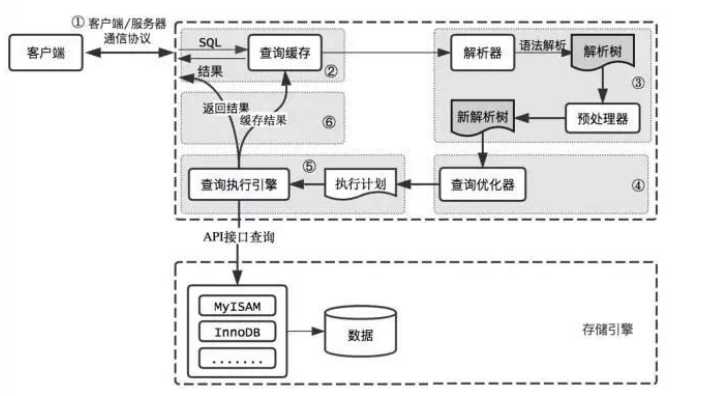

## 1. 逻辑架构分析:

### 1.1 mysql架构图:

> 注意: 这个图片比较老, 适用于5.7之前的版本


### 1.2 服务器处理客户端请求:

mysql是`c/s`架构, 即`client/server架构`, 服务端使用的是`mysqld`.底层是依靠`tcp/ip`网络通信协议来实现`c/s`之间的通信.`tcp/ip`协议是通过 `ip+端口号`来确定一个应用层程序的.而服务端程序则会持续监听`默认端口号`或者`启动时指定的其他端口号`.

`mysql`服务端程序默认的端口号是: `3306`.也可以通过 `mysqld -P端口号`在服务器程序启动的时候使用其他端口作为服务器程序监听的端口号.

不论客户端进程和服务端进程怎么通信, 总结起来实现的效果就是, `客户端向服务端发送一段sql语句, 服务器对sql语句进行处理, 最后向客户端返回处理结果`.

以查询为例子, mysql服务器处理流程大致如下:


`简化一下, 大致可以分为三层`:


#### 1. 连接层:

`mysql`对于处理客户端请求的线程采用了`池化`思想来管理.每当有客户端请求过来,服务器进程都会创建一个线程专门与这个客户端进行交互; 当客户端与服务器断开连接的时候,线程不会被销毁,而是被集中缓存起来,待后续连接过来继续使用.

客户端发送给服务端的连接,会携带`主机信息`,`用户名`,`密码`等信息,服务端会对这些信息进行校验,通过的连接服务端才会创建线程与其建立连接.

- `用户名或密码不对，会收到一个Access denied for user错误，客户端程序结束执行`
- `用户名密码认证通过，会从权限表查出账号拥有的权限与连接关联，之后的权限判断逻辑，都将依赖于此时读到的权限`


#### 2. 服务层:

- `sql接口`:

  - 主要作用是: `接受sql命令, 并且返回sql执行结果`.
  - mysql支持 DML(数据操作语言), DDL(数据定义语言), 存储过程, 视图, 触发器, 自定义函数等多种sql语言接口

- `parser 解析器`:

  - 主要作用是: `对sql语句进行语义分析, 语法分析. 将sql分解成数据结构, 并将这个结构传递到后续步骤`, 后续步骤中对sql语句的处理和传递都是基于这个结构来处理的.
  - 在sql命令传递到解析器的时候, 就会被解析器验证和解析, 并为该sql语句创建`语法树`, 并根据数据字典丰富查询语法树. 同时`会验证该客户端是否具有执行该语句的权限`.

- `optimizer 查询优化器`:

  - sql语句在语法解析后, 查询之前会使用查询优化器确定sql语句的执行路径, 生成一个`查询计划`.

  - 这个计划表明了`该sql语句应该使用哪些索引`进行查询(全表检索还是索引检索), 表之间的连接顺序, 最后按照执行计划的步骤调用存储引擎的方法来执行查询.

  - mysql采取的是`选取--投影--连接`策略进行查询: 例如:

    ```sql
    select id, name from student where gender = '男';
    ```

    - 选取: mysql会通过`where子句` 对数据进行选取, 而不是查询所有数据再通过`where`进行过滤
    - 投影: mysql会通过`select`包含的字段对结果属性进行属性投影, 而不是将全部属性查询出来, 再进行过滤
    - 连接: 将`选取`和`投影`两个查询条件连接起来, 生成最终的查询结果

- `caches & buffers 查询缓存组件`:

  - MySQL内部维持着一些Cache和Buffer，比如Query Cache用来缓存一条SELECT语句的执行结果，如果能够在其中找到对应的查询结果，那么就不必再进行查询解析、优化和执行的整个过程了，直接将结果反馈给客户端。
  - 这个缓存机制是由一系列小缓存组成的。比如表缓存，记录缓存，key缓存，权限缓存等 。
  - 这个查询缓存可以在 不同客户端之间共享 。
  - 从MySQL 5.7.20开始，不推荐使用查询缓存，并在 MySQL 8.0中删除 

#### 3. 引擎层:

`查询优化`之后还没有去访问表中的数据.`MYSQL`服务器将数据的`存储`和`提取`操作都封装到了一个名为 `存储引擎`的模块里面.

`存储引擎`主要还是负责 `物理上如何表示数据记录`、`如何从逻辑上的表中读取数据`、`怎么把数据写入到具体的物理存储器上`等

为了方便管理, `MYSQL`处理请求的过程大致被分为了两部分: `server层`(连接管理,查询缓存,语法解析,查询缓存),`存储引擎层(存取真实数据的功能)`.所以在`server层`堆语法进行优化完毕之后,只需要按照`执行计划`去调用底层存储引擎提供的接口获取到数据后返回给客户端.通常是以一条`记录`为单位.

以`SELECT`为例: `server层`按照执行计划向`存储引擎层`获取一条`记录`然后判断是否符合`where`条件,如果符合就返回给客户端(存入一个缓冲区,缓冲区满了一起flush出去),不符合就跳过该数据,然后向`存储引擎层`获取下一条数据,以此往复.

## 2. SQL执行流程:

### 2.1 MYSQL中sql执行流程:



**`以查询为例子`**:

#### 1. **`查询缓存`**: 

`MYSQL`服务器会对之前已经处理过的文本请求 和 请求结果进行缓存,如果当前查询是已经处理过的,直接将对应的结果返回给客户端;如果没有处理过就会进行下一步处理.

缓存不命中:

- 如果两个查询请求有 `任何字符上的不同(如: 空格, 注释, 大小写)`, 都会在成缓存不命中.
- 如果两个查询请求中 `包含了某些系统函数( NOW() 计算当前时间), 用户自定义函数和变量, 系统表(information_schema)`等, 都会造成缓存不命中
- `mysql`的缓存系统会监测涉及的每张表,只要该表的`结构`或者`数据`被修改,那么 与该表关联的所有查询缓存都会被删除. 如对该表使用了 INSERT 、 UPDATE 、 DELETE 、 TRUNCATE TABLE 、 ALTER TABLE 、 DROP TABLE 或 DROP DATABASE 语句.

缓存相关建议:

1. 建议在对很少更新的表, 使用mysql的缓存.

2. 按需使用cache:

   在配置中将query_cache_type设置为2, 让查询语句默认不实用缓存, 在需要使用缓存的语句中 添加`SQL_CACHE` 关键字, 开起该sql的缓存.

   ```ini
   # query_cache_type 有三个值 0:关闭查询缓存, 1: 默认开启, 2: 默认关闭, 携带SQL_CACHE才开启
   ```

   需要缓存的sql写法:

   ```sql
   select SQL_CACHE * from test where id = 10;
   ```

查看当前缓存机制:

```sql
show global variables like "%query_cache_type%";
```

#### 2. **`解析器`**:

解析器主要步骤

- `词法分析`: 解析器先对sql语句进行词法分析, 识别出sql语句中的字符串分别是什么, 代表什么含义. 
- `语法分析`: 根据词法分析的结果, 语法分析器会根据语法规则, 判断sql是否符合语法规则.

经过上面两个步骤, 如果sql语句正确, 会生成下面这样的语法树:


#### 3. `优化器`:

优化器主要的作用是确定sql语句的执行路径, 比如是`全表搜索`还是`索引搜索`. 最终会根据优化原则, 选择一个最佳的执行路径, 生成执行计划.

举例:

```sql
select * from test1 left join test2 using(ID) where test1.name = 'zhangwei' and test2.name = '王麻子'


方案1：可以先从表 test1 里面取出 name='zhangwei'的记录的 ID 值，再根据 ID 值关联到表 test2，再判 断 test2 里面 name的值是否等于 'mysql高级课程'。 
方案2：可以先从表 test2 里面取出 name='mysql高级课程' 的记录的 ID 值，再根据 ID 值关联到 test1， 再判断 test1 里面 name的值是否等于 zhangwei。 
这两种执行方法的逻辑结果是一样的，但是执行的效率会有不同，而优化器的作用就是决定选择使用哪一个方案。优化 器阶段完成后，这个语句的执行方案就确定下来了，然后进入执行器阶段。
```

> 优化器在处理sql可以分为: `逻辑查询`优化阶段 和 `物理查询` 优化阶段

#### 4. `执行器`:

在执行器工作之前, 是不会进行查询操作的, 目前仅仅是生成了一个执行计划, 此时会先对用户进行权限判断, 判断用户时候拥有该sql需要的操作权限.如果有权限就回去调用`存储引擎的查询接口`, 进行查询, 然后返回结果.

```sql
select * from test where id=1;
```

比如：表 test 中，ID 字段没有索引，那么执行器的执行流程是这样的：

```sql
调用 InnoDB 引擎接口取这个表的第一行，判断 ID 值是不是1，如果不是则跳过，如果是则将这行存在结果集中； 

调用引擎接口取“下一行”，重复相同的判断逻辑，直到取到这个表的最后一行。 

执行器将上述遍历过程中所有满足条件的行组成的记录集作为结果集返回给客户端。
```

## 3. 数据库的缓冲池(buffer pool)

以`InnoDB`为例子, `InnoDB`存储引擎是以页为单位来管理存储空间的, mysql在进行crud的时候, 实际上是在对页面进行操作. 而磁盘I/O需要消耗的时间很多, 如果将数据放在内存中进行操作, 那么效率会提高很多, 为了能让数据表或者索引中的数据随时被我们使用, DBMS会申请`内存空间来作为数据缓冲池` 来使用, 在真正访问页面之前, 需要吧磁盘上的也缓存到内存中`buffer pool`之后才可以访问.

这样做的好处是可以让磁盘活动最小化，从而 减少与磁盘直接进行 I/O 的时间 。要知道，这种策略对提升 SQL 语句的查询性能来说至关重要。如果索引的数据在缓冲池里，那么访问的成本就会降低很多。

### 3.1 缓冲池和查询缓存

`缓冲池和查询缓存`这两个不是同一个东西.

#### 1. 缓冲池:

在InnoDB存储引擎中有一部分数据会放到内存中, 缓冲池则占了这部分内存的大部分, 它用来存储各种数据的缓存. 大致结构如图:


**`缓存池的重要性`**:

InnoDB中无论是什么数据, 都是以`页`的形式存放在`表空间(InnoDB对文件系统中一个或者多个文件的抽象)`里面, 数据本质上是存放在磁盘上的, 由于磁盘I/O的效率不高, 所以在mysql处理客户端请求的时候, `即使是只需要访问某个数据页中的一条数据, 也会将整页数据都加载到内存中`, 然后进行读写访问, 在完成读写访问后, `不会立即释放对应的内存空间而是将其缓存起来`, 这样下次对该数据页的请求, 就能够省去磁盘I/O开销 

**`缓存原则:`**

"`位置 *　频次`"　这个原则，可以帮助我们对Ｉ／Ｏ效率进行优化．

- 首先：位置决定效率, 提供缓冲池是为了在内存中就可以直接访问数据.
- 其次: 频次决定优先级. 缓冲池大小有限, 所以需要`优先对使用频次高的热数据进行加载`

**`缓冲池预读特性`**:

缓冲池的作用就是提升I/O效率, 缓冲池在加载数据的时候存在一个`局部性原理(即缓冲池在加载某页数据的时候, 会将该页数据周围的一些数据都加载出来)`, 这就是`预读`.

#### 2. 查询缓存:

查询缓存缓存的是`查询结果, 是一个k-v结构`, 与缓冲池完全不是一回事.

### 3.2 缓冲池如何加载数据:

在数据库进行页面读操作的时候, 会先判断该页面是否在缓冲池中, 存在直接从缓冲池读数据, 不存在就会通过内存或者磁盘将页面存放到缓冲池里面再读取数据.

流程图:


> 缓冲池里面的数据修改, 不会立即刷盘到磁盘中去.
>
> 在对数据库中记录进行修改的时候, 先修改缓冲池中对应页里面的记录信息, 数据库会以`一定的频率将缓冲池中的数据刷新到磁盘中`, 但是不是每次发生更新操作就会刷盘. 缓冲池采用的是`check point`机制将数据回写到磁盘上.
>
> 比如: 当 `缓冲池不够用` 时, 需要释放掉一些不常用的页, 此时就可以强行采用 `check point`机制, 将不常用的数据刷盘到磁盘上, 然后再从缓冲池将这些页面释放掉. 
>
> `脏页`: 缓冲池中被修改过的页面(还没有刷盘到磁盘上), 与磁盘上的数据页不一致.

### 3.3 缓冲池操作:

**`1. 查看大小`**

```sql
show variables like 'innodb_buffer_pool_size'; # innodb
show variables like 'key_pool_size';# myisam, myisam只缓存索引, 不缓存数据
```

**`2. 设置大小`**

```sql
set global innodb_buffer_pool_size = 268435456; # 通过sql来设置
```

```ini
// 通过配置文件设置
[server]
innodb_buffer_pool_size = 268435456 
```

**`3. 设置多个buffer pool实例`**

buffer pool 本质上是innodb向操作系统申请的一块`连续内存空间`, 多线程场景下, 访问buffer pool中的数据都需要加锁处理. 如果buffer pool特别大而且并发量特别高的情况下, 单个buffer pool实例会影响响应速度. 这种情况下, 就可以把buffer pool拆分成若干个`小buffer pool`实例, 他们都是独立的, 独立申请空间, 独立管理各种表.

```ini
[server] 
innodb_buffer_pool_instances = 2
```

查看buffer pool实例个数:

```sql
show variables like 'innodb_buffer_pool_instances'; # 每个实例均分buffer size
```

> 如果buffer size 只设置了1GB或者更小, 就没有必要设置为多个buffer pool实例了, 因为innodb会默认把innodb_buffer_pool_instances改为1.
>
> 所以: 建议在buffer size >= 1GB的时候才设置`innodb_buffer_pool_instances`.