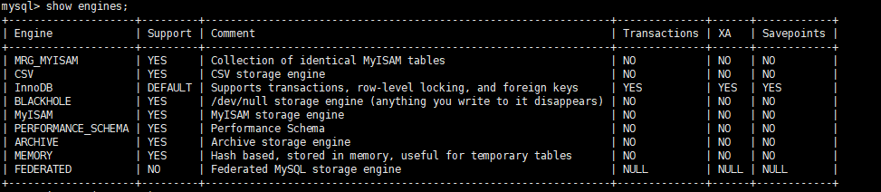

## 5.1 存储引擎概述:

mysql中提到了存储引擎的概念, `存储引擎` 简单来说就是`表的类型`, 其功能就是接受上层(执行器)传下来的指令, 对表中的数据进行提取或写入操作.

| 存储引擎  |                     描述                     |
| :-------- | :------------------------------------------: |
| ARCHIVE   |      用于数据文档(插入之后不能再被修改)      |
| BLACKHOLE |        丢弃写操作,读操作会返回空内容         |
| CSV       |      在存储数据的时候,以逗号分隔数据项       |
| FEDERATED |                用来访问远程表                |
| InnoDB    |              支持事务,行锁,外键              |
| MyISAM    |           只要的非事务处理存储引擎           |
| MEMORY    | 数据存储在内存,不存储在磁盘里面;多用于临时表 |
| MERGE     |       用来管理多个MyISAM表构成的表集合       |
| NDB       |            MySQL集群专用存储引擎             |

其中最常用的是 `InnoDB`,`MyISAM`和`MEMORY`.

支持的功能:

| Feature                                | MyISAM       | Memory           | InnoDB       | Archive      | NDB          |
| :------------------------------------- | :----------- | :--------------- | :----------- | :----------- | :----------- |
| B-tree indexes                         | Yes          | Yes              | Yes          | No           | No           |
| Backup/point-in-time recovery (note 1) | Yes          | Yes              | Yes          | Yes          | Yes          |
| Cluster database support               | No           | No               | No           | No           | Yes          |
| Clustered indexes                      | No           | No               | Yes          | No           | No           |
| Compressed data                        | Yes (note 2) | No               | Yes          | Yes          | No           |
| Data caches                            | No           | N/A              | Yes          | No           | Yes          |
| Encrypted data                         | Yes (note 3) | Yes (note 3)     | Yes (note 4) | Yes (note 3) | Yes (note 3) |
| Foreign key support                    | No           | No               | Yes          | No           | Yes (note 5) |
| Full-text search indexes               | Yes          | No               | Yes (note 6) | No           | No           |
| Geospatial data type support           | Yes          | No               | Yes          | Yes          | Yes          |
| Geospatial indexing support            | Yes          | No               | Yes (note 7) | No           | No           |
| Hash indexes                           | No           | Yes              | No (note 8)  | No           | Yes          |
| Index caches                           | Yes          | N/A              | Yes          | No           | Yes          |
| Locking granularity                    | Table        | Table            | Row          | Row          | Row          |
| MVCC                                   | No           | No               | Yes          | No           | No           |
| Replication support (note 1)           | Yes          | Limited (note 9) | Yes          | Yes          | Yes          |
| Storage limits                         | 256TB        | RAM              | 64TB         | None         | 384EB        |
| T-tree indexes                         | No           | No               | No           | No           | Yes          |
| Transactions                           | No           | No               | Yes          | No           | Yes          |
| Update statistics for data dictionary  | Yes          | Yes              | Yes          | Yes          | Yes          |

## 5.2 关于引擎的一些操作:

### 1. 查询支持的引擎:

```sql
show engines;
```



- `Support`: 是否支持该引擎,`DEFAULT`表示该引擎是默认存储引擎
- `Comment`: 是该引擎的功能概述
- `Transaction`: 表示该引擎是否支持事务
- `XA`: 表示该存储引擎是否支持分布式事务
- `Saveoptions`: 表示该引擎是否支持部分回滚

### 2. 设置表的存储引擎:

存储引擎是负责对表中的数据进行提取和写入工作的，我们可以为 不同的表设置不同的存储引擎 ，也就是说不同的表可以有不同的物理存储结构，不同的提取和写入方式。

1. 建表的时候就设置存储引擎

   ```sql
   CREATE TABLE `t_mysql_study`(
       字段语句
   )ENGINE= 存储引擎名字;
   ```

   > 如果没有显式指定存储引擎, 会使用系统默认的存储引擎

2. 修改已经创建好的表的存储引擎:

   ```sql
   # 修改表的引擎
   ALTER TABLE 表名 ENGINE = 存储引擎名称;
   # 查看建表语句来看引擎是否修改
   SHOW CREATE TABLE `t_mysql_study`
   ```


### 3. 默认的存储引擎

1. 查看:

   ```sql
   show variables like '%storage_engine%'; 
   #或
   SELECT @@default_storage_engine;
   ```

2. 设置默认存储引擎:

   - 启动命令修改

   ```sh
   SET DEFAULT_STORAGE_ENGINE=MyISAM;
   ```

   - 配置文件修改

   ```ini
   default-storage-engine=MyISAM 
   # 需要重启服务 
   systemctl restart mysqld.service
   ```

## 5.3 引擎介绍:

### 1. InnoDB引擎: 

**`InnoDB`是具备外键支持功能的事务存储引擎**

- MySQL从3.23.34a开始就包含InnoDB存储引擎。 大于等于5.5之后，默认采用InnoDB引擎 。 
- InnoDB是MySQL的 默认事务型引擎 ，它被设计用来处理大量的短期(short-lived)事务。可以确保事务的完整提交(Commit)和回滚(Rollback)。
- 除了增加和查询外，还需要更新、删除操作，那么，应优先选择InnoDB存储引擎。
- **除非有非常特别的原因需要使用其他的存储引擎，否则应该优先考虑InnoDB引擎。**
- 数据文件结构：
  - 表名.frm 存储表结构（MySQL8.0时，合并在表名.ibd中）
  - 表名.ibd 存储数据和索引
- InnoDB是 为处理巨大数据量的最大性能设计 。
  - 在以前的版本中，字典数据以元数据文件、非事务表等来存储。现在这些元数据文件被删除了。比如： .frm ， .par ， .trn ， .isl ， .db.opt 等都在MySQL8.0中不存在了。
- 对比MyISAM的存储引擎， InnoDB写的处理效率差一些 ，并且会占用更多的磁盘空间以保存数据和索引。
- MyISAM只缓存索引，不缓存真实数据；InnoDB不仅缓存索引还要缓存真实数据， 对内存要求较高 ，而且内存大小对性能有决定性的影响。

### 2. MyISAM引擎:

**`MyISAM`**是主要的非事务存储引擎.

- MyISAM提供了大量的特性，包括全文索引、压缩、空间函数(GIS)等，但MyISAM `不支持事务`、`行级锁`、`外键` ，有一个毫无疑问的缺陷就是崩溃后无法安全恢复 。 
- `5.5之前默认的存储引擎`
- 优势是访问的 速度快 ，对事务完整性没有要求或者以SELECT、INSERT为主的应用
- 针对数据统计有额外的常数存储。故而 count(*) 的查询效率很高
- 数据文件结构：（在《第02章_MySQL数据目录》章节已讲）
  - 表名.frm 存储表结构
  - 表名.MYD 存储数据 (MYData)
  - 表名.MYI 存储索引 (MYIndex)
- `应用场景：只读应用或者以读为主的业务`