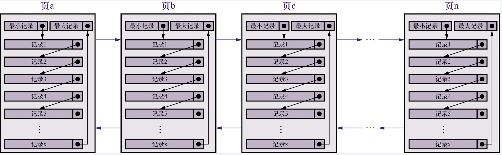
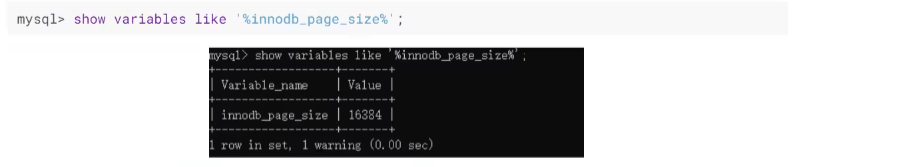
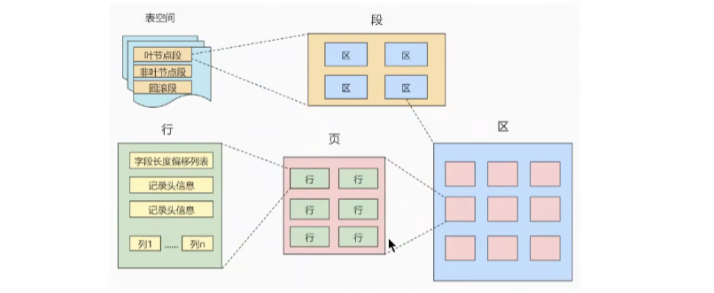

## 6.1 InnoDB页介绍:

### 6.1.1 磁盘与内存交互的基本单位: 页

`InnoDB`引擎是一个将表中的数据存储到磁盘上的存储引擎, 由于计算机对于数据的处理都发生在内存中, 为了提高效率, `InnoDB`将数据划分为若干页, 默认大小为`16KB`.

以`页`作为磁盘和内存之间交互的`基本单位`, 也就是说一次最少从磁盘中读取`16KB`的内容到内存中, 一次最少把内存中`16KB`数据刷新到磁盘中.

> 无论是读一行, 还是读多行, 都会将这些行所在的页进行加载. 
>
> 注意: `不同存储引擎`数据存放的结构是不同的.

### 6.1.2 页结构概述:



如上图所示, 

- 数据页与数据页之间, 是通过`双向链表`相互关联起来的, 所以数据页之间`在物理结构上可能是不相连的`. 

- 每个数据页内部总是会存在一条`最小记录`和`最大记录`, 以`最小记录为头结点`, `最大记录为尾结点`, 将其他用户记录按照`主键值从小到大`的顺序串连起来形成`单向链表`.
- 每个数据页都会生成一个`页目录`, 在通过主键查找某条记录的时候可以在页目录中`使用二分法`快速定位, 然后再遍历该槽对应分组的记录即可快速找到指定的记录

### 6.1.3 页的大小:



### 6.1.4 页的上层结构:



在数据库中, 还存在着 `区(Extent)`, `段Sgement`, `表空间tablespace`的概念. 总体关系如上图所示.

- `区(Extent)`: 是比页跟大一级的存储结构, 在InnoDB中, 一个区会分配`64个连续的页`(即区在文件系统中是一个`连续分配的空间`). 即一个区的默认大小为`16 * 64 KB = 1MB`.
- `段(Sgement)`: 由一个或者多个区组成, 区在文件系统中是一个连续分配的空间, 但是段中并不要去区和区之间是相邻的. `段是数据库中的分配单位, 不同类型的数据库对象以不同的形式存在`. 当我们创建数据表, 索引的时候, 就会创建相对应的段, 比如创建一张表时会创建一个表段, 创建一个索引时会创建一个索引段
- `表空间(tablespace)`: 是一个逻辑容器, 表空间存储的对象是段, 在一个表空间内可以有一个或多个段, 但是一个段只能属于一个表空间. 数据库由一个或者多个表空间组成, 表空间从管理上可以划分为`系统表空间`, `用户表空间`, `撤销表空间`, `临时表空间`等.

## 6.2 InnoDB行格式:

通常插入数据的时候, 都是以一行(一条记录)为单位插入, 所以记录在磁盘中存放的形式也被成为`行格式` 或者`记录格式`

InnoDB行格式分为: `COMPACT`,`REDUNDANT`,`DYNAMIC`和 `COMPRESSED`.

### 6.2.1 指定行格式的语法:

```sql
-- 建表的时候指定
CREATE TABLE table_name (
	columns...
) ROW_FORMAT=行格式名称;

-- 修改
ALTER TABLE table_name ROW_FORMAT=行格式名称;
```

### 6.2.2 COMPACT行格式:

##### 1. 示意图:


##### 2. 字段解释:

