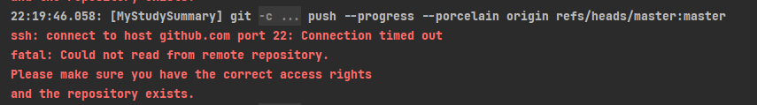

# github报ssh错误



解决办法:

1. 去用户目录下查找.ssh文件看看有不有, 没有的话使用git工具 `ssh-keygen -t rsa` 创建一个

2. 去github添加上新的密钥, 就是`id_rsa.pub`里面的东西

3. `ssh -T git@github.com`去测试是否成功连接上了

4. 如果还是提示22端口连接异常,就在``.ssh`文件夹里面创建一个config文件,输入以下内容

   ```text
   Host github.com
   User github账号名字
   Hostname ssh.github.com
   PreferredAuthentications publickey
   IdentityFile ~/.ssh/id_rsa
   Port 443
   ```
   > ps: 取消全局代理或许有帮助, 命令如下:
   >
   > `git config --global --unset http.proxy`
   >
   > `git config --global --unset https.proxy`


# linux权限导致配置环境变量失效

环境变量：

/home/btc/opt/es/jdk/bin

用户权限：11111

es这个文件夹的用户和用户组，都给了用户eth.

opt这个文件夹的用户和用户组， 还是btc

会导致的问题， 使用root修改/etc/profile设置java环境变量并且重新source之后， 将用户切换为eth后， `java -version`会报java未知命令。

这个现象就是因为eth用户没有opt文件夹的权限造成的。