## 1. top命令:

linux里面, `top`命令将会打开一个交互式命令行应用程序, 如下图所示, 一共分为两部分, `进程和资源相关的统计信息`, `当前运行的进程列表`. 

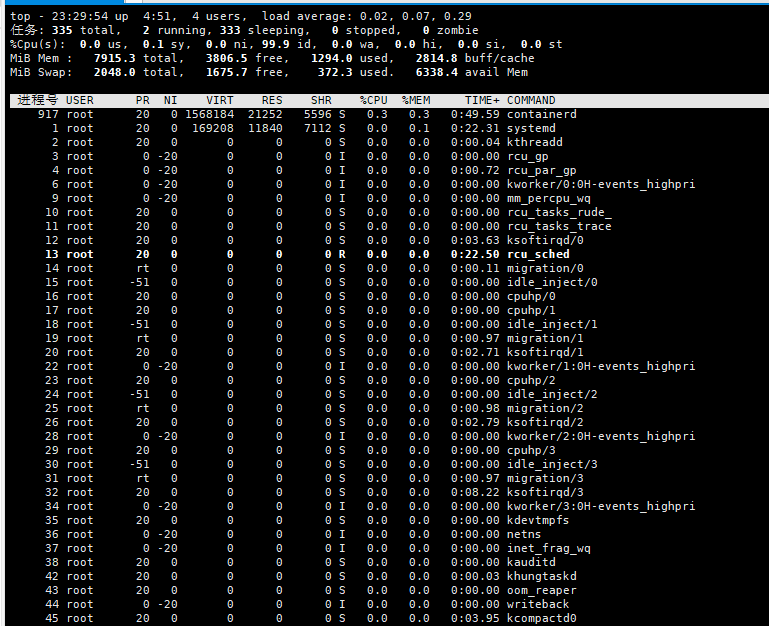

> 进程列表支持`↑(page up)` 向上翻页, `↓(page down)`向下翻页
>
> `q` 退出 top命令行程序
>
> `s` 修改刷新时间
>
> `k` 终止指定进程, `需要输入pid`
>
> `P` 按照占用cpu百分比(即%CPU列)排序
>
> `M` 按照占用内存百分比(即%MEM列)排序
>
> `T` 按照占用cpu时间(TIME+)排序
>
> `l` 显示或隐藏 `top行信息`
>
> `t` 显示或者隐藏 `tasks行, %Cpu行信息`
>
> `m` 显示或者隐藏 `Mem, Swap行信息`
>
> `H` 将进程列表切换为线程列表
>
> `c` 显示完整的启动命令路径
>
> `u` 只显示输入用户的所有进程信息
>
> `o` 过滤进程, 再次按`=`清除所有过滤条件

### 1. 进程和资源相关统计信息:

```shell
top - 23:34:28 up  4:56,  4 users,  load average: 0.07, 0.07, 0.23
```

`23:34:28 up` --- 当前时间

`4:56` --- 运行时间

`4 users` --- 运行进程的用户个数

`load average: 0.07, 0.07, 0.23` --- 1分, 5分, 15分平均负载

```shell
任务: 334 total,   1 running, 333 sleeping,   0 stopped,   0 zombie
```

`334 total` --- 进程总个数

`1 running` --- 运行状态个数

`333 sleeping` --- 睡眠状态个数

`0 stopped` --- 停止状态个数

`0 zombie` --- 僵死状态个数

```shell
%Cpu(s):  0.0 us,  0.1 sy,  0.0 ni, 99.9 id,  0.0 wa,  0.0 hi,  0.0 si,  0.0 st
```

`0.0 us`        用户空间进程占用CPU百分比   

`0.1 sy`        内核空间进程占用CPU百分比   

`0.0 ni`        nice值调整进程占用CPU百分比   

`99.9 id`       空闲进程占用CPU百分比   

`0.0 wa`        等待IO进程占用CPU百分比   

`0.0 hi`        硬件中断进程占用CPU百分比   

`0.3 st`        软件中断进程占用CPU百分比

```shell
MiB Mem :   7915.3 total,   3804.6 free,   1295.9 used,   2814.9 buff/cache
```

`7915.3 total`		 总空间 

`3804.6 free`		  空闲空间 

`1295.9 used`		  用户使用空间 

`2814.9 buff/cache`	缓冲和缓存空间

> mem 这一行显示的是`RAM`空间的信息, 当RAM空间使用率将要使用满的时候, RAM中不常用的区域将被写入Swap空间(就是下面这一列的信息)

```shell
MiB Swap:   2048.0 total,   1675.7 free,    372.3 used.   6343.7 avail Mem
```

`2048.0 total`			总空间   

`1675.7 free`			空闲空间   

`372.3 used`			用户使用空间   

`6343.7 avail Mem`		可用空间

> 显示的是swap空间的信息

### 2. 进程列表信息:

```shell
 PID USER      PR  NI    VIRT    RES    SHR    %CPU  %MEM     TIME+ COMMAND 
```

`PID` 进程号

`USER` 用户名

`PR` 优先级

`NI` Nice值

`VIRT` 虚拟内存

`RES` 常驻内存

`SHR` 共享内存

`%CPU` 占用cpu百分比

`%Mem` 占用内存百分比

`TIME+` 占用cpu的时长

`COMMAND` 启动命令


## 2. JPS java虚拟机进程状态工具

```shell
jps [options] [hostid]
```

> hostid如果不指定就默认为当前主机或服务器

options:

`q` : 不显示类名, jar名, main方法传入参数

`m` : 显示main方法传入参数

`l` : 显示main类或者jar全限名

`v` : 显示JVM参数

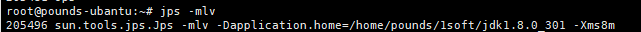


## 3. jstack 线程堆栈信息工具

是当前Java虚拟机中每个线程正在执行的Java线程、虚拟机内部线程和可选的本地方法堆栈帧的集合。对于每个方法栈帧，将会显示完整的类名、方法名、字节码索引(bytecode index，BCI)和行号。生成的线程快照可以用于定位线程出现长时间停顿的原因，比如：线程间死锁、死循环、请求外部资源被长时间挂起等等。

```shell
jstack [ option ] pid 

jstack [ option ] executable core 

jstack [ option ] [server-id@]remote-hostname-or-IP 
```

options:

`F` : 当java虚拟机进程由于进程挂起没有响应的时候可以通过这个参数强制输出线程快照信息.

`l` : 显示lock的附加信息

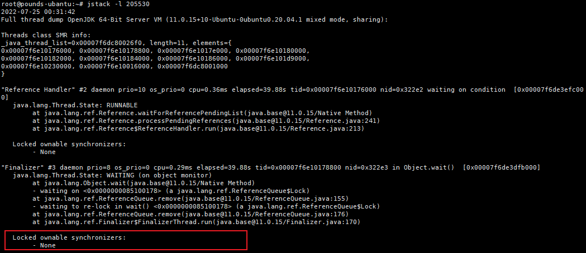

`m` : 显示混合栈帧信息, 不仅仅是java方法栈帧, 还有本地方法栈帧.

`h` : 显示jstack的帮助信息

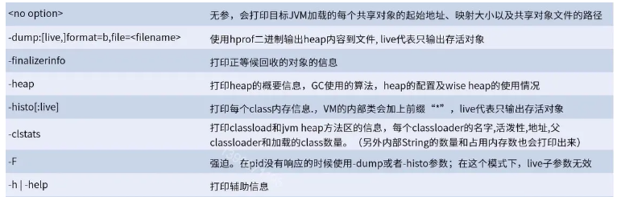

 jstack 输出重要信息介绍:

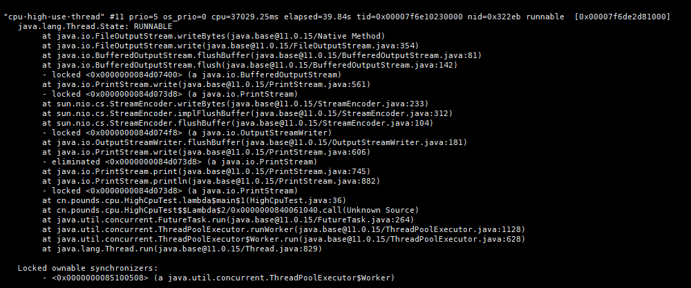

```shell
"cpu-high-use-thread" #11 prio=5 os_prio=0 cpu=37029.25ms elapsed=39.84s tid=0x00007f6e10230000 nid=0x322eb runnable [0x00007f6de2d81000]

```

`"cpu-high-use-thread"` : 线程的名称

`nid`: jvm线程号在操作系统中对应的线程号, 一半通过top命令得到java线程号, 然后通过`printf "%x\n" java线程号` 可以得到对应的 `nid`

jstack 线程栈帧分析实例: https://www.cnblogs.com/zhengyun_ustc/archive/2013/01/06/dumpanalysis.html


### 3. jmap 内存映射工具: 

```shell
jmap [ option ] pid (to connect to remote debug server)

jmap [ option ] executable core (to connect to remote debug server)

jmap [ option ] [server-id@] remote-hostname-or-IP (to connect to remote debug server)
```

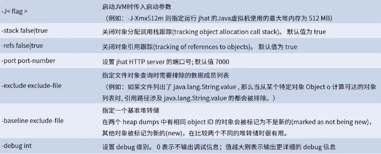

### 4. jstat jvm统计监测工具:

```shell
jstat [generalOption|outputOptions vmid [ interval [s | ms ] [ count ]]
```

-t参数 可以输出信息前面加上一个Timestamp列，显示程序运行的时间。

-h参数 可以在周期性的数据输出时，输出多少行数据后，跟着输出一个表头信息。

interval 指定输出统计周期，

count 指定输出多少次数据。

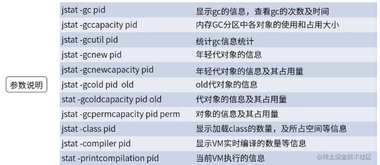

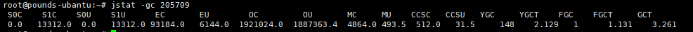

S0C、S1C、S0U、S1U：Survivor 0/1区容量（Capacity）和使用量（Used） 

EC、EU：Eden区容量和使用量 

OC、OU：年老代容量和使用量 

PC、PU：永久代容量和使用量 

YGC、YGT：年轻代GC次数和GC耗时 

FGC、FGCT：Full GC次数和Full GC耗时 

GCT：GC总耗时

### 5. jmd

jmd工具可以替代jps查看本地jvm信息

```shell
jcmd -l 

jcmd <pid | main class><command ...| PerfCounter.print | -f file >
```

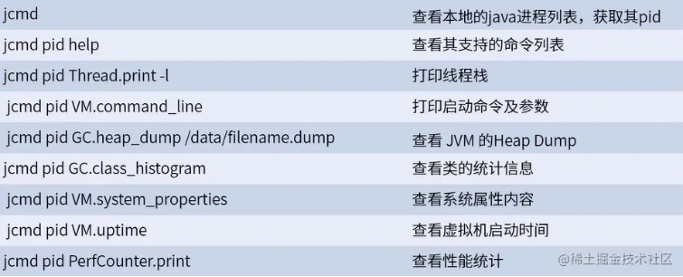


### 6. jinfo

查看jvm 参数和设置部分jvm参数

```shell
info [ option ] pid 

info [ option ] executable core 

info [ option ] [server-id@] remote-hostname-or-IP
```

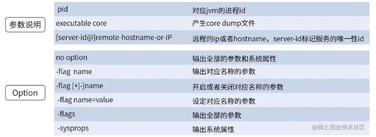


### 7. jhat

Java Head Analyse Tool 分析java堆的命令，可以将堆中的对象以html的形式显示出来，支持对象查询语言OQL 

```shell
jhat [-stack <bool>] [-refs <bool>] [-port <port>] [-baseline <file>] [-debug <int>] [-version ]  [-h|-help ]  <file>
```

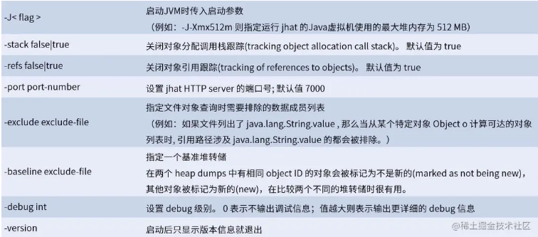

