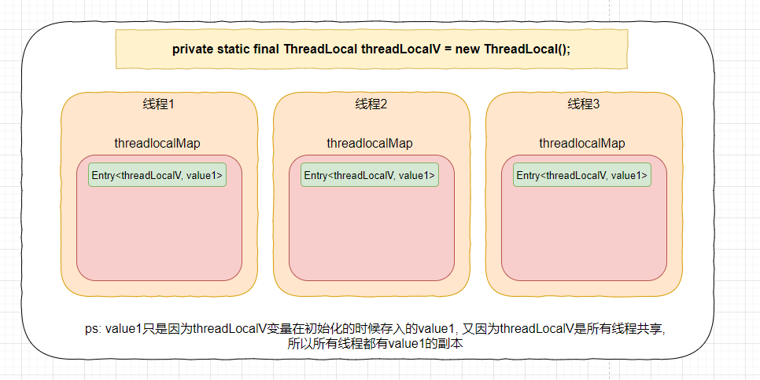
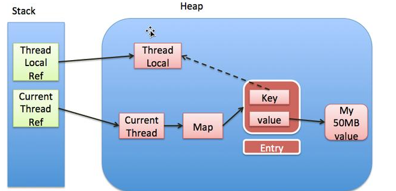

## 1. 什么是ThreadLocal:

`ThreadLocal`是为了实现 将共享数据处理成线程内独享数据, 以达到一个线程隔离的效果, 即`ThreadLocal变量是线程的局部变量`.

```java
/**
This class provides thread-local variables.  These variables differ from
 * their normal counterparts in that each thread that accesses one (via its
 * {@code get} or {@code set} method) has its own, independently initialized
 * copy of the variable.  {@code ThreadLocal} instances are typically private
 * static fields in classes that wish to associate state with a thread (e.g.,
 * a user ID or Transaction ID).
*/
```

ThreadLocal 提供了一些线程局部变量. 与普通变量不同,每个通过ThreadLocal提供的`get`或者`set`访问threadlocal包装的变量在线程内部都有一份独立的副本. `threadlocal可以看做是一个存放需要线程隔离的变量的容器`

> 要注意: 
>
> 1. ThreadLocal包装的变量在某个线程内部所有的修改操作, 对其他线程来讲是不可见的(`InheritableThreadLocal特例除外`), 所以ThreadLocal并不是用于解决并发问题的, 通常ThreadLocal变量的使用场景是用来在某个线程内部共享数据的.

## 2. ThreadLocal原理:

### 1. 几个重要的属性:

***java.lang.Thread***: thread对象有一个 `ThreadLocal.ThreadLocalMap`属性 --- `threadlocals`,存放当前线程私有的变量.

```java
public class Thread implements Runnable {
    // ... 省略无关代码
    
    ThreadLocal.ThreadLocalMap threadLocals = null;
	
    // ... 省略无关代码
}
```

***java.lang.ThreadLocal***:

```java
public class ThreadLocal<T> {
    // threadLocalMap定位的hash值
    private final int threadLocalHashCode = nextHashCode();
    
    // 所有threadLocal对象共享的一个属性, 与threadLocalMap解决hash冲突有关
    private static AtomicInteger nextHashCode = new AtomicInteger();
    
    // hash值计算的魔数, 主要是为了将 threadlocal 的hashcode均匀的分布在threadlocal中.
    private static final int HASH_INCREMENT = 0x61c88647;
}
```

***java.lang.Threadlocal#ThreadLocalMap***: threadlocal存放希望线程隔离数据的数据结构.

```java
static class ThreadLocalMap {
		// entry, 封装与threadlocal对象关联的数据. key为threadlocal对象, value就是 需要线程隔离的数据
        static class Entry extends WeakReference<ThreadLocal<?>> {
            /** The value associated with this ThreadLocal. */
            Object value;

            Entry(ThreadLocal<?> k, Object v) {
                super(k);
                value = v;
            }
        }

        // entry数组的初始长度
        private static final int INITIAL_CAPACITY = 16;

		//Entry数组, 会动态扩容, table的长度必须是 2的n次幂
        private Entry[] table;

        // entry数量
        private int size = 0;
		// 扩容阈值
        private int threshold; // Default to 0

}
```

### 2. 原理:

一句话描述: 线程对象`thread`持有一个`ThreadLocal.ThreadLocalMap`属性 --- `threadLocals`, 这个map是ThreadLocal的一个内部类(`数据结构为 key为threadlocal对象, value为 需要线程隔离的数据 的entry数组`), 用来存放希望线程隔离的数据.而ThreadLocal提供的访问这些数据的方法,首先都是通过线程对象获取到`ThreadLocalMap`再根据具体的key(key 就是threadlocal变量本身)去获取对应的值.



> 上图是ThreadLocal常见使用方法之一, 线程内ThreadLocal变量是怎么存储的.

## 3. 源码分析:

### 1. ThreadLocalMap的原理:

#### 1. entry继承弱引用的原因:

```java
        static class Entry extends WeakReference<ThreadLocal<?>> {
            /** The value associated with this ThreadLocal. */
            Object value;

            Entry(ThreadLocal<?> k, Object v) {
                super(k);
                value = v;
            }
        }
```

1. 什么是弱引用:

   `弱引用`: 弱引用引用的对象A, 在没有强引用引用的情况下, 只要发生gc, 那么这个对象A就会被回收, `java中WeakReference表示弱引用`

2. 为什么继承弱引用:

   ThreadLocalMap中entry继承弱引用,是为了用弱引用引用key, 然后配合threadlocal对于过期entry(`key为null的entry`)的清理机制, 防止内存泄漏.

   ***为什么会内存泄漏:***

   

   > 实线箭头为强引用, 虚线箭头为弱引用

   当我们线程对象是通过线程池创建出来的核心线程池的时候, 由于核心线程池通常不会被回收, 那么`thread -> threadLocals -> entry -> value -> my50MBvalue`这条引用链就会一直存在.但是当某一次垃圾回收发现entry中的key(即 `弱引用指向的threadlocal对象`)没有了其他引用应用他的时候, key就会被回收掉. 这个时候 与之对应的value就无法再通过key在程序中被使用到了, 这个时候就发生了内存泄漏.

   > 1. 内存泄漏: 当某些对象不能被程序使用到了, 但是又无法在垃圾回收的时候回收掉.
   > 2. 内存溢出: 在程序中创建了大量可用又无法回收的对象, 然后没有空闲内存,并且垃圾回收也无法提供更多的内存

   ***threadlocal解决内存泄露***:

   `entry继承弱引用的好处就是对于某些线程持有的threadlocal对象,长时间不实用的情况下, 可以在gc的时候被回收掉, 减轻内存压力`,但是会带来一个内存泄漏的问题, 为了解决这一个问题, threadlocal在`get`,`set`,`remove`等方法中都加入了对 key为null 的过期entry的回收机制, 来解决内存泄漏的问题.

   `get,remove`方法中都是调用`expungeStaleEntry`将过期entry的value设置为null

   ```java
   private int expungeStaleEntry(int staleSlot) {
               Entry[] tab = table;
               int len = tab.length;
   
               // expunge entry at staleSlot
               tab[staleSlot].value = null;
               tab[staleSlot] = null;
               size--;
   
               // 省略entry数组调整代码
               return i;
           }
   ```

   `set`方法是调用`replaceStaleEntry(ThreadLocal<?> key, Object value,int staleSlot)`方法将过期entry替换掉:

   ```java
   private void replaceStaleEntry(ThreadLocal<?> key, Object value,
                                          int staleSlot) {
               Entry[] tab = table;
               int len = tab.length;
               Entry e;
   
   			// 省略代码
   
               // If key not found, put new entry in stale slot
               tab[staleSlot].value = null;
               tab[staleSlot] = new Entry(key, value);
   
   			// 省略代码
           }
   ```
   
   <font color=red>虽然在下次`get`,`set`,`remove`的时候, ThreadLocal提供了清除过期entry的机制, 但是如果一直不调用这几个方法, threadLocal提供的机制就无法使用了, 所以`建议在使用完threadlocal之后手动调用remove方法`</font>

#### 2. ThreadLoalMap的寻址方法:

寻址方法与HashMap的寻址方法没有区别, 都是才用的`除数取余法`, 并且使用`与运算`优化取模运算.

#### 3. ThreadLocalMap解决hash冲突的方法:

`开放地址法`: 通过寻址找到某个位置后, 发现该位置上已经存放了元素, 就按照某种算法重新计算下一个存放该元素的位置.

ThreadLocalMap中采用的是线性探测的方法. 当发现寻址到的位置上已经存放了元素后, 向后一个位置上去看存放了元素没有

```java
 private void set(ThreadLocal<?> key, Object value) {

            // We don't use a fast path as with get() because it is at
            // least as common to use set() to create new entries as
            // it is to replace existing ones, in which case, a fast
            // path would fail more often than not.

            Entry[] tab = table;
            int len = tab.length;
            int i = key.threadLocalHashCode & (len-1);
			// nextIndex(i, len) 这个方法就是计算下一个尝试的位置
            for (Entry e = tab[i];e != null;e = tab[i = nextIndex(i, len)]) {
                // 省略无关代码
            }
     		// 省略无关代码
}

// 如果下一次尝试的位置超过了 entry数组的长度, 就去第一个, 否则下一次尝试的位置就是当前位置的下一个位置
private static int nextIndex(int i, int len) {
            return ((i + 1 < len) ? i + 1 : 0);
        }
```


### 2. ThreadLocal常用方法:

#### 1. 初始化方法:

`ThreadLocal`: 

```java
// 构建一个空threadlocal, 在get的时候会初始化一个null值作为value
public ThreadLocal() {
}

protected T initialValue() {
        return null;
    }
}
```


`withInitial`: 根据提供的生成器supplier内部生成value的逻辑, 初始化一个value出来

```java
// 
public static <S> ThreadLocal<S> withInitial(Supplier<? extends S> supplier) {
    return new SuppliedThreadLocal<>(supplier);
}

    static final class SuppliedThreadLocal<T> extends ThreadLocal<T> {

        private final Supplier<? extends T> supplier;

        SuppliedThreadLocal(Supplier<? extends T> supplier) {
            this.supplier = Objects.requireNonNull(supplier);
        }

        @Override
        protected T initialValue() {
            return supplier.get();
        }
    }
```

#### 2. get:

1. 获取当前线程对象, 获取到当前线程持有的threadlocalmap
2. 当前线程持有的threadlocalmap不为空, 就根据threadlocal对象去entry数组中查询出对应的value, 然后返回
3. 当前线程持有的threadlocalmap为空, 初始化一个空值, 创建一个threadlocalmap保存在当前线程对象中, 然后将空值存入并将其返回.

```java
    public T get() {
        Thread t = Thread.currentThread();
        ThreadLocalMap map = getMap(t);
        if (map != null) {
            ThreadLocalMap.Entry e = map.getEntry(this);
            if (e != null) {
                @SuppressWarnings("unchecked")
                T result = (T)e.value;
                return result;
            }
        }
        return setInitialValue();
    }

	// 获取当前线程持有的threadlocalmap
    ThreadLocalMap getMap(Thread t) {
        return t.threadLocals;
    }
	
	private T setInitialValue() {
        T value = initialValue();
        Thread t = Thread.currentThread();
        ThreadLocalMap map = getMap(t);
        if (map != null)
            map.set(this, value);
        else
            createMap(t, value);
        return value;
    }
```

> 下面这段代码就是get方法中判断entry是否需要清除的逻辑

```java
        private Entry getEntry(ThreadLocal<?> key) {
            int i = key.threadLocalHashCode & (table.length - 1);
            Entry e = table[i];
            if (e != null && e.get() == key)
                return e;
            else
                // 当 entry为空, 或者entry.get()不等于key(为什么不等于key? 因为弱引用在垃圾回收的时候被回收了, 置为null)
                return getEntryAfterMiss(key, i, e);
        }
		
		// 当entry不为空的时候, 就会去遍历entry数组, 逐一判断是否存在当前threadlocal对象为key的entry, 有就返回
		// 不是需要的key, 如果key为null, 就执行清理操作, 否则找到下一个元素继续判断
		private Entry getEntryAfterMiss(ThreadLocal<?> key, int i, Entry e) {
            Entry[] tab = table;
            int len = tab.length;

            while (e != null) {
                ThreadLocal<?> k = e.get();
                if (k == key)
                    return e;
                if (k == null)
                    // 清理过期entry的操作
                    expungeStaleEntry(i);
                else
                    i = nextIndex(i, len);
                e = tab[i];
            }
            return null;
        }
```

#### 3. set:

1. 获取当前线程对象, 拿到当前线程对象持有的threadlocalmap
2. 如果threadlocalmap不为空, 把threadlocal为key, 存入threadlocalmap中.
3. 如果threadlocalmap为空, 以threadlocal为key, value为value新建entry, 新建一个map赋值给当前thread对象 .

```java
    public void set(T value) {
        Thread t = Thread.currentThread();
        ThreadLocalMap map = getMap(t);
        if (map != null)
            map.set(this, value);
        else
            createMap(t, value);
    }
	
	// 采用开放地址法 处理hash冲突, 如果发现key为null的过期entry就将其对应的value 设置为null,防止内存泄漏
    private void set(ThreadLocal<?> key, Object value) {

            // We don't use a fast path as with get() because it is at
            // least as common to use set() to create new entries as
            // it is to replace existing ones, in which case, a fast
            // path would fail more often than not.

            Entry[] tab = table;
            int len = tab.length;
            int i = key.threadLocalHashCode & (len-1);

            for (Entry e = tab[i];
                 e != null;
                 e = tab[i = nextIndex(i, len)]) {
                ThreadLocal<?> k = e.get();

                if (k == key) {
                    e.value = value;
                    return;
                }

                if (k == null) {
                    replaceStaleEntry(key, value, i);
                    return;
                }
            }

            tab[i] = new Entry(key, value);
            int sz = ++size;
            if (!cleanSomeSlots(i, sz) && sz >= threshold)
                rehash();
        }
```

#### 4. remove:

遍历整个threadlocalmap, 然后找到key与threadlocal对象相同的entry, 先把entry的key置为null ,然后清除所有过期key

```java
private void remove(ThreadLocal<?> key) {
            Entry[] tab = table;
            int len = tab.length;
            int i = key.threadLocalHashCode & (len-1);
            for (Entry e = tab[i];
                 e != null;
                 e = tab[i = nextIndex(i, len)]) {
                if (e.get() == key) {
                    e.clear();
                    expungeStaleEntry(i);
                    return;
                }
            }
        }
```

## 4. threadlocal的使用场景:

threadlocal通常是用来线程内共享数据的, 比如 `1. 同一个线程内部在不同的地方都需要获取用户信息进行一些业务判断`, `2. 同一个事务, 希望所有方法都用一个数据库连接`

## 5. 几个比较好的实践示例:

ThreadLocal使用的时候两条建议:

1. 使用 static final修饰, 减少threadlocal对象占用的空间, 所有的线程共享一个threadlocal对象
2. 在使用完threadlocal后手动调用 remove方法.

示例1: threadlocal缓存用户信息.

```java
@Component
public class UserInfoInterceptor implements HandlerInterceptor {
    @Override
    public boolean preHandle(HttpServletRequest request, HttpServletResponse response, Object handler) throws Exception {
        UserAgent userAgent = UserAgent.parseUserAgentString(request.getHeader("User-Agent"));
        String ip = IpUtils.getIpAddr(ServletUtils.getRequest());
        LoginUser loginUser = new LoginUser();
        loginUser.setIpaddr(ip);
        loginUser.setIpaddr(ip);
        loginUser.setLoginLocation(AddressUtils.getRealAddressByIP(ip));
        loginUser.setBrowser(userAgent.getBrowser().getName());
        loginUser.setOs(userAgent.getOperatingSystem().getName());
        UserContext.set(loginUser);
        return true;
    }

    @Override
    public void postHandle(HttpServletRequest request, HttpServletResponse response, Object handler, ModelAndView modelAndView) throws Exception {
    }

    @Override
    public void afterCompletion(HttpServletRequest request, HttpServletResponse response, Object handler, Exception ex) throws Exception {
        // 请求完毕之后清理threadlocal
        UserContext.clear();
    }
}
// threadlocal的使用
public class UserContext {
    private static final ThreadLocal<LoginUser> USER_THREAD_LOCAL = new ThreadLocal<>();

    public static void set(LoginUser loginUser){
        USER_THREAD_LOCAL.set(loginUser);
    }

    public static LoginUser get(){
        return USER_THREAD_LOCAL.get();
    }

    public static void clear(){
        USER_THREAD_LOCAL.remove();
    }
}
```

示例二: 线程池中操作threadlocal的时候, 在各个线程执行完毕之后remove. 

```java
public class ThreadLocalTest {
    /**
     * 创建一个初始值为 10 的threadlocal对象.
     */
    private static final ThreadLocal<Integer> THREAD_LOCAL = ThreadLocal.withInitial(()->10);
    private static final ThreadPoolExecutor EXECUTORS = new ThreadPoolExecutor(
            3,
            3,
            0,
            TimeUnit.SECONDS,
            new ArrayBlockingQueue<Runnable>(15),
            Executors.defaultThreadFactory(),
            new ThreadPoolExecutor.CallerRunsPolicy()
    ) {
        @Override
        protected void afterExecute(Runnable r, Throwable t) {
            // 线程执行完毕后清理各自的threadlocal存储的数据
            THREAD_LOCAL.remove();
        }
    };


    @Test
    public void test(){
        // 存储各个线程对threadlocal值进行+10之后的结果
        Integer[] integers = new Integer[4];
        // 最大线程数量设置为3 , 开启4个线程一定会复用线程, 可以观察是否能够拿到 threadlocal里面没有清除的value
        for (int i = 0; i < 4; i++) {
            AtomicInteger atomicInteger = new AtomicInteger(i);
            EXECUTORS.execute(()->{
                try {
                    // 先睡2 * i秒,让各个线程串行
                    Thread.sleep(2000L * atomicInteger.get());
                    Integer threadlocalValue = THREAD_LOCAL.get();
                    System.out.println("threadlocal初始值为:  " + threadlocalValue);

                    // 做一个累加操作
                    THREAD_LOCAL.set(threadlocalValue + 10);
                    integers[atomicInteger.get()] = THREAD_LOCAL.get();
                } catch (InterruptedException e) {
                    e.printStackTrace();
                }
            });
        }

        try {
            Thread.sleep(10000);
        } catch (InterruptedException e) {
            e.printStackTrace();
        }
        System.out.println(Arrays.toString(integers));
    }
}
```

>  执行完remove的测试结果为:

```java
threadlocal初始值为:  10
threadlocal初始值为:  10
threadlocal初始值为:  10
threadlocal初始值为:  10
[20, 20, 20, 20]
```

> 执行完不remove的测试结果为:

```java
threadlocal初始值为:  10
threadlocal初始值为:  10
threadlocal初始值为:  10
threadlocal初始值为:  20
[20, 20, 20, 30]
```

示例三: rocketmq中对threadlocal的使用, 这个类在选择消息队列的时候, 会生成一个随机数,作为消息确定消息队列的hash值使用

```java
public class ThreadLocalIndex {
    private final ThreadLocal<Integer> threadLocalIndex = new ThreadLocal<Integer>();
    private final Random random = new Random();

    public int incrementAndGet() {
        Integer index = this.threadLocalIndex.get();
        if (null == index) {
            index = Math.abs(random.nextInt());
            this.threadLocalIndex.set(index);
        }

        this.threadLocalIndex.set(++index);
        return Math.abs(index);
    }

    @Override
    public String toString() {
        return "ThreadLocalIndex{" +
            "threadLocalIndex=" + threadLocalIndex.get() +
            '}';
    }
}
```

> 注意这里没有在使用完之后手动remove,是因为threadlocal中的值是否是该线程执行上一次任务时遗留的值, 不会对队列的选择产生影响所以不需要remove掉.但是像使用threadlocal

