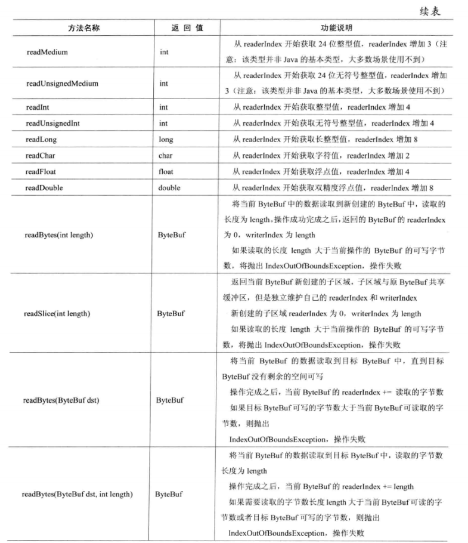
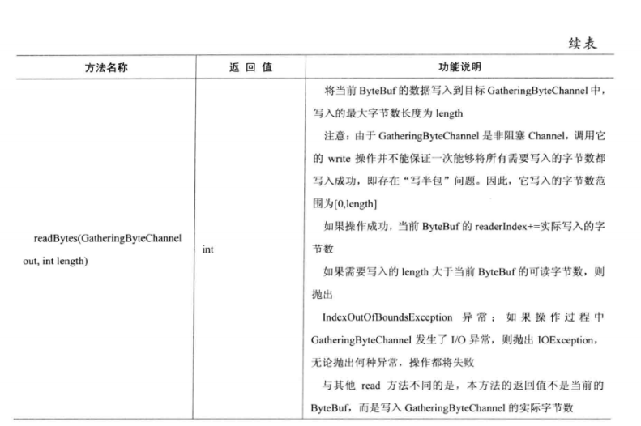
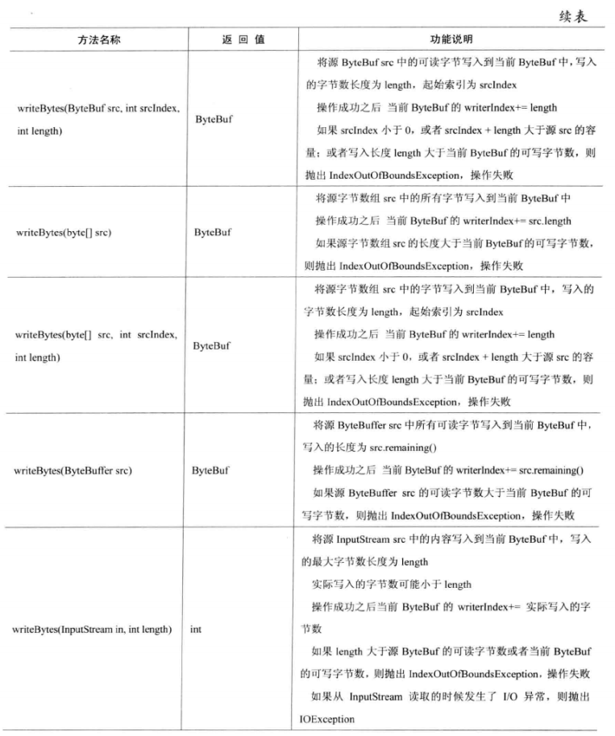
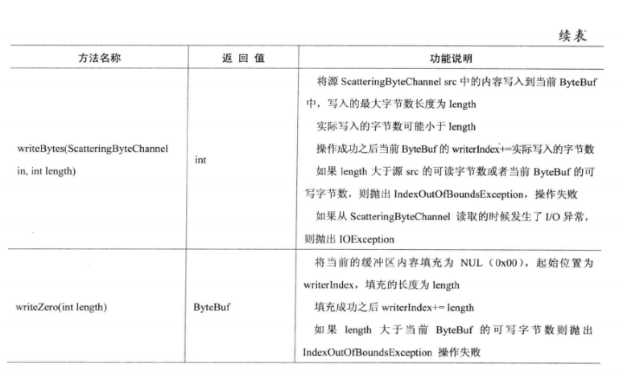
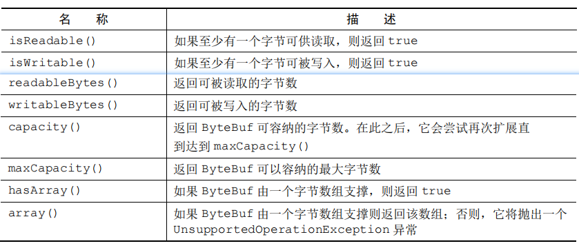
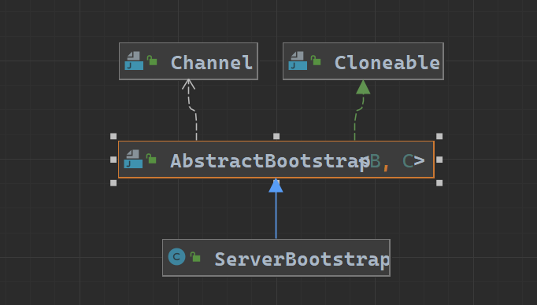

## 5.1 核心组件概述:

1. Channel:  
   `Channel`是NIO 三大核心组件之一, Channel是输入输出硬件设备与内存之间的一个通道的抽象,channel当做是 数据传输的载体,因此 channel可以被打开或者关闭, 可以连接或者断开连接.
2. ByteBuf:  
   `ByteBuf`是Netty在Nio的ByteBuffer基础上的扩展,Netty的核心数据容器.
3. ChannelHandler和ChannelPipeline:  
   `ChannelPipeline`: channel包裹的数据处理链,本质是个双向链表,结点元素是ChannelHandlerContext.而ChannelHandlerContext又与数据处理器
   `ChannelHandler`关联.  
   `ChannelHandler`: 数据处理器,对数据的处理逻辑都在这个对象中完成.
4. EventLoopGroup和EventLoop:  
   `EventLoopGroup`事件循环组: 本质是一个线程池,里面的线程与`EventLoop`事件循环相关联.
5. Future和Promise:   
   `回调`: 本质是一个方法,一个指向已经被提供给其他方法的方法的引用   
   `Future`: future可以看做是一个异步操作结果的占位符,future会在未来的某一个时刻完成,并提供对一步操作结果访问的途径.  
   `Promise`: promise是对future的扩展,future本身是不提供对异步操作结果设置的途径,promise则提供了对异步操作设置结果的途径.

## 5.2 Channel:

### 5.2.1 Channel概述:

1. 基本的I/O操作(bind,connect,read,write)依赖于底层网络传输提供的原语(Socket).Netty提供了自己的Channel及其子类,大大的降低了直接使用socket的复杂性.
2. 通过channel可以获得当前网络连接的通道的状态
3. 通过channel可以获得当前网络连接的配置参数(比如: 接口缓冲区的大小等)
4. channel提供异步的网络I/O操作(建立连接,读写,绑定端口等),异步调用意味着任何I/O都将立即返回,并且不保证在调用结束时所有的I/O操作已经完成
5. channel支持关联I/O操作与对应的处理程序(即handler)
6. 不同的协议,不同阻塞类型的连接都有不同的channel与之对应,常见的Channel类型`不仅限与下列实现类`为:  
   |Channel实现类|解释|
   |:--|---|
   | NioSocketChannel |异步的客户端TCP连接|
   | NioServerSocketChannel |异步的服务端TCP连接|
   | NioDatagramChannel |异步udp连接|
   | NioSctpChannel |异步客户端Sctp连接|
   | NioSctpServerChannel |异步服务端Sctp连接|
   | OioSocketChannel |阻塞的客户端tcp连接|
   | EmbeddedChannel |内置的channel 用于测试channel|

### 5.2.2 Channel的层次结构、常用方法:

#### 5.2.2.1 层次结构:

   ```java
      public interface Channel extends AttributeMap, ChannelOutboundInvoker, Comparable<Channel>
   ```

  
说明:

1. 每一个Channel在初始化的时候都将会被分配一个ChannelPipeLine和ChannelConfig.
2. 每一个Channel都是独一无二的,Channel实现了java.lang.Comparable接口,从而保证了Channel的顺序.
3. ChannelConfig包含了该channel的所有设置,并且支持了更新,可以通过`实现ChannelConfig的子类来给Channel设置某些特殊的设置`
4. ChannelPipeLine是实现Channel只执行I/O操作所有逻辑的容器,里面包含了许多 实际处理数据的handler了, 本质是一个 双向链表,表头表位分别表示入站出站的起点.
5. Netty的Channel是线程安全的,所以可以使用多线程对channel进行操作
6. 通过Channel.write()操作,数据将从链表表尾开始向链表表头移动,通过ChannelHandlerContext.write()是将数据传递给下一个ChannelHandler开始沿着链表移动.

#### 5.2.2.2 常见方法

1. `Channel read()`:
   从当前Channel中读取数据到第一个inbound缓冲区,如果数据读取成功,触发`ChannelHandler.channelRead(ChannelHandlerContext ctx, Object msg)事件`
   .`read()操作`完毕之后,紧接着触发`ChannelHandler.channelReadComplete(ChannelHandlerContext ctx)事件`. 如果该channel读请求被挂起,后续的读操作会被忽略.
2. `ChannelFuture write(Object msg)`: 请求将当前的msg通过ChannelPipeLine(`从pipeline的链表尾开始流动`)写入到Channel中.

   > 注意: write只是将数据存放于channel的缓冲区中,并不会将数据发送出去.要发送数据必须使用flush()方法

3. `ChannelFuture write(Object msg, ChannelPromise promise)`: 与 `方法2` 作用相同,参数 `promise`是用来写入 `write方法`的执行结果.
4. `ChannelFuture writeAndFlush(Object msg)`: 与 `方法2` 作用类似, 不过 `会立即将msg发送出去`
5. `ChannelFuture writeAndFlush(Object msg, ChannelPromise promise)`: 与 `方法4` 作用相同, 参数 `promise`是用来写入 `write方法`的执行结果.
6. `ChannelOutboundInvoker flush()`: 将所有带发送的数据(`存放于channel缓冲区中的数据`),发送出去
7. `ChannelFuture close()`: 关闭`channel`无论 `close`操作是成功还是失败,都会通知一次`channelFuture对象`(即触发ChannelFuture.
   operationComplete方法). `close操作`会级联触发该channel关联的`channePipeLine`中所有 `出站handler(继承了xxxOutBoundHandler)的close方法`.

   > 注意: 一旦channel 被关闭之后,就无法再使用了
8. `ChannelFuture disconnect()`: 断开与远程通信对端的连接. `disconnect方法`会级联触发该channel关联的`channePipeLine`
   中所有 `出站handler(继承了xxxOutBoundHandler)的close方法`
9. `ChannelFuture disconnect(ChannelPromise promise)`: 断开与远程通信对端的连接,并级联触发所有出站handler的`disconnect方法`,参数`promise`用于设置
   `diaconnect方法`的执行结果.
10. `ChannelFuture connect(SocketAddress remoteAddress)`: 客户端使用指定的服务端地址remoteAddress发起连接请求,如果连接因为应答超时而失败,
    ChannelFuture中的 `connect方法`执行结果就是`ConnectTimeoutException`,连接被拒绝就是`ConnectException`.
    `connection方法`会级联触发该channel关联的`pipeline`中所有`出站handler`中的`connect方法`.

    > connect方法有很多的重载方法,可以既连接远程,又绑定本地地址等...
11. `ChannelFuture bind(SocketAddress localAddress)`: 绑定本地的socket地址,并级联触发所有`出站handler`中的`bind
    (ChannelHandlerContext, SocketAddress, ChannelPromise)方法`

> 重载方法多了一个参数 `promise`,支持对bind操作执行结果的设置

12. channel信息获取方法:

   ```java
        ChannelConfig config() // 获取channel的配置信息,如: 连接超时时间
        ChannelMetadata metadata() // 获取channel的元数据描述信息,如TCP配置信息等
        boolean isOpen()  // channel是否已经打开
        boolean isRegistered() // channel 是否已经注册到EventLoop中
        boolean isActive() // channel是否已经处于激活状态
        boolean isWritable() // channel是否可写
        SocketAddress localAddress();  // channel本地绑定地址
        SocketAddress remoteAddress(); // channel 远程通信的远程地址
        ChannelPipeline pipeline(); // 获取channel关联的pipeline  
        ByteBufAllocator alloc(); // 获取channel缓冲区的分配对象,用于分配缓冲区大小  
        EventLoop eventLoop(); // 获取channel绑定的eventLoop(唯一分配一个I/O事件的处理线程)
        ChannelId id(); // 获取channel的唯一标识
        Channel parent();  // serverChannel.parent()返回null,socketChannel返回serverSocketChannel 
   ```

### 5.2.3 Channel的源码分析:

成员变量:

```java
    /**
     * 父通道, server socket channel
     */
    private final Channel parent;
    /**
     * channel唯一标识id
     */
    private final ChannelId id;
    /**
     * i/o操作实际完成的对象
     */
    private final Unsafe unsafe;
    /**
     * channel所包装的处理器链要封装进这个pipeline里面
     */
    private final DefaultChannelPipeline pipeline;
    private final VoidChannelPromise unsafeVoidPromise = new VoidChannelPromise(this, false);
    private final CloseFuture closeFuture = new CloseFuture(this);

    private volatile SocketAddress localAddress;
    private volatile SocketAddress remoteAddress;
    private volatile EventLoop eventLoop;
    private volatile boolean registered;
    private boolean closeInitiated;
    private Throwable initialCloseCause;

    /** Cache for the string representation of this channel */
    private boolean strValActive;
    private String strVal;
```

### 5.2.4 常见channel:

#### 1. EmbeddedChannel 嵌入式通道:

EmbeddedChannel是专门为netty 测试准备的一个组件. netty提供一种Embedded传输, 用于测试channelHandler.

具体使用方法就是: 将入站或者出站数据写入到EmbeddedChannel中, 然后检查是否有任何东西打到了channelPipeline的尾部.

常用的方法:

| 方法                                  | 作用                                                         |
| ------------------------------------- | ------------------------------------------------------------ |
| boolean writeInbound(Object... msgs)  | 将数据写入EmbeddedChannel中.如果可以通过readInbound()方法从EmbeddedChannel中读取数据, 就返回true |
| <T> T readInbound()                   | 从channel里面读取数据, 所读取出来的数据都是穿过了整个pipeline的. 没有东西可读则返回null |
| boolean writeOutbound(Object... msgs) | 将数据写入EmbeddedChannel中.ture表示可以从readOutBound方法里面读取到数据. |
| <T> T readOutbound()                  | 从channel里面读取数据, 所读取出来的数据都是穿过了整个pipeline的. 没有东西可读则返回null |
| boolean finish()                      | 将EmbeddedChannel标记为已完成, 且如果有可读去的入站数据或者出站数据, 就返回ture. 该方法还会调用EmbeddedChannel上的close()方法 |


## 5.3 ByteBuf:

### 5.3.1 ByteBuf概述:

1. ByteBuf优化:  
   NIO中ByteBuffer的缺点:
    - `长度固定`: 一旦ByteBuffer分配完成,其容量就不能动态扩展或者收缩, 容易出现数组越界异常.
    - `操作繁琐`: ByteBuffer所有的读写操作都是基于`position`作为定位指针进行操作,读写操作切换的时候需要使用`flip()`或者`rewind()`方法
    - `功能有限`: ByteBuffer的API功能有限, 一些高级和实用的特性不支持,需要手动实现

   Netty中ByteBuf的优点:
    - 可以被用户自定义的缓冲区类型扩展
    - 通过内置的复合缓冲区实现了透明的零拷贝
    - 容量可以按需增长(类似于StringBuilder)
    - 读写操作使用不同的索引,读写都有专门的api无需来回切换
    - 支持方法的链式调用
    - 支持引用计数
    - 支持池化

### 5.3.2 ByteBuf工作原理:

1. ByteBuf的数据结构:
    - `初始化时`:  
      
    - `写入部分数据之后`:  
        
      说明:
        - ByteBuf维护了两个不同的指针: 一个用于读(readerIndex),一个用于写(writeIndex).
        - ReadIndex 和 WriteIndex 的起始位置都是数组下标为0的位置.
        - 凡是 `read` 或者 `write`开头的api都会让 `readerIndex` 或者 `writeIndex`递增,而 `get` 或者 `set`开头的api不会.
        - ByteBuf有默认的最大长度限制 `Integter.MAX_VALUE`.在这个范围之内可以定义ByteBuf的最大容量,通过`capacity(int)
          `或者`ensureWritable(int)`方法扩容如果超出最大容量会抛出异常.
        - 试图读 `writeIndex`之后的数据,或者视图在`最大容量`之外写数据,会发生数组越界异常
2. ByteBuf的使用模式:
    - `堆缓冲区`:  
      最常用模式,将数据存放在JVM的对空间里面.这种模式又被称为是 `支撑数组`.  
      `优点`: 能够在没有使用 `池化` 的情况下提供快速的分配和释放.`非常适合有遗留数据需要处理的情况`  
      `缺点`: 当需要发送堆缓冲区的数据时,JVM需要在内部把 `堆缓冲区` 中的数据复制到 `直接缓冲区`中.  
      使用示例:
      ```java
         // 通过netty提供的工具类Unpooled获取Netty的数据容器,ByteBuf
         ByteBuf byteBuf = Unpooled.copiedBuffer("hello netty", Charset.forName("utf-8"));
      
         // 相关方法
         // public abstract boolean hasArray();判断ByteBuf的使用模式(hasArray判断的是 byteBuf是否在堆空间有一个支撑数组),
         // 即数据存放的位置在哪儿 堆/直接缓存区/复合缓冲区
         if (byteBuf.hasArray()){
             //  获取byteBuf的支撑数组
             byte[] array = byteBuf.array();
      
             // 把字节数组转换成字符串
             System.out.println( new String(array,Charset.forName("utf-8")));
      
             // 获取支撑数组的一些信息:
             // 获取支撑数组的偏移量
             System.out.println(byteBuf.arrayOffset());
             // 获取支撑数组的可读索引位置
             System.out.println(byteBuf.readerIndex());
             // 获取支撑数组的可写索引位置
             System.out.println(byteBuf.writerIndex());
             // 获取支撑数组的容量
             System.out.println(byteBuf.capacity());
             // 获取支撑数组中剩余可读元素占多少个字节,这个的大小是相对于readerIndex位置的,
             // 比如下面这个读取方法会导致readerIndex的移动,从而导致readableBytes()变化
             System.out.println(byteBuf.readByte());
             // 但是getByte方法是不会造成readerIndex移动的
             System.out.println(byteBuf.getByte(1));
             System.out.println(byteBuf.readableBytes());
         } 
      ```

    - `直接缓冲区`:  
      `网络数据传输最理想的选择`,直接缓冲区中的数据是常驻在常规会被JVM进行垃圾回收的堆空间之外. 优点:
      由于数据是存储在JVM堆空间之外的直接内存中,在进行网络传输的时候,无需把数据从堆空间复制到直接内存中,提高网络传输时的性能.   
      缺点: 1.分配和释放的开销都十分昂贵;2.如果数据不仅仅是用作网络传输的数据,在服务端还可能对齐进行访问的话,必须要将数据从`直接内存`复制到`堆空间中`来.
      > 建议: 如果缓冲区中的数据,需要被访问的话,堆缓冲区是更好的选择.

      使用示例:
      ```java
         ByteBuf directBuf = Unpooled.directBuffer();
         // public abstract boolean hasArray();判断ByteBuf的使用模式(hasArray判断的是 byteBuf是否在堆空间有一个支撑数组),
         // 如果不是那么就是直接缓冲区
         if (!directBuf.hasArray()){
             int len = directBuf.readableBytes();
             byte[] bytes = new byte[len];
             directBuf.getBytes(directBuf.readerIndex(),bytes);
             // 业务逻辑处理
             handleArray(bytes,0,len);
         }  
      ```

    - `复合缓冲区`:    
      `多个ByteBuf的聚合视图`,可以根据需要添加或者删除ByteBuf实例.Netty通过ByteBuf子类 --- `CompositeByteBuf`实现`复合缓冲区模式`,
      其提供一个将多个缓冲区表示为单个合并缓冲区的虚拟表示.
      > ps:  `CompositeByteBuf`中的byteBuf实例可能同时包含 `直接缓冲区`或者`非直接缓冲区`,此时`hasArray()`方法在只有一个实例的时候,回去判断该实例是否有支撑数组,
      > 存在多个实例的时候`hasArray方法`总是返回`false`

      使用示例:  模拟一个HTTP协议传输的消息,包含两部分 头部和主题,分别由不同的模块生成,在发送数据的时候进行组装.如图:`可以使用CompositeByteBuf来消除每条消息都重复创建这两个缓冲区`  
      
      ```java
          //  -------------------------------  构造 复合缓冲区  -----------------------------
          CompositeByteBuf composited = Unpooled.compositeBuffer();
          // 也可以是堆缓冲区
          ByteBuf headerBuf = Unpooled.directBuffer();
          // 也可以是直接缓冲区,buffer()返回的是一个堆缓冲区
          ByteBuf bodyBuf = Unpooled.buffer();
      
          // 添加缓冲区到复合缓冲区
          composited.addComponents(headerBuf,bodyBuf);
      
          //  .... 业务逻辑
      
          // 删除某个buf,按照添加的顺序,在本例子中,0为headBuf
          composited.removeComponent(0);
          // 遍历获取每一个buf
          for (ByteBuf buf : composited) {
              System.out.println(buf.toString());
          }   
        
          // ------------------------------  访问复合缓冲区  --------------------------------
          public static void byteBufCompositeArray() {
              CompositeByteBuf compBuf = Unpooled.compositeBuffer();
              //获得可读字节数
              int length = compBuf.readableBytes();
              //分配一个具有可读字节数长度的新数组
              byte[] array = new byte[length];
              //将字节读到该数组中
              compBuf.getBytes(compBuf.readerIndex(), array);
              //使用偏移量和长度作为参数使用该数组
              handleArray(array, 0, array.length);
          }
      ```

### 5.3.3 字节级别操作:

工作时通常ByteBuf的数据结构图:  


#### 5.3.3.1 几种不同的字节区间:

1. `可丢弃字节区间`:  
   在ByteBuf中,已经被读取过的字节都会被视为是 `可丢弃的字节`, `0`到 `readerIndex`之间就是 `可丢弃区间`,通过`discardReadBytes()`可以丢弃他们并回收空间.
   `discardReadBytes()`方法会将 `readerIndex`重新指向 `byteBuf`数组开始元素的位置,`writerIndex`会减少相应的数量.
   `discardReadBytes()`调用之后的数据结构:  
   
   > 注意:
   > 1. 由于`discardReadBytes()`方法只是移动了`writerIndex`和`可读字节`,但是没有对其他数组空间进行数据擦除,所以可写部分的数据是`没有任何保证的`.
   > 2. 在非必要时刻(内存极低紧张)的时候,不要使用 `discardReadBytes()`将`可丢弃字节区间`转化为`可写区间`,因为该方法必须将`可读区间`中的数据转移到数组开始位置去,这个操作很有可能会发生`内存复制`

2. `可读字节区间`:  
   ByteBuf的可读字节是存储实际数据的区间.`新分配`、`包装`、`复制`的缓冲区默认的`readerIndex`为`0`.  
   任何 `read` 或者 `skip` 开头的方法都会将造成`readerIndex`增加已读字节. 如果 `readBytes(ByteBuf dest)`读取并写入到`dest`会造成 `dest`的`writerIndex`
   增加相应的数量.

   > 读取 `writerIndex`之外的数据将造成数组越界异常

3. `可写字节区间`:  
   可写字节区间是指一个拥有未定义内容的,写入就绪的内存区域.`新分配`的缓冲区默认的`readerIndex`为`0`.  
   任何以 `write` 开头的方法都会造成 `writerIndex`增加以写入字节数. 如果 `writeBytes(Bytes dest)`读取并写入到`dest` 会造成 `调用` 这个方法的缓冲区的 `readerIndex`
   增加相应的数量.

#### 5.3.3.2 索引管理:

1. `随机访问索引`: `get或者set`开头的方法来随机`访问或者写入`数据 ByteBuf与普通数组一样,索引总是从 `0`开始,到`capacity - 1`截至.
   > 注意:
   > 1. `get或者set`开头的方法不会造成读写索引的移动
   > 2. 通过`需要索引值为入参`的方法来访问缓冲区,同样不会造成读写索引的移动
   > 3. 在需要的时候可以通过 readerIndex(index) 或者 writerIndex(index) 来移动读写索引

2. `顺序访问索引`: `read()或者write()`方法来顺序 `读取或者写入` 数据
3. `索引管理`:  
   调用 `markReaderIndex()`, `markWriterIndex()` 来标记读写索引  
   调用 `resetWriterIndex()`, `resetReaderIndex()` 来重置读写索引到标记的位置  
   调用 `readerIndex(index)`, `writerIndex(index` 来指定读写索引的位置  
   调用 `clear()` 将读写索引重新指向 `数组起始位置`
   > 1. `clear()`方法仅仅是重置读写索引为0,不会对buf中的数据进行清除
   > 2. 相对于 `discardReadBytes()`方法,`clear()`方法更为效率,因为它只是将读写索引重置为了0,不会引发任何的数据复制.

#### 5.3.3.3 派生缓冲区:

派生缓冲区为ByteBuf提供以专门的方式呈现 `缓冲区数据` 的视图,常见方法为:

- `duplicate()`: 返回一个与调用`duplicate()`的缓冲区`共享所有空间`的缓冲区
- `slice()`: 返回调用`slice()`的缓冲区`整个可读字节区间`的切片
- `slice(int,int)`: 返回调用`slice()`的缓冲区`部分可读字节区间`的切片
- `readSlice(int length)`: 返回调用`slice()`的缓冲区`可读字节区间中 readerIndex + length`的切片,会将`readerIndex`增加length长度.
- `order(ByteOrder)`:
- `Unpooled.unmofifiableBuffer(..)`:

> 注意:
> 1. 上面的方法只是将数据展示出来了,但是与原buffer使用的是同一份数据,修改派生缓冲区的数据也会改变原缓冲区的数据.(`如同ArrayList.subList`)
> 2. 如果想要复制一份独立的数据副本,请使用`copy()`,`copy(int,int)`

测试:

```java
        // ----------------------   非共享  -----------------------------------------

        Charset utf8 = Charset.forName("UTF-8");
        //创建 ByteBuf 以保存所提供的字符串的字节
        ByteBuf buf = Unpooled.copiedBuffer("Netty in Action rocks!", utf8);
        //创建该 ByteBuf 从索引 0 开始到索引 15 结束的分段的副本
        ByteBuf copy = buf.copy(0, 15);
        //将打印"Netty in Action"
        System.out.println(copy.toString(utf8));
        //更新索引 0 处的字节
        buf.setByte(0, (byte)'J');
        //将会成功，因为数据不是共享的
        assert buf.getByte(0) != copy.getByte(0);

        // ----------------------   共享  -----------------------------------------
        //创建一个用于保存给定字符串的字节的 ByteBuf
        ByteBuf bufForSlice = Unpooled.copiedBuffer("Netty in Action rocks!", utf8);
        //创建该 ByteBuf 从索引 0 开始到索引 15 结束的一个新切片
        ByteBuf sliced = bufForSlice.slice(0, 15);
        //将打印"Netty in Action"
        System.out.println(sliced.toString(utf8));
        //更新索引 0 处的字节
        bufForSlice.setByte(0, (byte)'J');
        //将会成功，因为数据是共享的，对其中一个所做的更改对另外一个也是可见的
        assert bufForSlice.getByte(0) == sliced.getByte(0);
```

#### 5.3.3.4 查找字节所在的位置:

  
一般的字节可以通过 `indexOf()` 方法来查找指定的字节,或者通过传入 `ByteProcessor参数` 设定`中止字符`来配合`forEachByte()方法`帮助查找.

```java
    /**
     * Aborts on a {@code NUL (0x00)}.
     */
    ByteProcessor FIND_NUL = new IndexOfProcessor((byte) 0);

    /**
     * Aborts on a non-{@code NUL (0x00)}.
     */
    ByteProcessor FIND_NON_NUL = new IndexNotOfProcessor((byte) 0);

    /**
     * Aborts on a {@code CR ('\r')}.
     */
    ByteProcessor FIND_CR = new IndexOfProcessor(CARRIAGE_RETURN);

    /**
     * Aborts on a non-{@code CR ('\r')}.
     */
    ByteProcessor FIND_NON_CR = new IndexNotOfProcessor(CARRIAGE_RETURN);

    /**
     * Aborts on a {@code LF ('\n')}.
     */
    ByteProcessor FIND_LF = new IndexOfProcessor(LINE_FEED);

    /**
     * Aborts on a non-{@code LF ('\n')}.
     */
    ByteProcessor FIND_NON_LF = new IndexNotOfProcessor(LINE_FEED);

    /**
     * Aborts on a semicolon {@code (';')}.
     */
    ByteProcessor FIND_SEMI_COLON = new IndexOfProcessor((byte) ';');

    /**
     * Aborts on a comma {@code (',')}.
     */
    ByteProcessor FIND_COMMA = new IndexOfProcessor((byte) ',');

    /**
     * Aborts on a ascii space character ({@code ' '}).
     */
    ByteProcessor FIND_ASCII_SPACE = new IndexOfProcessor(SPACE);

    /**
     * Aborts on a {@code CR ('\r')} or a {@code LF ('\n')}.
     */
    ByteProcessor FIND_CRLF = new ByteProcessor() {
        @Override
        public boolean process(byte value) {
            return value != CARRIAGE_RETURN && value != LINE_FEED;
        }
    };

    /**
     * Aborts on a byte which is neither a {@code CR ('\r')} nor a {@code LF ('\n')}.
     */
    ByteProcessor FIND_NON_CRLF = new ByteProcessor() {
        @Override
        public boolean process(byte value) {
            return value == CARRIAGE_RETURN || value == LINE_FEED;
        }
    };

    /**
     * Aborts on a linear whitespace (a ({@code ' '} or a {@code '\t'}).
     */
    ByteProcessor FIND_LINEAR_WHITESPACE = new ByteProcessor() {
        @Override
        public boolean process(byte value) {
            return value != SPACE && value != HTAB;
        }
    };

    /**
     * Aborts on a byte which is not a linear whitespace (neither {@code ' '} nor {@code '\t'}).
     */
    ByteProcessor FIND_NON_LINEAR_WHITESPACE = new ByteProcessor() {
        @Override
        public boolean process(byte value) {
            return value == SPACE || value == HTAB;
        }
    };
```

### 5.3.4 ByteBuf常见API总结:

#### 5.3.4.1 顺序读操作:

  
  
  


#### 5.3.4.2 顺序写操作:

  
  
  


#### 5.3.4.3 随机写操作:


#### 5.3.4.4 随机读操作:


#### 5.3.4.5 其他操作:



### 5.3.5 ByteBuf辅助工具类:

#### 5.3.5.1 ByteBufHolder接口:

`ByteBufHolder`是`ByteBuf`的容器,除了实际数据装载之外,我们还需要存储各种属性值.比如HTTP的请求和响应都可以携带消息体,在Netty中消息体就是用`ByteBuf`来表示;
但是由于不同的协议之间会包含不同的协议字段和功能,这部分数据并不适合写在实际数据中,所以Netty抽象出了一个 `ByteBufHolder接口`持有一个`ByteBuf`用以装载实际数据, 同时携带不同协议的协议字段和功能. (
ByteBufHolder的实现类实现不同协议的协议字段和功能描述).  
  
说明:

- `ByteBufHolder`为Netty的高级特性提供了支持,比如缓冲区池化,其中可以从池中借用ByteBuf,并且在需要时自动释放.
- `通常用作需要存储实际数据的消息对象接口`
- `常用方法`:  
  

#### 5.3.5.2 ByteBuf内存空间分配:

1. `按需分配 --- ByteBufAllocator接口`:
    1. 为了降低分配和释放的内存开销,Netty通过`interface ByteBufAllocator`实现了缓冲区池化,`ByteBufAllocator`可以用来分配我们所描述过得任意类型的ByteBuf实例.
       `池化`不会改变`ByteBuf`api 的语义,只是新的数据需要使用ByteBuf来存储的时候,可以从缓冲池中取出一个 `ByteBuf实例` 来存储数据.
    2. 常用方法:  
       

    3. 说明:
        - 可以通过 `channel`(每个都可以有一个不同的ByteBufAllocator实例) 或者 绑定到
          `channelHandler`的`ChannelHandlerContext`获取到一个`ByteBufAllocator`的引用.
        - Netty提供了 ByteBufAllocator 的实现:  
          `PooledByteBufAllocator`:  池化ByteBuf实例,提高性能并最大限度的减少内存碎片.使用的是jemalloc技术实现的内存分配.
          `UnpooledByteBufAllocator`:  非池化ByteBuf实例分配,每一次调用都会返回一个新的byteBuf实例.
          > 1. netty4.1版本默认使用的是 `PooledByteBufAllocator`, 4.0版本默认使用的则是 `UnpooledByteBufAllocator`.
          > 2. 可以通过`ChannelConfig`或者`Bootstrap`配置 使用什么类型的 `ByteBufAllocator`.
        - `ioBuffer()`: 这个方法在使用的时候,如果当前运行环境有 sun.misc.Unsafe 支持的时候, 返回的是 `Direct ByteBuf`,否则返回的是 `Heap ByteBuf`.  
          当使用 `PreferHeapByteBufAllocator`的时候, 只会返回 `Heap ByteBuf`.

2. `Unpooled缓冲区`:  
   在某些情况下,如果未能获取到一个 `ByteBufAllocator`的引用.可以通过工具类 `Unpooled` 来创建未池化的 `ByteBuf实例`.  
   

3. `ByteBufUtil类`:  
   `ByteBufUtil` 提供了用于操作 `ByteBuf` 的静态的辅助方法。因为这个API是通用的，并且和池化无关，所以这些方法已然在分配类的外部实现。 这些静态方法中最有价值的可能就是 hexdump()
   方法，它以十六进制的表示形式输出`ByteBuf` 的内容。这在各种情况下都很有用，例如，出于调试的目的记录 `ByteBuf` 的内容。十
   六进制的表示通常会提供一个比字节值的直接表示形式更加有用的日志条目，此外，十六进制的版本还可以很容易地转换回实际的字节表示。 另一个有用的方法是 `boolean equals(ByteBuf, ByteBuf)`
   ，它被用来判断两个 `ByteBuf`实例的相等性。

### 5.3.6 引用计数:

- `引用计数`: 一种通过在某个对象所持有的资源不再被其他对象引用时,释放该对象所持有的资源来优化内存使用和性能的技术.(`类似于JVM的引用计数算法`)
- Netty 在第 4 版中为 `ByteBuf` 和 `ByteBufHolder` 引入了引用计数技术，它们都实现了 `interface ReferenceCounted`.
- `引用计数实现的大致思路`: 它主要涉及跟踪到某个特定对象的活动引用的数量。一个 `ReferenceCounted` 实现的实例将通常以活动的引用计数为 `1`作为开始。只要`引用计 数`大于 `0`
  ，就能保证对象不会被释放。当活动引用的数量减少到 0 时，该实例就会被释放。

  > 注意: 虽然释放的确切语义可能是特定于实现的，但是至少已经释放的对象应该不可再用了。
- `引用计数`对于 `池化实现`（如 PooledByteBufAllocator）来说是至关重要的，它降低了内存分配的开销。
- 试图访问一个已经被`释放(或者说是 引用计数为 0)`的引用计数的对象，将会导致一个 `IllegalReferenceCountException`。
- `谁来释放`: 一般是由 最后访问资源的一方 来负责释放 资源.

> 一个特定的（ReferenceCounted 的实现）类，可以用它自己的独特方式来定义它的引用计数规则。例如，我们可以设想一个类，其 `release()` 方法的实现总是将引用计数设为 零，而不用关心它的当前值，从而一次性地使所有的活动引用都失效。

### 5.3.7 ByteBuf源码分析:

TODO

## 5.4 ChannelHandler和ChannelPipeline:

### 5.4.1 ChannelHandler和ChannelPipeline的概述:

`Channel,ChannelPipeline,ChannelContext,ChannelHandler之间的关系`:


Netty的ChannelPipeline和ChannelHandler机制类似于Servlet和Filter过滤器,这类拦截器实际上是责任链模式的一种变形,主要是为了方便事件的拦截和用户业务逻辑的定制.  
`ChannelHandler`: 从应用程序开发人员的角度来看,Netty的主要组件是ChannelHandler,它充当了所有处理入站和出站数据的应用程序逻辑的容器,ChannelHandler可以适用于任何逻辑操作.  
`ChannelPipeline`: Netty将Channel的数据管道抽象为 `ChannelPipeline`,消息在 `ChannelPipeline`中流动和传递.
`ChannelPipeline`持有I/O事件拦截器`ChannelHandler`的链表, 由 `ChannelHandler` 对I/O事件进行拦截和处理,可以方便的通过增删handler来实现不同业务逻辑的定制,不需要对已有
handler修改,就能实现对修改封闭和对扩展的支持.  
`ChannelHandlerContext`: 当`ChannelHandler`每一次被分配到一个`ChannelPipeline`的时候,都会创建一个新的`ChannelHandlerContext`与`ChannelHandler`
关联起来, 其表示`ChannelHandler`与`ChannelPipeline`的绑定关系.

### 5.4.2 ChannelHandler:

#### 5.4.2.1 Channel的生命周期:

`Channel`接口定义了一组和 `ChannelInBoundHandler`api 密切相关的简单但是功能强大的状态模型.`Channel的4个状态` :  
  
  
说明:

- 只要`Channel`没有关闭,`Channel`就可以再次被注册到`EventLoop`组件上.
- 当图片中的状态一旦发生改变的时候,就会生成对应的事件,这些事件会被转发给 `ChannelPipeline` 中的 `ChannelHandler`处理.

#### 5.4.2.2 ChannelHandler的生命周期:

`ChannelHandler`定义的生命周期操作,`ChannelHandler`被添加到`channelPipeline`或者从`channelPipeline`中移除的时候会触发这些操作.
每个方法都会接收一个`ChannelHandlerContext`作为参数
  
`channelHandler`两个重要的子接口:

- `ChannelInboundHandler` : 处理入栈数据以及各种状态变化
- `ChannelOutboundHandler` : 处理出站数据并且允许拦截所有的操作

#### 5.4.2.3 `ChannelInboundHandler`接口:

  
说明:

- 上面是 `ChannelInboundHandler`的生命周期方法,channel中的`数据被读取`或者`channel状态发生变化`的时候被调用.
- 当 `ChannelInboundHandler`的子类类重写了`channelRead()`方法的时候,需要手动通过 `ReferenceCountUtil.release()`来手动释放与`池化ByteBuf有关的内存
  (即参数msg)`

```java
         @Sharable
         public class DiscardHandler extends ChannelInboundHandlerAdapter{
             @Override
             public void channelRead(ChannelHandlerContext ctx,Object msg){
                 // 如果不手动释放,Netty会通过日志的形式记录msg未释放的实例
                 ReferenceCountUtil.release(msg);
             }  
         }
```

- 也可以通过 `SimpleChannelInboundHandler`来自动释放资源,ps: 不要试图把 `SimpleChannelInboundHandler`中的数据存放起来,以便后期使用. 也就是不要试图在handler里面共享数据

```java
         @Sharable
         public class DiscardHandler extends ChannelInboundHandlerAdapter{
             @Override
             public void channelRead(ChannelHandlerContext ctx,Object msg){
                 // 在这里就不需要手动释放msg所占用的byteBuf空间了
             }  
         }
```

#### 5.4.2.3 `ChannelOutboundHandler`接口:

出站操作和数据将由 `ChannelOutboundHandler`处理.`ChannelOutboundHandler`的方法将会被 `Channel` , `ChannelPipeline` ,以及
`ChannelHandlerContext` 调用.  
`ChannelOutboundHandler` 可以按照需要`推迟操作` 或者 `推迟事件`, 这可以通过一些复杂的方法来处理请求.   


#### 5.4.2.4 `ChannelHandlerAadptor`:

  
说明:

- `ChannelInboundHandlerAdapter` 和 `ChannelOutboundHandlerAdapter` 类分别提供了 `ChannelInboundHandler`
  和 `ChannelOutboundHandler`
  的基本实现。通过扩展抽象类 `ChannelHandlerAdapter`，它们获得了它们共同的超接口 ChannelHandler 的方法。
- `ChannelHandlerAdapter` 还提供了实用方法 `isSharable()`。如果其对应的实现被标注为 `@Sharable`，那么这个方法将返回 `true`，表示它可以被添加到多个
  `ChannelPipeline`中.
- 在 `ChannelInboundHandlerAdapter` 和 `ChannelOutboundHandlerAdapter` 中所提供的方法体调用了其相关联的 `ChannelHandlerContext` 上的等效方法(
  fireXXX())， 从而将事件转发到了 `ChannelPipeline` 中的下一个 `ChannelHandler` 中。

#### 5.4.2.5 防止内存泄露:

- 每当通过调用 `ChannelInboundHandler.channelRead()`或者 `ChannelOutboundHandler.write()`方法来处理数据时，都需要保证不会出现资源泄漏(buf没有释放)。 Netty
  使用引用计数来处理池化的 ByteBuf。所以在完全使用完某个 ByteBuf 后，调整其引用计数是很重要的。
- Netty提供了class ResourceLeakDetector ， 它将对你应用程序的缓冲区分配做大约 1%的采样来检测内存泄露。  
  Netty定义的4种`泄漏检测级别`:  
  
  > 可以通过启动命令: `java -Dio.netty.leakDetectionLevel=ADVANCED` 来设置内存检测级别

  检测结果: `存在内存泄漏`如图   
  

### 5.4.3 ChannelPipeline:

- `ChannelPipeline` : 是一个流经Channel的入站和出站事件的ChannelHandler实例双向链表.
- `ChannelPipeline`在`Channel`创建的时候,就会分配给`Channel`并与之关联,直到`Channel`关闭.在`Channel`整个生命周期中,`ChannelPipeline`都是唯一与之绑定的,
  既不能 `新增pipeline`也不能`分离pipeline`.
- 根据事件的类型,事件将会被 `ChannelInboundHandler`或者`ChannelOutboundHandler`处理.`ChannelHandler`之间通过上下文对象`ChannelHandlerContext`交互.
- `ChannelHandlerContext`可以让`ChannelHandler`之间进行交互,也可以动态的修改 `ChannelPipeline`中 handler的顺序.
- 入站口总是 `处理入站事件`的 `ChannelInboundHandler`(即链表的head总是指向`能够`处理入站事件的处理器),出站口总是 `处理出站事件`的`ChannelOutboundHandler`(即
  链表的tail总是指向`能够`处理出站事件的处理器)
- `ChannelHandler`在`ChannelPipeline`执行顺序是根据`handler`被加入到双向链表中的顺序而决定的
  > 一个处理器,可能同时实现 `ChannelInboundHandler` 和 `ChannelOutboundHandler`.在`Netty`中事件流经pipeline的时候通过标志位判断当前处理器能不能处理该事件,直到找到一个
  > 能够处理该事件的handler为止.

#### 5.4.3.1 获取pipeline:

- 通过Channel获取

```java
        bootstrap = new Bootstrap()
        .group(clientGroup)
        .channel(NioSocketChannel.class)
        // 这里实现的是中途断线重连,断线换成netty术语就是channel不活跃了
        .handler(new ChannelInitializer<SocketChannel>() {
            @Override
            protected void initChannel(SocketChannel ch) {
                // ch.pipeline就是获取pipeline
                ch.pipeline().addLast(new ChannelInboundHandlerAdapter() {
                    // channel在运行过程中中断,就会触发这个(channelInactive)方法,然后通过这个方法去重新连接
                    @Override
                    public void channelInactive(ChannelHandlerContext ctx) throws Exception {
                        ctx.channel().eventLoop().schedule(()-> doConnect(),2, TimeUnit.SECONDS);
                    }
                });
            }
        });
```

- 通过ChannelHandlerContext获取:

```java
    public void handlerAdded(ChannelHandlerContext ctx) throws Exception {
        Channel curChannel = ctx.channel();  
        // 获取pipeline
        ChannelPipeline pipeline = ctx.pipeline();
    }
```

#### 5.4.3.2 处理ChannelPipeline中的handler:

1. `ChannelPipeline`的修改,实际上是修改双向链表上的handler,`ChannelPipeline`提供了一些对handler进行crud的方法:  
   

```java
ChannelPipeline pipeline = ..; // 通过channel或者channelHandlerContext可以获取pipeline
FirstHandler firstHandler = new FirstHandler(); 
pipeline.addLast("handler1", firstHandler); // 加入
pipeline.addFirst("handler2", new SecondHandler()); 加入
pipeline.addLast("handler3", new ThirdHandler()); 加入
        // 此时pipeline中的顺序为 handler2 -> handler1 -> handler3
...
pipeline.remove("handler3");
pipeline.remove(firstHandler);
pipeline.replace("handler2", "handler4", new ForthHandler());
// 此时pipeline中仅剩 handler4
```

> 由于整个pipeline中的channelHandler都是由与channel绑定的eventLoop来执行的,所以如果要在handler中使用阻塞api,为了不降低整体的I/O性能,在`添加handler`的时候,
> 可以使用pipeline中带有EventExecutorGroup的add()方法,`将handler交给ExecutorGroup中的线程去执行而不是有eventLoop线程执行`.

2. 访问handler:  
   

#### 5.4.3.3 事件的传递:

`入站操作`:  实际上就是通知pipeline中下一个handler调用对应的接口:  

> 调用channel或者pipeline对象的上述方法,会将整个事件沿着pipeline进行传播,但是通过handlerContext中的上述方法只会将事件传递给pipeline中下一个能够处理该事件的handler.

`出站操作`:  许多方法会造成底层套接字上发生一些列的动作  


### 5.4.4 ChannelHandlerContext:


- `ChannelHandlerContext`代表 `handler` 和 `pipeline`之间的关联关系,只要有 `handler`分配到`pipeline`中来,就创建一个`context`与`handler关联`.
- `ChannelHandlerContext`主要作用是 用来与`context`关联的`handler`和其他`同一个pipeline中的handler`之间的交互 --- 将消息传递给下一个能够处理该消息的handler
- `ChannelHandlerContext`与`handler`的关联关系是永远不会改变的,缓存Context的引用是线程安全的.
- `ChannelHandlerContext`常用方法总结:  
  

- `ChannelHandlerContext`与其他用同名方法的组件相比,产生的事件流更短,可以利用这个特性来获取最大的性能,`特性使用场景如下:`
    - 为了减少将事件传经对它不感兴趣的handler所带来的开销
    - 为了避免将事件传经那些可能会对他感兴趣的handler

- `ChannelHandlerContext`只能于一个handler绑定,但是handler可以绑定多个context实例.
    - 正确示例:
    ```java
        @sharable
        public class SharableHandler extends ChannelInboundHandlerAdapter{
            @Override
            public void channelRead(ChannelHandlerContext ctx, Object meg){ 
                ctx.fireChannelRead(msg);
            }         
        }
    ```
    - 错误示例:
    ```java
        @sharable
        public class SharableHandler extends ChannelInboundHandlerAdapter{
            private int count;
            @Override
            public void channelRead(ChannelHandlerContext ctx, Object meg){ 
                // 对共享资源不保证线程安全的修改操作,会导致问题
                count++;
                ctx.fireChannelRead(msg);
            }         
        }
    ```
  > handler必须添加@Shareble注解,并且handler必须要是线程安全的.

- `ChannelHandlerContext`特殊用法:  
  保存`ChannelHandlerContext`在其他channel中使用或者以供稍后使用,完成一些特殊的操作
    ```java
        public class WriteHandler extends ChannelHandlerAdapter { 
            private ChannelHandlerContext ctx;
            @Override
            public void handlerAdded(ChannelHandlerContext ctx) {
                this.ctx = ctx;
            }
            public void send(String msg) {
                ctx.writeAndFlush(msg);
            }
        }
    ```

### 5.4.5 异常处理:

#### 5.4.5.1 入站异常处理:

如果在处理入站事件的过程中,发生了异常,那么异常将会从当前handler开始在pipeline中的`InboundHandler`传递下去.

- 实现异常处理: 通过重写exceptionCaught方法
    ```java
        public void exceptionCaught(ChannelHandlerContext ctx, Throwable cause) throws Exception;
    ```
    ```java
        public class EchoServerHandler extends ChannelInboundHandlerAdapter {
            @Override
            public void exceptionCaught(ChannelHandlerContext ctx, Throwable cause) throws Exception {
                cause.printStackTrace();
                ctx.close();
            }
        }
    ```
- 注意事项:
    1. 默认的exceptionCaught()方法只是简单的将当前异常转发给了pipeline中的handler
    2. 如果异常到达了pipeline的尾部仍然没有处理,netty会在日志这种记录该异常为未处理异常, `通常为了所有异常都会被处理,pipeline的最后都会存在一个实现了示例代码的handler`
    3. 通过重写exceptionCaught()来自定义自己的异常处理方法.

#### 5.4.5.2 出站异常处理:

通过异步通知机制,来处理出站异常:

- 每个出站操作都会返回一个ChannelFuture.注册到ChannelFuture的ChannelFutureListener将在操作完成的时候通知该操作是否成功
- 几乎所有的ChannelOutboundHandler上的方法都会传入一个ChannelPromise的实例.channelPromise是channelFuture的子类,可以用于异步通知也可以用于立即通知的可写方法
    ```java
        ChannelPromise setSuccess();
        ChannelPromise setFailure(Throwable cause);
    ```

- 处理异常示例:  
  方法1: 通过向出站操作返回的ChannelFuture中添加具体的监听器
    ```java
        ChannelFuture future = channel.write(someMessage)
        future.addListener(new ChanelFutureListener() {
            @Override
            public void operationComplete(ChannelFuture f){
                if(!f.isSuccess()){
                    f.cause().printStackTrace();
                    f.channel().close();
                }     
            }     
        })
    ```
  <font color=red>**启动重连的示例**</font>
    ```java
        // 注意这里一定不要调用sync()
        ChannelFuture connectFuture = bootstrap.connect(new InetSocketAddress(remoteHost, port));
        // 添加链接事件的监听器,当连接事件触发的时候就会调用监听器里面的operationComplete方法
        connectFuture.addListener((ChannelFutureListener) future -> {
            if (future.isSuccess()){
                System.out.println(" 连接成功........");
            }else{
                System.out.println(String.format(" 连接失败,正在尝试重连 ..... 当前为 第 %s 次重连",retryTime.intValue()));
                future.channel().eventLoop().schedule(()->doConnect(),1,TimeUnit.SECONDS);
            }
        });
    ```
  方法2: 给出站操作的参数 promise添加listener.
    ```java
        public class OutboundExceptionHandler extends ChannelOutboundHandlerAdapter {
            @Override
            public void write(ChannelHandlerContext ctx, Object msg, ChannelPromise promise) {
                promise.addListener(new ChannelFutureListener() {
                    @Override
                    public void operationComplete(ChannelFuture f) {
                        if (!f.isSuccess()) {
                            f.cause().printStackTrace();
                            f.channel().close();
                        } 
                    }
                });
            } 
        }
    ```
  > 两种方法如何选择: 不同出站事件的细节异常处理使用`方法一`更好, `方法二`更适合于一般的异常处理

### 5.4.6 特殊handler:

#### 1. channelinitalizer:


## 5.5 EventLoopGroup和EventLoop:

**继承结构**  


### 5.5.1 EventLoop:

#### 5.5.1.1 概述:

运行任务来处理在连接的生命周期内发生的事件是任何网络框架的基本功能.这种功能在编程上的构造称为`事件循环`,Netty使用`EventLoop`表示.  
事件循环的大致思路:

```java
    // 只要线程没有被关闭,就一直循环执行
    while (!terminated) {
        // 阻塞获取就绪事件
        List<Runnable> readyEvents = blockUntilEventsReady();
        // 遍历就绪事件,逐一执行
        for (Runnable event : readEvents) {
            ev.run();
        }
    }
```

1. 在Netty所提供的线程模型中 `EventLoop` 将由一个永远不会改变的 线程 驱动(即由这个线程来处理`EventLoop`中就绪的事件).
2. 任务可以直接提交给`EventLoop的实现类`,根据具体需求直接直接执行或者调度执行.  `EventLoop`继承了JUC中的延迟任务线程池`ScheduledExecutorService`,但是
   只定义了一个用来返回 `EventLoop`属于哪一个`EventLoopGroup`的方法(`parent()`)
3. 根据配置和cpu核心数量不同,可能会创建多个EventLoop实例来优化资源的使用率,当个 `EventLoop`可以被分配给多个 `Channel`.

#### 5.5.1.2 I/O事件处理:

1. Netty3 中的I/O事件处理:
    - Netty3 中使用的线程模型只保证了入站事件会在I/O线程(Netty4中的`EventLoop`)中执行.但是出站事件都是由调用线程处理,该线程可以能是`EventLoop`或者其他线程,这样一来
      handler中执行的代码就有可能被多个线程并发执行,就需要在handler中处理线程安全问题.  
      比如: 在不同的线程中调用Channel.write(),同一个Channel中同时触发了出站事件.
    - Netty3 模型中如果出站事件触发了入站事件,可能造成一次额外的线程上下文切换.  
      比如: Channel.write()方法造成异常的时候,需要生成并触发一个exceptionCaught事件.在Netty3 模型中 exceptionCaught是一个入站事件,需要在调用线程中执行,然后将事件\
      交给I/O线程处理,造成依次不必要的线程上下文切换.

2. Netty4 中的I/O事件处理:
    - 所有的I/O操作和事件都交给 驱动`EventLoop`永远不会改变的线程处理.解决了 `handler需要注意线程安全的问题` 和 `不必要的线程切换`

#### 5.5.1.3 I/O事件处理:

1. JDK的任务调度API:  通过 `ScheduledExecutorService`来完成
2. `EventLoop`来调度任务:
    - 延迟多少时间后执行一次:
   ```java
        Channel ch = ...
        // 60 秒之后执行一次,之后不再执行
        ScheduledFuture<?> future = ch.eventLoop().schedule( new Runnable() {
                @Override
                public void run() {
                    System.out.println("60 seconds later");
                }
        }, 60, TimeUnit.SECONDS);
   ```
    - 定时任务:
   ```java
        Channel ch = ...
        // 60秒后,执行第一次,之后每60秒执行一次.
        ScheduledFuture<?> future = ch.eventLoop().scheduleAtFixedRate(
            new Runnable() {
                @Override
                public void run() {
                System.out.println("Run every 60 seconds");
            }
        }, 60, 60, TimeUnit.Seconds);
   ```
    - 任务的取消: 通过future来取消或者检查任务的执行状态
   ```java
        ScheduledFuture<?> future = ch.eventLoop().scheduleAtFixedRate(...);
        // Some other code that runs...
        // 任务的取消
        boolean mayInterruptIfRunning = false;
        future.cancel(mayInterruptIfRunning);
   ```
   说明:
    1. netty的任务调度是否立即执行是取决于调用任务的线程是否是 与`EventLoop`绑定的线程,即`负责处理`该channel事件的线程.如果是那么将会立即执行,如果不是那么将会把任务放入延时队列中,
       在 `EventLoop` 下次处理它的事件的时候,会去处理这些任务.`保证了任务不会被多个线程同时执行`.
    2. `EventLoop`的任务队列,是 `EventLoop独有的`,独立于其他EventLoop.
    3. 调度任务执行的逻辑:  
       

### 5.5.2 EventLoopGroup:

从上面的继承结构图中可以看出 `EventLoopGroup`实际上就是一个 `ScheduledExecutorService` 延时任务线程池.

`EventLoopGroup`主要功能:

1. 作为一个线程池管理 `EventLoop实例`
2. 将channel注册到eventLoop的selector上
3.

## 5.6 Future和Promise:

future与promise都是表示程序中正在执行的任务`未知的结果`的占位符, future是一个只读占位符, promise则是可写占位符, promise可以设置任务的结果, 并且prmise是继承了netty的Future. Promise 与 Future相比更加的灵活, 可以根据业务需求修改任务执行结果, 从而让不同的任务按照预期顺序执行.

### 5.6.1 Futrue:

`异步阻塞调用` : 虽然将工作分发给不同的线程去执行, 但是分发任务的线程还是需要阻塞等待其他线程的结果.


`异步回调` : 将任务分发给其他线程, 分发任务的线程不再等待其他线程的结果, 后续的操作有其他线程中某个线程执行回调操作完成. 


演示代码:

- 异步任务类:

  ```java
  public class WashJob implements Callable<Boolean> {
      @Override
      public Boolean call() throws Exception {
          try {
              System.out.println("洗茶杯工作开始");
  
              Thread.sleep(3500);
          } catch (Exception e) {
              e.printStackTrace();
              return false;
          }
          System.out.println("茶杯洗好了");
          return true;
      }
  }
  ```

  ```java
  public class HotWaterJob implements Callable<Boolean> {
  
      @Override
      public Boolean call() throws Exception {
          try {
              System.out.println("开始烧开水了");
  
              Thread.sleep(3000);
          } catch (Exception e) {
              System.out.printf("烧开水的时候发生异常了, %s%n", e.getMessage());
              return false;
          }
          System.out.println("开水烧好了");
          return true;
      }
  }
  ```

- 异步阻塞:

  ```java
      @Test
      public void AsyncCall() throws InterruptedException {
          // 测试线程作为 这个泡茶喝demo的主线程
          Callable<Boolean> washJob = new WashJob();
          FutureTask<Boolean> washJobFutureTask = new FutureTask<>(washJob);
  
          Callable<Boolean> hotWaterJob = new HotWaterJob();
          FutureTask<Boolean> hotWaterFutureTask = new FutureTask<>(hotWaterJob);
          POOL_EXECUTOR.submit(washJobFutureTask);
          POOL_EXECUTOR.submit(hotWaterFutureTask);
  
          try {
              Boolean cupOk = washJobFutureTask.get();
              Boolean waterOk = hotWaterFutureTask.get();
  
              drinkTea(waterOk, cupOk);
          } catch (Exception e) {
              e.printStackTrace();
          }
          Thread.sleep(1000);
      }
  ```

- 异步回调:

  ```java
      @Test
      public void asyncCallBack() throws InterruptedException {
          Callable<Boolean> washJob = new WashJob();
  
          Callable<Boolean> hotWaterJob = new HotWaterJob();
          // 这里借用netty的回调机制演示, netty中 扩展了java的Future接口, 在Future接口中增加了一个通过listener回调的机制
          DefaultEventExecutorGroup eventExecutors = new DefaultEventExecutorGroup(2);
          Future<Boolean> submit = eventExecutors.submit(hotWaterJob);
          submit.addListener(future -> {
              if (future.isSuccess()) {
                  System.out.println("烧水完成");
                  this.waterOk = true;
              } else {
                  System.out.println("烧水失败");
              }
          });
  
          Future<Boolean> washFuture = eventExecutors.submit(washJob);
          washFuture.addListener(future -> {
              if (future.isSuccess()) {
                  System.out.println("洗杯子成功");
                  this.cupOk = true;
                  drinkTea(this.waterOk, this.cupOk);
              } else {
                  System.out.println("洗杯子失败");
              }
          });
  
          Thread.sleep(5000);
  
      }
  ```


### 5.6.2 Futrue方法:

```java
/*
 * Copyright 2013 The Netty Project
 *
 * The Netty Project licenses this file to you under the Apache License,
 * version 2.0 (the "License"); you may not use this file except in compliance
 * with the License. You may obtain a copy of the License at:
 *
 *   https://www.apache.org/licenses/LICENSE-2.0
 *
 * Unless required by applicable law or agreed to in writing, software
 * distributed under the License is distributed on an "AS IS" BASIS, WITHOUT
 * WARRANTIES OR CONDITIONS OF ANY KIND, either express or implied. See the
 * License for the specific language governing permissions and limitations
 * under the License.
 */
package io.netty.util.concurrent;

import java.util.concurrent.CancellationException;
import java.util.concurrent.TimeUnit;


/**
 * The result of an asynchronous operation.
 */
@SuppressWarnings("ClassNameSameAsAncestorName")
public interface Future<V> extends java.util.concurrent.Future<V> {

    /**
     * Returns {@code true} if and only if the I/O operation was completed
     * successfully.
     * 当且仅当 任务完整的成功的执行结束, 才会返回true
     */
    boolean isSuccess();

    /**
     * 当且仅当 任务 通过cancel方法取消的时候, 返回true
     */
    boolean isCancellable();

    /**
     * 返回 任务 异常结束的异常实例, 如果任务成功执行或者并没有执行完毕, 返回null
     */
    Throwable cause();

    /**
     * 给future添加一个监听器, 当isDone方法执行后, 该监听器会被触发.
     * 如果在添加监听器的时候, future已经执行完毕, 那么该监听器会被立刻触发
     */
    Future<V> addListener(GenericFutureListener<? extends Future<? super V>> listener);

    /**
     * 给future添加一组监听器, 当isDone方法执行后, 该组监听器会被触发.
     * 如果在添加监听器的时候, future已经执行完毕, 那么该组监听器会被立刻触发
     */
    Future<V> addListeners(GenericFutureListener<? extends Future<? super V>>... listeners);

    /**
     * 删除第一个找到的指定监听器, 当isDone方法执行完毕后, 被删除的监听不会被触发.
     * 如果指点监听器与future没有关联关系, 这个方法什么都不会做.
     */
    Future<V> removeListener(GenericFutureListener<? extends Future<? super V>> listener);

    /**
     * 删除第一组找到的指定监听器, 当isDone方法执行完毕后, 被删除的监听不会被触发.
     * 如果指定监听器与future没有关联关系, 这个方法什么都不会做.
     */
    Future<V> removeListeners(GenericFutureListener<? extends Future<? super V>>... listeners);

    /**
     * 同步等待, 直到Future执行结束, 或者 直接抛出执行过程中的异常, 响应中断
     */
    Future<V> sync() throws InterruptedException;

    /**
     * 同步等待, 直到Future执行结束, 或者 直接抛出执行过程中的异常, 不会响应中断
     */
    Future<V> syncUninterruptibly();

    /**
     * 等待future完成执行, 但是不会像sync那样一旦发现future有异常就立马抛出异常
     */
    Future<V> await() throws InterruptedException;

    /**
     * 等待future完成执行, 但是不会像sync那样一旦发现future有异常就立马抛出异常.
     * 并且会捕获中断异常, 然后抛弃中断异常
     */
    Future<V> awaitUninterruptibly();

    /**
     * 超时等待future完成执行, 但是不会像sync那样一旦发现future有异常就立马抛出异常.
     * 当且仅当future在timeout时间内执行完成
     */
    boolean await(long timeout, TimeUnit unit) throws InterruptedException;

    boolean await(long timeoutMillis) throws InterruptedException;

    boolean awaitUninterruptibly(long timeout, TimeUnit unit);

    boolean awaitUninterruptibly(long timeoutMillis);

    /**
     * 立即返回future的结果, 如果future没有执行完, 则返回null.
     * ps: null在某些场景下可能是future的执行结果, 所以不能根据null来判断future是否执行完成
     * 需要配置isDone()方法
     */
    V getNow();

    /**
     * 取消当前Future实例的执行，如果取消成功会抛出CancellationException异常
     */
    @Override
    boolean cancel(boolean mayInterruptIfRunning);
}
```


### 5.6.3 Promise:

```java
/*
 * Copyright 2013 The Netty Project
 *
 * The Netty Project licenses this file to you under the Apache License,
 * version 2.0 (the "License"); you may not use this file except in compliance
 * with the License. You may obtain a copy of the License at:
 *
 *   https://www.apache.org/licenses/LICENSE-2.0
 *
 * Unless required by applicable law or agreed to in writing, software
 * distributed under the License is distributed on an "AS IS" BASIS, WITHOUT
 * WARRANTIES OR CONDITIONS OF ANY KIND, either express or implied. See the
 * License for the specific language governing permissions and limitations
 * under the License.
 */
package io.netty.util.concurrent;

/**
 * Special {@link Future} which is writable.
 */
public interface Promise<V> extends Future<V> {

    /**
     * 设置future执行结果, 表示future执行成功, 并且触发所有监听器
     * 如果future已经执行成功, 或者失败, 这个方法会抛出 IllegalStateException
     */
    Promise<V> setSuccess(V result);

    /**
     * 标记future执行成功, 并设置future执行结果, 并且通知所有的监听器.
     * 当且仅当成功设置future为执行成功状态的时候, 返回true. 否则无论future已经被标记为成功或者失败, 都会返回false
     */
    boolean trySuccess(V result);

    /**
     * 设置future执行失败的原因, 表示future执行失败, 并且触发所有监听器
     * 如果future已经执行成功, 或者失败, 这个方法会抛出 IllegalStateException
     */
    Promise<V> setFailure(Throwable cause);

    /**
     * 标记future执行失败, 并设置future执行失败的原因, 并且通知所有的监听器.
     * 当且仅当成功设置future为执行失败状态的时候, 返回true. 否则无论future已经被标记为成功或者失败, 都会返回false
     */
    boolean tryFailure(Throwable cause);

    /**
     * 设置future为不可取消.
     * 当且仅当成功设置future为不可取消状态, 或者future在没有取消的情况下执行成功的时候返回ture.
     * 如果future已经被取消了, 则返回false.
     */
    boolean setUncancellable();

    @Override
    Promise<V> addListener(GenericFutureListener<? extends Future<? super V>> listener);

    @Override
    Promise<V> addListeners(GenericFutureListener<? extends Future<? super V>>... listeners);

    @Override
    Promise<V> removeListener(GenericFutureListener<? extends Future<? super V>> listener);

    @Override
    Promise<V> removeListeners(GenericFutureListener<? extends Future<? super V>>... listeners);

    @Override
    Promise<V> await() throws InterruptedException;

    @Override
    Promise<V> awaitUninterruptibly();

    @Override
    Promise<V> sync() throws InterruptedException;

    @Override
    Promise<V> syncUninterruptibly();
}
```

https://juejin.cn/post/6844904202603347975

### 5.6.4 源码:

- 添加监听器: 添加监听器分为单个添加和批量添加, 所有的监听器对象都会存放在 `DefualtPromise` 这个类的listeners属性里面, 无论是批量添加还是单独添加最终调用的方法都是`addListener0(GenericFutureListener<? extends Future<? super V>> listener)` 方法

  - 单独添加入口: `Promise<V> addListener(GenericFutureListener<? extends Future<? super V>> listener)`

    ```java
        public Promise<V> addListener(GenericFutureListener<? extends Future<? super V>> listener) {
            checkNotNull(listener, "listener");
            // 加锁是为了防止i/o线程或者业务线程同时进行添加操作造成多线程问题
            synchronized (this) {
                addListener0(listener);
            }
            // 添加完成后立即去判断future是否执行完了, 执行完了就通知一下监听器
            if (isDone()) {
                notifyListeners();
            }
            return this;
        }
    ```

    

  - 批量添加的入口: `Promise<V> addListeners(GenericFutureListener<? extends Future<? super V>>... listeners)`

    ```java
        public Promise<V> addListeners(GenericFutureListener<? extends Future<? super V>>... listeners) {
            checkNotNull(listeners, "listeners");
            // 加锁是为了防止i/o线程或者业务线程同时进行添加操作造成多线程问题
            synchronized (this) {
                for (GenericFutureListener<? extends Future<? super V>> listener : listeners) {
                    if (listener == null) {
                        break;
                    }
                    addListener0(listener);
                }
            }
            // 添加完成后立即去判断future是否执行完了, 执行完了就通知一下监听器
            if (isDone()) {
                notifyListeners();
            }
            return this;
        }
    ```

  - 最终都会调用的`addListener0`方法: 

    ```java
        private void addListener0(GenericFutureListener<? extends Future<? super V>> listener) {
            if (listeners == null) {// 第一次添加的时候
                listeners = listener;
            } else if (listeners instanceof DefaultFutureListeners) {// 第三次添加的时候直接add
                ((DefaultFutureListeners) listeners).add(listener);
            } else {
                // 第二次添加, 就会把监听器封装成一个含有数组的一个对象
                listeners = new DefaultFutureListeners((GenericFutureListener<?>) listeners, listener);
            }
        }
    ```

    `DefaultFutureListeners`:

    ```java
    final class DefaultFutureListeners {
    
        private GenericFutureListener<? extends Future<?>>[] listeners;
    	//....省略n多东西
    }
    ```

- 溢出监听器: remove同样支持批量删除和单独删除, 核心代码都是: `removeListener0(GenericFutureListener<? extends Future<? super V>> listener)`

  ```java
      private void removeListener0(GenericFutureListener<? extends Future<? super V>> listener) {
          if (listeners instanceof DefaultFutureListeners) {
              ((DefaultFutureListeners) listeners).remove(listener);
          } else if (listeners == listener) {
              listeners = null;
          }
      }
  ```

- 触发监听器: 在添加监听, 移除监听器, 或者设置Promise结果的时候都会触发监听器. 核心方法 `io.netty.util.concurrent.DefaultPromise#notifyListeners`

  ```java
      private void notifyListeners() {
          EventExecutor executor = executor();
          // 首先判断当前执行的线程是否是i/o线程, 即channel绑定的eventLoop
          if (executor.inEventLoop()) {
              final InternalThreadLocalMap threadLocals = InternalThreadLocalMap.get();
              final int stackDepth = threadLocals.futureListenerStackDepth();
              // 使用一个threadlocal保存调用栈的深度
              if (stackDepth < MAX_LISTENER_STACK_DEPTH) {
                  threadLocals.setFutureListenerStackDepth(stackDepth + 1);
                  try {
                      // 通知监听器的操作
                      notifyListenersNow();
                  } finally {
                      // 还原调用栈的深度
                      threadLocals.setFutureListenerStackDepth(stackDepth);
                  }
                  return;
              }
          }
  		// 如果当前执行线程不是绑定的eventLoop, 就将通知任务进入队列中, 等待执行
          safeExecute(executor, new Runnable() {
              @Override
              public void run() {
                  notifyListenersNow();
              }
          });
      }
  ```

  `io.netty.util.concurrent.DefaultPromise#notifyListenersNow`

  ```java
      private void notifyListenersNow() {
          Object listeners;
          // 加锁, 防止其他线程添加监听器, 造成漏通知
          synchronized (this) {
              // Only proceed if there are listeners to notify and we are not already notifying listeners.
              // 当且仅当有监听器需要通知, 或者没有监听器正在被通知的时候进行处理
              if (notifyingListeners || this.listeners == null) {
                  return;
              }
              notifyingListeners = true;
              // 现有的所有监听器都会被通知到
              listeners = this.listeners;
              // 有两层用意:
              // 1. 所有的监听器只通知一边
              // 2. 等下会通过这个属性是否为null, 来判断是否有新添加进来的监听器, 如果有继续通知
              this.listeners = null;
          }
          // 死循环将全部都通知到, 包括在当前方法调用后添加进来的监听器
          for (;;) {
              if (listeners instanceof DefaultFutureListeners) {
                  // 多个监听器, 会循环遍历一个一个通知
                  notifyListeners0((DefaultFutureListeners) listeners);
              } else {
                  // 单个监听直接通知
                  notifyListener0(this, (GenericFutureListener<?>) listeners);
              }
              // 执行到这里就表示, 现有监听器通知完了, 开始判断是否还有监听器需要通知
              // 加锁同样是为了防止其他线程添加监听器, 即如果当前线程已经通知完了所有的监听器, 还没有添加进来的监听器就不允许添加了
              synchronized (this) {
                  if (this.listeners == null) {
                      // Nothing can throw from within this method, so setting notifyingListeners back to false does not
                      // need to be in a finally block.
                      notifyingListeners = false;
                      return;
                  }
                  listeners = this.listeners;
                  this.listeners = null;
              }
          }
      }
  
  ```

  `io.netty.util.concurrent.DefaultPromise#notifyListener0(Future future, GenericFutureListener l)`

  ```java
      private static void notifyListener0(Future future, GenericFutureListener l) {
          try {
              l.operationComplete(future);
          } catch (Throwable t) {
              if (logger.isWarnEnabled()) {
                  logger.warn("An exception was thrown by " + l.getClass().getName() + ".operationComplete()", t);
              }
          }
      }
  ```

  > 这个方法是最终的方法, l.operationComplete(future);这里就是在调用我们添加监听器时实现的方法, 然后执行我们的逻辑

- sync():

  `io.netty.util.concurrent.DefaultPromise#sync()`: 实际上就是调用`await()`方法等待

  ```java
      public Promise<V> sync() throws InterruptedException {
          await();
          rethrowIfFailed();
          return this;
      }
  ```

  `io.netty.util.concurrent.DefaultPromise#await()`: 

  ```java
      public Promise<V> await() throws InterruptedException {
          // 先判断是否已经执行完了, 执行完了就直接返回
          if (isDone()) {
              return this;
          }
          // 判断是否被中断
          if (Thread.interrupted()) {
              throw new InterruptedException(toString());
          }
          // 检查是否死锁了, 就是判断当前线程是否是正在eventLoop, 如果不是就表示这个同步操作和eventLoop
          // 会无线等待
          checkDeadLock();
  
          synchronized (this) {
              // 死循环直到执行结束
              while (!isDone()) {
                  // 这里增加waiter的统计, 用于某个地方调用了cansel或者设置future执行结果的时候
                  // 进行判断是否需要通知
                  incWaiters();
                  try {
                      wait();
                  } finally {
                      // 减少本次增加的waiter
                      decWaiters();
                  }
              }
          }
          return this;
      }
  ```

  

## 5.7 编解码器:

### 1. 为什么要有编解码器:

netty是一个网络通信框架, 目前使用的网络通信模型中, 最底层物理层(即传输数据的物理材质)只能传输比特流, 也就是说在计算机之间传输的数据只能以 0,1 来表示, 发送信号的一方由应用程序将数据(`以java为例就是pojo`)
序列化成01表示的字节序列, 然后再接受信号的一方由程序将网络中的以0,1表示的字节序列反序列化成数据.

- 编码器的作用就是将应用程序的数据转成为网络格式.

- 解码器的作用就是将网络格式的数据转化成为应用程序需要的数据格式.

### 2. 解码器:

#### 1. 解码器定义:

解码器是将网络字节流转换回应用程序的消息格式的组件, 所以解码器主要是`处理入站数据`使用,
netty中的解码器都是间接或者直接实现了ChannelInboundHandler的入站处理器,每当需要为channelPipeline中的下一个channelInbudHandler转换入站数据的时候,就会使用到解码器.
由于ChannelPipeline的设计, 多个解码器可以链接在一起.

#### 2. 常见解码器:

> 解码器(Decoder)都是 `入站处理器`
>
> 解码编码器中的引用技术: 为了防止内存溢出, netty有自己的引用计数机制, 对于编码解码器里面的消息, 一旦`消息`被编码或者解码, 就会被netty的引用计数机制, 释放.ReferenceCountUtil.release(message)

1. `ByteToMessageDecoder(抽象类)`: 将字节解码为消息. 由于不清楚接受到的数据是否完整, `这个类会对数据进行缓冲`, 直到该类准备好处理数据.

   重要方法:

    - `abstract void decode(ChannelHandlerContext ctx, ByteBuf in, List<Object> out) throws Exception`

      ctx: decoder所属的上下文

      in: 存放入站数据的byteBuf

      out: 存放解码完成pojo的list

      > 这个方法在解码的时候会重复调用, 直到bytebuf没有数据可读, 或者没有数据往out list里面去. 方法调用结束后, out list里面有数据的数据, 就会将out list传递给下一个入站handler.

      ```java
      public class MyByteToLongDecoder extends ByteToMessageDecoder {
          /**
           * decode方法会被调用多次,当没有元素往list里面添加,或者ByteBuf里面没有数据的时候就不再调用decode方法
           * out不为空的时候,ChannelInboundHandler中的入站也会被调用多次
           * @param ctx  --- 上下文对线
           * @param in --- 入站ByteBuf
           * @param out --- 向下一个handler传递的集合
           * @throws Exception
           */
          @Override
          protected void decode(ChannelHandlerContext ctx, ByteBuf in, List<Object> out) throws Exception {
              // 当byteBuf中可读字节 >= 8 的时候表示,一个long类型数据准备好了
              if (in.readableBytes() >= 8){
                  out.add(in.readLong());
              }
          }
      }
      ```

    - `void decodeLast(ChannelHandlerContext ctx, ByteBuf in, List<Object> out) throws Exception`

      ctx: decoder所属的上下文

      in: 存放入站数据的byteBuf

      out: 存放解码完成pojo的list

      > 当channelInactive被触发的时候,会最后调用一次decodeLast方法, decodeLast方法默认

   解码流程:

    1. 由于ByteToMessageDecoder是个抽象类, 所以解码发生在其子类对decode方法的实现中, 不断的循环输入ByteBuf, 只要有可读数据就进行解码, 将解码后的数据存放进输出list里面.
    2. 只要输出list长度大于0, 就fireChannelRead将解码后的数据传递给下一个入站handler(遍历输出list,一个一个传送).

   

    3. 解码过程源码:

       ```java
           protected void callDecode(ChannelHandlerContext ctx, ByteBuf in, List<Object> out) {
               try {
                   while (in.isReadable()) {
                       int outSize = out.size();
                       // 向下一个入站handler传输已经解码好的数据
                       if (outSize > 0) {
                           fireChannelRead(ctx, out, outSize);
                           out.clear();
                           if (ctx.isRemoved()) {
                               break;
                           }
                           outSize = 0;
                       }
                       // 记录输入bytebuf可读字节长度
                       int oldInputLength = in.readableBytes();
                       decode(ctx, in, out);
                       if (ctx.isRemoved()) {
                           break;
                       }
                       // 输出list里面没有数据
                       if (outSize == out.size()) {
                           // 解码没有解到任何数据
                           if (oldInputLength == in.readableBytes()) {
                               break;
                           } else {
                               continue;
                           }
                       }
                       // 证明解码解了个寂寞, 啥也没解出来
                       if (oldInputLength == in.readableBytes()) {
                           throw new DecoderException(
                                   StringUtil.simpleClassName(getClass()) +
                                   ".decode() did not read anything but decoded a message.");
                       }
                       if (isSingleDecode()) {
                           break;
                       }
                   }
               } catch (DecoderException e) {
                   throw e;
               } catch (Throwable cause) {
                   throw new DecoderException(cause);
               }
           }
       ```


2. `ReplayingDecoder<S>(抽象类)`: 通过一个自动检查byteBuf中的字节数是否存在需要数据长度的byteBuf, 避免了ByteToMessageDecoder在每次编码前都要检查待编码数据长度的问题.

   > 注意:
   >
   > 1. ReplayingDecoder这个解码器在解码时使用的是,ReplayingDecoderByteBuf作为待解码数据的缓冲对象, 虽然通过装饰者模式, 对byteBuf进行了扩展, 提供了不用检查待解码数据长度的便利, 但是`ReplayingDecoderByteBuf`并没有支持`ByteBuf`全部的方法. 所以在调用某些方法的时候会抛出`不支持方法异常`
   > 2. ReplayingDecoder虽然很方便, 但是会牺牲一定的性能
   > 3. ReplayingDecoder`<S>`可以通过枚举类型作为泛型参数, 自定义解码器的状态(实际上就是通过枚举定义), 通过枚举类型确定下一次对数据使用什么解码方式. 如果不需要管理解码器的状态, 泛型参数传`void`即可

   使用示例:

    - 无状态管理:

   ```java
   public class MyLongReolayingDecoder extends ReplayingDecoder<Void> {
       @Override
       protected void decode(ChannelHandlerContext channelHandlerContext, ByteBuf byteBuf, List<Object> list) throws Exception {
           // 这里就不需要再像ByteToMessageDecoder一样进行长度判断。
           list.add(byteBuf.readLong());
       }
   }
   ```

    - 有状态管理:

   ```java
   public class MyLongReolayingDecoder2 extends ReplayingDecoder<MyLongReolayingDecoder2.PHRASE> {
   	@Override
   	protected void decode(ChannelHandlerContext ctx, ByteBuf in, List<Object> out) throws Exception {
   		// 查看当前状态:
   		switch (state()){
   			case PHRASE_1:
   				long l1 = in.readLong();
   				out.add(l1);
   				// 将解码状态设置为 PHRASE_2, 表示下一次执行阶段2的操作
   				checkpoint(PHRASE.PHRASE_2);
   				break;
   			case PHRASE_2:
   				long l2 = in.readLong() + 1;
   				out.add(l2);
   				//将解码状态设置为 PHRASE_1, 表示下一次执行阶段1的操作
   				checkpoint(PHRASE.PHRASE_1);
   				break;
   			default:
   				break;
   		}
   	}
   
   	enum PHRASE {
   		/**
   		 * 阶段1: 读取出来就ok
   		 */
   		PHRASE_1,
   		/**
   		 * 阶段2: 读取出来做+1,操作
   		 */
   		PHRASE_2;
   	}
   }
   ```

   > checkpoint的两个作用:
   >
   > 1. 设置state属性的值，更新一下当前的状态。
   > 2. 还有一个非常大的作用，就是设置“读指针检查点”。`实际上就是: 记录在调用 checkPoint(S state)方法之前in.readerIndex`.

3. `MessageToMessageDecoder<T>(抽象类)`: 主要是用于客户端或者服务端程序内部消息类型的转换, 将上一个入站handler传来的消息(T类型),转换成需要的消息类型.

   `void decode(ChannelHandlerContext ctx, T msg, List<Object> out)`: 将上一个handler传来的T类型消息,转换成需要的类型,发送给下一个handler

   示例代码:

   ```java
   public class MyLongToStringMtomDecoder extends MessageToMessageDecoder<Long> {
   	@Override
   	protected void decode(ChannelHandlerContext ctx, Long msg, List<Object> out) throws Exception {
   		// 这里可能还有很多的逻辑
           out.add(String.valueOf(msg));
   	}
   }
   ```

4. `LineBasedFrameDecoder`:

5. `HttpObjectDecoder`:

6. `HttpObjectAggregator`:

7. `TooLongFrameException`: 为了防止解码器缓存大量数据以至于耗尽可用内存, 可以通过这个异常来表示解码器在接受到的 数据帧超出限定范围.

   ```java
   public class SafeByteToMessageDecoder extends ByteToMessageDecoder {
   	private static final int MAX_FRAME_SIZE = 1024;
   
   	@Override
   	protected void decode(ChannelHandlerContext ctx, ByteBuf in, List<Object> out) throws Exception {
   		int readableBytes = in.readableBytes();
   		if (readableBytes > MAX_FRAME_SIZE){
   			in.skipBytes(readableBytes);
   			throw new TooLongFrameException("received frame is too long");
   		}
   		// 执行一些正常逻辑
   	}
   }
   ```

### 3. 编码器:

#### 1. 编码器定义:

与解码器相反, 为了数据能够在只能传输字节流的物理层传输, 从程序发送出来的数据只能是字节流, 所以当数据离开发送端的时候, 需要`由编码器将数据编码成字节流`, 因此编码器是`出站handler`

#### 2. 常见编码器:

1. `MessageToByteEncoder(抽象类)`: 将消息序列化成字节流.

   重要方法:

   `void encode(ChannelHandlerContext ctx, I msg, ByteBuf out)`: 将类型为I的消息, 序列化为字节流, 然后传递给下一个出站handler
   ```java
    protected void encode(ChannelHandlerContext ctx, Long msg, ByteBuf out) throws Exception {
        out.writeLong(msg);
    }
   ```

2. `MessageToMessageEncoder(抽象类)`: 与解码器一样的, 编码器也有将数据从一个消息类型转换成另外一个类型的编码器.

   ```java
   public class MyLongToStringMtomEncoder extends MessageToMessageEncoder<Long> {
   	@Override
   	protected void encode(ChannelHandlerContext ctx, Long msg, List<Object> out) throws Exception {
   		ctx.writeAndFlush(String.valueOf(msg));
   	}
   }
   ```

3. `ProtobufEncoder`: 将java消息按照protobuf序列化成字节流

   ```java
   @Sharable
   public class ProtobufEncoder extends MessageToMessageEncoder<MessageLiteOrBuilder> {
       @Override
       protected void encode(ChannelHandlerContext ctx, MessageLiteOrBuilder msg, List<Object> out)
               throws Exception {
           if (msg instanceof MessageLite) {
               out.add(wrappedBuffer(((MessageLite) msg).toByteArray()));
               return;
           }
           if (msg instanceof MessageLite.Builder) {
               out.add(wrappedBuffer(((MessageLite.Builder) msg).build().toByteArray()));
           }
       }
   }
   ```

### 4. 编解码器:

#### 1. 定义:

编解码器是 `编码器` 和 `解码器` 的整合, 即可以做 `出站数据编码为字节流` 也可以 `将入站字节流解码成为数据`.

#### 2. 常见编解码器:

1. `ByteToMessageCodec(抽象类)`:

   ```java
   //ByteToMessageCodec 实现原理
       private final TypeParameterMatcher outboundMsgMatcher;
       private final MessageToByteEncoder<I> encoder;
   
   	private final ByteToMessageDecoder decoder = new ByteToMessageDecoder() {
           @Override
           public void decode(ChannelHandlerContext ctx, ByteBuf in, List<Object> out) throws Exception {
               ByteToMessageCodec.this.decode(ctx, in, out);
           }
   
           @Override
           protected void decodeLast(ChannelHandlerContext ctx, ByteBuf in, List<Object> out) throws Exception {
               ByteToMessageCodec.this.decodeLast(ctx, in, out);
           }
   	};	
       protected abstract void encode(ChannelHandlerContext ctx, I msg, ByteBuf out) throws Exception;
   
       /**
        * @see ByteToMessageDecoder#decode(ChannelHandlerContext, ByteBuf, List)
        */
       protected abstract void decode(ChannelHandlerContext ctx, ByteBuf in, List<Object> out) throws Exception;
   
       private final class Encoder extends MessageToByteEncoder<I> {
           Encoder(boolean preferDirect) {
               super(preferDirect);
           }
   
           @Override
           public boolean acceptOutboundMessage(Object msg) throws Exception {
               return ByteToMessageCodec.this.acceptOutboundMessage(msg);
           }
   
           @Override
           protected void encode(ChannelHandlerContext ctx, I msg, ByteBuf out) throws Exception {
               ByteToMessageCodec.this.encode(ctx, msg, out);
           }
       }
   ```

2. `MessageToMessageCodec<INBOUND_IN,OUTBOUND_IN>(抽象类)`:

   ```java
       // 
   
   	private final MessageToMessageEncoder<Object> encoder = new MessageToMessageEncoder<Object>() {
   
           @Override
           public boolean acceptOutboundMessage(Object msg) throws Exception {
               return MessageToMessageCodec.this.acceptOutboundMessage(msg);
           }
   
           @Override
           @SuppressWarnings("unchecked")
           protected void encode(ChannelHandlerContext ctx, Object msg, List<Object> out) throws Exception {
               MessageToMessageCodec.this.encode(ctx, (OUTBOUND_IN) msg, out);
           }
       };
   
       private final MessageToMessageDecoder<Object> decoder = new MessageToMessageDecoder<Object>() {
   
           @Override
           public boolean acceptInboundMessage(Object msg) throws Exception {
               return MessageToMessageCodec.this.acceptInboundMessage(msg);
           }
   
           @Override
           @SuppressWarnings("unchecked")
           protected void decode(ChannelHandlerContext ctx, Object msg, List<Object> out) throws Exception {
               MessageToMessageCodec.this.decode(ctx, (INBOUND_IN) msg, out);
           }
       };
   
       protected abstract void encode(ChannelHandlerContext ctx, OUTBOUND_IN msg, List<Object> out)
               throws Exception;
   
       protected abstract void decode(ChannelHandlerContext ctx, INBOUND_IN msg, List<Object> out)
               throws Exception;
   ```


3. `ChannelDuplexHandler<In,Out>`: 通过代理模式,将不同的入站handler和出站handler放在一个handler里面, 来处理出入站数据

   ```java
   
   ```
```
   
   

```

## 5.8 bootStrap:

主要分为 服务端启动类`ServerBootStrap` 和 客户端启动类`BootStrap`.

### 5.8.1 ServerBootStrap:

继承关系:



`ServerbootStrap` : 主要是对从reactor线程组(worker线程组)相关的配置进行管理, 其方法以 `child` 开头的都是对从Reactor线程组(worker线程组)的相关配置. 从Reactor负责管理的`xxxSocketChannel`相关配置也是保存在`ServerBootStrap`中.

`AbstarctBootStap` : 主要是对主reactor(boos线程组)相关配置进行管理, 以及 主reactor线程组 负责管理的 `xxxServerSocketChannel` 相关配置进行管理.


使用示例:

```java
    public static void main(String[] args) {
        // 1. 创建两个NioEventLoopGroup,分别作为Boss Group 和  Worker Group
        // 两个Group的实际子线程NioEventLoop的个数为: 实际核心数 * 2
        NioEventLoopGroup bossGroup = new NioEventLoopGroup();
        NioEventLoopGroup workerGroup = new NioEventLoopGroup();

        try {
            // 2.创建netty服务器的启动对象,主要是用来配置参数
            ServerBootstrap bootstrap = new ServerBootstrap();

            // 3. 配置参数
            bootstrap
                    // 设置parent group,child group
                    .group(bossGroup,workerGroup)
                    // 设置服务端通道,如同Nio中的serverSocketChannel
                    .channel(NioServerSocketChannel.class)
                    // 设置服务端channel等待连接队列的容量
                    .option(ChannelOption.SO_BACKLOG,128)
                    // 设置保持活动连接状态,因该是设置workerGroup的属性
                    .childOption(ChannelOption.SO_KEEPALIVE,true)
                    // 设置真正执行业务逻辑的handler
                    .childHandler(
                            // 创建通道初始化对象,初始化的是socketChannel
                            new ChannelInitializer<SocketChannel>() {
                        /**
                         * 给pipeline设置一个handler
                         * @param ch --- SocketChannel
                         * @throws Exception
                         */
                        @Override
                        protected void initChannel(SocketChannel ch) throws Exception {
                            // 入门案例的演示
//                            ch.pipeline().addLast(new NettyServerHandler());
                            // task使用方式的演示
                            ch.pipeline().addLast(new NettyServerTaskQueueHandler());

                        }
                    });

            System.out.println(" ..........  server is ready ............");

            // 4. 将服务器绑定一个端口,并同步监听:  真正的启动服务器操作
            ChannelFuture channelFuture = bootstrap.bind(6668).sync();
            // 5.  监听服务器channel关闭事件
            channelFuture.channel().closeFuture().sync();
        }catch (Exception e){
            e.printStackTrace();
        }finally {
            bossGroup.shutdownGracefully();
            workerGroup.shutdownGracefully();
        }
    }

```


### 5.8.2 BootStrap:

继承关系: 与ServerBootStrap不同的是, 通常在客户端只会配置一个reactor线程组. 所有信息都放在父类中


使用示例:

```java
    public static void main(String[] args) {
        // 1. 创建客户端事件循环组
        NioEventLoopGroup eventExecutors = new NioEventLoopGroup();

        try {
            // 2. 创建启动对象,注意: 要使用netty的包,并且不是的ServerBootStrap
            Bootstrap bootstrap = new Bootstrap();
            // 3. 设置属性
            bootstrap
                    // 设置事件组
                    .group(eventExecutors)
                    // 设置通道
                    .channel(NioSocketChannel.class)
                    // 设置handler
                    .handler(new ChannelInitializer<SocketChannel>() {
                        @Override
                        protected void initChannel(SocketChannel ch) throws Exception {
                            ch.pipeline().addLast(new NettyClientHandler());
                        }
                    });
            System.out.println(" 客户端准备完毕 ......");

            // 4. 启动客户端,并同步监听
            ChannelFuture channelFuture = bootstrap.connect("127.0.0.1", 6668).sync();
            // 5. 同步监听socketChannel 关闭
            channelFuture.channel().closeFuture().sync();
        }catch (Exception e) {
            e.printStackTrace();
        } finally{
            eventExecutors.shutdownGracefully();
        }
    }

```

