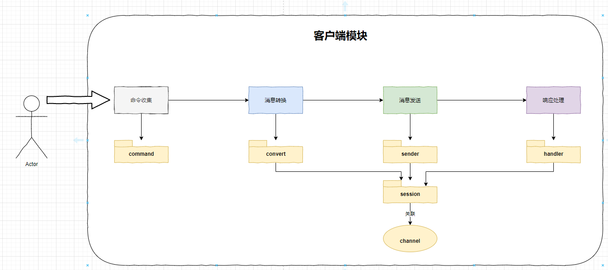
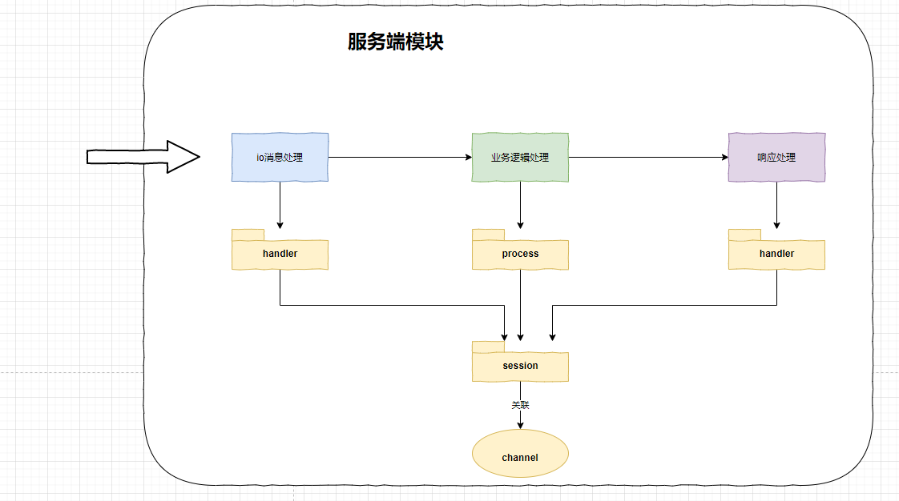

## 1. 项目分析:

### 1. 项目功能:

简单的单体im项目, 基本实现以下功能:

1. 用户登录校验
2. 聊天
3. 客户端心跳保活

### 1. 模块职责:

1. 客户端: 

   客户端的主要流程为: 用户输入信息收集(`命令收集`) -> 收集到的信息转换成客户端与服务端的消息实体(`消息转换`) -> 客户端与服务端通信(`消息发送`) -> 对服务端响应数据进行处理(`响应处理`)

   

2. 服务端:

   服务端的主要流程为:

   接受客户端发送来的消息(`i/o消息处理`) -> i/o线程分发消息到业务线程进行业务逻辑处理(`业务逻辑处理`) -> 业务逻辑处理完成后, 响应客户端(`响应处理`)

   

3. common:

   主要是一些公共组件, 公共pojo