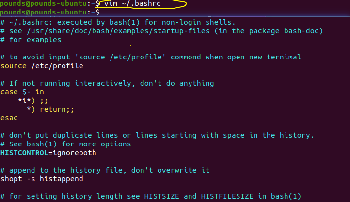

## 1. 缺少libtinfo.so.5

```bash
error while loading shared libraries: libtinfo.so.5: cannot open shared object file: No such file or directory
```

**解决办法:** 直接安装libncurses5

```bash
sudo apt-get install libncurses5
```

 ## 2. xxx commond not found

这个问题一般是出现在我们自己装的软件,使用他们的命令的时候(如 redis,mysql等).

**linux环境变量简介**:

1. `/etc/profile`: 全局的环境变量文件,通常都是在这个文件中配置环境变量. 这个环境变量文件是用户在登录的时候,操作系统定制用户环境的时候,使用的第一个文件,此文件为系统的每个用户设置环境变量,每当用户`第一次登录`的时候该文件被执行.
2. `/etc/environment`: 在用户登录的时候,操作系统定制用户环境使用的第二个文件,系统在读取用户自己的profile(也就是`~/.profile`)前, 设置环境文件的环境变量
3. `~/.profle`: 定制用户环境使用到的第三个文件,每个用户都可以配置自己专属的环境变量,每当用户登录的时候,该文件就会执行一次.默认的情况下,`~/.profile`设置一些环境变量,执行用户的`.bashrc`文件.
4. `/etc/bashrc`: 为每一个运行bash shell 的用户执行此文件. 每当bash shell被打开时,该文件被读取.
5. `~/.bashrc`: 该文件包含专属于当前用户的 bash shell的bash信息.每当登录时以及每次打开新shell的时候,该文件被读取

首先检查是否配置环境变量: (通常指的是`/etc/profile`文件)


`PATH`就是环境变量,如果存在对应的环境变量,仍然出现`xxx commond not found`, 并且通过`source /etc/profile`命令之后又可以正常使用,每次切换用户之后都要执行`source /etc/profile`才能正常使用.

<font color=red>这种情况就需要在 当前用户的配置文件中,添加source /etc/</font>,如图:



 ## 3. docker 容器能启动但是外部无法访问:
通常是采取修改网络设置中 `ipv4转发配置`.
解决办法:
1. `vi /etc/sysctl.conf` 或者 `vi /usr/lib/sysctl.d/00-system.conf`, 将`net.ipv4.ip_forward=1`的注释放开(没有就添加上这一行)
2. `service NetworkManager restart`重启网络管理
3. 可能出现的问题是, 在重启之后有线网络未被管理的情况,需要`sudo vim /usr/lib/NetworkManager/conf.d/10-globally-managed-devices.conf` 然后在行末条件`,except:type:ethernet`.
> 注意: 在第三步中添加内容是有个逗号的

