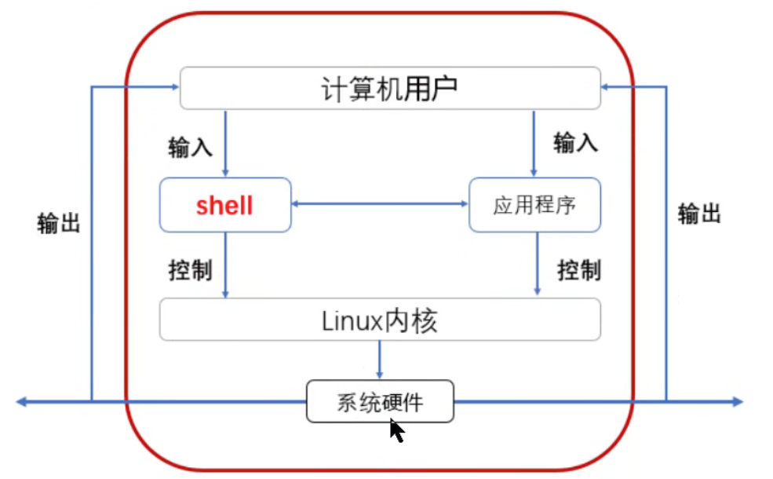

## 1. shell介绍:

`shell` 是解释型编程语言,shell 写的程序在运行的时候 由`解释器`翻译成机器语言,每执行一次都需要解释翻译一次.因此效率比较低.但是解释型语言跨平台性高.

`shell` 是 人机交互的桥梁, 介于内核与用户之间, 负责命令的解释



**Shell的种类**

```bash
[root@MissHou ~]# cat /etc/shells 
/bin/sh				#是bash的一个快捷方式
/bin/bash			#bash是大多数Linux默认的shell，包含的功能几乎可以涵盖shell所有的功能
---------------------- 上面这俩是一个东西
/sbin/nologin		#表示非交互，不能登录操作系统
/bin/dash			#小巧，高效，功能相比少一些

/bin/csh				#具有C语言风格的一种shell，具有许多特性，但也有一些缺陷
/bin/tcsh			#是csh的增强版，完全兼容csh
```

**shell和终端的关系:**

在打开终端的时候,默认会打开一个shell,终端中所有的命令都是通过默认打开的shell去解释执行的.

## 2. shell脚本:

### 1. 什么是shell脚本:

`shell脚本`: 实际上就是一个存储了一段代码的文本,然后通过解释器按照顺序解释执行这个文本.

### 2. 脚本的使用场景:

重复,复杂化的工作,通过把工作的命令写成脚本,以后都只需要执行脚本就能完成这些工作.

### 3. shell脚本能干啥: 

 ①自动化软件部署	LAMP/LNMP/Tomcat...	

 ②自动化管理		系统初始化脚本、批量更改主机密码、推送公钥...

 ③自动化分析处理	 统计网站访问量

 ④自动化备份		数据库备份、日志转储...

 ⑤自动化监控脚本

## 3. 脚本的执行方式:

- 标准脚本执行方法:

  ```bash
  # 1. 编写脚本:
  pounds@pounds-ubuntu:~/dev/shell$ cat first_shell.sh 
  #!/bin/env bash
  #comment
  echo "hello world"
  echo "hell shell"
  
  # 2. 给.sh文本赋予可执行权限
  pounds@pounds-ubuntu:~/dev/shell$ chmod +x first_shell.sh
  
  # 3. 执行,下面是在shell脚本所在文件夹执行的
  pounds@pounds-ubuntu:~/dev/shell$ ./first_shell.sh
  ```

- 非标准执行:

  1. 命令行指定解释器执行:

     ```bash
     [root@MissHou shell01]# bash first_shell.sh
     [root@MissHou shell01]# sh first_shell.sh
     [root@MissHou shell01]# bash -x first_shell.sh
     + echo 'hello world'
     hello world
     + echo 'hello world'
     hello world
     + echo 'hello world'
     hello world
     ----------------
     -x:一般用于排错，查看脚本的执行过程
     -n:用来查看脚本的语法是否有问题
     ------------
     ```

  2. 使用`source`命令读取脚本文件,执行代码:

     ```bash
     [root@MissHou shell01]# source first_shell.sh
     hello world
     hello world
     hello world
     ```

## 4. 基本格式:

**第一部分:** 魔法字符 `#!` 指定脚本使用的解释器 <font color=red>`必须写`</font>,比如:  

```shell
#! /bin/bash
```

表示这行代码以下内容使用bash解释器解析

> 如果直接将解释器的路径写死在脚本里面, 可能在某些系统就会存在找不到解释器的问题,因此可以使用: `#! /bin/env`解释器

**第二部分:** 注释部分,shell脚本里面, `#` 表示注释内容

**第三部分:** 脚本要实现功能的代码

**练习:**

1. 删除/tmp/目录下的所有文件

2. 然后在/tmp目录里创建3个目录，分别是dir1~dir3     

3. 拷贝/etc/hosts文件到刚创建的dir1目录里       

4. 最后打印"==报告首长，任务已于2019-05-05 10:10:10时间完成=="内容   

   `echo "报告首长，任务已于$(date +'%F %T')"`

```shell
#!/bin/env bash
rm -rf /tmp/*
mkdir /tmp/dir{1..3}
cp /etc/hosts /tmp/dir1
echo "报告长官, 任务已于$(date + '%F %T')完成"
```

## 5. shell语法:

### 1. 变量:

#### 1. 变量注意事项:

- 变量名区分大小写
- 变量名不能包含特殊符号
- 变量名不能以数字开头
- 等号两边不能有任何的空格

#### 2. 变量定义方式:

shell脚本是解释型语言,可以不给变量设置类型.但是也可以指定类型

<font color=red>命令行定义的变量,是针对于当前terminal的临时变量,一旦退出就无效</font>

- `基本方式`: 使用`等号`把某个类型的值赋值给变量

  ```powershell
  [root@MissHou ~]# A=1234567
  [root@MissHou ~]# echo $A
  1234567
  [root@MissHou ~]# echo ${A:2:4}		表示从A变量中第3个字符开始截取，截取4个字符
  3456
  
  说明：
  $变量名 和 ${变量名}的异同
  相同点：都可以调用变量
  不同点：${变量名}可以只截取变量的一部分，而$变量名不可以
  ```

- `命令执行结果赋值给变量`:

  ```powershell
  [root@MissHou ~]# B=`date +%F`
  [root@MissHou ~]# echo $B
  2019-04-16
  [root@MissHou ~]# C=$(uname -r)
  [root@MissHou ~]# echo $C
  2.6.32-696.el6.x86_64
  ```

- `交互式定义变量(read)`:

  目的: 让用户自己输入变量值,比较灵活,等同于java的Scanner.

  语法: `read [选项] 变量名`

  **常用选项:**

  | 选项 | 意义                                           |
  | ---- | ---------------------------------------------- |
  | -p   | 设置提示信息                                   |
  | -n   | 定义输入字符数量(限制变量的长度)               |
  | -s   | 不显示用户输入结果                             |
  | -t   | 定义超时时间,默认单位为秒,(等待用户输入的时间) |

  **举例:**

  ```powershell
  用法1：用户自己定义变量值
  [root@MissHou ~]# read name
  harry
  [root@MissHou ~]# echo $name
  harry
  [root@MissHou ~]# read -p "Input your name:" name
  Input your name:tom
  [root@MissHou ~]# echo $name
  tom
  ```

- `有类型变量定义(declare)`:

  目的: 给变量设置类型,对变量值进行一定的限制.

  语法: `declare [选项] 变量名=变量值`

  **常用选项:**

  | 选项 | 释义                                       | 举例                                         |
  | ---- | ------------------------------------------ | -------------------------------------------- |
  | -i   | 将变量看成整数                             | declare -i A=123                             |
  | -r   | 定义只读变量                               | declare -r B=hello                           |
  | -a   | 定义普通数组；查看普通数组                 |                                              |
  | -A   | 定义关联数组；查看关联数组                 |                                              |
  | -x   | 将变量通过环境导出(直接将变量变成环境变量) | declare -x AAA=123456 等于 export AAA=123456 |

#### 3. 变量的分类:

- `本地变量`: 当前用户自定义的变量,当前进程中有效, 其他进程以及当前进程的子进程无效

- `环境变量`: 当前进程有效,并且能够被子进程调用

  - `env`查看当前用户的环境变量
  - `set`查询当前用户的所有变量(环境变量和临时变量)
  - `export 变量名=变量值` 或者 `变量名=变量值;export 变量名` 设置环境变量

  ```powershell
  [root@MissHou ~]# export A=hello		临时将一个本地变量（临时变量）变成环境变量
  [root@MissHou ~]# env|grep ^A
  A=hello
  
  永久生效：
  vim /etc/profile 或者 ~/.bashrc
  export A=hello
  或者
  A=hello
  export A
  
  说明：系统中有一个变量PATH，环境变量
  export PATH=/usr/local/mysql/bin:$PATH
  ```

- `全局变量`: 

  - `全局变量`: 所有用户和程序都能调用,且继承,新建用户默认也能调用

  - `相关配置文件`:

    | 文件名               | 说明                                 | 备注                                                       |
    | -------------------- | ------------------------------------ | ---------------------------------------------------------- |
    | $HOME/.bashrc        | 当前用户的bash信息,用户`登录`时读取  | 定义别名、umask、函数等                                    |
    | $HOME/.bash_profile  | 当前用户的环境变量，用户`登录`时读取 |                                                            |
    | $HOME/.bash_logout   | 当前用户`退出`当前shell时最后读取    | 定义用户退出时执行的程序等                                 |
    | /etc/bashrc          | 全局的bash信息，所有用户都生效       |                                                            |
    | /etc/profile         | 全局环境变量信息                     | 系统和所有用户都生效                                       |
    | \$HOME/.bash_history | 用户的历史命令                       | history -w   保存历史记录         history -c  清空历史记录 |

    **说明：**以上文件修改后，都需要重新`source`让其生效或者退出重新登录。

    - **用户登录**系统**读取**相关`文件的顺序`
      1. `/etc/profile`
      2. `$HOME/.bash_profile`
      3. `$HOME/.bashrc`
      4. `/etc/bashrc`
      5. `$HOME/.bash_logout`

- `系统变量`:

  - 系统变量: shell本身已经定义好了的变量

    | 内置变量     | 含义                                                         |
    | ------------ | ------------------------------------------------------------ |
    | $?           | 获取上一条命令的执行状态: 非0就表示执行异常                  |
    | $#           | 获取脚本后面跟的参数个数                                     |
    | $*           | 获取脚本后面跟的所有参数,参数当成一个整体输出,每个变量参数之间都是以空格分隔 |
    | $@           | 获取脚本后面跟的所有参数,参数独立输出                        |
    | $1~$9        | 根据参数在参数列表中的位置获取参数, $1表示第一个位置参数     |
    | ${10} - ${n} | 位置编号两位数以上,必须使用`{}`括起来                        |
    |              |                                                              |
    |              |                                                              |
    |              |                                                              |
    |              |                                                              |

    
