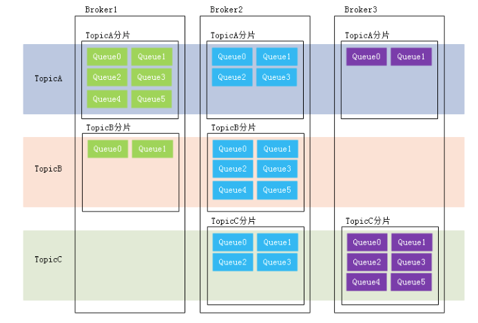

## 1. MQ概述:

## 2. RocketMQ概述:

## 3. 基本概念:

### 1. 名词解释:

- `主题(Topic)`: 表示一类消息的集合(如同聊天的时候话题的概念), 每个主题包含若干条消息, `每条消息只能属于一个主题`, 是RocketMQ进行消息订阅的基本单位. 

  一个生产者可以同时发送多种Topic的消息,但是一个消费者只能对某一个Topic感兴趣,即 `消费者只能订阅和消费一种Topic的消息`

- `消息(Message)` : 消息系统所传输信息的物理载体, 生产和消费数据的最小单位, 每条消息必须属于一个主题. 

- `标签(tag)`: 为消息设置的标志，用于同一主题下区分不同类型的消息。来自同一业务单元的消息，可以根据不同业务目的在同一主题下设置不同标签。标签能够有效地保持代码的清晰度和连贯性，`并优化RocketMQ提供的查询系统`。消费者可以根据Tag实现对不同子主题的不同消费逻辑，实现更好的扩展性。

  Topic是消息的一级分类，Tag是消息的二级分类。比如: 

  ```java
  Topic:货物
  tag=上海
  tag=江苏
  tag=浙江
  ------- 消费者 ----- 
  topic=货物 tag = 上海 
  topic=货物 tag = 上海|浙江 
  topic=货物 tag = *
  ```

- `消息队列(Message Queue)` : 用于存储消息的物理地址, 每个Topic中的消息地址存储于多个 消息队列中. 一个Topic的Queue也被称为 一个Topic 中的`消息分区`.

  > 同一个时刻, 一个Topic的Queue中的消息只能被一个消费者组中的一个消费者消费。一个Queue中的消息不允许同一个消费者组中的多个消费者同时消费

  **读写队列**: 从本质上来讲, 读写队列是同一个队列, 所以不存在读写队列数据同步的问题, 读写队列是从逻辑上进行区分的概念. 通常, 读写队列的数量都会设置成一样的.

  - 读队列: 消费者消费的队列.

  - 写队列: 生产者写入消息的队列.

  - 举例:

    ```java
    /**
    读写队列在创建的时候实际上是按照数量多的来创建队列的.
    */
    /*
    举例1: 
    写队列8 读队列4 此时broker中就会创建8个队列(分别为: 0 1 2 3 4 5 6 7).
    Producer会向这八个队列写入消息. 
    Consumer只会从0 1 2 3这四个队列中消费消息. 
    4 5 6 7 这四个队列的消息不会被消费.
    */
    /*
    举例2: 
    写队列4 读队列8 此时系统同样会创建8个队列 (分别为 0 1 2 3 4 5 6 7).
    Producer回向 0 1 2 3 这四个队列中写入消息.
    Consumer会消费8个队列中的消息,但是由于4 5 6 7这四个队列中没有消息, 假设ComsumerGroup中有两个Consumer, Consumer1消费0-3,Comsumer2消费4-7.就会出现Consumer2没有消息可消费的问题.
    */
    ```

    > 从上面举例可以看出,当读写队列数量不同的时候,总是有问题的,这样设计的目的是什么呢? 
    >
    > 是为了平滑缩容, 比如: 原本队列16个, 为了将队列缩小成8个但是又不丢失消息, 就可以将写队列改为8个,读队列数量不变. 此时只有前八个队列仍然有数据写入,后八个队列消息消费完的时候,就可以动态的将读队列也设置成8个.

- `分片(sharding)`: 分片不同于分区。在RocketMQ 中，分片指的是存放相应Topic的Broker。每个分片中会创建出相应数量的分区，即Queue，每个 Queue的大小都是相同的。

  

- `消息标识(MessageID/Key)`: RocketMQ中每个消息拥有`唯一`的Message ID, 并且可以携带具有业务标识的key. RocketMQ提供了通过`Message ID`和 `Key`查询消息的功能.

  不过需要注意的是，MessageId有两个:在生产者send()消息时会自动生成一个MessageId(msgId)， 当消息到达Broker后，Broker也会自动生成一个MessageId(offsetMsgId)。msgId、offsetMsgId与key都 称为消息标识。

  - msgId:由producer端生成，其生成规则为: producerIp + 进程pid + MessageClientIDSetter类的ClassLoader的hashCode +当前时间 + AutomicInteger自增计数器 
  - offsetMsgId:由broker端生成，其生成规则为:brokerIp + 物理分区的offset(Queue中的

  物理磁盘偏移量)

  - key:由用户指定的业务相关的唯一标识

### 2. 技术架构:


RocketMQ架构上主要分为四部分:

- `生产者(Producer)/生产者组(ProducerGroup)`: 

  > 消息生产者, 负责生产消息, 一般由业务系统负责生产消息.支持分布式集群方式部署

  **Producer**由用户业务逻辑部署, 属于是RocketMQ的客户端.

  一个生产者会把业务应用系统里面产生的消息发送到`Broker`服务器.

  Producer通过MQ的负载均衡模块选择相应的Broker集群队列进行消息投递，投递的过程支持`快速失败`并且`低延迟`。

  RocketMQ提供多种发送方式, 同步发送、异步发送、顺序发送、单向发送。

  - **同步发送**: 同步发送指生产者在发送消息后, 在接收到了接收方的确认消息之后才会向接收方发送下一条消息. 一般用于重要通知消息, 例如重要通知邮件, 营销短信.
  - **异步发送**: 异步发送指生产者在发送消息后, 不必等接收方的确认消息, 就可以继续发送下一条消息. 一般用于可能链路好事较长而对响应时间敏感的业务场景, 例如用户视频上传后通知启动转码服务.
  - **单向发送**: 单向发送指只负责发送消息而不等待服务器回应且没有回调函数触发. 一般用于一些耗时短但对可靠性要求不高的场景, 比如日志收集.

  **生产者组**: 同一类Producer的集合，这类Producer发送同一类消息且发送逻辑一致。如果发送的是事务消息且原始生产者在发送之后崩溃，则Broker服务器会联系同一生产者组的其他生产者实例以提交或回溯消费。

  RocketMQ中的消息生产者都是以生产者组(Producer Group)的形式出现的。生产者组是同一类生产 者的集合，这类Producer发送相同Topic类型的消息。一个生产者组可以同时发送多个主题的消息。

- `Broker` 

  > 消息中转角色, Broker主要负责消息的存储、投递和查询以及服务高可用保证.同时也存储着消息相关的元数据，包括 消费者组消费进度偏移offset、主题、队列等。

  在实际部署过程对应一台服务器, 每个Broker可以存储多个Topic的消息, 每个Topic的消息可以分片存储于不同的 Broker上.

  **Broker**是具体提供业务的服务器，单个Broker节点与所有的NameServer节点保持长连接及心跳，并会定时将**Topic**信息注册到NameServer，顺带一提底层的通信和连接都是**基于Netty实现**的。

  **Broker**负责消息存储，以Topic为纬度支持轻量级的队列，单机可以支撑上万队列规模，支持消息推拉模型。

  官网上有数据显示：具有**上亿级消息堆积能力**，同时可**严格保证消息的有序性**

  

  解释: 

  1. Remoting Module：整个Broker的实体，负责处理来自clients端的请求。
  2. Client Manager：负责管理客户端(Producer/Consumer)和维护Consumer的Topic订阅信息
  3. Store Service：提供方便简单的API接口处理消息存储到物理硬盘和查询功能。
  4. HA Service：高可用服务，提供Master Broker 和 Slave Broker之间的数据同步功能。
  5. Index Service：根据特定的Message key对投递到Broker的消息进行索引服务，以提供消息的快速查询

- `消费者(Consumer)/消费者组(ConsumerGroup)`

  > 负责消费消息，一般是后台系统负责异步消费

  **Consumer**由用户业务逻辑部署, 属于是RocketMQ的客户端.

  一个消息消费者会从Broker服务器拉取消息、并将其提供给应用程序, 支持**集群消费**和**广播消息**，提供**实时的消息订阅机制**.

  - **集群消费**: 集群消费模式下,相同Consumer Group的每个Consumer实例平均分摊消息。
  - **广播消费**: 广播消费模式下，相同Consumer Group的每个Consumer实例都接收全量的消息。

  从用户应用的角度而言提供了两种消费形式：拉取式消费、推动式消费。

  - **拉取式**: 由消费者主动从broker中拉取消息, 应用通常主动调用Consumer的拉消息方法从Broker服务器拉消息、主动权由应用控制。一旦获取了批量消息，应用就会启动消费过程。
  - **推动式**: 该模式下Broker收到数据后会主动推送给消费端，该消费模式一般实时性较高。**推动式消费**封装了消息的拉取、消费进度和其他的内部维护工作，将消息到达时执行的回调接口留给用户应用程序来实现。所以 Push 称为被动消费类型，但从实现上看还是从消息服务器中拉取消息，不同于 Pull 的是 Push 首先要注册消费监听器，当监听器处触发后才开始消费消息。

  **消费者组**: 同一类Consumer的集合，这类Consumer通常消费同一类消息且消费逻辑一致.要注意的是，消费者组的消费者实例必须订阅完全相同的Topic。

  RocketMQ中的消息消费者都是以消费者组(Consumer Group)的形式出现的。消费者组是同一类消 费者的集合，这类Consumer消费的是同一个Topic类型的消息。消费者组使得在消息消费方面，实现`负载均衡 `(将一个Topic中的不同的Queue平均分配给同一个Consumer Group的不同的Consumer，注意，并不是将消息负载均衡)和 容错 (一个Consmer挂了，该Consumer Group中的其它Consumer可以接着消费原Consumer消费的Queue)的目标变得非常容易。

  消费者组中Consumer的数量应该小于等于订阅Topic的Queue数量。如果超出Queue数量，则多出的 Consumer将不能消费消息。

  

- `名称服务(Name Server)`:

  **名称服务**, 是一个功能齐全的服务器,主要功能类似于zookeeper充当broker的注册中心, 支持Broker的动态注册与发现. **生产者**和**消费者**在连接broker的时候会主动去获取相关Topic的信息, 从而获取到broker的路由信息. 

  主要功能: 

  - `Broker管理`: NameServer接受Broker集群的注册信息并且保存下来作为路由信息的基本数据。然后提供心跳检测机制，检查Broker是否还存活
  - `路由信息管理`: 每个NameServer中都保存着Broker集群的整个路由信息和用于客户端查询的队列 信息。Producer和Conumser通过NameServer可以获取整个Broker集群的路由信息，从而进行消息的投递和消费。

  **路由注册**:

  NameServer通常也是以集群的方式部署，不过，NameServer是无状态的，即NameServer集群中的各 个节点间是无差异的，各节点间相互不进行信息通讯。那各节点中的数据是如何进行数据同步的呢?在 Broker节点启动时，轮询NameServer列表，与每个NameServer节点建立长连接，发起注册请求。在 NameServer内部维护着一个Broker列表，用来动态存储Broker的信息。

  > broker必须要指定所有的NameServer地址, 如果没有指出broker则不会向该NameServer注册.所以NameServer不能随意扩容, 因为不对broker重新进行配置的话,新的NameServer对Broker就是不可见的

  **心跳机制:**

  Broker节点为了证明自己是活着的，为了维护与NameServer间的长连接，会将最新的信息以 心跳包 的方式上报给NameServer，每30秒发送一次心跳。心跳包中包含 BrokerId、Broker地址(IP+Port)、 Broker名称、Broker所属集群名称等等。NameServer在接收到心跳包后，会更新心跳时间戳，记录这 个Broker的最新存活时间。

  > 由于broker通过心跳包更新自己的Topic信息,所以如果topic过多,就可能造成心跳包过大, 导致心跳检测失败.

  **路由剔除**:

  由于Broker关机、宕机或网络抖动等原因，NameServer没有收到Broker的心跳, NameServer可能会将其从Broker列表中剔除。

  NameServer中有一个定时任务，每隔10秒就会扫描一次Broker表，查看每一个Broker的最新心跳时间 戳距离当前时间是否超过120秒，如果超过，则会判定Broker失效，然后将其从Broker列表中剔除

  **路由发现:**

  RocketMQ的路由发现采用的是Pull模型。当Topic路由信息出现变化时，NameServer不会主动推送给客户端，而是客户端定时拉取主题最新的路由。默认客户端每30秒会拉取一次最新的路由。

  **客户端NameServer选择策略**:

  客户端在配置时必须要写上NameServer集群的地址，那么客户端到底连接的是哪个NameServer节点 呢?客户端首先会生产一个随机数，然后再与NameServer节点数量取模，此时得到的就是所要连接的 `节点索引`，然后就会进行连接。如果连接失败，则会采用round-robin策略，逐个尝试着去连接其它节 点。
  首先采用的是 `随机策略` 进行的选择，失败后采用的是 `轮询策略 `。

### 3. 集群部署:


部署特点:

- `NameServer`: 是一个几乎无状态的节点, 可以集群部署, 节点之间没有任何信息同步.

- `Broker` : 通常是以主从集群的形式部署, 即集群中具有Master和Slave两种角色, Master可以对应多个slave, slave只能对应一个master, master与slave之间的对应关系通过指定相同的BrokerName, 不同的BrokerId来定义(BrokerId为0 表示master, 非0表示slave). 

  Master也可以部署多个。每个Broker与NameServer集群中的所有节点建立长连接，定时注册Topic信息到所有NameServer。 注意：当前RocketMQ版本在部署架构上支持一Master多Slave，但只有BrokerId=1的从服务器才会参与消息的读负载。

  Master负责读写操作, Slave负责对master中的数据进行备份.

- `Producer`: 与NameServer集群中的其中一个节点（随机选择）建立长连接，定期从NameServer获取Topic路由信息，并向提供Topic 服务的Master建立长连接，且定时向Master发送心跳。Producer完全无状态，可集群部署

- `Consumer`: 与NameServer集群中的其中一个节点（随机选择）建立长连接，定期从NameServer获取Topic路由信息，并向提供Topic服务的Master、Slave建立长连接，且定时向Master、Slave发送心跳。Consumer既可以从Master订阅消息，也可以从Slave订阅消息，消费者在向Master拉取消息时，Master服务器会根据拉取偏移量与最大偏移量的距离（判断是否读老消息，产生读I/O），以及从服务器是否可读等因素建议下一次是从Master还是Slave拉取。

### 4. 工作流程:

1. 启动NameServer, NameServer启动后开始监听端口, 等待Broker, Producer, Consumer连接
2. 启动Broker时, Broker会与所有的NameServer建立并保持长连接, 然后30秒向NameServer定时发送心跳包
3. 发送消息前, 可以先创建Topic, 创建Topic时需要指定该Topic要存储于哪些Broker上, 创建Topic的同时也会将Topic与Broker 之间的关系写入到NameServer中. 也可以在发送消息的时候自动创建Topic.(ps: 自动创建topic似乎有问题)
   1. 手动创建topic,有两种模式:
      - 集群模式:  所有broker中的Queue数量是相同的, 即`所有broker一次性定义相同数量的Queue`
      - Broker模式: 每个Broker中的Queue数量可以不同, 即`broker逐一定义具体的Queue数量`
   2. 自动创建Topic的时候, 默认是Broker模式, 会为每个Broker默认创建4个Queue.
4. Producer发送消息, 启动时先跟NameServer集群中的其中一台建立长连接, 并从NameServer中获取路由信息, 即当前发送的topic消息的queue与broker的地址(IP+PROT)映射关系. 然后根据算法策略从队列中选择一个Queue, 与队列所在的broker建立长连接从而向broker发送消息.当然, 在获取到路由信息后, Producer会首先将路由信息缓存到本地, 在每30秒从Nameserver更新一次路由信息.
5. Consumer和Producer类似, 跟Namerserver集群其中一台服务器建立长连接, 获取所订阅的topic的路由信息, 然后根据算法策略从路由信息中获取到其所要消费的Queue, 然后直接跟Broker建立长连接, 开始消费消息. Consumer在获取到路由信息后, 同样也会每30秒更新一下路由信息. `与producer不同的是, consumer会定期向broker发送心跳包,表示其还处于存活状态`.

