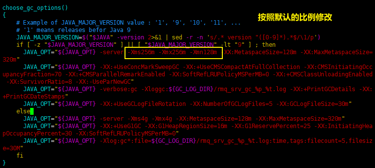
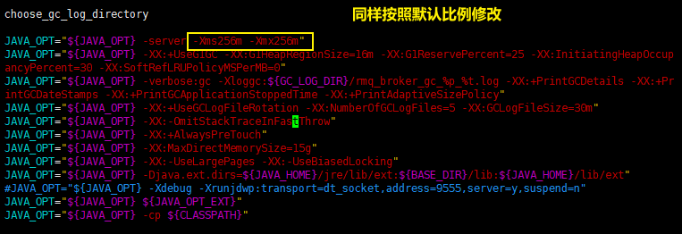
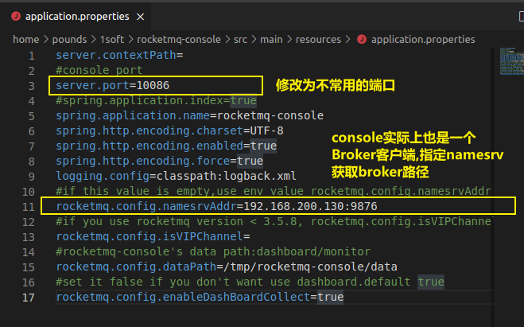
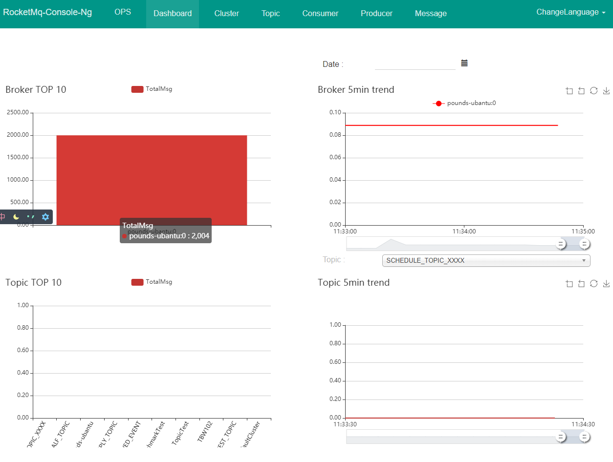

## 1.  准备工作:

### 1. 系统要求:

只列出了linux系统下的要求:

- 64bit OS, Linux/Unix/Mac is recommended;(Windows user see guide below)
- 64bit JDK 1.8+;
- Maven 3.2.x;
- Git;
- 4g+ free disk for Broker server

## 2. 下载RocketMQ安装包:

官网下载

## 3. 修改初始内存:

由于是学习RocketMQ默认的初试内存太大,需要修改小一点.

**修改runserver.sh**:
使用vim命令打开bin/runserver.sh文件。现将这些值修改为如下：



修改runbroker.sh
使用vim命令打开bin/runbroker.sh文件。现将这些值修改为如下：



## 4.启动

### 1. 启动Name Server:

```bash
nohup sh bin/mqnamesrv &
# 查看namesrv日志
tail -f ~/logs/rocketmqlogs/namesrv.log
```

### 2. 启动Broker:

```bash
  nohup sh bin/mqbroker -n localhost:9876 &
  tail -f ~/logs/rocketmqlogs/broker.log 
```

## 5. 测试:

在发送消息之前, 要先向producer指定nameserver的地址, 让producer获取broker的相关信息.

RocketMQ有多种方式来给producer设置nameserver的地址, 这里使用最简单的方式, 设置环境变量`namesrv_addr`

```bash
 # 设置nameserver的地址
 > export NAMESRV_ADDR=localhost:9876
 # org.apache.rocketmq.example.quickstart.Producer是官方提供的用例
 > sh bin/tools.sh org.apache.rocketmq.example.quickstart.Producer
 SendResult [sendStatus=SEND_OK, msgId= ...

 # org.apache.rocketmq.example.quickstart.Consumer是官方提供的用例 
 > sh bin/tools.sh org.apache.rocketmq.example.quickstart.Consumer
 ConsumeMessageThread_%d Receive New Messages: [MessageExt...
```

## 6. 关闭:

```bash
> sh bin/mqshutdown broker
The mqbroker(36695) is running...
Send shutdown request to mqbroker(36695) OK

> sh bin/mqshutdown namesrv
The mqnamesrv(36664) is running...
Send shutdown request to mqnamesrv(36664) OK
```

## 7. 官方自带的控制台:

[代码下载地址](https://github.com/apache/rocketmq-externals/releases/tag/rocketmq-console-1.0.0)

配置修改:



给pom添加依赖:

```xml
        <!--jaxb依赖, 可以根据xml schema生成java类的技术-->
        <dependency>
            <groupId>javax.xml.bind</groupId>
            <artifactId>jaxb-api</artifactId>
            <version>2.3.0</version>
        </dependency>
        <dependency>
            <groupId>com.sun.xml.bind</groupId>
            <artifactId>jaxb-impl</artifactId>
            <version>2.3.0</version>
        </dependency>
        <dependency>
            <groupId>com.sun.xml.bind</groupId>
            <artifactId>jaxb-core</artifactId>
            <version>2.3.0</version>
        </dependency>
        <dependency>
            <groupId>javax.activation</groupId>
            <artifactId>activation</artifactId>
            <version>1.1.1</version>
        </dependency>
```

打包,部署: 注意要跳过test,避免爆一些错误

```bash
# 打包
mvn clean package -Dmaven.test.skip=true
# 打完包后再target文件夹下面找到jar包, 下面命令的&不要丢了
nohup java -jar rocketmq-console-ng-1.0.0.jar &
```

访问配置好的路径:




