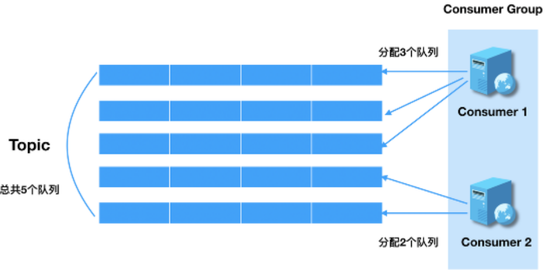

RocketMQ集群通常核心是broker集群.

## 1. 消息存储:

### 1. 消息在磁盘中存储结构:


通常在`${user}/store`下面会存方与消息存储相关的3个文件:


说明:

- abort：该文件在Broker启动后会自动创建，正常关闭Broker，该文件会自动消失。若在没有启动Broker的情况下，发现这个文件是存在的，则说明之前Broker的关闭是非正常关闭。
- checkpoint：其中存储着commitlog、consumequeue、index文件的最后刷盘时间戳
- commitlog：其中存放着commitlog文件，而消息是写在commitlog文件中的
- config：存放着Broker运行期间的一些配置数据
- consumequeue：其中存放着consumequeue文件，队列就存放在这个目录中
- index：其中存放着消息索引文件indexFile
- lock：运行期间使用到的全局资源锁

#### 1. commitlog:

 `CommitLog`：消息主体以及元数据的存储主体，存储Producer端写入的消息主体内容,消息内容不是定长的。单个文件大小`小于等于`1G, `文件名长度为20位，左边补零，剩余为起始偏移量`，比如00000000000000000000代表了第一个文件，起始偏移量为0，文件大小为1G=1073741824；当第一个文件写满了，第二个文件为00000000001073741824，起始偏移量为1073741824，以此类推。`消息主要是顺序写入日志文件`，当文件满了，写入下一个文件；

> 1. 在源码中commitLog文件被称为: mappedFile
> 2. 当消息的大小比mappedFile剩余容量大的时候,就会重新创建一个mappedFile文件,将该消息写入新mappedFile文件中.
> 3. 在一个broker中仅有一个commitLog目录,所有的mappedFile文件都是存放在该目录下面,所有Topic的消息,不会分topic存放,而是顺序写入当前在使用的mappedFile中.
> 4. 第n个mappedFile文件的名字实际上就是 前面n-1个mappedFile文件的大小之和.所以一个broker中的mappedFile文件的commitLog offset是连续的

**消息单元:**


mappedFile文件内容由一个个的消息单元构成。每个消息单元中包含消息总长度MsgLen、消息的物理位置physicalOffset、消息体内容Body、消息体长度BodyLength、消息主题Topic、Topic长度TopicLength、消息生产者BornHost、消息发送时间戳BornTimestamp、消息所在的队列QueueId、消息在Queue中存储的偏移量QueueOffset等近20余项消息相关属性。

#### 2. consumerQueue:

`ConsumeQueue`：消息消费队列，引入的目的主要是提高消息消费的性能，由于RocketMQ是基于主题topic的订阅模式，消息消费是针对主题进行的，如果要遍历commitlog文件中根据topic检索消息是非常低效的。Consumer即可根据ConsumeQueue来查找待消费的消息。其中，`ConsumeQueue（逻辑消费队列）作为消费消息的索引，保存了指定Topic下的队列消息在CommitLog中的起始物理偏移量offset，消息大小size和消息Tag的HashCode值。`

consumequeue文件可以看成是基于topic的commitlog索引文件，故consumequeue文件夹的组织方式如下：topic/queue/file三层组织结构，具体存储路径为：`$HOME/store/consumequeue/{topic}/{queueId}/{fileName}。`


consumequeue文件采取定长设计，每一个条目共20个字节, 表示当前文件的第一个索引条目的起始位移偏移量。与mappedFile文件名不同的是，其后续文件名是固定的。

ConsumeQueue中索引条目包含三部分, 分别为`8字节的commitlog物理偏移量`、`4字节的消息长度`、`8字节tag hashcode`，单个文件由30W个条目组成，可以像数组一样随机访问每一个条目，每个ConsumeQueue文件大小约5.72M；

**索引条目结构**：


#### 3. indexFile:

`IndexFile`：`IndexFile（索引文件）提供了一种可以通过key或时间区间来查询消息的方法`。Index文件的存储位置是：`$HOME \store\index${fileName}`，文件名fileName是以创建时的时间戳命名的，固定的单个IndexFile文件大小约为400M，一个IndexFile可以保存 2000W个索引，`IndexFile的底层存储设计为在文件系统中实现HashMap结构`，故rocketmq的索引文件其底层实现为hash索引。

> indexFile中的索引数据是为包含了key属性的消息创建的, 如果消息没有key属性, 那么就不会创建对应索引数据.

**IndexFile结构:**

每个Broker中会包含一组indexFile, 每个indexFile都是以`该indexFile创建时的时间戳`命名的.

每个indexFile文件由三部分组成: `indexHeader` , `slots槽位`, `index索引数据`. 每个indexfile文件中包含500w个slot槽位, 每个slot槽位又可能会挂载很多的index索引单元.


`indexHeader`: 定长40字节


- beginTimestamp：该indexFile中第一条消息的存储时间
- endTimestamp：该indexFile中最后一条消息存储时间
- beginPhyoffset：该indexFile中第一条消息在commitlog中的偏移量commitlog offset 
- endPhyoffset：该indexFile中最后一条消息在commitlog中的偏移量commitlog offset 
- hashSlotCount：已经填充有index的slot数量（并不是每个slot槽下都挂载有index索引单元，这里统计的是所有挂载了index索引单元的slot槽的数量）
- indexCount：该indexFile中包含的索引单元个数（统计出当前indexFile中所有slot槽下挂载的所有index索引单元的数量之和）

`index索引单元`: 定长20字节, 包含四个属性.


- keyHash：消息中指定的业务key的hash值 
- phyOffset：当前key对应的消息在commitlog中的偏移量commitlog offset 
- timeDiff：当前key对应消息的存储时间与当前indexFile创建时间的时间差
- preIndexNo：当前slot下当前index索引单元的前一个index索引单元的indexNo

`slots与indexes:` slot槽位500w个, 单个槽位占4字节


根据`hash(key) % 500w`得到 slot槽下标, 然后将slot槽的值修改为key对应的index索引单元的indexNo.

> indexNo是index索引单元在indexFile中的流水号, 从零开始依次递增.

如果发生slot槽位冲突, index索引单元还定义了`指向前一条index索引单元的指针 (preIndexNo)`, 从而形成一条单向链表.

在插入单向链表的时候是采用的头插法, 所以slot槽位永远记录的是最新的index索引单元.

**IndexFile的创建:**

创建时机:

- 第一条带有key的消息发送到broker, 系统发现没有indexFile, 此时会创建第一个indexFile.

- 当带key的消息发送到来后，系统会找到最新的indexFile，并从其indexHeader的最后4字节中读取到indexCount。若indexCount >= 2000w时，会创建新的indexFile

  > 由此可以推算出, indeFile大小 = 40(indexHeader) + 500w * 4 (slot槽位) + 2000w * 20 (index索引单元)

**indexFile查询流程**:


### 2. 页缓存与内存映射:

#### 1. 页缓存(pageCache):

`页缓存（PageCache)`是OS对文件的缓存，用于加速对文件的读写。一般来说，程序对文件进行顺序读写的速度几乎接近于内存的读写速度，主要原因就是由于OS使用PageCache机制对读写访问操作进行了性能优化，将一部分的内存用作PageCache。对于数据的写入，OS会先写入至Cache内，随后通过异步的方式由pdflush内核线程将Cache内的数据刷盘至物理磁盘上。对于数据的读取，如果一次读取文件时出现未命中PageCache的情况，OS从物理磁盘上访问读取文件的同时，会顺序对其他相邻块的数据文件进行预读取.

在RocketMQ中，ConsumeQueue逻辑消费队列存储的数据较少，并且是顺序读取，在page cache机制的预读取作用下，Consume Queue文件的读性能几乎接近读内存，即使在有消息堆积情况下也不会影响性能。而对于CommitLog消息存储的日志数据文件来说，读取消息内容时候会产生较多的随机访问读取，严重影响性能。如果选择合适的系统IO调度算法，比如设置调度算法为“Deadline”（此时块存储采用SSD的话），随机读的性能也会有所提升。

#### 2. 内存映射:

RocketMQ主要通过`MappedByteBuffer`对文件进行读写操作。其中，利用了NIO中的`FileChannel模型`将磁盘上的物理文件直接映射到用户态的内存地址中（这种`Mmap`的方式减少了传统IO将磁盘文件数据在操作系统内核地址空间的缓冲区和用户应用程序地址空间的缓冲区之间来回进行拷贝的性能开销），将对文件的操作转化为直接对内存地址进行操作，从而极大地提高了文件的读写效率（正因为需要使用内存映射机制，故`RocketMQ的文件存储都使用定长结构来存储`，方便一次将整个文件映射至内存）。

### 3. 数据复制与刷盘策略:


#### 1. 数据复制策略:

指的是broker集群中master和slave之间数据的复制.分为`同步复制`和`异步复制`:

`同步复制`: broker集群接收到producer的消息之后, master会等待slave数据同步成功后,再向producer返回消息接收成功确认ack.

`异步复制`: broker集群接收到producer的消息之后, master不会等待slave数据同步成功就立即向producer返回消息接收成功确认ack.

#### 2. 刷盘策略:

指的是`broker`实例将消息持久化到磁盘的方式,根据消息发送到broker内存后消息持久化到磁盘的方式, 分为`同步刷盘`和`异步刷盘`两种:


- `异步刷盘`: 由于os的pageCache技术, broker实例在消息写入pagecache之后就认为消息已经持久化到磁盘中, 此时就会向producer返回ack响应.但是broker实际上在pageCahce到一定数量,会开启异步线程在后台执行消息落盘操作, 降低了读写延迟, 提高了RocketMQ的性能和吞吐量.

  > 可能存在消息丢失的问题.

- `同步刷盘`: 当消息真正持久化到磁盘之后broker实例认为消息已经存入到磁盘中,此时才会向producer返回ack响应.

### 4. 对文件的读写流程:


#### 1. 消息写入:

- Broker根据queueId，获取到该消息对应索引条目要在consumequeue目录中的写入偏移量，即QueueOffset 
- 将queueId、queueOffset等数据，与消息一起封装为消息单元
- 将消息单元写入到commitlog
- 同时，形成消息索引条目
- 将消息索引条目分发到相应的consumequeue

#### 2. 消息消费:

- Consumer获取到其要消费消息所在Queue的消费偏移量offset，计算出其要消费消息的
  消息offset

  > 消费偏移量offset: 表示的是当前consumer`已经消费`到Queue中第几条队列
  >
  > 消息offset: 表示当前consumer`将要消费`第几条数据
  >
  > 消息offset = 消费偏移量offset + 1

- Consumer向Broker发送拉取请求，其中会包含其要拉取消息的Queue、消息offset及消息Tag。 

- Broker计算在该consumequeue中的queueOffset。 

  > 消费偏移量offset和消息offset均可以看做是队列下标, 但是queue实际上是个文件, 是没有下标这个概念的, 并且queue文件数据是顺序写入, `下标 * 队列元素大小  = 数据物理偏移量` , 因此: queueOffset实际上指的是索引条目在consumequeue文件中的物理偏移量.

- 从该queueOffset处开始向后查找第一个指定Tag的索引条目。

  > 同样因为consumequeue是顺序写入, queueoffset所表示的索引条目,不一定是需要tag,所以需要向后找.
  >
  > 有个疑问,向后找了如何标记这个消息已经被消费了

- 解析该索引条目的前8个字节，即可定位到该消息在commitlog中的commitlog offset

- 从对应commitlog offset中读取消息单元，并发送给Consumer

#### 3. 文件读写效率优化:

**Mmap内存映射**:

首先，RocketMQ对文件的读写操作是通过mmap内存映射进行的，将对文件的操作转化为直接对内存地址进行操作，从而极大地提高了文件的读写效率。

**PageCache**:

其次，consumequeue中的数据是顺序存放的，还引入了PageCache的预读取机制，使得对
consumequeue文件的读取几乎接近于内存读取，即使在有消息堆积情况下也不会影响性能。

**仍然存在的问题**:

RocketMQ中可能会影响性能的是对commitlog文件的读取。因为对commitlog文件来说，读取消息时会产生大量的随机访问，而随机访问会严重影响性能。不过，如果选择合适的系统IO调度算法，比如 `设置调度算法为Deadline（采用SSD固态硬盘的话），随机读的性能也会有所提升`。

## 2. Broker集群模式:

### 1. 单Master:

这种模式风险比较打, 一但Broker重启或者宕机, 会造成整个服务不可用. <font color=#red>不建议在生产环境使用</font>, 可以用于本地测试.

### 2. 多Master模式:

broker集群无Slave,全是Master, 例如两个Master或者三个Master, 优缺点如下:

- 优点: 配置简单, 单个Master宕机或者重启维护对应用无影响, 在磁盘配置为RAID10时, 即使机器宕机不可恢复情况下, 由于RAID10磁盘非常可靠, 消息也不会丢失(异步刷盘丢失少量,同步刷盘一条不丢), 性能最高

- 缺点: 单台机器宕机期间, 这台及其上没有消费的消息在机器恢复前不可被订阅,消息实时性受到影响.

  >以上优点的前提是，这些*Master*都配置了*RAID*磁盘阵列。如果没有配置，一旦出现某*Master*宕机，则会发生大量消息丢失的情况

### 3. 多Master多Slave模式(异步复制):

broker集群存在多个master, 每个Master对应多个slave(在配置了raid磁盘阵列的情况下, master一般配置一个slave即可).master与slave是主备关系, master负责处理消息的读写请求, slave负责消息的备份以及master宕机后的角色切换.

 HA采用异步复制的方式, 主备有短暂的消息延时(毫秒), 优缺点如下:

- 优点: 即使磁盘损坏, 消息丢失的非常少, 且消息的实时性不受影响, 同时Master宕机后, 消费者仍然可以从Slave消费, 而且此过程对客户端透明, 不需要人工干预, 性能同多Master模式几乎一样

- 缺点: 宕机或者磁盘损坏, 会造成少量数据丢失

  > 这个模式最大的特点是:
  >
  > master宕机后slave能够自动(? todo 存有疑问21.9.25)切换为master. 不过由于slave从master的同步具有短暂的延迟(毫秒级别), 所以在master宕机后, 异步复制可能存在少量消息丢失的问题.
  >
  > Slave从Master同步的延迟越短，其可能丢失的消息就越少 对于Master的RAID磁盘阵列，若使用的也是异步复制策略，同样也存在延迟问题，同样也可能会丢失消息。但RAID阵列的秘诀是微秒级的（因为是由硬盘支持的），所以其丢失的数据量会更少。

### 4. 多Maste多Slave模式(同步双写):

每个Master对应一个slave, 有多对Master-Slave, HA采用同步双写, 即只有主备都写成功, 才向应用返回成功.

- 优点: 数据与服务无单点故障, Master宕机的情况下, 消息无延迟, 服务可用性和数据可用性非常高.
- 缺点: 性能不如异步复制模式（大约低10%左右）, 发送当个消息的RT会略高, `最大的问题是: 目前版本(4.9.1)的RocketMQ会存在slave无法切换成Master的问题`

### 5. 最佳实践:

一般会为Master配置RAID10磁盘阵列, 然后为Mater配置一个Slave. 即利用了RAID10磁盘阵列的高效,安全性, 又解决了可能影响订阅的问题.

> 1）RAID磁盘阵列的效率要高于Master-Slave集群。因为RAID是硬件支持的。也正因为如此， 所以RAID阵列的搭建成本较高。 
>
> 2）多Master+RAID阵列，与多Master多Slave集群的区别是什么？ 
>
> - 多Master+RAID阵列，其仅仅可以保证数据不丢失，即不影响消息写入，但其可能会影响到消息的订阅。但其执行效率要远高于多Master多Slave集群 
> - 多Master多Slave集群，其不仅可以保证数据不丢失，也不会影响消息写入。其运行效率要低 于多Master+RAID阵列

## 3. RocketMQ配置文件详解:

```yml
#Sun Sep 26 15:29:12 CST 2021
#1=一次消息服务端消息拉取,消息在磁盘中传输允许的最大条数
maxTransferCountOnMessageInDisk=8
#2=brokerID 0表示主节点 大于0表示从节点
brokerId=0
#3=消息拉取线程池任务队列初始大小
pullThreadPoolQueueCapacity=100000
#4=消息传输是否使用堆内存[selectValue: true;false]
#需要提高拉消息效率时,建议关闭
transferMsgByHeap=true
#5=Broker权限 默认为6表示可读可写[selectValue: 1;2 --- 只写;4 --- 只读;6 --- 读写]
brokerPermission=6
#6=文件保留时间，默认72小时，表示非当前写文件最后一次更新时间加上filereservedtime小与当前时间，该文件将被清理(单位：小时)
fileReservedTime=72
#7=Consume两次刷盘的最大间隔,如果超过该间隔,将忽略(单位：毫秒)
flushConsumeQueueThoroughInterval=60000
#8=消费者数量变化后是否立即通知RebalenceService线程，以便马上进行重新负载[selectValue: true;false]
notifyConsumerIdsChangedEnable=true
#9=创建主题默认的队列数量
defaultTopicQueueNums=8
#10=从 transientStorepool中获取 ByteBuffer是否支持快速失败[selectValue: true;false]
fastFailIfNoBufferInStorePool=false
#11=ConsumeQueue扩展过滤bitmap大小
bitMapLengthConsumeQueueExt=112
#12=磁盘文件空间充足情况下，默认每天什么时候执行删除过期文件,默认凌晨4点
deleteWhen=04
#13=处理心跳请求的线程池阻塞队列数
heartbeatThreadPoolQueueCapacity=50000
#14=异步消息发送最大并发度
serverAsyncSemaphoreValue=64
#15=ByteBuffer是否开启缓存[selectValue: true;false]
serverPooledByteBufAllocatorEnable=true
#16=broker可以在指定的时间开始服务(时间戳，Long型)
startAcceptSendRequestTimeStamp=0
#17=事物消息回查周期(单位：毫秒)
transactionCheckInterval=60000
#18=
commercialTransCount=1
#19=一次HA主从同步传输的最大字节长度(单位：byte)
haTransferBatchSize=32768
#20=注册broker发起请求时是否开启压缩[selectValue: true;false]
compressedRegister=false
#21=Commitlog存储目录
storePathCommitLog=/home/service/var/rocketmq_data/ROCKEMQ集群id_broker-Cluster-ROCKEMQ集群id-0_0_10911/data/commitlog
#22=是否支持从节点获取nameServer[selectValue: true;false]
fetchNamesrvAddrByAddressServer=false
#23=
flushConsumerOffsetHistoryInterval=60000
#24=如果消费组消息消费堆积是否禁用该消费组继续消费消息[selectValue: true;false]
disableConsumeIfConsumerReadSlowly=false
#25=broker管理消费者的线程池线程数量
consumerManageThreadPoolNums=32
#26=询消息线程池任务队列初始大小
queryThreadPoolQueueCapacity=20000
#27=消息区域
regionId=DefaultRegion
#28=连接超时时间(单位：毫秒)
connectTimeoutMillis=3000
#29=Commitlog两次提交的最大间隔,如果超过该间隔,将忽略commitCommitLogLeastPages直接提交(单位：毫秒)
commitCommitLogThoroughInterval=200
#30=是否拒绝事物消息[selectValue: true;false]
rejectTransactionMessage=false
#31=broker存储目录
storePathRootDir=/home/service/var/rocketmq_data/ROCKEMQ集群id_broker-Cluster-ROCKEMQ集群id-0_0_10911/data
#32=同步刷盘超时时间(单位：毫秒)
syncFlushTimeout=5000
#33=
clientPooledByteBufAllocatorEnable=false
#34=是否开启比特位映射[selectValue: true;false]
enableCalcFilterBitMap=false
#35=Master监听端口,从服务器连接该端口,默认为10912
haListenPort=10912
#36=send oneway消息请求并发度
serverOnewaySemaphoreValue=256
#37=消费管理线程池任务队列大小
consumerManagerThreadPoolQueueCapacity=1000000
#38=ConsumeQueue扩展文件大小默认
mappedFileSizeConsumeQueueExt=50331648
#39=
channelNotActiveInterval=60000
#40=服务端处理客户端管理（心跳 注册 取消注册线程数量）
clientManageThreadPoolNums=32
#41=开启消息追踪[selectValue: true;false]
traceOn=true
#42=commitlog提交频率,仅在启用TransientStorePool时使用(单位：毫秒)
commitIntervalCommitLog=200
#43=client端发送单向请求的最大并发数
clientOnewaySemaphoreValue=65535
#44=Broker服务地址
brokerIP1=
#45=BrokerHAIP地址，供slave同步消息的地址
brokerIP2=
#46=销毁MappedFile被拒绝的最大存活时间(单位：毫秒)
destroyMapedFileIntervalForcibly=120000
#47=文件恢复时是否校验CRC[selectValue: true;false]
checkCRCOnRecover=true
#48=事物消息最大回查次数
transactionCheckMax=5
#49=
highSpeedMode=false
#50=访问消息在内存中的比例
#当slaveReadEnable=true,本次拉取消息中最大偏移量与当前主服务器消息存储文件最大偏移量的差值超过这个比例*最大内存的时候,consumer就会去slave中读取数据
#本次拉取消息中最大偏移量与当前主服务器消息存储文件最大偏移量的差值>这个比例*最大内存 表示读取的消息是很久以前的消息, 会发生读i/o
accessMessageInMemoryMaxRatio=40
#51=注册broker超时时间(单位：毫秒)
registerBrokerTimeoutMills=6000
#52=broker注册频率 大于1分钟为1分钟小于10秒为10秒(单位：毫秒)
registerNameServerPeriod=30000
#53=当磁盘处于暖机状态时刷新页大小(单位：byte)
flushLeastPagesWhenWarmMapedFile=4096
#54=netty客户端工作线程数
clientWorkerThreads=4
#55=是否计划刷新commitLog[selectValue: true;false]
flushCommitLogTimed=false
#56=是否温和地使用MappedFile,如果为true,将不强制将内存映射文件锁定在内存中[selectValue: true;false]
warmMapedFileEnable=false
#57=清除发送线程池任务队列的等待时间(单位：毫秒)
waitTimeMillsInSendQueue=3000
#58=transientStorePool中缓存 ByteBuffer个数
transientStorePoolSize=5
#59=通信超时是否关闭socket[selectValue: true;false]
clientCloseSocketIfTimeout=false
#60=从服务器是否支持offset检测[selectValue: true;false]
offsetCheckInSlave=false
#61=是否允许重复复制[selectValue: true;false]
duplicationEnable=false
#62=延迟队列拉取进度刷盘间隔(单位：毫秒)
flushDelayOffsetInterval=10000
#63=消息过滤是否支持重试[selectValue: true;false]
filterSupportRetry=false
#64=在指定的时间段内未执行读或写操作时，将触发IdleStateEvent(单位：秒)
clientChannelMaxIdleTimeSeconds=120
#65=Master与Slave心跳包发送间隔(单位：毫秒)
haSendHeartbeatInterval=5000
#66=清除消息拉取线程池任务队列的等待时间(单位：毫秒)
waitTimeMillsInPullQueue=5000
#67=一次提交至少需要脏页的数量,默认4页,针对 commitlog文件
commitCommitLogLeastPages=4
#68=broker服务器过滤服务器数量
filterServerNums=0
#69=清除过滤数据的时间间隔(单位：毫秒)
filterDataCleanTimeSpan=86400000
#70=单个索引文件的索引个数
maxIndexNum=20000000
#71=消息存储插件地址
messageStorePlugIn=
#72=网络连接最大空闲时间。如果链接空闲时间超过此参数设置的值，连接将被关闭(单位：秒)
serverChannelMaxIdleTimeSeconds=120
#73=服务端处理查询消息线程池数量
queryMessageThreadPoolNums=9
#74=RocketMQ主目录
rocketmqHome=/home/service/app/rocketmq/ROCKEMQ集群id_broker-Cluster-ROCKEMQ集群id-0_0_10911/rocketmq-all-4.3.0-bin-release
#75=commitlog刷盘频率(单位：毫秒)
flushIntervalCommitLog=500
#76=重试删除文件间隔(单位：毫秒)
redeleteHangedFileInterval=120000
#77=是否使用安全传输层协议[selectValue: true;false]
useTLS=false
#78=
commercialTimerCount=1
#79=commitlog两次刷盘的最大间隔,如果超过该间隔,将fushCommitLogLeastPages要求直接执行刷盘操作(单位：毫秒)
flushCommitLogThoroughInterval=10000
#80=允许从节点落后的最大偏移字节数,默认为256M。超过该值则表示该Slave不可用(单位：byte)
haSlaveFallbehindMax=268435456
#81=netty服务端公共线程池的线程数,如果通过请求code未获取到对应的线程池，则用此线程池来处理请求
serverCallbackExecutorThreads=0
#82=删除consumequeue文件时间间隔(单位：毫秒)
deleteConsumeQueueFilesInterval=100
#83=消息索引是否安全,默认为 false,文件恢复时选择文件检测点（commitlog.consumeque）的最小的与文件最后更新对比，如果为true，文件恢复时选择文件检测点保存的索引更新时间作为对比[selectValue: true;false]
messageIndexSafe=false
#84=netty业务线程池线程个数
serverWorkerThreads=8
#85=是否开启长轮训[selectValue: true;false]
longPollingEnable=true
#86=是否启用ConsumeQueue扩展属性[selectValue: true;false]
enableConsumeQueueExt=false
#87=是否强制注册[selectValue: true;false]
forceRegister=true
#88=一次服务端消息拉取,消息在内存中传输允许的最大传输字节数默认256kb(单位：byte)
maxTransferBytesOnMessageInMemory=262144
#89=默认一次查询消息的返回条数
defaultQueryMaxNum=32
#90=服务端处理控制台管理命令线程池线程数量
adminBrokerThreadPoolNums=16
#91=事物消息回查的超时时间(单位：毫秒)
transactionTimeOut=3000
#92=单个消息大小阈值(单位：byte)
maxMessageSize=4194304
#93=处理客户端心跳请求的线程池大小
heartbeatThreadPoolNums=1
#94=单个索引文件hash槽的个数
maxHashSlotNum=5000000
#95=
commercialEnable=true
#96=NameServer地址
namesrvAddr=
#97=客户端网络发送缓冲区大小(单位：byte)
clientSocketSndBufSize=131072
#98=netty服务端网络发送缓冲区大小(单位：byte)
serverSocketSndBufSize=131072
#99=最大延迟时间
maxDelayTime=40
#100=clientManageExecutor线程池阻塞队列容量
clientManagerThreadPoolQueueCapacity=1000000
#101=服务端处理消息发送线程池数量
#同步刷盘建议适当增大，具体配置需要经过压测。
sendMessageThreadPoolNums=20
#102=consumerQueue的流控制
putMsgIndexHightWater=600000
#103=netty客户端的public线程池的线程数
clientCallbackExecutorThreads=1
#104=netty客户端异步调用的最大并发数
clientAsyncSemaphoreValue=65535
#105=Master与slave长连接空闲时间,超过该时间将关闭连接(单位：毫秒)
haHousekeepingInterval=20000
#106=是否统计磁盘的使用情况,默认为true[selectValue: true;false]
diskFallRecorded=true
#107=是否支持消息index文件[selectValue: true;false]
messageIndexEnable=true
#108=是否支持 PutMessage Lock锁打印信息[selectValue: true;false]
debugLockEnable=false
#109=消息发送线程池任务队列初始大小
sendThreadPoolQueueCapacity=10000
#110=consumuQueue文件刷盘频率(单位：毫秒)
flushIntervalConsumeQueue=1000
#111=消息存储到commitlog文件时获取锁类型，如果为true使用ReentrantLock否则使用自旋锁[selectValue: true;false]
# 异步刷盘建议使用自旋锁，同步刷盘建议使用重入锁
useReentrantLockWhenPutMessage=true
#112=服务端处理消息拉取线程池线程数量
pullMessageThreadPoolNums=18
#113=一次刷盘至少需要页数,针对Consumequeue文件
flushConsumeQueueLeastPages=2
#114=broker监听的端口号
listenPort=10911
#115=单个consumequeue文件大小,表示单个Consumequeue文件中存储ConsumeQueue的个数(单位：byte)
mapedFileSizeConsumeQueue=6000000
#116=消息拉取时,消息在磁盘中传输允许的最大字节(单位：byte)
maxTransferBytesOnMessageInDisk=65536
#117=broker的名称
brokerName=broker-Cluster-ROCKEMQ集群id-0
#118=删除commitlog文件的时间间隔，删除一个文件后再删除下一个文件的间隔时间(单位：毫秒)
deleteCommitLogFilesInterval=100
#119=延迟消息等级(s 秒、m 分、h 时、d 天,格式参考默认值填写)
messageDelayLevel=1s 5s 10s 30s 1m 2m 3m 4m 5m 6m 7m 8m 9m 10m 20m 30m 1h 2h
#120=是否支持根据属性过滤 如果使用基于标准的sql92模式过滤消息则改参数必须设置为true[selectValue: true;false]
enablePropertyFilter=false
#121=是否启用Epoll IO模型[selectValue: true;false]
useEpollNativeSelector=false
#122=布隆过滤器参数
expectConsumerNumUseFilter=32
#123=是否开启强制删除过期文件[selectValue: true;false]
cleanFileForciblyEnable=true
#124=从节点是否可读[selectValue: true;false]
slaveReadEnable=false
#125=次刷盘至少需要刷的页数，针对commitlog文件
flushCommitLogLeastPages=4
#126=commitlog目录所在分区的最大使用比例，如果commitlog目录所在的分区使用比例大于该值，则触发过期文件删除
diskMaxUsedSpaceRatio=75
#127=broker快速失败时清理broker心跳线程等待时间
waitTimeMillsInHeartbeatQueue=31000
#128=是否开启堆外内存池[selectValue: true;false]
#异步刷盘建议开启
transientStorePoolEnable=false
#129=持久化消息消费进度 consumerOffse.json文件的频率(单位：毫秒)
flushConsumerOffsetInterval=5000
#130=是否自动创建消费组[selectValue: true;false]
autoCreateSubscriptionGroup=true
#131=消费组消息堆积超过此阈值，消费组不可用
consumerFallbehindThreshold=17179869184
#132=
commercialBigCount=1
#133=单个commitlog文件的大小(单位：byte)[selectValue: 1073741824;1610612736;2147483648]
mapedFileSizeCommitLog=1073741824
#134=broke所属的集群名称
brokerClusterName=Cluster-ROCKEMQ集群id
#135=消息刷盘方式[selectValue: SYNC_FLUSH(同步刷盘);ASYNC_FLUSH(异步刷盘)]
flushDiskType=ASYNC_FLUSH
#136=是否支持broker快速失败，为true表示会立即清除发送消息线程池，消息拉取线程池中排队任务 ，直接返回broker busy[selectValue: true;false]
brokerFastFailureEnable=true
#137=一次拉取消息在内存中传输运行的最大消息条数(默认32，不建议设置过高)
maxTransferCountOnMessageInMemory=32
#138=
commercialBaseCount=1
#139=清除过期文件线程调度频率(单位：毫秒)
cleanResourceInterval=10000
#140=一次查询消息最大返回消息条数
maxMsgsNumBatch=64
#141=broker名称的topic是否可以使用[selectValue: true;false]
brokerTopicEnable=true
#142=集群是否自动创建topic(线上建议关闭)[selectValue: true;false]
autoCreateTopicEnable=true
#143=布隆过滤器参数最大错误率
maxErrorRateOfBloomFilter=20
#144=netty客户端网络接收缓冲区大小(单位：byte)
clientSocketRcvBufSize=131072
#145=集群名称的topic是否可以使用[selectValue: true;false]
clusterTopicEnable=true
#146=消息写入mappedFile时锁占用用时间超过此配置值表示PageCache忙，会拒绝消息写入(单位：毫秒)
osPageCacheBusyTimeOutMills=1000
#147=netty服务端网络接收缓冲区大小(单位：byte)
serverSocketRcvBufSize=131072
#148=当前broker的角色[selectValue: SYNC_MASTER --- 同步复制主;ASYNC_MASTER --- 异步复制主;SLAVE --- 从节点]
brokerRole=SYNC_MASTER
#149=netty服务端处理IO请求的EventLoopGroup线程数
serverSelectorThreads=3
```

## 4. 消息的产生:

### 1. 消息的产生流程:

Producer将消息写入到Broker中的某个Queue经历了如下的流程:

1. 发送消息前, 向namesvr发送请求获取对应Topic的路由列表以及broker列表
2. Producer根据代码中指定的Queue选择策略, 从Queue列表中选择一个队列, 用于后续消息存储
3. Producer堆消息进行处理, 例如 消息本身超过4M, 会对消息进行压缩
4. Producer向选择的Queue所在broker发出RPC请求, 将消息发送到选择Queue.

**说明:**

1. Topic的路由表: 实际上是一个ConcurrentMap, key为topicName, value是QueueData实例列表. `QueueData`表示的是一个broker中所有属于topicName的Queue, 并不是用来表示某一个Queue的.

   ```java
   // topic路由列表
   HashMap<String/* topic */, List<QueueData>> topicQueueTable
   // QueueData
   public class QueueData implements Comparable<QueueData> {
       private String brokerName;
       private int readQueueNums;
       private int writeQueueNums;
       private int perm;
       private int topicSysFlag;
   }
   ```

2. Broker列表: 实际上也是一个map, key为brokerName,value为BrokerData .BrokerData表示的brokerName所代表的broker集群,通过hashMap<brokerId,brokerIp>来维护的信息

   ```java
   // broker列表:
   private final HashMap<String/* brokerName */, BrokerData> brokerAddrTable;
   // 
   public class BrokerData implements Comparable<BrokerData> {
       private String cluster;
       private String brokerName;
       private HashMap<Long/* brokerId */, String/* broker address */> brokerAddrs;
   	// ...省略部分代码
   }
   ```

### 2. Queue选择算法:

#### 1.无序消息:

**轮询:**一个队列一个消息,轮着来

默认选择算法。该算法保证了每个Queue中可以均匀的获取到消息。

> 该算法存在一个问题：由于某些原因，在某些Broker上的Queue可能投递延迟较严重。从而导致 Producer的缓存队列中出现较大的消息积压，影响消息的投递性能。

**最小投递延迟算法**:

该算法会统计每次消息投递的时间延迟，然后根据统计出的结果将消息投递到时间延迟最小的Queue。
如果延迟相同，则采用轮询算法投递。该算法可以有效提升消息的投递性能。

> 问题：消息在Queue上的分配不均匀。投递延迟小的Queue其可能会存在大量 的消息。而对该Queue的消费者压力会增大，降低消息的消费能力，可能会导致MQ中消息的堆 积。

### 3. 发送消息的方式:

`同步发送:` 同步发送消息是指，Producer发出⼀条消息后，会在收到MQ返回的ACK之后才发下⼀条消息。该方式的消息可靠性最高，但消息发送效率太低。

`异步发送:` 异步发送消息是指，Producer发出消息后无需等待MQ返回ACK，直接发送下⼀条消息。该方式的消息可靠性可以得到保障，消息发送效率也可以。

`单向发送:` 单向发送消息是指，Producer仅负责发送消息，不等待、不处理MQ的ACK。该发送方式时MQ也不返回ACK。该方式的消息发送效率最高，但消息可靠性较差。

## 5. 消息的消费:

### 1. 获取消息方式:

消费者从broker获取消息的方式有两种: pull拉取方式和push推动方式

- push: 有broker主动推送给消费者.

  这种方式是典型的 `发布-订阅模型`. 实现原理是 消费者向其关联的queue注册了监听器, 一旦发现有新的消息到来, 就出发回调方法, 由消费者执行回调去broker中拉取消息.

  push封装了对queue的遍历, 实时性强,但是比较占用系统资源.

- pull: 消费者主动拉取消息, 主动权由消费者控制.一旦获取了批量消息, 就会启动消费过程. 这个方式的实行较弱, 即broker中的消息不能及时发送给消费者,然后消费.

  需要应用实现对关联queue的遍历, 实时性差, 但是便于应用控制消息的处理进度.

  > 由于拉取时间间隔是由用户指定的，所以在设置该间隔时需要注意平稳：间隔太短，空请求比例会增加；间隔太长，消息的实时性太差

除了上面说的两种获取消息的方式, 消费还可以选择`并发`和`顺序`两种消费模型

- 并发消费: 对与一个队列消息, 每一个消费者内部都会创建一个线程池, 对于队列中的消息多线程处理, 即 `偏移量大的消息可能比偏移量小的消息有可能先消费`
- 顺序消费: rocketmq提供了基于队列顺序的消费模型, 即使有多个线程来消费, 在消费同一个队列的时候会加上锁, 从而保证顺序性.

### 2. 分配消息的方式:

消费组维度来讲, 消息消费的模式又分为两种: 集群消费(均摊) 和 广播消费(全量)

- 集群消费: 相同`消费者组`的每个`消费者实例` 会均摊同一个`Topic`的消息.

- 广播消费: 相同`消费者组`的每个 `消费者实例` 都会获取到同一个`Topic`的全量消息.即每条消息都能收到.但是由于每个消费者可能采用不同的方式来接受消息(pull或者push),所以他们之间的消费进度可能不同

  > 集群模式只能push?

**消费进度的保存**:

- 广播模式: 消费进度保存在 `消费者` .  路径为: `${USER_HOME}/.rocketmq_offsets`。
- 集群模式: 消费进度保存在`broker`中. 消费者组中所有consumer共同消费同一个topic中的消息, 同一条消息只会被消费一次. 消费进度会参与到负载均衡中去, 因此消费进度需要共享.  路径为: `${ROCKETMQ_HOME}/store/config/consumerOffset.json`

### 3. Rebalance机制:

<font color=red>Rebalance机制讨论的前提是：集群消费</font>

1. 什么是rebalance:

   rebalance即在均衡, 指的是. 将一个Topic下的多个queue在同一个消费组中的多个消费者间进行重新分配的过程.

   

   比如: 同一个消费者组在集群模式下已经分配好了消费者消费的队列, 此时再添加新的机器进来.就会重新分配队列给各个消费者.

   `rebalance机制`主要是为了提升消息的并行消费能力.

2. rebalance限制:

   由于一个队列最多分配给一个消费者, 因此当消费者组中消费者数量`大于`队列数量的时候, 多出来的消费者是没有队列分配的.

3. rebalance的问题:

   `消费暂停`: 在只有一个消费者的时候, 他负责消费所有的队列. 此时新增消费者会触发rebalance, 此时原消费者就要暂停部分队列的消费,等到这些队列分配给新的消费者后, 这些暂停的队列才能由新消费者消费.

   `消费重复`: 消费者在消费新分配给自己的队列时, 必须接着之前原消费者提交的消费进度进行消费. 默认情况下, offset是异步提交的. 这个异步性就会到这broker记录的offset, 与消费者实际进度不同.可能会造成重复消息.

   说明: consumer向broker提交offset也有`同步`和`异步`两种方式.

   - 同步: 消费者向broker提交offset后, 消费者会阻塞等待broker的确认消息, 只有收到了确认消息之后才能继续消费消息.
   - 异步: 消费者向broker提交offset后, 不需要等待broker的确认消息, 就可以继续消费消息

   > 对于一次性读取消息的数量，需要根据具体业务场景选择一个相对均衡的是很有必要的。因为数量过大，系统性能提升了，但产生重复消费的消息数量可能会增加；数量过小，系统性能会下降，但被重复消费的消息数量可能会减少。

   `消息突刺`: 由于rebalance可能造成重复消费, 如果需要重复消费的消息过多, 或者因为rebalance暂停的时间多长造成积压的消息过多, 可能会造成rebalance结束后的瞬间会有很多的消息需要消费.

4. rebalance产生的原因:

   - 消费者订阅的队列数量发生变化
     - broker扩缩容
     - broker升级运维
     - broker与NameSrv网络异常,没有注册上
   - 消费者数量变化
     - 消费者组扩缩容
     - 消费者运维升级
     - 消费者与NameSrv网络异常

5. rebalance过程:

   在Broker中维护着多个Map集合，这些集合中动态存放着当前Topic中Queue的信息、Consumer Group 中Consumer实例的信息。一旦发现消费者所订阅的Queue数量发生变化，或消费者组中消费者的数量发生变化，立即向Consumer Group中的每个实例发出Rebalance通知。

   相关代码:

   ```java
   // 管理topic相关信息,在TopicConfigManager类中定义    
   private final ConcurrentMap<String, TopicConfig> topicConfigTable =
           new ConcurrentHashMap<String, TopicConfig>(1024);
   // 管理consumerGroup相关,在ConsumerManager中定义 
   private final ConcurrentMap<String/* Group */, ConsumerGroupInfo> consumerTable = new ConcurrentHashMap<String, ConsumerGroupInfo>(1024);
   // 
   private ConcurrentMap<String/* topic@group */, ConcurrentMap<Integer, Long>> offsetTable = new ConcurrentHashMap<String, ConcurrentMap<Integer, Long>(512);
   ```

   Consumer实例在接收到通知后会采用Queue分配算法自己获取到相应的Queue，即由Consumer实例自主进行Rebalance。

### 4.  队列分配算法:

一个Topic中的Queue只能由Consumer Group中的一个Consumer进行消费，而一个Consumer可以同时消费多个Queue中的消息。那么Queue与Consumer间的配对关系是如何确定的，即Queue要分配给哪个Consumer进行消费，也是有算法策略的。常见的有四种策略。这些策略是通过在创建Consumer时的构造器传进去的。

**平均分配算法:**

该算法是要根据avg = QueueCount / ConsumerCount 的计算结果进行分配的。如果能够整除，则按顺序将avg个Queue逐个分配Consumer；如果不能整除，则将多余出的Queue按照Consumer顺序逐个分配。

**环形平均分配算法:**


环形平均算法是指，根据消费者的顺序，依次在由queue队列组成的环形图中逐个分配。

**一致性哈希算法:**


以consumer的hash值作为node结点, 再计算queue的hash值, 落在哪个范围就是哪个消费者的队列(顺时针确定范围)

一致性hash存在分配不均的问题, 引入执行hash算法是为了减少由于消费者组扩缩容后带来的大量Rebalance. 所以`在Consumer数量变化较频繁的场景,可以使用一致性hash算法`

**同机房策略**:


### 5. 至少一次原则:

`每条消息至少被成功消费1次`

Consumer在消费完消息后会向其消费进度记录器提交其消费消息的offset， offset被成功记录到记录器中，那么这条消费就被成功消费了。

> 什么是消费进度记录器？ 
>
> 对于广播消费模式来说，Consumer本身就是消费进度记录器。 
>
> 对于集群消费模式来说，Broker是消费进度记录器。

## 6. 订阅关系的一致性:

`订阅关系一致性`指: 同一个消费者组(Group ID相同) 下所有Consumer实例多订阅的Topic与Tag及消费者对消息的处理逻辑必须完全一致. 否则, 消息消费的逻辑就会混乱,甚至丢失消息.

**正确关系**

多个消费这组订阅了多个Topic, 且每个消费者组李的多个消费者实例的订阅关系保持一致.


**错误关系**

一个消费者组订阅了多个Topic，但是该消费者组里的多个Consumer实例的订阅关系并没有保持一致。


## 7. offset的管理:

> 这里的offset是消费者消费进度offset

消费进度offset是用来记录每个Queue的不同消费组的消费进度的。根据消费进度记录器的不同，可以分为两种模式：本地模式和远程模式。

### 1. 本地管理:

当消费模式为`广播消费`时，offset使用本地模式存储。因为每条消息会被所有的消费者消费，每个消费者管理自己的消费进度，各个消费者之间不存在消费进度的交集。

Consumer在广播消费模式下offset相关数据以json的形式持久化到Consumer本地磁盘文件中，默认文件路径为当前用户主目录下的.rocketmq_offsets/${clientId}/${group}/Offsets.json 。    其中${clientId}为当前消费者id，默认为ip@DEFAULT；${group}为消费者组名称。

### 2. 远程管理:

当消费模式为`集群消费`时, offset统一记录在broker中,使用远程模式管理.因为所有的Consumer实例对消息采取的是均衡消费,所有Consumer共享queue的消费进度.

Consumer在集群消费模式下offset相关数据以json的形式持久化到broker磁盘文件中,文件路径为当前主用户目录下的`store/config/consumerOffset.json`.

broker启动时会加载这个文件, 并写入到一个双层map 【topic@group -> {queueId, offset}】.`当发生Rebalance的时候, consumer会从该map中获取相应的offset来消费`

集群模式下offset采用远程管理模式,`主要是为了保证rebalance机制`.

### 3. 设置起始消费位置:

消费者消费的`起始位置`, consumer通过`consumer.setConsumeFromWhere()`方法自行设定的.通常为以下三种:

```java
public enum ConsumeFromWhere {
    // 从队列的当前最后一条消息开始消费
    CONSUME_FROM_LAST_OFFSET,

    @Deprecated
    CONSUME_FROM_LAST_OFFSET_AND_FROM_MIN_WHEN_BOOT_FIRST,
    @Deprecated
    CONSUME_FROM_MIN_OFFSET,
    @Deprecated
    CONSUME_FROM_MAX_OFFSET,
    // 从队列的第一条消息开始消费
    CONSUME_FROM_FIRST_OFFSET,
    // 从指定的具体时间戳位置的消息开始消费.时间戳通过 consumer.setConsumeTimestamp(“20210701080000”) yyyyMMddHHmmss
    CONSUME_FROM_TIMESTAMP,
}
```

当 消费完一批消息后, Consumer会提交其消费进度offset给Broker, Broker在收到消费进度后,会将消费进度更新到那个双层Map(ConsumerOffsetManager)以及consumerOffset.json文件中, 然后向consumer进行ack, ack内容为: `minOffset(当前消费队列的最小offset)`, `maxOffset(最大offset)`, 以及`nextBeginOffset(下次消费的起始offset)`

### 4. 重试队列:

当rocketMQ对消息的消费出现异常时, 会将发生异常的消息的offset提交到broker的重试队列.系统在发生消息消费异常时会为当前的`topic@group`创建一个`重试队列`，该队列以`%RETRY%`开头，到达重试时间后进行消费重试。

在consumerOffset.json中存储形式如图:


### 5. offset的两种提交方式:

前提是`集群消费模式`

`同步提交`：消费者在消费完一批消息后会向broker提交这些消息的offset，然后等待broker的成功响应。若在等待超时之前收到了成功响应，则继续读取下一批消息进行消费（从ACK中获取nextBeginOffset）。`若没有收到响应，则会重新提交，直到获取到响应`。而在这个等待过程中，消费者是阻塞的。其严重影响了消费者的吞吐量。

`异步提交`：消费者在消费完一批消息后向broker提交offset，但无需等待Broker的成功响应，可以继续读取并消费下一批消息。这种方式增加了消费者的吞吐量。但需要注意，broker在收到提交的offset后，还是会向消费者进行响应的。`异步提交在没有收到ack的时候, 也是通过从broker中获取nextBeginOffset参数直接继续消费的`. 

## 8. 消费幂等:

**消费幂等:** 多次消费同一条消息,产生的结果与消费一次的结果相同.

### 1. 消息重复的原因:

**发送时消息重复:**

在broker对消息持久化完成, 给producer响应的过程中出现问题, 导致producer重新发送一条完全相同的消息.从而造成消息的重复, 这时consumer一定会消费两次同样的消息.

**消费时消息重复:**

consumer消费完成后, 给broker响应的过程中出现问题, 导致broker无法确认消息是否被消费, 根据`至少被消费一次原则`, broker将在网络恢复后再次尝试投递之前已经被处理过的消息.此时consumer就会再次消费.

**rebalance造成重复消费:**

`集群消费模式下,采用异步提交offset的时候`, 在提交offset期间发生rebalance会造成 broker中记录的消费进度, 与consumer记录的消费进度不一致. 从而造成consumer重复消费消息.

### 2. 通用解决方案:

保证`消费幂等`的两大要素:

`幂等令牌:` 生产者与消费者之间的既定协议, 通常指具备唯一业务标识的字符串.

`唯一性处理:` 服务端通过采用一定的算法策略, 保证同一个业务逻辑不会被重复执行多次.

**通用解决方案:** `查缓存保证消息不重复` -> `查数据库,消息处理不重复` -> `消息消费记录双写(缓存,db)` 

1. 通过缓存对消息去重. 在缓存中如果已经存在了某个幂等令牌, 说明本次操作是重复性操作, 不执行; 如果缓存没有命中, 则继续执行.
2. 在唯一性处理之前, 先在数据库中查询幂等令牌作为索引的数据是否存在. 如果存在, 则说明本次操作为重复操作. 如果没有, 则继续执行.
3. 如果同一事务中完成三项操作: 唯一性处理后, 将幂等令牌存入缓存, 并将幂等令牌作为唯一索引写入db中.

### 3. 解决方案举例:

1. 当支付请求到达后，首先在Redis缓存中却获取key为`支付流水号(幂等令牌)`的缓存value。若value不空，则说明本次支付是重复操作，业务系统直接返回调用侧重复支付标识；若value为空，则进入下一步操作
2. 到DBMS中`根据支付流水号查询是否存在相应实例`。若存在，则说明本次支付是重复操作，业务系统直接返回调用侧重复支付标识；若不存在，则说明本次操作是首次操作，进入下一步完成唯一性处理
3. 在分布式事务中完成三项操作：
- 完成支付任务
- 将当前支付流水号作为key，任意字符串作为value，通过set(key, value, expireTime)将数据写入到Redis缓存
- 将当前支付流水号作为主键，与其它相关数据共同写入到DBMS

> 消息的幂等令牌可以通过消息的key来携带, 建议使用 `业务唯一标识作为幂等令牌`, 以支付操作为例: 应该使用`订单编号`作为幂等令牌.

## 9. 消息堆积与消费延迟:

### 1. 概念:

`消息堆积`: 由于消费消息的速度跟不上消息生产消息的速度, 造成MQ中存储的消息越来越多(进多出少), 这个现象就叫消息堆积

`消费延迟`: 消息堆积, 会造成消息消费的时间与原本应该消费的时间出现偏差, 这个现象就叫消息延迟

### 2. 产生原因分析:


consumer使用长轮询pull模式消费消息时, 分为以下两个阶段:

**拉取消息:**

Consumer通过长轮询Pull模式批量拉取的方式从服务端获取消息，将拉取到的消息缓存到本地缓冲队列中。对于拉取式消费，在内网环境下会有很高的吞吐量，所以这一阶段一般不会成为消息堆积的瓶颈。

> 单线程单分区的低规格主机(Consumer, 4c8g), 拉取消息就能达到几万TPS. 如果是多分区多线程, 则可以达到几十万TPS

**消息消费:**

Consumer将本地缓存的消息提交到消费线程中，使用业务消费逻辑对消息进行处理，处理完毕后获取到一个结果。这是真正的消息消费过程。此时Consumer的消费能力就完全依赖于消息的消费耗时和消费并发度了。如果由于业务处理逻辑复杂等原因，导致处理单条消息的耗时较长，则整体的消息吞吐量肯定不会高，此时就会导致Consumer本地缓冲队列达到上限，停止从服务端拉取消息。

**结论:**

消息堆积的瓶颈在mq服务正常的情况下,通常都是消费者消费能力不足造成的. 消费者的消费能力主要取决于 `消费耗时` 和 `消费并发度`.

> 消费耗时: 单线程处理单条消息的时长 `提高消费能力的优先级高于消费并发度`
>
> 消费并发度: 同时消费消息的数量.

### 3. 消费耗时:

影响消息处理时长的主要因素是代码逻辑。而代码逻辑中可能会影响处理时长代码主要有两种类型：`CPU内部计算型代码`和`外部I/O操作型代码`。

> 通常情况下代码中如果没有复杂的递归和循环的话，内部计算耗时相对外部I/O操作来说几乎可以忽略。所以外部IO型代码是影响消息处理时长的主要症结所在。
>
> 外部io操作代码举例:
>
> 1. 读写外部数据库，例如对远程*MySQL*的访问 
>
> 2. 读写外部缓存系统，例如对远程*Redis*的访问 
>
> 3. 下游系统调用，例如*Dubbo*的*RPC*远程调用，*Spring Cloud*的对下游系统的*Http*接口调用

### 4. 消费并发度:

一般情况下，消费者端的消费并发度由`单节点线程数`和`节点数量`共同决定，其值为`单节点线程数*节点数量`。不过，通常需要优先调整单节点的线程数，若单机硬件资源达到了上限，则需要通过横向扩展来提高消费并发度。

> 对于普通消息、延时消息及事务消息，并发度计算都是`单节点线程数*节点数量`。但对于顺序 消息则是不同的。顺序消息的消费并发度等于`Topic的Queue分区数量`。
>
>  *1*）`全局顺序消息`：该类型消息的*Topic*只有一个*Queue*分区。其可以保证该*Topic*的所有消息被顺序消费。为了保证这个全局顺序性，*Consumer Group*中在同一时刻只能有一个*Consumer*的一个线程进行消费。所以其`并发度为 1`。 
>
> *2*）分区顺序消息：该类型消息的*Topic*有多个*Queue*分区。其仅可以保证该*Topic*的每个*Queue*分区中的消息被顺序消费，不能保证整个*Topic*中消息的顺序消费。为了保证这个分区顺序性，每个*Queue*分区中的消息在*Consumer Group*中的同一时刻只能有一个*Consumer*的一个线程进行消费。即，在同一时刻最多会出现多个*Queue*分蘖有多个*Consumer*的多个线程并行消费。所以 其并发度为`Topic的分区数量`。

### 5. 单机线程计算公式:

理想环境下单节点的最优线程数计算模型为: 

`c*(t1 + t2)/t1`:

c: cpu核心数

t1: cpu计算逻辑耗时时间

t2: 外部io操作时间

> 生产环境需要进行压测, 先设置一个小于理论值的线程数量进行压测,逐步提高线程数量

### 6. 如何避免:

为了避免在业务使用时出现非预期的消息堆积和消费延迟问题，需要在前期设计阶段对整个业务逻辑进行完善的排查和梳理。其中最重要的就是梳理消息的`消费耗时`和设置`消息消费的并发度`。

**梳理消息的消费耗时**

通过压测获取消息的消费耗时，并对耗时较高的操作的代码逻辑进行分析。梳理消息的消费耗时需要关注以下信息：

- 消息消费逻辑的计算复杂度是否过高，代码是否存在无限循环和递归等缺陷。
- 消息消费逻辑中的I/O操作是否是必须的，能否用本地缓存等方案规避。
- 消费逻辑中的复杂耗时的操作是否可以做异步化处理。如果可以，是否会造成逻辑错乱

**设置消费并发度**

对于消息消费并发度的计算，可以通过以下两步实施：

- 逐步调大单个Consumer节点的线程数，并观测节点的系统指标，得到单个节点最优的消费线程数和消息吞吐量。

- 根据上下游链路的`流量峰值`计算出需要设置的节点数. `结点数量 = 流量峰值 / 单个结点消息吞吐量`.

## 10. 清理消息:

消息是被顺序存储在commitlog文件的，且消息大小不定长，所以消息的清理是不可能以消息为单位进行清理的，而是以commitlog文件为单位进行清理的。否则会急剧下降清理效率，并实现逻辑复杂。

commitlog文件存在一个过期时间，默认为72小时，即三天。除了用户手动清理外，在以下情况下也会被自动清理，无论文件中的消息是否被消费过：

- 文件过期，且到达`清理时间点`（默认为凌晨4点）后，自动清理过期文件

- 文件过期，且`磁盘空间占用率已达过期清理警戒线`（默认75%）后，无论是否达到清理时间点，都会自动清理过期文件

- 磁盘占用`率达到清理警戒线`（默认85%）后，开始按照设定好的规则清理文件，`无论是否过期`。默认会从最老的文件开始清理

- 磁盘占用率达到`系统危险警戒线`（默认90%）后，Broker将拒绝消息写入

> 需要注意以下几点： 
>
> *1*）对于*RocketMQ*系统来说，删除一个*1G*大小的文件，是一个压力巨大的*IO*操作。在删除过程中，系统性能会骤然下降。所以，其默认清理时间点为凌晨*4*点，访问量最小的时间。也正因如此，我们要保障磁盘空间的空闲率，不要使系统出现在其它时间点删除*commitlog*文件的情况。 
>
> *2*）官方建议*RocketMQ*服务的*Linux*文件系统采用*ext4*。因为对于文件删除操作，*ext4*要比*ext3*性能更好 

## 11. RocketMQ的线程模型:

rocketmq的线程模型,大体上是采用了 netty的主从reactor模型, 只不过与netty不同的是, rocketmq对不同功能的任务都采用的不同的线程池来处理, 从而提高效率.

**Netty的线程模型:** 


**RocketMQ线程模型:**


`主reactor`(eventLoopGroupBoss): 负责监听 TCP网络连接请求，建立好连接(OP_ACCEPT)，创建SocketChannel, 将建立好的连接交给`从reactor`并注册到selector上。

`从reactor`(eventLoopGroupSelector): 主要负责处理网络I/O事件, OP_READ, OP_WRITE, OP_CONNENT等, 获取到网络数据.

`netty_workers`(defaultEventExecutorGroup): SSL验证、编解码、空闲检查、网络连接管理等通信操作都交给这个线程池处理.

`biz_workers`(xxxExcutor): rocketMq根据不同类型的业务功能,创建了多个线程来执行不同的业务功能.

> 与netty线程模型相比:
>
> netty为了实现i/o多路复用, 和保证在处理不同连接请求整个处理链路是线程安全的, 对于注册在同一个eventLoop上的不同连接的i/o操作都采取串行执行的方式, 且业务功能和网络I/O操作都是在同一个线程中完成
>
> rocketmq将网络I/O操作和业务功能进行了分离, 采用不同的线程池来处理业务功能, 然后通过加锁保证线程安全
