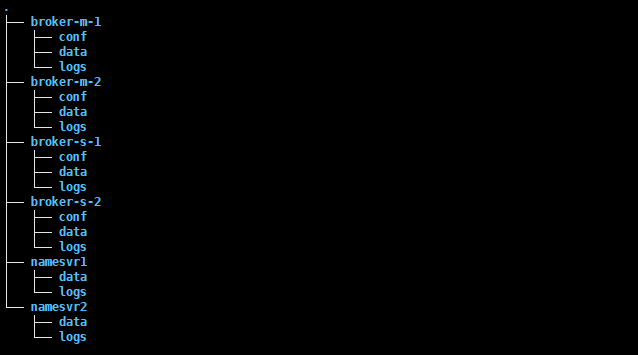
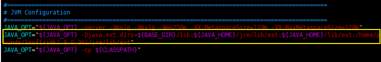

以搭建一个双主双重异步复制的Broker集群为例,采用的docker容器用来搭建


## 0. 源码编译安装:

1. 安装需要的环境:

   1. jdk安装: 
      - jdk 下载: https://www.oracle.com/hk/java/technologies/javase/javase8-archive-downloads.html
      - jdk 安装
        - macos: https://juejin.cn/post/6844903878694010893
        - windows: https://www.runoob.com/w3cnote/windows10-java-setup.html
   2. maven安装:
      - maven 下载二进制: https://dist.apache.org/repos/dist/release/maven/maven-3/
      - maven 安装(windows + macos): https://www.runoob.com/maven/maven-setup.html
      - 如果对于国外网站访问慢， 可以配置maven国内镜像：https://cloud.tencent.com/developer/article/1452479
   3. git安装:
      - https://github.com/apache/rocketmq/releases)
        - 下载地址: [https://git-scm.com/book/zh/v2/%E8%B5%B7%E6%AD%A5-%E5%AE%89%E8%A3%85-Git](https://git-scm.com/book/zh/v2/起步-安装-Git)

2. 源码编译:

   1. 下载源码:

      - 创建一个保存rocketmq源码的位置: `/home/pounds`

      - git clone: `git clone --branch release-4.9.3 https://github.com/apache/rocketmq.git`

      - 进入clone下来的rocketmq文件夹: `cd rocketmq`

        - 目录结构如图:

          

        - 编译打包源码: `mvn -Prelease-all -DskipTests clean install -U`

          

        - rocketmq编译好的代码在`distribution/target` 里面: `rocketmq-4.9.4-SNAPSHOT`就是编译好的mq程序

          

   2. 搭建一个`1namesv+1broker`的集群:

      1. 创建服务部署的文件夹: `这个文件夹随意创建就行`

         ```shell
         mkdir -p /home/pounds/rocketmq/inst/namesrv1
         mkdir -p /home/pounds/rocketmq/inst/broker1
         ```

      2. 将`rocketmq-4.9.4-SNAPSHOT`里面的东西分别拷贝到刚刚创建好的文件夹里面去.

         ```shell
         cp -R /tiger/tmp/rocketmq/distribution/target/rocketmq-4.9.4-SNAPSHOT/rocketmq-4.9.4-SNAPSHOT/* /tiger/rocketmq/namesrv1
         
         cp -R /tiger/tmp/rocketmq/distribution/target/rocketmq-4.9.4-SNAPSHOT/rocketmq-4.9.4-SNAPSHOT/* /tiger/rocketmq/broker1
         ```

         

      3. 修改日志,jvm相关配置: `按需操作的一个步骤`

         `以修改日志默认保存路径位置为例`:

         `cd namesrv1/conf` : 里面的 `logback_namesrv.xml`就是对应日志文件

         

         `jvm相关配置`: 配置文件位于 `bin/runserver.sh`里面

         

         > ps: 
         >
         > 1. broker配置修改方式与namesrv基本一样, 只是文件不同.
         > 2. 在实际环境中, 可能namesrv和broker不是部署与同一个机器上, 所以需要修改网络通信相关的配置, 如: ip等.

   3. 启动集群验证是否正常:

      分别启动namesrv和broker:

      ```shell
      cd /tiger/rocketmq/namesrv1 
      nohup sh bin/mqnamesrv &
      
      cd /tiger/rocketmq/broker1
      nohup sh bin/mqbroker -n localhost:9876 &
      ```

      验证功能是否正常:

      ```shell
      export NAMESRV_ADDR=localhost:9876
      sh bin/tools.sh org.apache.rocketmq.example.quickstart.Producer
      sh bin/tools.sh org.apache.rocketmq.example.quickstart.Consumer
      ```

      生产消息成功:

      

      消费消息成功:

      

## 1. 创建需要目录:

```bash
mkdir -p namesvr1/data &&
mkdir -p namesvr1/logs &&
mkdir -p namesvr2/data &&
mkdir -p namesvr2/logs &&
mkdir -p broker-m-1/data &&
mkdir -p broker-m-1/logs &&
mkdir -p broker-m-1/conf &&
mkdir -p broker-m-2/data &&
mkdir -p broker-m-2/logs &&
mkdir -p broker-m-2/conf &&
mkdir -p broker-s-1/data &&
mkdir -p broker-s-1/logs &&
mkdir -p broker-s-1/conf &&
mkdir -p broker-s-2/data &&
mkdir -p broker-s-2/logs &&
mkdir -p broker-s-2/conf
```

目录结构:



## 2. 添加每个集群实例的配置文件:

```bash
touch broker-m-1/conf/broker-m-1.conf &&
touch broker-s-1/conf/broker-s-1.conf &&
touch broker-m-2/conf/broker-m-2.conf &&
touch broker-s-2/conf/broker-s-2.conf 
```

**broker-m-1: **

broker集群1的主节点

```properties
# 整个rocketmq的broker名称
brokerClusterName=DefaultCluster
# 单个broker主从集群的名称,就是靠这个确认broker实例属于哪一个broker集群
brokerName=broker1
# broker实例是主还是从,非零即从
brokerId=0
# 指定删除消息存储过期文件的时间, [本文件设置为凌晨4点]
deleteWhen=04
# 消息存储文件保留时长, [本文件设置为48小时]
fileReservedTime=48
# 当前broker实例数据同步策略和角色 
# -ASYNC_MASTER 异步复制_主节点 
# -SYNC_MASTER 同步双写_主节点 
# -SLAVE 从节点
brokerRole=SYNC_MASTER
# 刷盘策略 
# - ASYNC_FLUSH 异步刷盘 
# - SYNC_FLUSH 同步刷盘
flushDiskType=SYNC_FLUSH
# 当前broker实例ip
brokerIP1=192.168.200.130
# broker实例对外提供服务监听的端口, 容器部署的时候多个broker不要使用同一个端口
listenPort=10911
# namesrv的地址
namesrvAddr=192.168.200.130:9876;192.168.200.130:9877
# 是否能够自动创建topic
autoCreateTopicEnable=true
```

**broker-s-1: **

```properties
# 整个rocketmq的broker名称
brokerClusterName=DefaultCluster
# 单个broker主从集群的名称,就是靠这个确认broker实例属于哪一个broker集群
brokerName=broker1
# broker实例是主还是从,非零即从
brokerId=1
# 指定删除消息存储过期文件的时间, [本文件设置为凌晨4点]
deleteWhen=04
# 消息存储文件保留时长, [本文件设置为48小时]
fileReservedTime=48
# 当前broker实例数据同步策略和角色 
# -ASYNC_MASTER 异步复制_主节点 
# -SYNC_MASTER 同步双写_主节点 
# -SLAVE 从节点
brokerRole=SLAVE
# 刷盘策略 
# - ASYNC_FLUSH 异步刷盘 
# - SYNC_FLUSH 同步刷盘
flushDiskType=SYNC_FLUSH
# 当前broker实例ip
brokerIP1=192.168.200.130
# broker实例对外提供服务监听的端口, 容器部署的时候多个broker不要使用同一个端口
listenPort=11911
# namesrv的地址
namesrvAddr=192.168.200.130:9876;192.168.200.130:9877
# 是否能够自动创建topic
autoCreateTopicEnable=true
```

**broker-m-2: **

```properties
# 整个rocketmq的broker名称
brokerClusterName=DefaultCluster
# 单个broker主从集群的名称,就是靠这个确认broker实例属于哪一个broker集群
brokerName=broker2
# broker实例是主还是从,非零即从
brokerId=0
# 指定删除消息存储过期文件的时间, [本文件设置为凌晨4点]
deleteWhen=04
# 消息存储文件保留时长, [本文件设置为48小时]
fileReservedTime=48
# 当前broker实例数据同步策略和角色 
# -ASYNC_MASTER 异步复制_主节点 
# -SYNC_MASTER 同步双写_主节点 
# -SLAVE 从节点
brokerRole=SYNC_MASTER
# 刷盘策略 
# - ASYNC_FLUSH 异步刷盘 
# - SYNC_FLUSH 同步刷盘
flushDiskType=SYNC_FLUSH
# 当前broker实例ip
brokerIP1=192.168.200.130
# broker实例对外提供服务监听的端口, 容器部署的时候多个broker不要使用同一个端口
listenPort=12911
# namesrv的地址
namesrvAddr=192.168.200.130:9876;192.168.200.130:9877
# 是否能够自动创建topic
autoCreateTopicEnable=true
```

**broker-s-2: **

```properties
# 整个rocketmq的broker名称
brokerClusterName=DefaultCluster
# 单个broker主从集群的名称,就是靠这个确认broker实例属于哪一个broker集群
brokerName=broker2
# broker实例是主还是从,非零即从
brokerId=1
# 指定删除消息存储过期文件的时间, [本文件设置为凌晨4点]
deleteWhen=04
# 消息存储文件保留时长, [本文件设置为48小时]
fileReservedTime=48
# 当前broker实例数据同步策略和角色 
# -ASYNC_MASTER 异步复制_主节点 
# -SYNC_MASTER 同步双写_主节点 
# -SLAVE 从节点
brokerRole=SLAVE
# 刷盘策略 
# - ASYNC_FLUSH 异步刷盘 
# - SYNC_FLUSH 同步刷盘
flushDiskType=SYNC_FLUSH
# 当前broker实例ip
brokerIP1=192.168.200.130
# broker实例对外提供服务监听的端口, 容器部署的时候多个broker不要使用同一个端口
listenPort=13911
# namesrv的地址
namesrvAddr=192.168.200.130:9876;192.168.200.130:9877
# 是否能够自动创建topic
autoCreateTopicEnable=true
```

> 几点注意事项:
>
> 1. broker的master和slave,是通过brokerName这个数据确定是否属于同一个集群,然后通过brokerId区分broker的角色
> 2. 因为是在一台虚拟机上通过docker容器部署的集群,所以注意broker之间要使用不同的端口来区分他们.

**docker-compose.yml**

如果机器上没有docker-compose,想要安装docker-compose

```yml

version: '3.5'
services:
  namesrv1:
    image: rocketmqinc/rocketmq:4.4.0
    container_name: namesrv1
    restart: always
    ports:
      - 9876:9876
    volumes:
      - /home/pounds/1soft/dockerData/rocketmq/namesrv1/logs:/opt/logs
      - /home/pounds/1soft/dockerData/rocketmq/namesrv1/data:/opt/store
    command: sh mqnamesrv
    networks:
      rocketmq:
        aliases:
          - namesrv1
  namesrv2:
    image: rocketmqinc/rocketmq:4.4.0
    container_name: namesrv2
    restart: always
    ports:
      - 9877:9876
    volumes:
      - /home/pounds/1soft/dockerData/rocketmq/namesrv2/logs:/opt/logs
      - /home/pounds/1soft/dockerData/rocketmq/namesrv2/data:/opt/store
    command: sh mqnamesrv
    networks:
      rocketmq:
        aliases:
          - namesrv2
  broker-m-1:
    image: rocketmqinc/rocketmq:4.4.0
    container_name: broker-m-1
    links:
      - namesrv1:namesrv1
      - namesrv2:namesrv2
    restart: always
    ports:
      - 10909:10909
      - 10911:10911
      - 10912:10912
    environment:
      TZ: Asia/Shanghai
      NAMESRV_ADDR: "namesrv1:9876"
      JAVA_OPTS: "-Duser.home=/opt"
      JAVA_OPT_EXT: "-server -Xms256m -Xmx256m -Xmn256m"
    volumes:
      - /home/pounds/1soft/dockerData/rocketmq/broker-m-1/logs:/opt/logs
      - /home/pounds/1soft/dockerData/rocketmq/broker-m-1/data:/opt/store
      - /home/pounds/1soft/dockerData/rocketmq/broker-m-1/conf/broker-m-1.conf:/opt/rocketmq-4.4.0/conf/broker-m-1.conf
    command: sh mqbroker -c /opt/rocketmq-4.4.0/conf/broker-m-1.conf autoCreateTopicEnable=true &
    networks:
      rocketmq:
        aliases:
          - broker-m-1
  broker-s-1:
    image: rocketmqinc/rocketmq:4.4.0
    container_name: broker-s-1
    links:
      - namesrv1:namesrv1
      - namesrv2:namesrv2
    restart: always
    ports:
      - 11909:10909
      - 11911:11911
      - 11912:10912
    environment:
      TZ: Asia/Shanghai
      NAMESRV_ADDR: "namesrv1:9876"
      JAVA_OPTS: "-Duser.home=/opt"
      JAVA_OPT_EXT: "-server -Xms256m -Xmx256m -Xmn256m"
    volumes:
      - /home/pounds/1soft/dockerData/rocketmq/broker-s-1/logs:/opt/logs
      - /home/pounds/1soft/dockerData/rocketmq/broker-s-1/data:/opt/store
      - /home/pounds/1soft/dockerData/rocketmq/broker-s-1/conf/broker-s-1.conf:/opt/rocketmq-4.4.0/conf/broker-s-1.conf
    command: sh mqbroker -c /opt/rocketmq-4.4.0/conf/broker-s-1.conf autoCreateTopicEnable=true &
    networks:
      rocketmq:
        aliases:
          - broker-s-1
  broker-m-2:
    image: rocketmqinc/rocketmq:4.4.0
    container_name: broker-m-2
    links:
      - namesrv1:namesrv1
      - namesrv2:namesrv1
    restart: always
    ports:
      - 12909:10909
      - 12911:12911
      - 12912:10912
    environment:
      TZ: Asia/Shanghai
      NAMESRV_ADDR: "namesrv1:9876"
      JAVA_OPTS: "-Duser.home=/opt"
      JAVA_OPT_EXT: "-server -Xms256m -Xmx256m -Xmn256m"
    volumes:
      - /home/pounds/1soft/dockerData/rocketmq/broker-m-2/logs:/opt/logs
      - /home/pounds/1soft/dockerData/rocketmq/broker-m-2/data:/opt/store
      - /home/pounds/1soft/dockerData/rocketmq/broker-m-2/conf/broker-m-2.conf:/opt/rocketmq-4.4.0/conf/broker-m-2.conf
    command: sh mqbroker -c /opt/rocketmq-4.4.0/conf/broker-m-2.conf autoCreateTopicEnable=true &
    networks:
      rocketmq:
        aliases:
          - broker-m-2
  broker-s-2:
    image: rocketmqinc/rocketmq:4.4.0
    container_name: broker-s-2
    links:
      - namesrv1:namesrv1
      - namesrv2:namesrv2
    restart: always
    ports:
      - 13909:10909
      - 13911:13911
      - 13912:10912
    environment:
      TZ: Asia/Shanghai
      NAMESRV_ADDR: "namesrv1:9876"
      JAVA_OPTS: "-Duser.home=/opt"
      JAVA_OPT_EXT: "-server -Xms256m -Xmx256m -Xmn256m"
    volumes:
      - /home/pounds/1soft/dockerData/rocketmq/broker-s-2/logs:/opt/logs
      - /home/pounds/1soft/dockerData/rocketmq/broker-s-2/data:/opt/store
      - /home/pounds/1soft/dockerData/rocketmq/broker-s-2/conf/broker-s-2.conf:/opt/rocketmq-4.4.0/conf/broker-s-2.conf
    command: sh mqbroker -c /opt/rocketmq-4.4.0/conf/broker-s-2.conf autoCreateTopicEnable=true &
    networks:
      rocketmq:
        aliases:
          - broker-s-2
  rocketmq-console:
    image: styletang/rocketmq-console-ng
    container_name: rocketmq-console
    restart: always
    ports:
      - 10086:8080
    environment:
      # 解决时区问题,不然一直要报this have`t data!
      TZ: Asia/Shanghai
      JAVA_OPTS: -Drocketmq.namesrv.addr=namesrv1:9876;namesrv2:9877 -Dcom.rocketmq.sendMessageWithVIPChannel=false -Duser.timezone='Asia/Shanghai'
    networks:
      rocketmq:
        aliases:
          - rocketmq-console
networks:
  rocketmq:
    name: rocketmq
    driver: bridge

```

> 在通过docker-compose创建docker容器之后,发现因为挂载的文件不对,导致容器起不起来的解决办法:
>
> 删除容器,将文件挂载修改正确,然后中心执行docker-compose.

## 3. mqadmin命令:

`mqadmin命令`是一个运维命令,用于对mq的主题,集群,broker等信息进行管理.

**使用之前:**

1. 如果没有配置jdk的环境变量就需要,修改 bin/tools.sh 脚本中配置的JDK的ext目录位置.

   使用vim命令打开tools.sh文件，并在JAVA_OPT配置的-Djava.ext.dirs这一行的后面添加jre/lib下的ext路径。

   

**官方解释:**

[mqadmin命令](https://github.com/apache/rocketmq/blob/master/docs/cn/operation.md)

