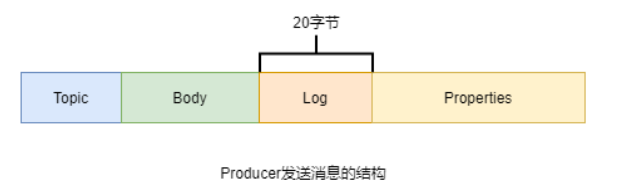

添加对应的依赖:

```pom
        <dependency>
            <groupId>org.apache.rocketmq</groupId>
            <artifactId>rocketmq-client</artifactId>
            <version>4.9.1</version>
        </dependency>
```

> 注意: 依赖的版本要与rocketmq运行的版本一致

## 1. 发送消息:

### 1. 普通消息:

#### 1. 同步发送:

```java
package cn.pounds.general;

import org.apache.rocketmq.client.producer.DefaultMQProducer;
import org.apache.rocketmq.client.producer.SendResult;
import org.apache.rocketmq.common.message.Message;

public class SyncProducer {
    private static final Integer totalCount = 100;
    public static void main(String[] args) {
        try {
            // 创建一个producer, 参数为 生产组名称
            DefaultMQProducer producer = new DefaultMQProducer("general_message_group");
            // 指定nameserver地址
            producer.setNamesrvAddr("192.168.200.130:9876");
            // 设置发送失败的重试次数:
            producer.setRetryTimesWhenSendAsyncFailed(3);
            // 设置发送超时时长,单位是毫秒
            producer.setSendMsgTimeout(5000);

            // producer启动
            producer.start();

            // 发送100条消息
            for (int i = 0; i < totalCount; i++) {
                // 消息是以二进制的形式发送
                byte[] body = String.format("hi , im sync message no.%s", i + 1).getBytes();
                // 封装成消息对象
                Message message = new Message("syncMessage", "syncMessage", body);
                // 设置key
                message.setKeys("sync-key-i");
                SendResult sendResult = producer.send(message);
                System.out.println(sendResult);
            }

            // 关闭producer
            producer.shutdown();
        }catch (Exception e) {
            e.printStackTrace();
        }
    }
}
```

其中: `SendResult`可能出现的几种状态

```java
public enum SendStatus {
    // 发送成功
    SEND_OK,
    // 刷盘超时.同步刷盘才可能出现的状态,异步刷盘不会出现这个状态
    FLUSH_DISK_TIMEOUT,
    // slave同步超时, broker集群同步方式为 同步复制 , 才会出现的状态
    FLUSH_SLAVE_TIMEOUT,
    // 么有可用slave, broker集群同步方式为 同步复制 , 才会出现的状态
    SLAVE_NOT_AVAILABLE;

    private SendStatus() {
    }
}
```

#### 2. 异步发送:

```java
package cn.pounds.general;

import org.apache.rocketmq.client.producer.DefaultMQProducer;
import org.apache.rocketmq.client.producer.SendCallback;
import org.apache.rocketmq.client.producer.SendResult;
import org.apache.rocketmq.common.message.Message;

/**
 * @author: pounds
 * @date: 2021/10/7 23:54
 * @desc: 异步发送
 */
public class AsyncProducer {
    private static final Integer totalCount = 100;
    public static void main(String[] args) {
        try {
            // 创建一个producer, 参数为 生产组名称
            DefaultMQProducer producer = new DefaultMQProducer("general_message_group");
            // 指定nameserver地址
            producer.setNamesrvAddr("192.168.200.130:9877");
            // 指定异步发送失败后不进行重试
            producer.setRetryTimesWhenSendAsyncFailed(0);
            // 指定topic的queue数量为2,默认是4个
            producer.setDefaultTopicQueueNums(2);

            // producer启动
            producer.start();
            
            // 发送100条消息
            for (int i = 0; i < totalCount; i++) {
                // 消息是以二进制的形式发送
                byte[] body = String.format("hi , im async message no.%s", i + 1).getBytes();
                // 封装成消息对象
                Message message = new Message("asyncMessage", "asyncMessage", body);
                // 设置key
                message.setKeys("async-key-i");

                // todo 这里就与同步发送不一样了,rocketmq是通过send方法重载来区分同步异步
                producer.send(message, new SendCallback() {
                    @Override
                    public void onSuccess(SendResult sendResult) {
                        System.out.println("success: " + sendResult);
                    }

                    @Override
                    public void onException(Throwable e) {
                        e.printStackTrace();
                    }
                });
            }
            // todo 关闭producer,这里就不能直接关闭了,需要有一定的延迟
            Thread.currentThread().sleep(3000);
            producer.shutdown();
        }catch (Exception e) {
            e.printStackTrace();
        }
    }
}
```

异步发送核心代码:

```java
@Deprecated
    public void send(final Message msg, final SendCallback sendCallback, final long timeout)
        throws MQClientException, RemotingException, InterruptedException {
        final long beginStartTime = System.currentTimeMillis();
        // 核心线程数和最大小陈树都是 当前cpu核心数
        ExecutorService executor = this.getAsyncSenderExecutor();
        try {
            executor.submit(new Runnable() {
                @Override
                public void run() {
                    long costTime = System.currentTimeMillis() - beginStartTime;
                    // 如果任务在线程池里面等待的太久会造成超时,从而无法发送消息
                    if (timeout > costTime) {
                        try {
                            sendDefaultImpl(msg, CommunicationMode.ASYNC, sendCallback, timeout - costTime);
                        } catch (Exception e) {
                            sendCallback.onException(e);
                        }
                    } else {
                        sendCallback.onException(
                            new RemotingTooMuchRequestException("DEFAULT ASYNC send call timeout"));
                    }
                }

            });
        } catch (RejectedExecutionException e) {
            throw new MQClientException("executor rejected ", e);
        }

    }
```

#### 3. 单向发送:

```java
package cn.pounds.general;

import org.apache.rocketmq.client.exception.MQBrokerException;
import org.apache.rocketmq.client.exception.MQClientException;
import org.apache.rocketmq.client.producer.DefaultMQProducer;
import org.apache.rocketmq.common.message.Message;
import org.apache.rocketmq.remoting.exception.RemotingException;

/**
 * @author: pounds
 * @date: 2021/10/8 21:06
 * @desc:
 */
public class OneWayProducer {
    private static final Integer totalCount = 100;

    public static void main(String[] args) throws MQClientException, MQBrokerException, RemotingException, InterruptedException {
        DefaultMQProducer onewayproducer = new DefaultMQProducer("general_message_group");
        onewayproducer.setNamesrvAddr("192.168.200.130:9876");
        onewayproducer.start();

        for (int i = 0; i < 100; i++) {
            byte[] bytes = String.format("hi, im one way message no.%s", i).getBytes();
            Message message = new Message("OnewayMessage", "oneway", bytes);
            // 单向发送
            onewayproducer.send(message);
        }
        onewayproducer.shutdown();
    }
}
```

### 2. 顺序消息:

消息有序指的是一类消息消费时，能按照发送的顺序来消费.

顺序消息分为全局顺序消息与分区顺序消息，全局顺序是指某个Topic下的所有消息都要保证顺序；部分顺序消息只要保证每一组消息被顺序消费即可。

- 全局顺序: `生产者,队列,消费者 一一对应`

  

  对于指定的一个 Topic，所有消息按照严格的先入先出（FIFO）的顺序进行发布和消费。 

  适用场景：性能要求不高，所有的消息严格按照 FIFO 原则进行消息发布和消费的场景

- 分区顺序: `根据不同sharding key将消息严格按照FIFO顺序进行发布和消费`

  

  > `order1`, `order2`, `order3`就是`sharding key`,在代码中的体现就是  在定义producer的时候可以指定消息队列选择器(`MessageQueueSelector`)

  对于指定的一个 Topic，所有消息根据 `sharding key` 进行区块分区。 同一个分区内的消息按照严格的 FIFO 顺序进行发布和消费。 

  `Sharding key `是顺序消息中用来区分不同分区的关键字段，和普通消息的 Key 是完全不同的概念。 `sharding key` 要求不能重复.

  适用场景：性能要求高，以 sharding key 作为分区字段，在同一个区块中严格的按照 FIFO 原则进行消息发布和消费的场景。

  > 几点说明:
  >
  > 1. 消息选择器的选择算法, 一般是采用的是 `除数取余`定位法, 余数为对应queue的queueID.
  > 2. `除数取余`可能会出现, 不同`sharding key`定位到相同queue上. 通常采取的做法是consumer接收到消息后, 会对`sharding key`进行校验, 如果是自己关注的就消费,不是就不做任何处理.
  > 3. 对于定位到同一个queue,但是`sharding key`不同的消息, 由于同一个队列同一时刻只能被同一个消费组中的一个消费者消费,所以消费同一个队列的消费者关心的`sharding key`也是不同,就不会存在某些消息被某个消费者取走, 真正关心的消费者无法消费该消息的问题.`关注不同shaarding key的消费者定位到同一个queue上的情况下, 消费模式应该是广播消费`

将所有消息都写到一个队列里面去.

**使用示例:**

```java
/**
 * @author: pounds
 * @date: 2021/10/8 22:50
 * @desc: 顺序消息
 */
public class OrderProducer {
    private static final Integer TOTAL_COUNT = 100;

    public static void main(String[] args) {

        DefaultMQProducer orderProducer = new DefaultMQProducer("order_producer_group");
        try {
            orderProducer.setNamesrvAddr("192.168.200.130;9876");
            // 全局有序就将队列设置为1
//            orderProducer.setDefaultTopicQueueNums(1);

            orderProducer.start();

            for (int i = 0; i < TOTAL_COUNT; i++) {
                int orderId = i;
                String content = String.format("hi, im ordre messages no.%s", orderId);
                Message message = new Message("orderMessage", "orderTag", "key-" + i, content.getBytes());

                // 为了消费的时候防止消费到同一个队列的其他数据,将sharding key 一同传递给consumer
                message.setKeys(String.valueOf(orderId));

                SendResult sendResult = orderProducer.send(message, new MessageQueueSelector() {
                    /**
                     * 具体的选择算法, 自动设置
                     * @param mqs --- 队列列表
                     * @param msg --- 消息
                     * @param arg --- sharding key分区依据, 在这个例子就是send方法中传过来的orderId
                     * @return
                     */
                    @Override
                    public MessageQueue select(List<MessageQueue> mqs, Message msg, Object arg) {
                        Integer id = (Integer) arg;
                        int queueIndex = id & (mqs.size() - 1);
                        return mqs.get(queueIndex);
                    }
                }, orderId);
                System.out.println(sendResult);
            }
        }catch (Exception e) {
            e.printStackTrace();
        }
        orderProducer.shutdown();
    }
}
```


### 3. 延时消息:

#### 1. 简介:

**延时消息:** 某些消息并不需要在broker接受到消息之后就立即处理, 而是可以在一定时间之后再对投递给对应的消费队列, 这类消息就是 `延时消息`

**使用场景:**

1. 通过延时消息实现定时任务的功能
2. 电商系统, 未支付订单关闭的功能

#### 2. 延时等级:

rocketmq的延时消息 不像rabbitmq的延时消息可以设置任意的延迟消费时间, rocketmq对延时消息规定了特定的延时等级.如下:

```java
 private String messageDelayLevel = "1s 5s 10s 30s 1m 2m 3m 4m 5m 6m 7m 8m 9m 10m 20m 30m 1h 2h";
```

从`延迟等级 1级(1s)`开始到 `延时等级 18级(2h)`共18个等级. 

> 特别的:
>
> - `level == 0`，消息为 非延迟消息
> - `1 <= level <= maxLevel`，消息延迟特定时间，例如level==1，延迟1s
> - `level > maxLevel` ，则level== maxLevel，如果设置的等级大于的最大延迟登记, 则该消息的延迟等级取最大延迟等级

如果需要自定义延时等级,在broker.conf中通过`messageDelayLevel`来设置: 下面就新增了延时等级`1d`, 即延迟等级为 `19级`

```conf
#119=延迟消息等级(s 秒、m 分、h 时、d 天,格式参考默认值填写)
messageDelayLevel=1s 5s 10s 30s 1m 2m 3m 4m 5m 6m 7m 8m 9m 10m 20m 30m 1h 2h 1d
```

> 注意: 既然是broker.conf, 那么messageDelayLevel就是broker级别的配置, 也就是说这个broker中所有topic的队列延迟等级都是一样的

#### 3. 延时消息原理:

**1. 延迟消息存储格式:**

延迟消息在consumequeue文件夹中, rocketmq为延迟消息专门设置了一个topic来存放延迟消息, `schedule_topic_xxx` ,并且以 `延迟等级 - 1`为queueId, 区分不同延迟等级的消息.如图:


**2. 延迟消息处理步骤:**


1. broker接受到消息, 将消息写入commitlog, 在分发之前会判断消息的延迟等级, 如果等于0, 正常分发, 如果 != 0,执行步骤2

2. 根据消息延迟等级, 按照`queueId = 延迟等级 -1`将消息分发到 `schedule_topic_xxxx`topic下 对应的队列中.具体步骤:

   1. 将消息topic修改为 `schedule_topic_xxxx`

   2. 根据延时等级，在consumequeue目录中SCHEDULE_TOPIC_XXXX主题下创建出相应的queueId(即`queueId = 延迟等级 -1`)目录与consumequeue文件（如果没有这些目录与文件的话）。

   3. 修改消息单元中原本存储messageTagHashCode的部分.将其修改为该消息的投递时间(`投递时间 = 消息进入broker写入commitlog的时间 + 延迟等级`)

   4. 将消息索引写入到SCHEDULE_TOPIC_XXXX主题下相应的consumequeue中

      > 这里要注意一下投递时间, 由于queue中消息是先进先出, 所以queue第一条消息的投递时间是最小的, 依次递增.

3. 投递消息. 投递消息实际上就是在broker内部将消息从 `schedule_topic_xxxx` 的队列中,读取出来将消息tocpic改回原来的topic并将延迟等级置为0具体操作:

   broker内部有一个`ScheduleMessageService`延迟消息服务,在broker启动时, 该服务会根据broker的延时等级创建对应数量的`TimerTask`, 每一个`TimerTask`负责一个等级的延时消息的消费与重新投递任务.`TimerTask`会定时去检测响应队列中第一条消息是否到期, 如果没有到期说明该队列中的消息都没有到期,无需继续检测.如果到期了, 就从commitlog中将消息读取出来, 修改topic为原topic, 延迟登记置为0.然后执行步骤4.

4. 将消息重新写入commitlog中.由`TimerTask`将处理过后的延迟消息重新写入commitlog, 并再次形成新的索引条目, 分发到topic对应的queue中.

> 从延迟消息处理的步骤可以看出, 在消息第一次进入broker和重新投递的时候都会被写入commitlog, 即会被重复计数,因此发送数量, tps都会变高

#### 4. 示例代码:

```java
/**
 * @author: pounds
 * @date: 2021/10/9 22:59
 * @desc: 延迟消息,采用同步发送演示
 */
public class DelayProducer {

    public static void main(String[] args) throws MQClientException, MQBrokerException, RemotingException, InterruptedException {
        DefaultMQProducer producer = new DefaultMQProducer("delay_message_producer");
        producer.setNamesrvAddr("192.168.200.130:9877");
        producer.start();

        for (int i = 0; i < 10; i++) {
            String content = String.format("im delay messaage no.%d, time: %d", i,System.currentTimeMillis());
            Message message = new Message("delayMessage", "someTag", content.getBytes());
            // 消息延迟10s
            message.setDelayTimeLevel(3);
            producer.send(message);
        }
        producer.shutdown();
    }
}

public class DelayConsumer {

    public static void main(String[] args) throws MQClientException {
        DefaultMQPushConsumer consu = new DefaultMQPushConsumer("delay_message_consumer");
        consu.setNamesrvAddr("192.168.200.130:9877");
        consu.subscribe("delayMessage", "*");
        // 注册消息监听器:
        consu.registerMessageListener(new MessageListenerConcurrently() {
            @Override
            public ConsumeConcurrentlyStatus consumeMessage(List<MessageExt> msgs, ConsumeConcurrentlyContext context) {
                for (MessageExt message : msgs) {
                    // Print approximate delay time period
                    System.out.println("Receive message[msgId=" + message.getMsgId() + "] " + (System.currentTimeMillis() - message.getBornTimestamp()) + "ms later");
                }
                return ConsumeConcurrentlyStatus.CONSUME_SUCCESS;
            }
        });
        // 启动消费者
        consu.start();
    }
}

```

### 4. 事务消息:

rocketmq的事务消息确保的是 在消息被消费之前提交消息的producer部分的本地事务是成功执行了的.

#### 1. 基于 XA 协议的2pc:


**重要组成部分:**

1. AP(Application Program): 应用程序. 主要作用是 定义哪些操作是事务操作, 并且可以访问事务操作的资源.
2. RM(Resource Manager): 资源管理器, 主要作用是管理我们需要操作的资源, 如数据库, 消息队列, 文件系统等.
3. TM(Transaction Manager): 事务管理器, 主要作用是 接受AP 提交的事务请求, 对该事务进行全局管理, 管理事务的分支(一个事务可能包含多个事务操作,每个事物操作都可以看做是一个分支)状态, 协调RM处理, 通知RM那些操作是全局事务以及事务分支等等.
4. TC(Transaction Coordinator): 事务协调者, 主要作用是 维护全局和分支事务的状态, 驱动全局事务提交或者回滚

**XA协议的标准实现模型2PC:**

2PC(Two-Phase-Commit 二阶段提交): 

- 阶段一 `提交事务请求`

  1. 事务询问: 协调者向所有参与者发送事务内容, 询问是否可以执行提交操作, 并开始等待各个参与者进行响应.
  2. 执行事务: 参与者在接收到了协调者的询问之后, 会开始执行本地事务, 将UNDO和Redo操作计入本地事务日志中.
  3. 响应结果: 参与者根据本地事务执行的结果向协调者响应. 成功yes, 失败no.

- 阶段二 `执行事务提交`

  协调者会根据各个参与者响应的事务执行结果, 决定全局事务是否提交, 分为两种情况:

  - 所有参与者都响应yes:
    1. 发送提交请求: 协调者向所有参与者发送commit请求.
    2. 提交事务: 参与者接收到commit请求后, 会 `正式执行事务的提交操作` ,并在完成提交操作后, 释放事务执行期间占用的资源.
    3. 反馈事务提交结果: 参与者在完成事务提交后, 协调者发送ack消息确认.
    4. 完成事务: 协调者在收到所有参与者的ack消息之后, 完成事务.
  - 部分参与者响应no, 或者响应超时(只要没有协调者没有接收到所有参与者的yes响应) 就会中断事务.
    1. 发送回滚请求: 协调者向所有参与者发送Rollback请求.
    2. 本地事务回滚: 参与者在接收到协调者的回滚请求后, 利用本地的UNDO信息执行Rollback. 回滚后释放事务执行期间占用的资源.
    3. 反馈回滚结果: 参与者在完成回滚操作后, 向协调者发送ack消息.
    4. 中断事务: 协调者收到所有参与者的回滚ack消息后,完成事务中断.

> 2pc模型解决的是数据强一致性问题

#### 2. RocketMQ事务消息:

rocketmq的事务消息提供类似 X/Open XA 的分布事务功能.

broker充当了2pc模型中的`RM`, 即`资源管理器`, producer充当了2pc模型中的`TM`,`RM`和`TC`, 即`事务参与者`, `事务协调者`.

**事务消息产生的流程:** 主要分为两部分, `事务消息的发送及提交` 、 `事务消息的补偿流程`


- 事务消息的发送及提交:

  1. producer中`TM`向`TC`发起全局事务指令, 开启`全局事务`.
  2. `TC`向所有参与者询问事务:
     1. 分支事务一: producer向broker发送`半事务消息prepareHalf`, 将消息`预提交`到broker, broker向producer中的`TC`响应预提交结果, 分支事务1响应完毕.
     2. 分支事务二: producer执行本地事务,producer根据本地事务执行结果, 向`TC`响应结果, 分支事务2响应完毕.
  3. 处理响应结果:
     1. 都yes: producer中的`TC`会向producer的本地事务和broker发送真正的commit请求, broker中的事务消息真正的提交给consumer订阅的topic对应的队列.
     2. 有no: producer中的`TC` 向producer的本地事务和broker发送rollback指令, broker中的事务消息就会被删除.

- 事务消息补偿流程:

  当producer本地事务响应超时, 响应状态为`unknown`,或者broker超过设置的时间后没有接收到事务消息全局确认指令的时候, 就会执行消息回查, 去查询本地事务的执行结果, 然后根据本地事务执行的结果再次决定是否向broker发送commit请求还是rollback请求.

  

> 几点说明:
>
> 1. 事务消息一共有三种状态:
>
> ```java
> public enum LocalTransactionState {
>     COMMIT_MESSAGE, // 提交
>     ROLLBACK_MESSAGE, // 回滚
>     UNKNOW,// 回差
> }
> ```
>
> 2. 回查不会重新执行事务, 而是去查询事务的执行状态
> 3. 回查相关配置:
>
> ```java
> transactionTimeout=20，指定TM在20秒内应将最终确认状态发送给TC，否则引发消息回查。默认为60秒.当发送事务消息时，用户还可以通过设置用户属性 CHECK_IMMUNITY_TIME_IN_SECONDS 来改变这个限制，该参数优先于 transactionTimeout 参数。
> transactionCheckMax=5，指定最多回查5次，超过后将丢弃消息并记录错误日志。默认15次。
> transactionCheckInterval=10，指定设置的多次消息回查的时间间隔为10秒。默认为60秒。
> ```
>
> 4. 事务消息不支持延时消息和批量消息。
> 5. 事务消息的生产者 ID 不能与其他类型消息的生产者 ID 共享。与其他类型的消息不同，事务消息允许反向查询、MQ服务器能通过它们的生产者 ID 查询到消费者。

#### 3. 示例代码:

```java
import org.apache.rocketmq.client.exception.MQClientException;
import org.apache.rocketmq.client.producer.LocalTransactionState;
import org.apache.rocketmq.client.producer.SendResult;
import org.apache.rocketmq.client.producer.TransactionListener;
import org.apache.rocketmq.client.producer.TransactionMQProducer;
import org.apache.rocketmq.common.message.Message;
import org.apache.rocketmq.common.message.MessageExt;
import org.apache.rocketmq.remoting.common.RemotingHelper;

import java.io.UnsupportedEncodingException;
import java.util.concurrent.*;
import java.util.concurrent.atomic.AtomicInteger;

/**
 * @author: pounds
 * @date: 2021/10/11 23:07
 * @desc: 事务消息
 */
public class TransProducer {
    public static void main(String[] args) throws MQClientException, InterruptedException {
        /*
         * 首先创建一个事务消息的监听器, 主要作用是监听broker那边传回来的执行本地事务和事务检查请求
         * 事务监听器都是通过实现TransactionListener接口,其中两个方法:
         * 1. 当半事务消息预提交成功之后, 就会回调executeLocalTransaction执行本地事务, 所以本地事务的逻辑就写在这个里面
         * 2. checkLocalTransaction是用来 事务消息回查本地事务执行状态的
         */
        TransactionListener transactionListener = new TransactionListener() {
            private ConcurrentHashMap<String, Integer> localTrans = new ConcurrentHashMap<>();
            /**
             * 当半事务消息预提交成功之后, 就会回调executeLocalTransaction执行本地事务, 所以本地事务的逻辑就写在这个里面
             * @param msg --- 事务消息
             * @param arg --- 本地事务需要的一些参数
             * @return --- 本地事务状态
             * 这里arg是发送消息时,消息的编号(即for循环中i变量), 我们让被3整除的都表示本地事务执行成功,其余的都走回查
             */
            @Override
            public LocalTransactionState executeLocalTransaction(Message msg, Object arg) {
                Integer index = (Integer) arg;
                int status = index % 3;
                msg.setKeys(index.toString());
                localTrans.put(msg.getTransactionId(), status);
                if (status == 0 ){
                    byte[] body = msg.getBody();
                    byte[] bytes =
                            new StringBuilder(new String(body)).append(",我是本地事务执行完毕后就直接提交的消息").toString().getBytes();
                    msg.setBody(bytes);
                    return LocalTransactionState.COMMIT_MESSAGE;
                }
                return LocalTransactionState.UNKNOW;
            }

            /**
             * checkLocalTransaction是用来 事务消息回查本地事务执行状态的
             * @param msg --- 事务消息
             * @return --- 本地事务执行状态
             * 这里让本地执行结果为1的消息,通过回查成功提交
             */
            @Override
            public LocalTransactionState checkLocalTransaction(MessageExt msg) {
                // 验证使用线程池
                System.out.printf("threadName:%s%n",Thread.currentThread().getName());
                System.out.printf("当前正在回查key为%s消息%n",msg.getKeys());
                Integer status = localTrans.get(msg.getTransactionId());
                if (null != status) {
                    switch (status) {
                        case 0:
                            return LocalTransactionState.UNKNOW;
                        case 1:
                            byte[] body = msg.getBody();
                            byte[] bytes =
                                    new StringBuilder(new String(body)).append(",我是回查结束提交的消息").toString().getBytes();
                            msg.setBody(bytes);
                            return LocalTransactionState.COMMIT_MESSAGE;
                        case 2:
                            return LocalTransactionState.ROLLBACK_MESSAGE;
                        default:
                    }
                }
                return LocalTransactionState.COMMIT_MESSAGE;
            }
        };

        /*
         * 创建一个线程池, 供消息回查的时候使用
         */
        ThreadPoolExecutor checkExcutor = new ThreadPoolExecutor(
                2,
                5,
                1000,
                TimeUnit.SECONDS,
                new ArrayBlockingQueue<Runnable>(1000),
                r -> {
                    Thread thread = new Thread(r);
                    thread.setName("client-transaction-msg-check-thread-%d");
                    return thread;
                },
                new ThreadPoolExecutor.CallerRunsPolicy()
                );

        // 创建事务消息producer
        TransactionMQProducer producer = new TransactionMQProducer("trans_message_producer_group");

        producer.setExecutorService(checkExcutor);
        producer.setTransactionListener(transactionListener);
        producer.setNamesrvAddr("192.168.200.130:9876;192.168.200.130:9877");

        producer.start();
        String[] tags = new String[] {"TagA", "TagB", "TagC", "TagD", "TagE"};
        for (int i = 0; i < 10; i++) {
            try {
                Message msg =
                        new Message("TransMessage", tags[i % tags.length], "KEY" + i,
                                ("Hello RocketMQ " + i).getBytes(RemotingHelper.DEFAULT_CHARSET));
                // 发送事务消息, 参数arg表示本地事务需要的参数
                SendResult sendResult = producer.sendMessageInTransaction(msg, i);
                System.out.printf("%s%n", sendResult);
                Thread.sleep(10);
            } catch (Exception e) {
                e.printStackTrace();
            }
        }
        for (int i = 0; i < 100000; i++) {
            Thread.sleep(1000);
        }
        producer.shutdown();
    }
}

```

### 5. 批量消息:

#### 1. 批量发送消息

生产者在发送消息的时候可以一次性发送多条消息, 需要注意一下几点:

1. 批量发送的消息必须具有相同的Topic
2. 批量发送的消息必须具有相同的刷盘策略
3. 批量发送的消息不能是延时消息和事务消息
4. 一批消息默认情况下总大小不能超过4MB.如果想要超过4M,可以进行如下操作:
   - 将该批次消息进行拆分,拆分成若干小于4MB的消息,分多批次发送
   - 修改producer端和broker的参数:
     - producer端在发送之前需要 `producer.setMaxMessageSize(size)`
     - broker端需要修改配置文件中 `maxMessageSize属性`

**生产者消息大小:**



生产者通过send()方法发送的Message，并不是直接将Message序列化后发送到网络上的，而是通过这个Message生成了一个字符串发送出去的。这个字符串由四部分构成：Topic、消息Body、消息日志（占20字节），及用于描述消息的一堆属性key-value。这些属性中包含例如生产者地址、生产时间、要发送的QueueId等。最终写入到Broker中消息单元中的数据都是来自于这些属性。

#### 2. 批量消费消息:

默认情况下, 每次只能消费一条消息.可以通过下面的代码来修改, 使得消费者可以一次性消费多条消息.

```java
// 1. 设置每次消费消息的数量, 最大不能超过32.
consu.setConsumeMessageBatchMaxSize(25);
// 2. 取消上面每次消费数量最大不能超过32的限制, 将其限制在64.
consu.setPullBatchSize(64);
```

> pullBatchSize和comsumeMessageBatchMaxSize并不是越大越好:
>
> pullBatchSize: 限制的是每次从broker拉取消息的数量, 数量越大不仅拉取的时间越长, 在网络上传输出现问题的可能性也越高.一旦拉取过程中出现了问题, 那么本批次所有的消息都需要重新拉取
>
> comsumeMessageBatchMaxSize: 限制的是消费者每次消费消息的数量, 同一次消费的消息都将有同一个线程来处理, 处理过程只要有一个消息处理异常, 这批消息就需要全部重新消费处理. `所以设置得越大消息并发消费的能力就越低, 并且这批消息具有相同的消费结果`

#### 3. 代码示例:

演示的是: 在不修改producer和broker 配置的情况下, 如何发送一批总大小超过4MB但是单个消息大小不超过4MB的消息.

> 如果单个消息超过4MB必须需要修改配置文件才行.

**分割器:**

```java
public class MessageSplitter implements Iterator<List<Message>> {
    /** 限制每次发送的消息不能超过4MB */
    private final int SIZE_LIMIT = 4 * 1024 * 1024;
    /** 存放一批大于4M的消息 */
    private List<Message> messages;
    /** 迭代器指向List<Message>里面的哪个位置 */
    private int curIndex;

    public MessageSplitter(List<Message> messages) {
        this.messages = messages;
    }

    @Override
    public boolean hasNext() {
        return curIndex < messages.size();
    }


    @Override
    public List<Message> next() {
        int startIndex = getStartIndex();
        int nextIndex = startIndex;
        int totalSize = 0;
        for (; nextIndex < messages.size(); nextIndex++){
            Message message = messages.get(nextIndex);
            int msgSize = calculateMsgSize(message);
            if (msgSize + totalSize> SIZE_LIMIT){
                break;
            }else {
                totalSize += msgSize;
            }
        }
        List<Message> messages = this.messages.subList(startIndex, nextIndex);
        // 修改迭代器迭代到那个位置了.
        curIndex = nextIndex;
        return messages;
    }
    /**
     * 获取开始索引
     */
    private int getStartIndex(){
        Message message = messages.get(curIndex);
        int msgSize = calculateMsgSize(message);
        while (msgSize > SIZE_LIMIT){
            curIndex++;
            Message nextMsg = messages.get(curIndex);
            msgSize = calculateMsgSize(nextMsg);
        }
        return curIndex;
    }
    /**
     * 计算消息的长度为多少字节
     * 网络中消息格式: Topic.length() + Body.length() + 20(日志开销) + 消息属性所占用的长度
     * @param msg --- 待计算的消息
     * @return 消息长度
     */
    private int calculateMsgSize(Message msg){
        AtomicInteger tmpLength = new AtomicInteger(msg.getTopic().length() + msg.getBody().length);
        msg.getProperties().forEach((k,v) -> {
            tmpLength.addAndGet(k.length() + v.length());
        });
        tmpLength.addAndGet(20);
        return tmpLength.get();
    }

}
```

**生产者:**

```java
public class BatchProducer {
    public static void main(String[] args) throws Exception {
        DefaultMQProducer producer = new DefaultMQProducer("pg");
        producer.setNamesrvAddr("rocketmqOS:9876");
        // 指定要发送的消息的最大大小，默认是4M
        // 不过，仅修改该属性是不行的，还需要同时修改broker加载的配置文件中的
        // maxMessageSize属性
        producer.setMaxMessageSize(8 * 1024 * 1024);
        producer.start();
        // 定义要发送的消息集合
        List<Message> messages = new ArrayList<>();
        for (int i = 0; i < 100; i++) {
            byte[] body = ("Hi," + i).getBytes();
            Message msg = new Message("TransTopic", "someTag", body);
            messages.add(msg);
        }

        // 定义消息列表分割器，将消息列表分割为多个不超出4M大小的小列表
        MessageSplitter splitter = new MessageSplitter(messages);
        while (splitter.hasNext()) {
            try {
                List<Message> listItem = splitter.next();
                producer.send(listItem);
            } catch (Exception e) {
                e.printStackTrace(); }
        }

        producer.shutdown();
    }
}
```

**消费者:**

```java
public class BatchConsumer {
    public static void main(String[] args) throws MQClientException {
        DefaultMQPushConsumer consumer = new DefaultMQPushConsumer("cg");
        consumer.setNamesrvAddr("rocketmqOS:9876");
        consumer.setConsumeFromWhere(ConsumeFromWhere.CONSUME_FROM_FIRST_OFFSET);
        consumer.subscribe("someTopicA", "*");
        // 指定每次可以消费10条消息，默认为1 
        consumer.setConsumeMessageBatchMaxSize(10);
        // 指定每次可以从Broker拉取40条消息，默认为32 
        consumer.setPullBatchSize(40);
        
        consumer.registerMessageListener((MessageListenerConcurrently) (msgs, context) -> {
            for (MessageExt msg : msgs) {
                System.out.println(msg);
            }
            // 消费成功的返回结果 
            return ConsumeConcurrentlyStatus.CONSUME_SUCCESS;
            // 消费异常时的返回结果 
            // return ConsumeConcurrentlyStatus.RECONSUME_LATER; 
        });
        consumer.start();
        System.out.println("Consumer Started");
    }
} 
```


## 2. 消费消息:

### 1. 简单示例:

```java
package cn.pounds.general;

import org.apache.rocketmq.client.consumer.DefaultLitePullConsumer;
import org.apache.rocketmq.client.consumer.DefaultMQPushConsumer;
import org.apache.rocketmq.client.consumer.listener.ConsumeConcurrentlyContext;
import org.apache.rocketmq.client.consumer.listener.ConsumeConcurrentlyStatus;
import org.apache.rocketmq.client.consumer.listener.MessageListenerConcurrently;
import org.apache.rocketmq.client.exception.MQClientException;
import org.apache.rocketmq.common.consumer.ConsumeFromWhere;
import org.apache.rocketmq.common.message.MessageExt;
import org.apache.rocketmq.common.protocol.heartbeat.MessageModel;

import java.util.List;

/**
 * @author: pounds
 * @date: 2021/10/8 21:18
 * @desc:
 */
public class SomeConsumer {
    public static void main(String[] args) throws MQClientException {
        // pull方式消费
//        DefaultLitePullConsumer consumer = new DefaultLitePullConsumer("cg");
        // push方式消费
        DefaultMQPushConsumer cg = new DefaultMQPushConsumer("cg");
        // 设置namesrv
        cg.setNamesrvAddr("192.168.200.130:9876");
        // 设置消费起点
        cg.setConsumeFromWhere(ConsumeFromWhere.CONSUME_FROM_FIRST_OFFSET);
        // 订阅消息
        cg.subscribe("syncMessage","*");
        // 注册消息监听器
        cg.registerMessageListener(new MessageListenerConcurrently() {
            // 有消息就会触发这个方法
            @Override
            public ConsumeConcurrentlyStatus consumeMessage(List<MessageExt> msgs, ConsumeConcurrentlyContext context) {
                System.out.printf("%s Receive New Messages: %s %n", Thread.currentThread().getName(), msgs);
                return ConsumeConcurrentlyStatus.CONSUME_SUCCESS;
            }
        });

        // 开始消费.默认是集群模式消费
        // 修改消费模式为,广播消费
//        cg.setMessageModel(MessageModel.BROADCASTING);
        cg.start();
        System.out.println("Consumer Started");

    }
}
```

## 3. 消息过滤:

### 1. tag过滤:

消费者在消费的时候, 可以通过消息的tag属性对消息进行过滤, 操作方法就是在订阅消息的时候, 除了指定topic的通知指定tag, 多个tag之间使用`||`分割.

```java
// tag过滤示例:
        DefaultMQPushConsumer consumer = new DefaultMQPushConsumer("please_rename_unique_group_name");
        consumer.subscribe("TagFilterTest", "TagA || TagC");
```

> tag过滤的限制是: 一条消息只能有一个标签, 一些复杂场景无法起作用.

示例代码:

生产者没有任何区别, 只提记录消费者示例

```java
public class TagFilterConsumer {

    public static void main(String[] args) throws InterruptedException, MQClientException, IOException {

        DefaultMQPushConsumer consumer = new DefaultMQPushConsumer("please_rename_unique_group_name");
        // 表示只订阅, "tagFilterTest"topic中tag为 tagA, tagC的消息
        consumer.subscribe("TagFilterTest", "TagA || TagC");

        consumer.registerMessageListener(new MessageListenerConcurrently() {

            @Override
            public ConsumeConcurrentlyStatus consumeMessage(List<MessageExt> msgs,
                ConsumeConcurrentlyContext context) {
                System.out.printf("%s Receive New Messages: %s %n", Thread.currentThread().getName(), msgs);
                return ConsumeConcurrentlyStatus.CONSUME_SUCCESS;
            }
        });

        consumer.start();

        System.out.printf("Consumer Started.%n");
    }
}
```


### 2. SQL过滤:

SQL过滤, 是通过对用户实现给消息设置的某些特殊属性(`msg.getProperties()`可以查看这些特殊属性)进行过滤.

1. 常量支持类型:

   - 数值: 123, 3.415等
   - 字符: 'abc', <font color=red>必须使用单引号包裹起来</font>
   - NULL
   - 布尔值: TRUE 或者 FALSE

2. 基本语法:

   - 数值比较: >, <, >=, <=, BETWEEN, =

   - 字符比较: =, <>, IN

   - is null, is not null

   - and, or, not

   - 举个例子:

     ```sql
     ------------
     | message  |
     |----------|  a > 5 AND b = 'abc'
     | a = 10   |  --------------------> Gotten
     | b = 'abc'|
     | c = true |
     ------------
     ------------
     | message  |
     |----------|   a > 5 AND b = 'abc'
     | a = 1    |  --------------------> Missed
     | b = 'abc'|
     | c = true |
     ------------
     ```

     

3. 示例代码:

如果需要对message的特殊属性进行sql过滤需要在生产者发送消息之前设置属性.

**生产者**

```java
public class SqlFilterProducer {

    public static void main(String[] args) throws Exception {

        DefaultMQProducer producer = new DefaultMQProducer("please_rename_unique_group_name");

        producer.start();

        String[] tags = new String[] {"TagA", "TagB", "TagC"};

        for (int i = 0; i < 10; i++) {
            Message msg = new Message("SqlFilterTest",
                tags[i % tags.length],
                ("Hello RocketMQ " + i).getBytes(RemotingHelper.DEFAULT_CHARSET)
            );
            // 设置msg属性, 用于消费者过滤
            msg.putUserProperty("a", String.valueOf(i));

            SendResult sendResult = producer.send(msg);
            System.out.printf("%s%n", sendResult);
        }

        producer.shutdown();
    }
}
```

**消费者**

默认情况下, broker是没有开启sql过滤功能. 需要设置broker的配置文件

```java
enablePropertyFilter = true
```

消费者代码:

```java
public class SqlFilterConsumer {

    public static void main(String[] args) throws Exception {

        DefaultMQPushConsumer consumer = new DefaultMQPushConsumer("please_rename_unique_group_name");

        // Don't forget to set enablePropertyFilter=true in broker
        // 订阅 tag不为空,tag为TagA或者TagB, 并且消息设置了a属性, a属性介于0-3之间
        consumer.subscribe("SqlFilterTest",
            MessageSelector.bySql("(TAGS is not null and TAGS in ('TagA', 'TagB'))" +
                "and (a is not null and a between 0 and 3)"));

        // 只有订阅的消息有这个属性a, a >=0 and a <= 3
//        consumer.subscribe("TopicTest", MessageSelector.bySql("a between 0 and 3");

        consumer.registerMessageListener(new MessageListenerConcurrently() {

            @Override
            public ConsumeConcurrentlyStatus consumeMessage(List<MessageExt> msgs,
                ConsumeConcurrentlyContext context) {
                System.out.printf("%s Receive New Messages: %s %n", Thread.currentThread().getName(), msgs);
                return ConsumeConcurrentlyStatus.CONSUME_SUCCESS;
            }
        });

        consumer.start();
        System.out.printf("Consumer Started.%n");
    }
}
```

> 注意事项:
>
> 1. 要使用sql过滤, broker需要开启sql过滤功能
> 2. 只有使用push模式的消费者才能用使用SQL92标准的sql语句
> 3. 要对message的特殊属性进行过滤, 生产者需要早发送消息之前设置属性

## 4. 消息重投:

producer对发送失败的消息进行重新发送的机制, 称为消息重试(重投).消息重投保证消息尽可能发送成功, 不丢失, 但可能会造成消息冲虚.消息重复在RocketMQ中是无法避免的消息重复在一般情况下不会发送, 当出现消息量大, 网络抖动, 消息重复就会成为大概率事件producer主动重发, consumer负载变化, 也可能造成消息重复消息重复无法避免, 需要在consumer端增加避免消息重复消费的逻辑.

**设置消息重试策略:**

1. `retryTimesWhenSendFailed`:

   同步发送失败重投次数，默认为2，因此生产者会最多尝试发送`retryTimesWhenSendFailed` + 1次。

   不会选择上次失败的broker，`尝试向其他broker发送`，最大程度保证消息不丢。超过重投次数，抛出异常，由客户端保证消息不丢。

   当出现`RemotingException`、`MQClientException`和部分`MQBrokerException`时会重投。

   broker还具有`失败隔离`功能, 保证producer尽量选择未发生过发送失败的broker作为目标broker,提升消息发送效率，降低消息发送耗时

   ```java
   // 设置同步发送失败时重试发送的次数，默认为2次 
   producer.setRetryTimesWhenSendFailed(3);
   ```

2. `retryTimesWhenSendAsyncFailed`:异步发送失败重试次数，异步重试不会选择其他broker，`仅在同一个broker上做重试`，不保证消息不丢。

   ```java
   // 指定异步发送失败后不进行重试发送 
   producer.setRetryTimesWhenSendAsyncFailed(0);
   ```

3. `retryAnotherBrokerWhenNotStoreOK`:消息刷盘（主或备）超时或slave不可用（返回状态非SEND_OK），是否尝试发送到其他broker，默认false。对于重要消息可以通过在Broker的配置文件设置`retryAnotherBrokerWhenNotStoreOK`属性为true来开启发送到其他broker的功能。。

注意以下几点:

1. 异步发送有重试, 同步发送有重投, <font color=red>oneway没有任何重试机制.</font>
2. 只有普通消息有重投机制, <font color=red>顺序消息没有重投机制</font>

## 5. 消费重试:

### 1. 顺序消息的消费重试:

对于顺序消息, consumer消费失败后, 为了保证消息的顺序性, consumer会不断的进行消费重试, 直到消费成功, 因此在`消费重试期间应用可能因为一直消费重试被阻塞`.

消费重试默认间隔时间为1000毫秒,可以通过下面的方式修改:

```java
DefaultMQPushConsumer consumer = new DefaultMQPushConsumer("cg"); 
// 顺序消息消费失败的消费重试时间间隔，单位毫秒，默认为1000，其取值范围为[10, 30000]
consumer.setSuspendCurrentQueueTimeMillis(100); 
```

> 由于顺序消息的重试是无休止的, 所以对于顺序消息的消费, 一定要保证应用能够及时监控并处理消费失败的情况,避免应用被消费重试阻塞.

### 2. 无序消息的消费重试:

对于无序消息（普通消息、延时消息、事务消息），当Consumer消费消息失败时，可以通过设置返回状态达到消息重试的效果。不过需要注意，无序消息的重试只对`集群消费方式`生效，广播消费方式不提供失败重试特性。即对于广播消费，消费失败后，失败消息不再重试，继续消费后续消息。

### 3. 消费重试次数与间隔:

对于`无序消息集群消费`下的重试消费，每条消息默认最多重试16次，但每次重试的间隔时间是不同的，会逐渐变长。每次重试的间隔时间如下表。

| 重试次数 | 与上次重试的时间间隔 | 重试次数 | 与上次重试的时间间隔 |
| -------- | -------------------- | -------- | -------------------- |
| 1        | 10s                  | 9        | 7m                   |
| 2        | 30s                  | 10       | 8m                   |
| 3        | 1m                   | 11       | 9m                   |
| 4        | 2m                   | 12       | 10m                  |
| 5        | 3m                   | 13       | 20m                  |
| 6        | 4m                   | 14       | 30m                  |
| 7        | 5m                   | 15       | 1h                   |
| 8        | 6m                   | 16       | 2h                   |

> 实际上消费重试,是通过延时队列重新投递到重试队列中来实现的, 上面的时间间隔其实就是默认的延迟级别
>
> 消费重试16次之后, 该消息就会被投递到`死信队列`

修改最大消费重试次数:

```java
DefaultMQPushConsumer consumer = new DefaultMQPushConsumer("cg"); 
// 修改消费重试次数 
consumer.setMaxReconsumeTimes(10);
```

> 对于修改过的最大重试次数:
>
> 1. 如果修改之后的值小于16,则按照默认时间间隔进行重试
> 2. 如果修改之后的值大于16, 则超过16次之后的重试时间间隔都是`2h`
>
> 对于Consumer Group中 一个或者多个consumer修改了重试次数:
>
> 1. 如果只有一个consumer修改了重试次数, 那么整个consumer group的最大重试次数都是这个值
> 2. 如果有多个consumer修改了重试次数, 按照修改的顺序取最新的值作为整个group的最大重试次数.

### 4. 重试队列:

RocketMQ会为每个消费组都设置一个Topic名称为`%RETRY%consumerGroupName@comsumerGroupName`的重试队列（这里需要注意的是，这个Topic的重试队列是针对消费组，而不是针对每个Topic设置的），用于暂时保存因为各种异常而导致Consumer端无法消费的消息。考虑到异常恢复起来需要一些时间，`会为重试队列设置多个重试级别，每个重试级别都有与之对应的重新投递延时，重试次数越多投递延时就越大`。RocketMQ对于重试消息的处理是先保存至Topic名称为`SCHEDULE_TOPIC_XXXX的延迟队列`中，后台定时任务按照对应的时间进行Delay后重新保存至`%RETRY%consumerGroupName@comsumerGroupName`的重试队列中。


### 5. 如何触发消费重试:

在消费监听器的`consumeMessage`返回下列信息都能触发消费重试:

- return null
- return ConsumeConcurrentlyStatus.RECOMSUME_LATER;
- 抛异常

```java
public class RetryConsumer {

    public static void main(String[] args) throws InterruptedException, MQClientException, IOException {

        DefaultMQPushConsumer consumer = new DefaultMQPushConsumer("please_rename_unique_group_name");
        // 表示只订阅, "tagFilterTest"topic中tag为 tagA, tagC的消息
        consumer.subscribe("TagFilterTest", "TagA || TagC");

        consumer.registerMessageListener(new MessageListenerConcurrently() {

            @Override
            public ConsumeConcurrentlyStatus consumeMessage(List<MessageExt> msgs,
                                                            ConsumeConcurrentlyContext context) {
                try {
                    System.out.printf("%s Receive New Messages: %s %n", Thread.currentThread().getName(), msgs);
                    // ...消费逻辑
                } catch (Exception e) {
                    // 触发消费重试的三种范式
                    // return null;
                    // return ConsumeConcurrentlyStatus.RECONSUME_LATER;
                    throw new RuntimeException("消费异常");
                }
                return ConsumeConcurrentlyStatus.CONSUME_SUCCESS;
            }
        });

        consumer.start();

        System.out.printf("Consumer Started.%n");
    }
}
```

## 6. 死信队列:

当消息第一次没有被正常消费的时候, 会触发消费重试, 重试次数超过了最大重试次数之后`消费仍然失败`, 那么这条消息就会被发送到该消费者对应的一个特殊队列中存储起来. 这个队列就是`死信队列(Dead-Letter Queue, DLQ)`, 死信队列中的消息被称为`死信消息(Dead-Letter Message, DLM)`

**死信队列的特征:**

- 死信消息不会再被消费者消费.
- 死信消息与正常时间相同, 有效期为commitLog的过期时间, 过期之后会被删除
- 死信队列实际上在RMQ中也对应一个特殊的Topic, `%DLQ%consumerGroup@consumerGroup `即每个消费者组对应一个死信队列.
- 死信队列只有在消费者组产生了死信消息的时候才会被创建出来.

**死信消息的处理**

死信消息的出现, 实际上就意味着系统中某些地方出现了问题, 从而导致消费者无法正常消费该消息, 比如代码中原本就存在bug. 对于死信消息, 通常需要开发人员进行特殊处理.最关

键的步骤是要排查可疑因素，解决代码中可能存在的Bug，然后再将原来的死信消息再次进行投递消费。
