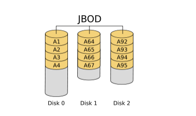
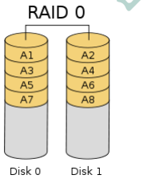
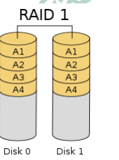
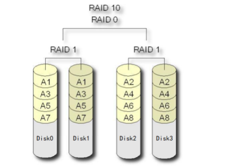
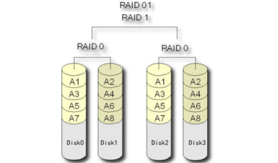

## 1. RAID磁盘阵列:

### 1. RAID历史:

`RAID ---- 独立磁盘冗余阵列（ Redundant Array of Independent Disks ）`

1988 年美国加州大学伯克利分校的 D. A. Patterson 教授等首次在论文 “A Case of Redundant Array of Inexpensive Disks” 中提出了 RAID 概念 ，即廉价冗余磁盘阵列（ Redundant Array of Inexpensive Disks ）。由于当时大容量磁盘比较昂贵， RAID 的基本思想是将多个容量较小、相对廉价的磁盘进行有机组合，从而以较低的成本获得与昂贵大容量磁盘相当的容量、性能、可靠性。随着磁盘成本和价格的不断降低， “廉价” 已经毫无意义。因此， RAID 咨询委员会（ RAID Advisory Board, RAB ）决定用“ 独立 ” 替代 “ 廉价 ” ，于时 `RAID 变成了独立磁盘冗余阵列（ Redundant Array of Independent Disks ）`。但这仅仅是名称的变化，实质内容没有改变。

### 2. RAID等级:

RAID 技术作为高性能、高可靠的存储技术，得到了非常广泛的应用。 

RAID 主要利用镜像、数据条带和数据校验三种技术来获取高性能、可靠性、容错能力和扩展性. 

根据对这三种技术的使用策略和组合架构，可以把 RAID 分为不同的等级，以满足不同数据应用的需求。

目前业界与学术界公认的标准是 RAID0 ~ RAID6 ，而在实际应用领域中使用最多的 RAID 等级是 RAID0 、 RAID1 、 RAID3 、 RAID5 、 RAID6 和 RAID10。

### 3. 关键技术:

**镜像技术:**

镜像技术是一种冗余技术，为磁盘提供数据备份功能，防止磁盘发生故障而造成数据丢失。对于 RAID而言，采用`镜像技术`最典型地的用法就是，`同时在磁盘阵列中产生两个完全相同的数据副本，并且分布在两个不同的磁盘上`。

镜像提供了完全的数据冗余能力，当一个数据副本失效不可用时，外部系统仍可正常访问另一副本，不会对应用系统运行和性能产生影响。而且，`镜像不需要额外的计算和校验，故障修复非常快，直接复制即可`。

镜像技术可以从多个副本进行并发读取数据，提供更高的读 I/O 性能，但不能并行写数据，写多个副本通常会导致一定的 I/O 性能下降。

镜像技术提供了非常高的数据安全性，其代价也是非常昂贵的，需要至少双倍的存储空间。高成本限制了镜像的广泛应用，主要应用于至关重要的数据保护，这种场合下的数据丢失可能会造成非常巨大的损失。

**数据条带技术:**

数据条带化技术是一种自动将 I/O操作负载均衡到多个物理磁盘上的技术。更具体地说就是，将一块连续的数据分成很多小部分并把它们分别存储到不同磁盘上。这就能使多个进程可以并发访问数据的多个不同部分，从而获得最大程度上的 I/O 并行能力，极大地提升性能。

**数据校验技术:**

数据校验技术是指， RAID 要在写入数据的同时进行校验计算，并将得到的校验数据存储在 RAID 成员磁盘中。校验数据可以集中保存在某个磁盘或分散存储在多个不同磁盘中。`当其中一部分数据出错时，就可以对剩余数据和校验数据进行反校验计算重建丢失的数据。`

数据校验技术相对于镜像技术的优势在于节省大量开销，但由于每次数据读写都要进行大量的校验运算，对计算机的运算速度要求很高，且必须使用硬件 RAID 控制器。在数据重建恢复方面，检验技术比镜像技术复杂得多且慢得多。

### 4. RAID分类:

从实现角度看， RAID 主要分为软 RAID、硬 RAID 以及混合 RAID 三种。
**软 RAID**

所有功能均有操作系统和 CPU 来完成，没有独立的 RAID 控制处理芯片和 I/O 处理芯片，效率自然最低。

**硬 RAID**

配备了专门的 RAID 控制处理芯片和 I/O 处理芯片以及阵列缓冲，不占用 CPU 资源。效率很高，但成本也很高。

**混合 RAID**

具备 RAID 控制处理芯片，但没有专门的I/O 处理芯片，需要 CPU 和驱动程序来完成。性能和成本在软RAID 和硬 RAID 之间。

5 常见RAID等级详解 

**JBOD **

JBOD ，Just a Bunch of Disks，磁盘簇。表示一个没有控制软件提供协调控制的磁盘集合，这是 RAID区别与 JBOD 的主要因素。 JBOD 将多个物理磁盘串联起来，提供一个巨大的逻辑磁盘。

JBOD 的数据存放机制是由第一块磁盘开始按顺序往后存储，当前磁盘存储空间用完后，再依次往后面的磁盘存储数据。 JBOD 存储性能完全等同于单块磁盘，而且也不提供数据安全保护。

> 其只是简单提供一种扩展存储空间的机制，JBOD可用存储容量等于所有成员磁盘的存储空间之 和 JBOD 常指磁盘柜，而不论其是否提供 RAID 功能。不过，JBOD并非官方术语，官方称为Spanning。 

**RAID0**

RAID0 是一种简单的、无数据校验的数据条带化技术。实际上不是一种真正的 RAID ，因为它并不提供任何形式的冗余策略。 RAID0 将所在磁盘条带化后组成大容量的存储空间，将数据分散存储在所有磁盘中，以独立访问方式实现多块磁盘的并读访问。

理论上讲，一个由 n 块磁盘组成的 RAID0 ，它的读写性能是单个磁盘性能的 n 倍，但由于总线带宽等多种因素的限制，实际的性能提升低于理论值。由于可以并发执行 I/O 操作，总线带宽得到充分利用。再加上不需要进行数据校验，RAID0 的性能在所有 RAID 等级中是最高的。 

RAID0 具有低成本、高读写性能、 100% 的高存储空间利用率等优点，但是它不提供数据冗余保护，一旦数据损坏，将无法恢复。

应用场景：对数据的顺序读写要求不高，对数据的安全性和可靠性要求不高，但对系统性能要求很高的
场景。

> RAID0与JBOD相同点：  
>
> 1）存储容量：都是成员磁盘容量总和 
>
> 2）磁盘利用率，都是100%，即都没有做任何的数据冗余备份 
>
> RAID0与JBOD不同点： 
>
> JBOD：数据是顺序存放的，一个磁盘存满后才会开始存放到下一个磁盘
> RAID：各个磁盘中的数据写入是并行的，是通过数据条带技术写入的。其读写性能是JBOD的n 倍 

**RAID1** 

RAID1 就是一种镜像技术，它将数据完全一致地分别写到工作磁盘和镜像磁盘，它的磁盘空间利用率为 50% 。 RAID1 在数据写入时，响应时间会有所影响，但是读数据的时候没有影响。 RAID1 提供了最佳的数据保护，一旦工作磁盘发生故障，系统将自动切换到镜像磁盘，不会影响使用。

RAID1是为了增强数据安全性使两块磁盘数据呈现完全镜像，从而达到安全性好、技术简单、管理方便。 RAID1 拥有完全容错的能力，但实现成本高。

应用场景：对顺序读写性能要求较高，或对数据安全性要求较高的场景。

**RAID10** 

RAID10是一个RAID1与RAID0的组合体，所以它继承了RAID0的快速和RAID1的安全。

简单来说就是，先做条带，再做镜像。发即将进来的数据先分散到不同的磁盘，再将磁盘中的数据做镜像。

**RAID01**

RAID01是一个RAID0与RAID1的组合体，所以它继承了RAID0的快速和RAID1的安全。
简单来说就是，先做镜像再做条带。即将进来的数据先做镜像，再将镜像数据写入到与之前数据不同的磁盘，即再做条带。

> RAID10要比RAID01的容错率再高，所以生产环境下一般是不使用RAID01的。