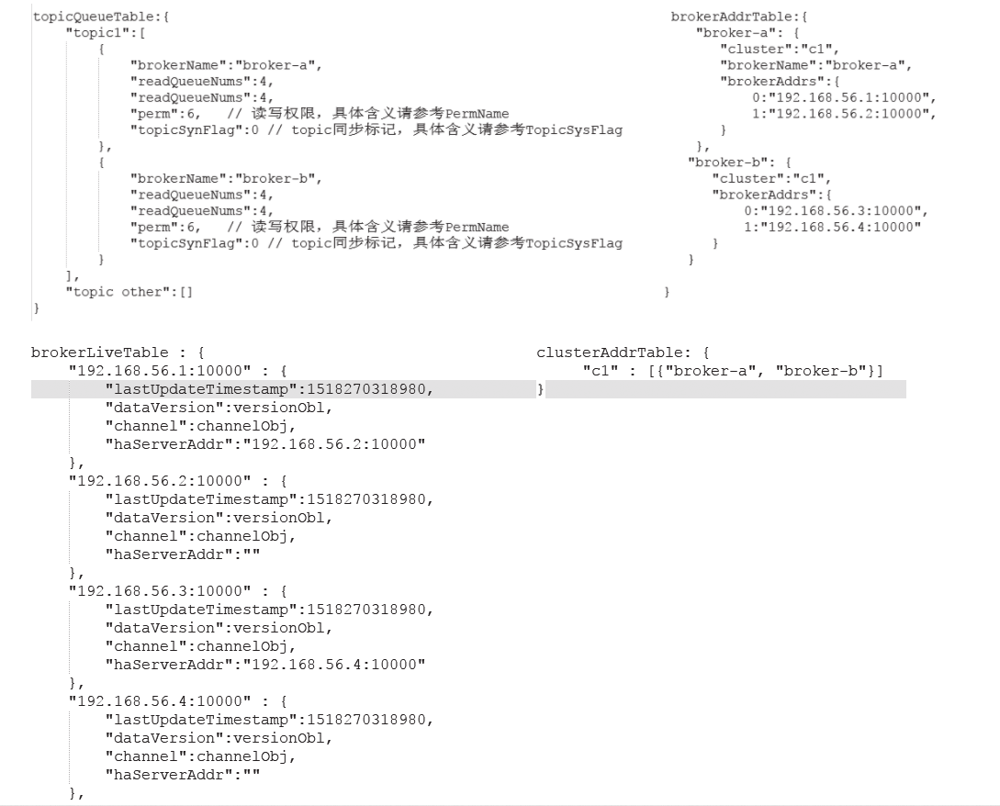

## 1. NameServer启动流程:

### 1. NameServer配置相关:

#### 1. 启动时加载配置信息维护:

rocketmq通过`NamesrvConfig`维护了NameServer默认的配置文件加载路径.

```java
public class NamesrvConfig {
    // rocketmq主目录, 主要是用于读取配置文件, 存储数据等.
    private String rocketmqHome = System.getProperty(MixAll.ROCKETMQ_HOME_PROPERTY, System.getenv(MixAll.ROCKETMQ_HOME_ENV));
    // nameServer kv格式配置文件默认路径 ${user.home}/namesrv/kvConfig.json
    private String kvConfigPath = System.getProperty("user.home") + File.separator + "namesrv" + File.separator + "kvConfig.json";
    // nameServer properties格式配置文件默认路径 ${user.home}/namesrv/namesrv.properties
    private String configStorePath = System.getProperty("user.home") + File.separator + "namesrv" + File.separator + "namesrv.properties";
    private String productEnvName = "center";
    private boolean clusterTest = false;
    // 是否开启顺序消息, 默认不支持
    private boolean orderMessageEnable = false;

    // 省略了一系列的get set
}
```

#### 2. netty通信server端相关配置:

rocketmq通过`NettyServerConfig`维护了netty通信server端的一些默认配置:

```java
public class NettyServerConfig implements Cloneable {
    // nameserver监听端口, 会被初始化成9876
    private int listenPort = 8888;
    
    // ------------------------  线程模型中线程池线管配置 --------------------------------
    // netty worker线程数量,即 nettyReactor模型中的从reactor线程池
    // IO线程池个数，主要是NameServer、Broker端解析请求、返回相应的线程个数，这类线程主要是处理网路请求的，
    // 解析请求包，然后转发到各个业务线程池完成具体的操作，然后将结果返回给调用方
    private int serverSelectorThreads = 3;
    // netty 业务线程池线程数量
    private int serverWorkerThreads = 8;
    // netty public任务线程池线程数量, Netty网络设计，根据业务类型会创建不同的线程池，
    // 比如处理消息发送、消息消费、心跳检测等。如果该业务类型未注册线程池，则由public线程池执行。
    private int serverCallbackExecutorThreads = 0;

    // send oneway消息并发读信号量(broker端的一个参数)
    private int serverOnewaySemaphoreValue = 256;
    // 异步消息发送最大并发读(broker端参数)
    private int serverAsyncSemaphoreValue = 64;
    // 网络连接最大空闲时间, 单位秒
    private int serverChannelMaxIdleTimeSeconds = 120;
    // 网络socket发送缓冲区大小
    private int serverSocketSndBufSize = NettySystemConfig.socketSndbufSize;
    // 网络socket接收缓冲区大小
    private int serverSocketRcvBufSize = NettySystemConfig.socketRcvbufSize;
    // netty池化缓冲区分配器是否开启
    private boolean serverPooledByteBufAllocatorEnable = true;
    // 是否使用epoll io模型
    private boolean useEpollNativeSelector = false;


	// 省略了一些列的get set
}
```

### 2. 启动流程:

整个`NameServer`启动的时序图如下: 并没有给出NameServer 开启了tls的时候的相关步骤


`NamesrvController`, 是`NameServer`的一个抽象, 代表着一个`NameServer实例`,

**NamesrvController重要属性**

```java
public class NamesrvController {
    private static final InternalLogger log = InternalLoggerFactory.getLogger(LoggerName.NAMESRV_LOGGER_NAME);
	// --------------------------- 配置信息相关 ---------------------------------------
    private final NamesrvConfig namesrvConfig;
    private final NettyServerConfig nettyServerConfig;
	private Configuration configuration;
    private final KVConfigManager kvConfigManager;
    
    // --------------------------- 通信相关 ---------------------------------------
    // 路由信息管理器
    private final RouteInfoManager routeInfoManager;
    // netty server
    private RemotingServer remotingServer;
    // nameserver与broker通信的 io事件监听器
    private BrokerHousekeepingService brokerHousekeepingService;

    // --------------------------- 功能线程池相关 ---------------------------------------
    // 单线程定时任务线程池
    private final ScheduledExecutorService scheduledExecutorService = Executors.newSingleThreadScheduledExecutor(new ThreadFactoryImpl(
        "NSScheduledThread"));
    // namesrv的业务线程池
    private ExecutorService remotingExecutor;
    private FileWatchService fileWatchService;
    
    // .... 省略方法
}
```


`NameServer`启动的过程大概可以分成2部分:

1. 创建`NamesrvController`, 并加载核心配置 `NamesrvConfig`, `NettyServerConfig`.
2. 初始化`NamesrvController`, 创建jvm关闭的钩子线程(在关闭时做一些资源的释放), 并启动


#### 1. 创建`NamesrvController`加载核心配置:

`NamesrvStartup`是`Namesrv`启动的入口, 通过main0方法开启`Namesrv`启动的流程.

```java
    public static NamesrvController main0(String[] args) {
        try {
            // 创建namesrvController
            NamesrvController controller = createNamesrvController(args);
            // 启动controller, 主要是启动netty服务端, nameserver相关的服务
            start(controller);
			
            // 省略部分代码...
            return controller;
        } catch (Throwable e) {
            e.printStackTrace();
            System.exit(-1);
        }
        return null;
    }
```

`createNamesrvController(args)`方法中, 主要是对核心配置文件进行加载, 根据namesrv的启动命令判断是否需要对默认配置进行修改.

```java
public static NamesrvController createNamesrvController(String[] args) throws IOException, JoranException {
    System.setProperty(RemotingCommand.REMOTING_VERSION_KEY, Integer.toString(MQVersion.CURRENT_VERSION));
    //PackageConflictDetect.detectFastjson();
	// 将命令行参数封装为CommandLine对象
    Options options = ServerUtil.buildCommandlineOptions(new Options());
    commandLine = ServerUtil.parseCmdLine("mqnamesrv", args, buildCommandlineOptions(options), new PosixParser());
    if (null == commandLine) {
        System.exit(-1);
        return null;
    }

    // nameServer相关配置
    final NamesrvConfig namesrvConfig = new NamesrvConfig();
    // netty相关配置
    final NettyServerConfig nettyServerConfig = new NettyServerConfig();
    // 设置nameServer默认端进口
    nettyServerConfig.setListenPort(9876);
    // 解析启动命令行里面的'-c'参数, 即指定的nameServer配置文件路径, 比如 -c ./nameserver.conf
    if (commandLine.hasOption('c')) {
        String file = commandLine.getOptionValue('c');
        if (file != null) {
			// ... 通过工具类将命令行指定的配置文件加载并覆盖namesrvConfig, nettyServerConfig
        }
    }
    // 解析启动命令行里面的'-p'参数, 比如 属性名=属性值, -p是用来指定某个参数的
    if (commandLine.hasOption('p')) {
        InternalLogger console = InternalLoggerFactory.getLogger(LoggerName.NAMESRV_CONSOLE_NAME);
        MixAll.printObjectProperties(console, namesrvConfig);
        MixAll.printObjectProperties(console, nettyServerConfig);
        System.exit(0);
    }

    // 解析控制台命令
    MixAll.properties2Object(ServerUtil.commandLine2Properties(commandLine), namesrvConfig);

    if (null == namesrvConfig.getRocketmqHome()) {
        System.out.printf("Please set the %s variable in your environment to match the location of the RocketMQ installation%n", MixAll.ROCKETMQ_HOME_ENV);
        System.exit(-2);
    }

    // ...省略logger配置加载,创建logger相关代码

    // 这里就是在创建namerserver 的controller,创建KVConfigManager,RouteInfoManager,BrokerHousekeepingService,Configuration
    // 设置storePath
    final NamesrvController controller = new NamesrvController(namesrvConfig, nettyServerConfig);

    // remember all configs to prevent discard
    controller.getConfiguration().registerConfig(properties);

    return controller;
}
```

`namesrvController`构造器:

```java
    public NamesrvController(NamesrvConfig namesrvConfig, NettyServerConfig nettyServerConfig) {
        this.namesrvConfig = namesrvConfig;
        this.nettyServerConfig = nettyServerConfig;
        this.kvConfigManager = new KVConfigManager(this);
        this.routeInfoManager = new RouteInfoManager();
        this.brokerHousekeepingService = new BrokerHousekeepingService(this);
        this.configuration = new Configuration(
            log,
            this.namesrvConfig, this.nettyServerConfig
        );
        this.configuration.setStorePathFromConfig(this.namesrvConfig, "configStorePath");
    }
```

至此创建完成.

#### 2. 初始化controller, 并启动:

回到`NamesrvStartup`的main0方法调用`start(controller);`, 

```java
public static NamesrvController start(final NamesrvController controller) throws Exception {

        if (null == controller) {
            throw new IllegalArgumentException("NamesrvController is null");
        }

        // 初始化一些NameServer的相关组件, 定时任务, 如netty服务端, kv配置日志记录任务, 离线broker路由信息的删除任务
        boolean initResult = controller.initialize();
        if (!initResult) {
            controller.shutdown();
            System.exit(-3);
        }

        // 开启一个NameServerController关闭钩子线程, 一旦NameServerController关闭就释放资源, 主要是一些线程池的关闭
        Runtime.getRuntime().addShutdownHook(new ShutdownHookThread(log, new Callable<Void>() {
            @Override
            public Void call() throws Exception {
                controller.shutdown();
                return null;
            }
        }));

        // 正式启动,主要是nettyserver, fileWatchService的启动
        controller.start();

        return controller;
    }
```

通过`controller.initialize()`方法, 一一处理 `json格式配置文件加载`, `初始化nettyServer`, `创建业务线程池`, `注册业务processer`, `初始化定时任务---broker下线`, `初始化定时任务---kv配置记录`,

`创建tls服务线程fileWatchService`.

```java
public boolean initialize() {
    // json格式配置文件加载
    this.kvConfigManager.load();
    // 启动netty server, brokerHousekeepingService是事件监听器
    this.remotingServer = new NettyRemotingServer(this.nettyServerConfig, this.brokerHousekeepingService);

    // 创建业务线程池
    this.remotingExecutor =
        Executors.newFixedThreadPool(nettyServerConfig.getServerWorkerThreads(), new ThreadFactoryImpl("RemotingExecutorThread_"));

    // 注册业务processor
    this.registerProcessor();

    // 创建一个定时任务,定时去扫描哪些不活跃的broker, 每10s扫描一次
    this.scheduledExecutorService.scheduleAtFixedRate(new Runnable() {

        @Override
        public void run() {
            NamesrvController.this.routeInfoManager.scanNotActiveBroker();
        }
    }, 5, 10, TimeUnit.SECONDS);

    // 创建一个定时任务,每10秒在日志中打印一下kv配置
    this.scheduledExecutorService.scheduleAtFixedRate(new Runnable() {

        @Override
        public void run() {
            NamesrvController.this.kvConfigManager.printAllPeriodically();
        }
    }, 1, 10, TimeUnit.MINUTES);

    // ....省略tls相关, todo 暂时(20.10.16)不管

    return true;
}
```

- **nettyServer的初始化**

  `NettyRemotingServer`是RocketMq对netty通信框架中server端的一个抽象.里面维护了通信时的相关组件.

  ```java
  public class NettyRemotingServer extends NettyRemotingAbstract implements RemotingServer {
      private static final InternalLogger log = InternalLoggerFactory.getLogger(RemotingHelper.ROCKETMQ_REMOTING);
      // --------------------------- 配置信息相关 ---------------------------------------
      private final NettyServerConfig nettyServerConfig;
      private int port = 0;
  
      // --------------------------- 通信组件 ---------------------------------------
      // 启动器
      private final ServerBootstrap serverBootstrap;
      // netty bossGroup,主要负责I/O事件OP_ACCEPT
      private final EventLoopGroup eventLoopGroupBoss;
      // neety workerGroup,主要负责I/O事件OP_CONNECT, OP_READ, OP_WRITE
      private final EventLoopGroup eventLoopGroupSelector;
      private final ChannelEventListener channelEventListener;
      // public业务执行线程池
      private final ExecutorService publicExecutor;
  
      // --------------------------- 通信业务线程池 ---------------------------------------
      // 通信业务消息发送、消息消费、心跳检测,编解码,功能业务转发等
      private DefaultEventExecutorGroup defaultEventExecutorGroup;
  
      // --------------------------- handler ---------------------------------------
      private HandshakeHandler handshakeHandler;
      private NettyEncoder encoder;
      private NettyConnectManageHandler connectionManageHandler;
      private NettyServerHandler serverHandler;
  
  }
  ```
  
  通过构造函数创建`netty server`
  
  ```java
  public NettyRemotingServer(final NettyServerConfig nettyServerConfig,
          final ChannelEventListener channelEventListener) {
          // 主要是设置了oneway和async两种消息的并发信号量,namesrv无关主要是broker端配置
          super(nettyServerConfig.getServerOnewaySemaphoreValue(), nettyServerConfig.getServerAsyncSemaphoreValue());
          this.serverBootstrap = new ServerBootstrap();
          this.nettyServerConfig = nettyServerConfig;
          this.channelEventListener = channelEventListener;
  
          // 如果配置文件没有配置netty 共用线程池线程数量的话,将其设置为4
          int publicThreadNums = nettyServerConfig.getServerCallbackExecutorThreads();
          if (publicThreadNums <= 0) {
              publicThreadNums = 4;
          }
          // 创建public线程池
          this.publicExecutor = Executors.newFixedThreadPool(publicThreadNums, new ThreadFactory() {
              private AtomicInteger threadIndex = new AtomicInteger(0);
  
              @Override
              public Thread newThread(Runnable r) {
                  return new Thread(r, "NettyServerPublicExecutor_" + this.threadIndex.incrementAndGet());
              }
          });
  
          if (useEpoll()) {
              // 使用epoll
              // 创建bossGroup
              this.eventLoopGroupBoss = new EpollEventLoopGroup(1, new ThreadFactory() {
                  private AtomicInteger threadIndex = new AtomicInteger(0);
  
                  @Override
                  public Thread newThread(Runnable r) {
                      return new Thread(r, String.format("NettyEPOLLBoss_%d", this.threadIndex.incrementAndGet()));
                  }
              });
  
              // 创建worker group, 默认3个线程
              this.eventLoopGroupSelector = new EpollEventLoopGroup(nettyServerConfig.getServerSelectorThreads(), new ThreadFactory() {
                  private AtomicInteger threadIndex = new AtomicInteger(0);
                  private int threadTotal = nettyServerConfig.getServerSelectorThreads();
  
                  @Override
                  public Thread newThread(Runnable r) {
                      return new Thread(r, String.format("NettyServerEPOLLSelector_%d_%d", threadTotal, this.threadIndex.incrementAndGet()));
                  }
              });
          } else {
              // 不使用epoll
              // boss
              this.eventLoopGroupBoss = new NioEventLoopGroup(1, new ThreadFactory() {
                  private AtomicInteger threadIndex = new AtomicInteger(0);
  
                  @Override
                  public Thread newThread(Runnable r) {
                      return new Thread(r, String.format("NettyNIOBoss_%d", this.threadIndex.incrementAndGet()));
                  }
              });
  
              // worker,默认3个线程
              this.eventLoopGroupSelector = new NioEventLoopGroup(nettyServerConfig.getServerSelectorThreads(), new ThreadFactory() {
                  private AtomicInteger threadIndex = new AtomicInteger(0);
                  private int threadTotal = nettyServerConfig.getServerSelectorThreads();
  
                  @Override
                  public Thread newThread(Runnable r) {
                      return new Thread(r, String.format("NettyServerNIOSelector_%d_%d", threadTotal, this.threadIndex.incrementAndGet()));
                  }
              });
          }
          // 加载ssl上下文,创建sslHandler使用的
          loadSslContext();
      }
  ```
  
- **注册业务processer**

  ```java
  private void registerProcessor() {
          if (namesrvConfig.isClusterTest()) {
              // 集群测试
              this.remotingServer.registerDefaultProcessor(new ClusterTestRequestProcessor(this, namesrvConfig.getProductEnvName()),
                  this.remotingExecutor);
          } else {
              // 正常启动
              this.remotingServer.registerDefaultProcessor(new DefaultRequestProcessor(this), this.remotingExecutor);
          }
      }
  ```

通过`Runtime.getRuntime().addShutdownHook()`给jvm注册一个钩子线程, 当jvm关闭时就做一些资源释放操作: `contrller.shutdown()`

```java
    public void shutdown() {
        this.remotingServer.shutdown();
        this.remotingExecutor.shutdown();
        this.scheduledExecutorService.shutdown();

        if (this.fileWatchService != null) {
            this.fileWatchService.shutdown();
        }
    }
```

通过`controller.start();`正式启动,主要是nettyserver, fileWatchService的启动

```java
    public void start() throws Exception {
        this.remotingServer.start();

        if (this.fileWatchService != null) {
            this.fileWatchService.start();
        }
    }
```

## 2. 路由管理:

> 路由发现在rocketmq源码解析消息发现的时候已经讲了

###  1. 路由元信息:

rockermq的路由元信息, 包含`topic与队列的映射关系`, `brokerName与broker信息的映射关系`, `clusterName与brokerName的映射关系`, `broker地址与broker活跃信息的映射关系`, `broker地址和消息过滤服务器信息的映射关系`等几个核心数据.

这些数据都封装在 `RouteInfoManager` 类中.

```java
public class RouteInfoManager {
    private static final InternalLogger log = InternalLoggerFactory.getLogger(LoggerName.NAMESRV_LOGGER_NAME);
    // 默认broker过期时间, 即broker上一次更新时间 + 这个过期时间 > 当前时间表示broker不活跃
    private final static long BROKER_CHANNEL_EXPIRED_TIME = 1000 * 60 * 2;
    private final ReadWriteLock lock = new ReentrantReadWriteLock();
    // topic与queue的映射关系
    private final HashMap<String/* topic */, List<QueueData>> topicQueueTable;
    // brokerName与broker的映射关系
    private final HashMap<String/* brokerName */, BrokerData> brokerAddrTable;
    // cluster与broker的映射关系, broker属于哪个集群
    private final HashMap<String/* clusterName */, Set<String/* brokerName */>> clusterAddrTable;
    // 活跃broker的缓存, broker地址 -> broker信息
    private final HashMap<String/* brokerAddr */, BrokerLiveInfo> brokerLiveTable;
    // 消息过滤相关信息
    private final HashMap<String/* brokerAddr */, List<String>/* Filter Server */> filterServerTable;
    
    // ... 省略了方法
}
```



> 说明:
>
> 1. 一个主从broker用brokerName表示,代表一个broker集群,其中brokerId为0的表示master. 多个主从broker集群构成一个cluster.

`QueueData`: 表示topic对应的所有queue信息概览

```java
public class QueueData implements Comparable<QueueData> {
    // 队列所属于的主从broker集群的brokerName
    private String brokerName;
    // 读队列
    private int readQueueNums;
    // 写队列
    private int writeQueueNums;
    // 队列权限, 可读, 可写, 读写
    private int perm;
    // topic系统标志
    private int topicSysFlag;
    // ... 省略了方法
}
```

`BrokerData`: 表示主从broker集群的信息

```java
public class BrokerData implements Comparable<BrokerData> {
    // 主从broker集群所属的cluster
    private String cluster;
    // 主从broker集群的名字
    private String brokerName;
    // brokerId 与 broker address的缓存
    private HashMap<Long/* brokerId */, String/* broker address */> brokerAddrs;
	
    // ... 省略了方法
}
```

`BrokerLiveInfo`: 表示仍然活跃的broker信息.

```java
class BrokerLiveInfo {
    // broker信息上一次更新的时间
    private long lastUpdateTimestamp;
    // broker数据版本
    private DataVersion dataVersion;
    // broker与namesrv之间的channel
    private Channel channel;
    // 高可用地址
    private String haServerAddr;
}
```

### 2. 路由注册:


#### 1. 发送请求:

路由注册的入口是在broker启动的时候, 开启了一个定时任务去周期性的注册broker信息. 周期的时间范围是`10s - 60s`.

**_org.apache.rocketmq.broker.BrokerController#start()_**: 

```java
		// 如果设置了不开启DledgerCommitLog,先注册一次
		if (!messageStoreConfig.isEnableDLegerCommitLog()) {
            startProcessorByHa(messageStoreConfig.getBrokerRole());
            handleSlaveSynchronize(messageStoreConfig.getBrokerRole());
            this.registerBrokerAll(true, false, true);
        }
		// 开个定时任务
        this.scheduledExecutorService.scheduleAtFixedRate(new Runnable() {

            @Override
            public void run() {
                try {
                    BrokerController.this.registerBrokerAll(true, false, brokerConfig.isForceRegister());
                } catch (Throwable e) {
                    log.error("registerBrokerAll Exception", e);
                }
            }
        }, 1000 * 10, Math.max(10000, Math.min(brokerConfig.getRegisterNameServerPeriod(), 60000)), TimeUnit.MILLISECONDS);
```

**_org.apache.rocketmq.broker.BrokerController#registerBrokerAll()_**: 

这个方法主要是对已经存在的topic根据broker的可读可写性质设置topic的权限.

然后如果`需要强制注册broker`, 或者`broker中存在topic数据版本与namesrv版本不一致`, 都调用`doRegisterBrokerAll(checkOrderConfig, oneway, topicConfigWrapper);`去注册broker(实际上是更新数据)

> `changeToMaster()`, `changeToSlave()`.当broker角色切换的时候, 会通过oneway方式去发送一次注册broker的请求.

```java
public synchronized void registerBrokerAll(final boolean checkOrderConfig, boolean oneway, boolean forceRegister) {
    TopicConfigSerializeWrapper topicConfigWrapper = this.getTopicConfigManager().buildTopicConfigSerializeWrapper();
    // 如果broker不可读, 或者不可写. 将原有topic配置都设置成不可读或者不可写
    if (!PermName.isWriteable(this.getBrokerConfig().getBrokerPermission())
        || !PermName.isReadable(this.getBrokerConfig().getBrokerPermission())) {
        ConcurrentHashMap<String, TopicConfig> topicConfigTable = new ConcurrentHashMap<String, TopicConfig>();
        for (TopicConfig topicConfig : topicConfigWrapper.getTopicConfigTable().values()) {
            TopicConfig tmp =
                new TopicConfig(topicConfig.getTopicName(), topicConfig.getReadQueueNums(), topicConfig.getWriteQueueNums(),
                    this.brokerConfig.getBrokerPermission());
            topicConfigTable.put(topicConfig.getTopicName(), tmp);
        }
        topicConfigWrapper.setTopicConfigTable(topicConfigTable);
    }

    // 需要强制注册, 或者需要注册(needRegister主要是根据namesrv中保存的topic数据版本和broker中对比)
    if (forceRegister || needRegister(this.brokerConfig.getBrokerClusterName(),
        this.getBrokerAddr(),
        this.brokerConfig.getBrokerName(),
        this.brokerConfig.getBrokerId(),
        this.brokerConfig.getRegisterBrokerTimeoutMills())) {
        doRegisterBrokerAll(checkOrderConfig, oneway, topicConfigWrapper);
    }
}
```

```java
needRegister(this.brokerConfig.getBrokerClusterName(),
        this.getBrokerAddr(),
        this.brokerConfig.getBrokerName(),
        this.brokerConfig.getBrokerId(),
        this.brokerConfig.getRegisterBrokerTimeoutMills()))
```

这一坨代码实际上就是broker与namesrv之间的心跳机制, 通过注册的定时任务一起定时向namesrv发送心跳数据.

> 注意: netty也有心跳机制的实现, 是用来维护netty客户端与netty服务端之间连接的, 与broker和namesrv之间的心跳机制作用是不同的.

**_org.apache.rocketmq.broker.BrokerController#doRegisterBrokerAll()_**: 

主要是再根据注册结果中, Nameserver响应进行 :

1. message HA master地址的变更
2. 给slave结点同步master地址
3. 修改顺序topic的配置

```java
	private void doRegisterBrokerAll(boolean checkOrderConfig, boolean oneway,
        TopicConfigSerializeWrapper topicConfigWrapper) {
        // 注册
        List<RegisterBrokerResult> registerBrokerResultList = this.brokerOuterAPI.registerBrokerAll(
            this.brokerConfig.getBrokerClusterName(),
            this.getBrokerAddr(),
            this.brokerConfig.getBrokerName(),
            this.brokerConfig.getBrokerId(),
            this.getHAServerAddr(),
            topicConfigWrapper,
            this.filterServerManager.buildNewFilterServerList(),
            oneway,
            this.brokerConfig.getRegisterBrokerTimeoutMills(),
            this.brokerConfig.isCompressedRegister());
        
        // 根据Nameserver响应进行 :
        // 1. message HA master地址的变更
        // 2. 给slave结点同步master地址
        // 3. 修改顺序topic的配置
        if (registerBrokerResultList.size() > 0) {
            RegisterBrokerResult registerBrokerResult = registerBrokerResultList.get(0);
            if (registerBrokerResult != null) {
                if (this.updateMasterHAServerAddrPeriodically && registerBrokerResult.getHaServerAddr() != null) {
                    this.messageStore.updateHaMasterAddress(registerBrokerResult.getHaServerAddr());
                }

                this.slaveSynchronize.setMasterAddr(registerBrokerResult.getMasterAddr());

                if (checkOrderConfig) {
                    this.getTopicConfigManager().updateOrderTopicConfig(registerBrokerResult.getKvTable());
                }
            }
        }
    }
```

**_org.apache.rocketmq.broker.out.BrokerOuterAPI#registerBrokerAll()_**: 

主要是封装请求头,请求体, 然后通过CountDownLatch并发向所有namesrv注册, 然后将响应结果存入registerBrokerResultList返回

```java
public List<RegisterBrokerResult> registerBrokerAll(
    final String clusterName,
    final String brokerAddr,
    final String brokerName,
    final long brokerId,
    final String haServerAddr,
    final TopicConfigSerializeWrapper topicConfigWrapper,
    final List<String> filterServerList,
    final boolean oneway,
    final int timeoutMills,
    final boolean compressed) {

    final List<RegisterBrokerResult> registerBrokerResultList = new CopyOnWriteArrayList<>();
    List<String> nameServerAddressList = this.remotingClient.getNameServerAddressList();
    if (nameServerAddressList != null && nameServerAddressList.size() > 0) {
        // 封装注册broker的请求头
        final RegisterBrokerRequestHeader requestHeader = new RegisterBrokerRequestHeader();
        requestHeader.setBrokerAddr(brokerAddr);
        requestHeader.setBrokerId(brokerId);
        requestHeader.setBrokerName(brokerName);
        requestHeader.setClusterName(clusterName);
        requestHeader.setHaServerAddr(haServerAddr);
        requestHeader.setCompressed(compressed);
		
        // 封装请求体
        RegisterBrokerBody requestBody = new RegisterBrokerBody();
        requestBody.setTopicConfigSerializeWrapper(topicConfigWrapper);
        requestBody.setFilterServerList(filterServerList);
        final byte[] body = requestBody.encode(compressed);
        final int bodyCrc32 = UtilAll.crc32(body);
        requestHeader.setBodyCrc32(bodyCrc32);
        // 通过countDownLatch并发向所有的namesrv注册broker
        final CountDownLatch countDownLatch = new CountDownLatch(nameServerAddressList.size());
        for (final String namesrvAddr : nameServerAddressList) {
            brokerOuterExecutor.execute(new Runnable() {
                @Override
                public void run() {
                    try {
                        // 注册
                        RegisterBrokerResult result = registerBroker(namesrvAddr, oneway, timeoutMills, requestHeader, body);
                        if (result != null) {
                            registerBrokerResultList.add(result);
                        }

                        log.info("register broker[{}]to name server {} OK", brokerId, namesrvAddr);
                    } catch (Exception e) {
                        log.warn("registerBroker Exception, {}", namesrvAddr, e);
                    } finally {
                        countDownLatch.countDown();
                    }
                }
            });
        }

        try {
            countDownLatch.await(timeoutMills, TimeUnit.MILLISECONDS);
        } catch (InterruptedException e) {
        }
    }

    return registerBrokerResultList;
}
```

**_org.apache.rocketmq.broker.out.BrokerOuterAPI#registerBrokerAll()_**: 主要是调用netty client发送请求, 对请求结果的封装

```java
    private RegisterBrokerResult registerBroker(
        final String namesrvAddr,
        final boolean oneway,
        final int timeoutMills,
        final RegisterBrokerRequestHeader requestHeader,
        final byte[] body
    ) throws RemotingCommandException, MQBrokerException, RemotingConnectException, RemotingSendRequestException, RemotingTimeoutException,
        InterruptedException {
        RemotingCommand request = RemotingCommand.createRequestCommand(RequestCode.REGISTER_BROKER, requestHeader);
        request.setBody(body);
		
        // oneway方式注册
        if (oneway) {
            try {
                this.remotingClient.invokeOneway(namesrvAddr, request, timeoutMills);
            } catch (RemotingTooMuchRequestException e) {
                // Ignore
            }
            return null;
        }
		
        // netty 客户端发送注册请求了
        RemotingCommand response = this.remotingClient.invokeSync(namesrvAddr, request, timeoutMills);
        assert response != null;
        
        switch (response.getCode()) {
            case ResponseCode.SUCCESS: {
                RegisterBrokerResponseHeader responseHeader =
                    (RegisterBrokerResponseHeader) response.decodeCommandCustomHeader(RegisterBrokerResponseHeader.class);
                RegisterBrokerResult result = new RegisterBrokerResult();
                result.setMasterAddr(responseHeader.getMasterAddr());
                result.setHaServerAddr(responseHeader.getHaServerAddr());
                if (response.getBody() != null) {
                    result.setKvTable(KVTable.decode(response.getBody(), KVTable.class));
                }
                return result;
            }
            default:
                break;
        }

        throw new MQBrokerException(response.getCode(), response.getRemark(), requestHeader == null ? null : requestHeader.getBrokerAddr());
    }
```

#### 2. 处理注册请求:


***org.apache.rocketmq.namesrv.processor.DefaultRequestProcessor#processRequest()***: namesrv处理网络请求都是在这个接口中.

```java
    @Override
    public RemotingCommand processRequest(ChannelHandlerContext ctx,
        RemotingCommand request) throws RemotingCommandException {

        if (ctx != null) {
            log.debug("receive request, {} {} {}",
                request.getCode(),
                RemotingHelper.parseChannelRemoteAddr(ctx.channel()),
                request);
        }


        switch (request.getCode()) {
            // ... 省略,其他case
            case RequestCode.REGISTER_BROKER:
                Version brokerVersion = MQVersion.value2Version(request.getVersion());
                if (brokerVersion.ordinal() >= MQVersion.Version.V3_0_11.ordinal()) {
                    return this.registerBrokerWithFilterServer(ctx, request);
                } else {
                    return this.registerBroker(ctx, request);
                }
			// ...省略, 其他case
            default:
                break;
        }
        return null;
    }
```

***org.apache.rocketmq.namesrv.processor.DefaultRequestProcessor#registerBrokerWithFilterServer()***: 以3.0以上版本注册为例, 3.0前后版本注册流程都差不多.都是从namesrvController拿到路由管理器,进行注册

```java
public RemotingCommand registerBrokerWithFilterServer(ChannelHandlerContext ctx, RemotingCommand request)
        throws RemotingCommandException {
        final RemotingCommand response = RemotingCommand.createResponseCommand(RegisterBrokerResponseHeader.class);
        final RegisterBrokerResponseHeader responseHeader = (RegisterBrokerResponseHeader) response.readCustomHeader();
        final RegisterBrokerRequestHeader requestHeader =
            (RegisterBrokerRequestHeader) request.decodeCommandCustomHeader(RegisterBrokerRequestHeader.class);
		
    	// 
        if (!checksum(ctx, request, requestHeader)) {
            response.setCode(ResponseCode.SYSTEM_ERROR);
            response.setRemark("crc32 not match");
            return response;
        }

        RegisterBrokerBody registerBrokerBody = new RegisterBrokerBody();

        if (request.getBody() != null) {
            try {
                registerBrokerBody = RegisterBrokerBody.decode(request.getBody(), requestHeader.isCompressed());
            } catch (Exception e) {
                throw new RemotingCommandException("Failed to decode RegisterBrokerBody", e);
            }
        } else {
            registerBrokerBody.getTopicConfigSerializeWrapper().getDataVersion().setCounter(new AtomicLong(0));
            registerBrokerBody.getTopicConfigSerializeWrapper().getDataVersion().setTimestamp(0);
        }
		// 核心代码
        RegisterBrokerResult result = this.namesrvController.getRouteInfoManager().registerBroker(
            requestHeader.getClusterName(),
            requestHeader.getBrokerAddr(),
            requestHeader.getBrokerName(),
            requestHeader.getBrokerId(),
            requestHeader.getHaServerAddr(),
            registerBrokerBody.getTopicConfigSerializeWrapper(),
            registerBrokerBody.getFilterServerList(),
            ctx.channel());

        responseHeader.setHaServerAddr(result.getHaServerAddr());
        responseHeader.setMasterAddr(result.getMasterAddr());

        byte[] jsonValue = this.namesrvController.getKvConfigManager().getKVListByNamespace(NamesrvUtil.NAMESPACE_ORDER_TOPIC_CONFIG);
        response.setBody(jsonValue);

        response.setCode(ResponseCode.SUCCESS);
        response.setRemark(null);
        return response;
    }
```

***org.apache.rocketmq.namesrv.routeinfo.RouteInfoManager#sregisterBroker()***

> 注册流程:
>
> 1. 注册brokerName到clusterAddrTable{clusterName -> set{brokerNames}}
> 2. 注册具体实例到brokerAddrTable{brokerName -> brokerData}
> 3. 注册更新master broker的topicQueueTable{topic,queueData}
> 4. 更新brokerLiveTable{brokerAddr->BrokerLiveInfo}
> 5. 更新filterServerTable{brokerAddr->List<FilterServer>}

```java
    /**
     *
     * @param clusterName --- cluster集群名称
     * @param brokerAddr --- 待注册broker地址
     * @param brokerName --- 待注册broker所属broker集群名称
     * @param brokerId --- 待注册broker
     * @param haServerAddr
     * @param topicConfigWrapper
     * @param filterServerList
     * @param channel
     * @return
     */
    public RegisterBrokerResult registerBroker(
        final String clusterName,
        final String brokerAddr,
        final String brokerName,
        final long brokerId,
        final String haServerAddr,
        final TopicConfigSerializeWrapper topicConfigWrapper,
        final List<String> filterServerList,
        final Channel channel) {
        RegisterBrokerResult result = new RegisterBrokerResult();
        try {
            /**
             * 注册流程:
             * 1. 注册brokerName到clusterAddrTable{clusterName -> set{brokerNames}}
             * 2. 注册具体实例到brokerAddrTable{brokerName -> brokerData}
             * 3. 注册更新master broker的topicQueueTable{topic,queueData}
             * 4. 更新brokerLiveTable{brokerAddr->BrokerLiveInfo}
             * 5. 更新filterServerTable{brokerAddr->List<FilterServer>}
             */
            try {
                // 写锁,路由元数据写入串行化
                this.lock.writeLock().lockInterruptibly();

                // ---------------------------------------- 1. 注册brokerName到clusterAddrTable{clusterName->set{brokerNames}} ------------------------------------
                Set<String> brokerNames = this.clusterAddrTable.get(clusterName);
                if (null == brokerNames) {
                    brokerNames = new HashSet<String>();
                    this.clusterAddrTable.put(clusterName, brokerNames);
                }
                brokerNames.add(brokerName);

                boolean registerFirst = false;

                // ---------------------------------------- 2. 注册具体实例到brokerAddrTable{brokerName -> brokerData} ---------------------------------------------
                BrokerData brokerData = this.brokerAddrTable.get(brokerName);
                if (null == brokerData) {
                    registerFirst = true;
                    brokerData = new BrokerData(clusterName, brokerName, new HashMap<Long, String>());
                    this.brokerAddrTable.put(brokerName, brokerData);
                }
                Map<Long, String> brokerAddrsMap = brokerData.getBrokerAddrs();
                //Switch slave to master: first remove <1, IP:PORT> in namesrv, then add <0, IP:PORT>
                //The same IP:PORT must only have one record in brokerAddrTable
                Iterator<Entry<Long, String>> it = brokerAddrsMap.entrySet().iterator();
                while (it.hasNext()) {
                    Entry<Long, String> item = it.next();
                    if (null != brokerAddr && brokerAddr.equals(item.getValue()) && brokerId != item.getKey()) {
                        it.remove();
                    }
                }

                String oldAddr = brokerData.getBrokerAddrs().put(brokerId, brokerAddr);
                // null == brokerData || null == oldAddr, 即没有broker的数据, 或者brokerAddrs里面没有待注册broker的地址都是第一次注册
                registerFirst = registerFirst || (null == oldAddr);


                // ---------------------------------------- 3. 注册更新master broker的topicQueueTable{topic,queueData} --------------------------------------------
                // 记录或者更新master中topic信息,topicQueueTable
                if (null != topicConfigWrapper
                    && MixAll.MASTER_ID == brokerId) {
                    if (this.isBrokerTopicConfigChanged(brokerAddr, topicConfigWrapper.getDataVersion())
                        || registerFirst) {
                        ConcurrentMap<String, TopicConfig> tcTable =
                            topicConfigWrapper.getTopicConfigTable();
                        if (tcTable != null) {
                            for (Map.Entry<String, TopicConfig> entry : tcTable.entrySet()) {
                                this.createAndUpdateQueueData(brokerName, entry.getValue());
                            }
                        }
                    }
                }

                // -------------------------- 4.更新brokerLiveTable{brokerAddr->BrokerLiveInfo}-----------------------------------------------
                BrokerLiveInfo prevBrokerLiveInfo = this.brokerLiveTable.put(brokerAddr,
                    new BrokerLiveInfo(
                        System.currentTimeMillis(),
                        topicConfigWrapper.getDataVersion(),
                        channel,
                        haServerAddr));
                if (null == prevBrokerLiveInfo) {
                    log.info("new broker registered, {} HAServer: {}", brokerAddr, haServerAddr);
                }

                // --------------------------5更新filterServerTable{}List<FilterServer>-----------------------------------------------
                if (filterServerList != null) {
                    if (filterServerList.isEmpty()) {
                        this.filterServerTable.remove(brokerAddr);
                    } else {
                        this.filterServerTable.put(brokerAddr, filterServerList);
                    }
                }
                // 封装HA信息
                if (MixAll.MASTER_ID != brokerId) {
                    String masterAddr = brokerData.getBrokerAddrs().get(MixAll.MASTER_ID);
                    if (masterAddr != null) {
                        BrokerLiveInfo brokerLiveInfo = this.brokerLiveTable.get(masterAddr);
                        if (brokerLiveInfo != null) {
                            result.setHaServerAddr(brokerLiveInfo.getHaServerAddr());
                            result.setMasterAddr(masterAddr);
                        }
                    }
                }
            } finally {
                this.lock.writeLock().unlock();
            }
        } catch (Exception e) {
            log.error("registerBroker Exception", e);
        }

        return result;
    }
```

### 3. 路由剔除:

`路由剔除`的入口有两处:

1. namesrvContoller初始化的时候,创建了一个定时任务, 该任务会周期性的去判断brokerLiveInfo是否过期,过期就把相关的路由信息剔除掉.
2. Broker 在正常被关闭的情况下，会执行unregisterBroker 指令。

> 效果都是将元数据删除, 一个是namesrv主动删除, 一个是broker主动请求删除

#### 1. broker长时间未发送心跳包:


***org.apache.rocketmq.namesrv.NamesrvController#initialize()***: 初始化时创建broker剔除的定时任务

```java
    public boolean initialize() {
        // ...省略,加载kv配置

        // ...省略启动netty server, brokerHousekeepingService是事件监听器


        // ...省略,创建业务线程池


        // ...省略,注册业务processor

        // 创建一个定时任务,定时去扫描哪些不活跃的broker, 每10s扫描一次
        this.scheduledExecutorService.scheduleAtFixedRate(new Runnable() {

            @Override
            public void run() {
                NamesrvController.this.routeInfoManager.scanNotActiveBroker();
            }
        }, 5, 10, TimeUnit.SECONDS);

        // ...省略,每10秒在日志中打印一下kv配置

        // ...省略,ls相关, todo 暂时(20.10.16)不管

        return true;
    }

```

 ***org.apache.rocketmq.namesrv.routeinfo.RouteInfoManager#scanNotActiveBroker()***: 遍历brokerLiveTable, 如果brokerLiveInfo.getLastUpdateTimestamp() + 120s < 当前时间, 表示brokerLiveInfo表示的broker过期了,将其从brokerLiveInfo缓存中剔除,并关闭其连接

```java
    /**
     * 从活跃broker缓存中判断broker是否还存活
     */
    public void scanNotActiveBroker() {
        Iterator<Entry<String/* brokerAddr */, BrokerLiveInfo>> it = this.brokerLiveTable.entrySet().iterator();
        while (it.hasNext()) {
            Entry<String, BrokerLiveInfo> next = it.next();
            long last = next.getValue().getLastUpdateTimestamp();
            if ((last + BROKER_CHANNEL_EXPIRED_TIME) < System.currentTimeMillis()) {
                RemotingUtil.closeChannel(next.getValue().getChannel());
                // 将broker从brokerLiveTable中移除
                it.remove();
                log.warn("The broker channel expired, {} {}ms", next.getKey(), BROKER_CHANNEL_EXPIRED_TIME);
                // 下面剔除其他的路由元数据
                this.onChannelDestroy(next.getKey(), next.getValue().getChannel());
            }
        }
    }
```

***org.apache.rocketmq.namesrv.routeinfo.RouteInfoManager#onChannelDestroy()***: 真正的路由元数据剔除

> 整个路由元数据剔除流程:
>
> 心跳信息 -> 过滤信息 -> 从主备broker集群数据中删除对应broker地址 -> 某个集群所有ip地址都删除了,删除broker集群信息 -> 某个cluster集群中所有broker集群都被删除,删除cluster信息 -> 删除queue缓存信息

```java
public void onChannelDestroy(String remoteAddr, Channel channel) {
        // 存放brokerLiveTable中的key 即brokerAddr
        String brokerAddrFound = null;
        // 根据channel找到需要删除的brokerAddr,保证被判定为120s内没有再次注册的broker
        // 一定会被剔除
        if (channel != null) {
            try {
                try {
                    // 缓存用的是hashmap,存在并发问题, 加读锁,保证读取期间不会重新写入, 保证即使是在scanNotActiveBroker方法
                    // 删除心跳数据之后,在注册了一次,也会根据channel拿到应该删除的broker信息
                    this.lock.readLock().lockInterruptibly();
                    Iterator<Entry<String, BrokerLiveInfo>> itBrokerLiveTable =
                        this.brokerLiveTable.entrySet().iterator();
                    while (itBrokerLiveTable.hasNext()) {
                        Entry<String/* brokerAddr */, BrokerLiveInfo> entry = itBrokerLiveTable.next();
                        // 根据已经删除的broker与namesrv之间的channel拿到,对应brokerAddr
                        if (entry.getValue().getChannel() == channel) {
                            brokerAddrFound = entry.getKey();
                            break;
                        }
                    }
                } finally {
                    this.lock.readLock().unlock();
                }
            } catch (Exception e) {
                log.error("onChannelDestroy Exception", e);
            }
        }

        // 根据channel没有找到对应的brokerAddr, 说明待删除的broker在120s之后并没有再次注册
        // 也表示删除brokerLiveInfo后没有重新注册,就可以根据remoteAddr进行其他数据的剔除
        if (null == brokerAddrFound) {
            brokerAddrFound = remoteAddr;
        } else {
            log.info("the broker's channel destroyed, {}, clean it's data structure at once", brokerAddrFound);
        }

        if (brokerAddrFound != null && brokerAddrFound.length() > 0) {
            // 心跳信息 -> 过滤信息 -> 从主备broker集群数据中删除对应broker地址 -> 某个集群所有ip地址都删除了,删除broker集群信息
            // -> 某个cluster集群中所有broker集群都被删除,删除cluster信息 -> 删除queue缓存信息
            try {
                try {
                    // 所有的缓存都是hashmap,加上写锁保证路由剔除线程在删除数据的时候只有它自己在执行写操作.
                    this.lock.writeLock().lockInterruptibly();
                    this.brokerLiveTable.remove(brokerAddrFound);
                    this.filterServerTable.remove(brokerAddrFound);
                    String brokerNameFound = null;
                    boolean removeBrokerName = false;
                    //brokerAddrTable broker信息缓存,下面这while循环在删除与brokerAddrFound相同地址的broker信息
                    Iterator<Entry<String, BrokerData>> itBrokerAddrTable =
                        this.brokerAddrTable.entrySet().iterator();
                    while (itBrokerAddrTable.hasNext() && (null == brokerNameFound)) {
                        BrokerData brokerData = itBrokerAddrTable.next().getValue();

                        Iterator<Entry<Long/* brokerId */, String/* broker address */>> it = brokerData.getBrokerAddrs().entrySet().iterator();
                        // 从broker集群中删除掉掉线broker的地址信息缓存
                        while (it.hasNext()) {
                            Entry<Long, String> entry = it.next();
                            Long brokerId = entry.getKey();
                            String brokerAddr = entry.getValue();
                            if (brokerAddr.equals(brokerAddrFound)) {
                                brokerNameFound = brokerData.getBrokerName();
                                it.remove();
                                log.info("remove brokerAddr[{}, {}] from brokerAddrTable, because channel destroyed",
                                    brokerId, brokerAddr);
                                break;
                            }
                        }
                        // 如果broker集群中所有的broker地址信息都被删除了(比如单实例broker集群), 那么就删除掉这个集群的缓存信息
                        if (brokerData.getBrokerAddrs().isEmpty()) {
                            removeBrokerName = true;
                            itBrokerAddrTable.remove();
                            log.info("remove brokerName[{}] from brokerAddrTable, because channel destroyed",
                                brokerData.getBrokerName());
                        }
                    }

                    // 当某个broker集群被删除了, 需要删除对应的集群缓存信息
                    if (brokerNameFound != null && removeBrokerName) {
                        Iterator<Entry<String, Set<String>>> it = this.clusterAddrTable.entrySet().iterator();
                        while (it.hasNext()) {
                            Entry<String, Set<String>> entry = it.next();
                            String clusterName = entry.getKey();
                            Set<String> brokerNames = entry.getValue();
                            boolean removed = brokerNames.remove(brokerNameFound);
                            if (removed) {
                                log.info("remove brokerName[{}], clusterName[{}] from clusterAddrTable, because channel destroyed",
                                    brokerNameFound, clusterName);

                                if (brokerNames.isEmpty()) {
                                    log.info("remove the clusterName[{}] from clusterAddrTable, because channel destroyed and no broker in this cluster",
                                        clusterName);
                                    it.remove();
                                }

                                break;
                            }
                        }
                    }

                    // 移除broker对应的queue的路由信息
                    if (removeBrokerName) {
                        Iterator<Entry<String, List<QueueData>>> itTopicQueueTable =
                            this.topicQueueTable.entrySet().iterator();
                        while (itTopicQueueTable.hasNext()) {
                            Entry<String, List<QueueData>> entry = itTopicQueueTable.next();
                            String topic = entry.getKey();
                            List<QueueData> queueDataList = entry.getValue();

                            Iterator<QueueData> itQueueData = queueDataList.iterator();
                            while (itQueueData.hasNext()) {
                                QueueData queueData = itQueueData.next();
                                if (queueData.getBrokerName().equals(brokerNameFound)) {
                                    itQueueData.remove();
                                    log.info("remove topic[{} {}], from topicQueueTable, because channel destroyed",
                                        topic, queueData);
                                }
                            }

                            if (queueDataList.isEmpty()) {
                                itTopicQueueTable.remove();
                                log.info("remove topic[{}] all queue, from topicQueueTable, because channel destroyed",
                                    topic);
                            }
                        }
                    }
                } finally {
                    this.lock.writeLock().unlock();
                }
            } catch (Exception e) {
                log.error("onChannelDestroy Exception", e);
            }
        }
    }
```

#### 2. 正常关闭broker:

1. 发送`unregister_broker`请求:

   ***org.apache.rocketmq.broker.BrokerController#shutdown()***

   ```java
   // ... 省略,其他功能关闭代码
   
   this.unregisterBrokerAll();
   
   // ... 省略, 其他功能关闭代码
   ```

   ***org.apache.rocketmq.broker.BrokerController#unregisterBrokerAll()***

   ```java
       private void unregisterBrokerAll() {
           this.brokerOuterAPI.unregisterBrokerAll(
               this.brokerConfig.getBrokerClusterName(),
               this.getBrokerAddr(),
               this.brokerConfig.getBrokerName(),
               this.brokerConfig.getBrokerId());
       }
   ```
   
   ***org.apache.rocketmq.broker.out.BrokerOuterAPI#unregisterBrokerAll()***

   ```java
    public void unregisterBrokerAll(
           final String clusterName,
           final String brokerAddr,
           final String brokerName,
           final long brokerId
       ) {
           List<String> nameServerAddressList = this.remotingClient.getNameServerAddressList();
           if (nameServerAddressList != null) {
               for (String namesrvAddr : nameServerAddressList) {
                   try {
                       this.unregisterBroker(namesrvAddr, clusterName, brokerAddr, brokerName, brokerId);
                       log.info("unregisterBroker OK, NamesrvAddr: {}", namesrvAddr);
                   } catch (Exception e) {
                       log.warn("unregisterBroker Exception, {}", namesrvAddr, e);
                   }
               }
           }
       }
   ```
   
   ***org.apache.rocketmq.broker.out.BrokerOuterAPI#unregisterBrokerAll()***: 这里主要是想所有的`namesrv`发送`unregister_broker请求`

   ```java
    public void unregisterBroker(
           final String namesrvAddr,
           final String clusterName,
           final String brokerAddr,
           final String brokerName,
           final long brokerId
       ) throws RemotingConnectException, RemotingSendRequestException, RemotingTimeoutException, InterruptedException, MQBrokerException {
           UnRegisterBrokerRequestHeader requestHeader = new UnRegisterBrokerRequestHeader();
           requestHeader.setBrokerAddr(brokerAddr);
           requestHeader.setBrokerId(brokerId);
           requestHeader.setBrokerName(brokerName);
           requestHeader.setClusterName(clusterName);
           RemotingCommand request = RemotingCommand.createRequestCommand(RequestCode.UNREGISTER_BROKER, requestHeader);
   
           RemotingCommand response = this.remotingClient.invokeSync(namesrvAddr, request, 3000);
           assert response != null;
           switch (response.getCode()) {
               case ResponseCode.SUCCESS: {
                   return;
               }
               default:
                   break;
           }
   
           throw new MQBrokerException(response.getCode(), response.getRemark(), brokerAddr);
       }
   ```
   
   

2. namesrv处理请求: 

   

***org.apache.rocketmq.namesrv.processor.DefaultRequestProcessor#processRequest()***: namesrv处理网络请求都是在这个接口中.

```java
    @Override
    public RemotingCommand processRequest(ChannelHandlerContext ctx,
        RemotingCommand request) throws RemotingCommandException {

        if (ctx != null) {
            log.debug("receive request, {} {} {}",
                request.getCode(),
                RemotingHelper.parseChannelRemoteAddr(ctx.channel()),
                request);
        }


        switch (request.getCode()) {
            // ... 省略,其他case
            case RequestCode.UNREGISTER_BROKER:
                return this.unregisterBroker(ctx, request);
			// ...省略, 其他case
            default:
                break;
        }
        return null;
    }
```

***org.apache.rocketmq.namesrv.processor.DefaultRequestProcessor#processRequest()***: 封装下请求头, 将路由剔除相关参数传递给 RouteInfoManager处理.

```java
    public RemotingCommand unregisterBroker(ChannelHandlerContext ctx,
        RemotingCommand request) throws RemotingCommandException {
        final RemotingCommand response = RemotingCommand.createResponseCommand(null);
        // 重新封装请求头
        final UnRegisterBrokerRequestHeader requestHeader =
            (UnRegisterBrokerRequestHeader) request.decodeCommandCustomHeader(UnRegisterBrokerRequestHeader.class);
        // 真正路由剔除
        this.namesrvController.getRouteInfoManager().unregisterBroker(
            requestHeader.getClusterName(),
            requestHeader.getBrokerAddr(),
            requestHeader.getBrokerName(),
            requestHeader.getBrokerId());

        response.setCode(ResponseCode.SUCCESS);
        response.setRemark(null);
        return response;
    }
```

***org.apache.rocketmq.namesrv.routeinfo.RouteInfoManager#unregisterBroker()***: 根据broker端传来的数据剔除信息, 直接去剔除路由元数据

```java
    public void unregisterBroker(
        final String clusterName,
        final String brokerAddr,
        final String brokerName,
        final long brokerId) {
        try {
            try {
                // 这里因为是主动下限, 就不存在重新注册的情况, 直接根据broker地址来删除路由数据就ok了
                this.lock.writeLock().lockInterruptibly();
                BrokerLiveInfo brokerLiveInfo = this.brokerLiveTable.remove(brokerAddr);
                log.info("unregisterBroker, remove from brokerLiveTable {}, {}",
                    brokerLiveInfo != null ? "OK" : "Failed",
                    brokerAddr
                );

                this.filterServerTable.remove(brokerAddr);

                boolean removeBrokerName = false;
                BrokerData brokerData = this.brokerAddrTable.get(brokerName);
                if (null != brokerData) {
                    String addr = brokerData.getBrokerAddrs().remove(brokerId);
                    log.info("unregisterBroker, remove addr from brokerAddrTable {}, {}",
                        addr != null ? "OK" : "Failed",
                        brokerAddr
                    );

                    if (brokerData.getBrokerAddrs().isEmpty()) {
                        this.brokerAddrTable.remove(brokerName);
                        log.info("unregisterBroker, remove name from brokerAddrTable OK, {}",
                            brokerName
                        );
                        // broker集群所有实例都下线了
                        removeBrokerName = true;
                    }
                }
                // broker集群所有实例都下线了, 需要剔除brokerName对应的信息
                if (removeBrokerName) {
                    Set<String> nameSet = this.clusterAddrTable.get(clusterName);
                    if (nameSet != null) {
                        boolean removed = nameSet.remove(brokerName);
                        log.info("unregisterBroker, remove name from clusterAddrTable {}, {}",
                            removed ? "OK" : "Failed",
                            brokerName);

                        if (nameSet.isEmpty()) {
                            this.clusterAddrTable.remove(clusterName);
                            log.info("unregisterBroker, remove cluster from clusterAddrTable {}",
                                clusterName
                            );
                        }
                    }
                    // 删除topic信息
                    this.removeTopicByBrokerName(brokerName);
                }
            } finally {
                this.lock.writeLock().unlock();
            }
        } catch (Exception e) {
            log.error("unregisterBroker Exception", e);
        }
    }
```

### 3. 路由发现:

无论是消费者还是生产者, 路由发现的方式都是以下两种: 本质上都是主动从namesrv那里拉取路由信息

#### 1. 获取路由信息的入口:

1. 定时任务,定时更新topic的路由消息缓存起来

   ***org.apache.rocketmq.client.impl.factory.MQClientInstance#startScheduledTask()***

   ```java
           // 定时更新topic路由信息的任务,30s一次, 因此producer和consumer都不能实时感知broker的变化, todo 定时路由发现
           this.scheduledExecutorService.scheduleAtFixedRate(new Runnable() {
   
               @Override
               public void run() {
                   try {
                       MQClientInstance.this.updateTopicRouteInfoFromNameServer();
                   } catch (Exception e) {
                       log.error("ScheduledTask updateTopicRouteInfoFromNameServer exception", e);
                   }
               }
           }, 10, this.clientConfig.getPollNameServerInterval(), TimeUnit.MILLISECONDS);
   ```

2. 在需要使用的时候, 主动去拉取topic路由信息,(以生产者为例)

   ***org.apache.rocketmq.client.impl.producer.DefaultMQProducerImpl#tryToFindTopicPublishInfo()***

   ```java
   private TopicPublishInfo tryToFindTopicPublishInfo(final String topic) {
           TopicPublishInfo topicPublishInfo = this.topicPublishInfoTable.get(topic);
           if (null == topicPublishInfo || !topicPublishInfo.ok()) {
               this.topicPublishInfoTable.putIfAbsent(topic, new TopicPublishInfo());
               // 主动拉取topic信息的入口
               this.mQClientFactory.updateTopicRouteInfoFromNameServer(topic);
               topicPublishInfo = this.topicPublishInfoTable.get(topic);
           }
   
           // 判断topicPublishInfo是否可用,可用就返回, 否则用默认topic再去获取一次路由信息
           if (topicPublishInfo.isHaveTopicRouterInfo() || topicPublishInfo.ok()) {
               return topicPublishInfo;
           } else {
               this.mQClientFactory.updateTopicRouteInfoFromNameServer(topic, true, this.defaultMQProducer);
               topicPublishInfo = this.topicPublishInfoTable.get(topic);
               return topicPublishInfo;
           }
       }
   ```

   > 当没有对应的路由消息,或者路由消息不可用的时候才回去手动拉取

#### 2. namesrv查找路由信息的过程:

***DefaultRequestProcessor#processRequest***: 根据请求code找到相关processesor和处理该请求的线程池

```java
    @Override
    public RemotingCommand processRequest(ChannelHandlerContext ctx,
        RemotingCommand request) throws RemotingCommandException {
        // ... 省略了校验代码


        switch (request.getCode()) {
			// ... 省略了其他请求类型的case
            case RequestCode.GET_ROUTEINFO_BY_TOPIC:
                return this.getRouteInfoByTopic(ctx, request);
            // ... 省略了其他请求类型的case
            default:
                break;
        }
        return null;
    }
```

***DefaultRequestProcessor#getRouteInfoByTopic(ChannelHandlerContext ctx, RemotingCommand request)***: 从路由元数据中查询出对应topic信息

```java
public RemotingCommand getRouteInfoByTopic(ChannelHandlerContext ctx,
        RemotingCommand request) throws RemotingCommandException {
        final RemotingCommand response = RemotingCommand.createResponseCommand(null);
        final GetRouteInfoRequestHeader requestHeader =
            (GetRouteInfoRequestHeader) request.decodeCommandCustomHeader(GetRouteInfoRequestHeader.class);
        // 封装路由信息
        TopicRouteData topicRouteData = this.namesrvController.getRouteInfoManager().pickupTopicRouteData(requestHeader.getTopic());

        if (topicRouteData != null) {
            // 开启了顺序消息的话, 去查topic对应顺序消息的kv配置
            if (this.namesrvController.getNamesrvConfig().isOrderMessageEnable()) {
                String orderTopicConf =
                    this.namesrvController.getKvConfigManager().getKVConfig(NamesrvUtil.NAMESPACE_ORDER_TOPIC_CONFIG,
                        requestHeader.getTopic());
                topicRouteData.setOrderTopicConf(orderTopicConf);
            }

            byte[] content = topicRouteData.encode();
            response.setBody(content);
            response.setCode(ResponseCode.SUCCESS);
            response.setRemark(null);
            return response;
        }

        response.setCode(ResponseCode.TOPIC_NOT_EXIST);
        response.setRemark("No topic route info in name server for the topic: " + requestHeader.getTopic()
            + FAQUrl.suggestTodo(FAQUrl.APPLY_TOPIC_URL));
        return response;
    }
```

#### 3. 路由消息的更新:

***org.apache.rocketmq.client.impl.factory.MQClientInstance#updateTopicRouteInfoFromNameServer()***

```java
 public boolean updateTopicRouteInfoFromNameServer(final String topic, boolean isDefault,
        DefaultMQProducer defaultMQProducer) {
        try {
            if (this.lockNamesrv.tryLock(LOCK_TIMEOUT_MILLIS, TimeUnit.MILLISECONDS)) {
                try {
                    TopicRouteData topicRouteData;
                    if (isDefault && defaultMQProducer != null) {
                        // ----------------------------- 获取默认topic的路由信息 ---------------------------------- \\
                        topicRouteData = this.mQClientAPIImpl.getDefaultTopicRouteInfoFromNameServer(defaultMQProducer.getCreateTopicKey(),
                            1000 * 3);
                        if (topicRouteData != null) {
                            for (QueueData data : topicRouteData.getQueueDatas()) {
                                int queueNums = Math.min(defaultMQProducer.getDefaultTopicQueueNums(), data.getReadQueueNums());
                                // 默认topic路由信息中读写数量是一样的.
                                data.setReadQueueNums(queueNums);
                                data.setWriteQueueNums(queueNums);
                            }
                        }
                    } else {
                        // ----------------------------- 获取默认非默认topic的路由信息 ---------------------------------- \\
                        topicRouteData = this.mQClientAPIImpl.getTopicRouteInfoFromNameServer(topic, 1000 * 3);
                    }

                    if (topicRouteData != null) {
                        TopicRouteData old = this.topicRouteTable.get(topic);
                        boolean changed = topicRouteDataIsChange(old, topicRouteData);
                        if (!changed) {
                            changed = this.isNeedUpdateTopicRouteInfo(topic);
                        } else {
                            log.info("the topic[{}] route info changed, old[{}] ,new[{}]", topic, old, topicRouteData);
                        }

                        // 路由信息更新
                        if (changed) {
                            TopicRouteData cloneTopicRouteData = topicRouteData.cloneTopicRouteData();
                            // 更新broker信息
                            for (BrokerData bd : topicRouteData.getBrokerDatas()) {
                                this.brokerAddrTable.put(bd.getBrokerName(), bd.getBrokerAddrs());
                            }

                            // 更新生产者发送的topic信息
                            {
                                TopicPublishInfo publishInfo = topicRouteData2TopicPublishInfo(topic, topicRouteData);
                                publishInfo.setHaveTopicRouterInfo(true);
                                Iterator<Entry<String, MQProducerInner>> it = this.producerTable.entrySet().iterator();
                                while (it.hasNext()) {
                                    Entry<String, MQProducerInner> entry = it.next();
                                    MQProducerInner impl = entry.getValue();
                                    if (impl != null) {
                                        impl.updateTopicPublishInfo(topic, publishInfo);
                                    }
                                }
                            }

                            // 更新消费者订阅topic的信息
                            {
                                Set<MessageQueue> subscribeInfo = topicRouteData2TopicSubscribeInfo(topic, topicRouteData);
                                Iterator<Entry<String, MQConsumerInner>> it = this.consumerTable.entrySet().iterator();
                                while (it.hasNext()) {
                                    Entry<String, MQConsumerInner> entry = it.next();
                                    MQConsumerInner impl = entry.getValue();
                                    if (impl != null) {
                                        impl.updateTopicSubscribeInfo(topic, subscribeInfo);
                                    }
                                }
                            }
                            log.info("topicRouteTable.put. Topic = {}, TopicRouteData[{}]", topic, cloneTopicRouteData);
                            // 路由数据更新
                            this.topicRouteTable.put(topic, cloneTopicRouteData);
                            return true;
                        }
                    } else {
                        log.warn("updateTopicRouteInfoFromNameServer, getTopicRouteInfoFromNameServer return null, Topic: {}. [{}]", topic, this.clientId);
                    }
                } catch (MQClientException e) {
                    if (!topic.startsWith(MixAll.RETRY_GROUP_TOPIC_PREFIX)) {
                        log.warn("updateTopicRouteInfoFromNameServer Exception", e);
                    }
                } catch (RemotingException e) {
                    log.error("updateTopicRouteInfoFromNameServer Exception", e);
                    throw new IllegalStateException(e);
                } finally {
                    this.lockNamesrv.unlock();
                }
            } else {
                log.warn("updateTopicRouteInfoFromNameServer tryLock timeout {}ms. [{}]", LOCK_TIMEOUT_MILLIS, this.clientId);
            }
        } catch (InterruptedException e) {
            log.warn("updateTopicRouteInfoFromNameServer Exception", e);
        }

        return false;
    }
```

> producer和consumer的路由缓存实际上是有延迟的, 因为他们都是默认间隔30s从namesrv那里将路由信息拉取下来, 缓存在本地.然后发送消息的时候首先是从缓存中获取到对应topic的路由消息.当没有对应的路由消息,或者路由消息不可用的时候才回去手动拉取

***客户端路由消息的封装***:

***已发布topic信息***

```java
public class TopicPublishInfo {
    // 标记是否还是顺序消息
    private boolean orderTopic = false;
    // 标记是否存在路由信息
    private boolean haveTopicRouterInfo = false;
    // 队列信息
    private List<MessageQueue> messageQueueList = new ArrayList<MessageQueue>();
    // 线程内索引共享, 用于队列选择
    private volatile ThreadLocalIndex sendWhichQueue = new ThreadLocalIndex();
    // 路由信息
    private TopicRouteData topicRouteData;
}
```

***路由信息***

```java
public class TopicRouteData extends RemotingSerializable {
    // 顺序消息配置
    private String orderTopicConf;
    // 队列信息
    private List<QueueData> queueDatas;
    // broker信息
    private List<BrokerData> brokerDatas;
    // 过滤服务器信息
    private HashMap<String/* brokerAddr */, List<String>/* Filter Server */> filterServerTable;
}
```

##### 1. 生产者路由信息处理:

***MQClientInstance#topicRouteData2TopicPublishInfo(final String topic, final TopicRouteData route)***

```java
public static TopicPublishInfo topicRouteData2TopicPublishInfo(final String topic, final TopicRouteData route) {
        TopicPublishInfo info = new TopicPublishInfo();
        info.setTopicRouteData(route);
        // 处理顺序消息的配置信息,主要是封装消息要发送到哪些队列里面去
        if (route.getOrderTopicConf() != null && route.getOrderTopicConf().length() > 0) {
            String[] brokers = route.getOrderTopicConf().split(";");
            for (String broker : brokers) {
                String[] item = broker.split(":");
                int nums = Integer.parseInt(item[1]);
                for (int i = 0; i < nums; i++) {
                    MessageQueue mq = new MessageQueue(topic, item[0], i);
                    info.getMessageQueueList().add(mq);
                }
            }

            info.setOrderTopic(true);
        } else {
            // 非顺序消息的处理
            List<QueueData> qds = route.getQueueDatas();
            Collections.sort(qds);
            // 筛选出
            for (QueueData qd : qds) {
                if (PermName.isWriteable(qd.getPerm())) {
                    BrokerData brokerData = null;
                    // 获取可写队列对应broker
                    for (BrokerData bd : route.getBrokerDatas()) {
                        if (bd.getBrokerName().equals(qd.getBrokerName())) {
                            brokerData = bd;
                            break;
                        }
                    }

                    if (null == brokerData) {
                        continue;
                    }
                    // 排除没有master的broker主从集群
                    if (!brokerData.getBrokerAddrs().containsKey(MixAll.MASTER_ID)) {
                        continue;
                    }
                    // 将可写队列存入发布topic信息中
                    for (int i = 0; i < qd.getWriteQueueNums(); i++) {
                        MessageQueue mq = new MessageQueue(topic, qd.getBrokerName(), i);
                        info.getMessageQueueList().add(mq);
                    }
                }
            }

            info.setOrderTopic(false);
        }

        return info;
    }
```

##### 2. 消费者路由信息处理:

***MQClientInstance#topicRouteData2TopicPublishInfo(final String topic, final TopicRouteData route)***: 筛选出可读队列

```java
public static Set<MessageQueue> topicRouteData2TopicSubscribeInfo(final String topic, final TopicRouteData route) {
    Set<MessageQueue> mqList = new HashSet<MessageQueue>();
    List<QueueData> qds = route.getQueueDatas();
    for (QueueData qd : qds) {
        if (PermName.isReadable(qd.getPerm())) {
            for (int i = 0; i < qd.getReadQueueNums(); i++) {
                MessageQueue mq = new MessageQueue(topic, qd.getBrokerName(), i);
                mqList.add(mq);
            }
        }
    }

    return mqList;
}
```

## 3. 客户端对namesrv的选择:

在发送消息,或者消费之前, netty客户端都回去获取对应的channel来通信, 获取namesrv地址的逻辑也是在这里,轮询选择一个namesrvAddr然后缓存起来.

***NettyRemotingClient#getAndCreateChannel()***

```java
// addr 为空表示需要从namesrv获取broker的地址,因此获取是去获取namesrv的channel
private Channel getAndCreateChannel(final String addr) throws RemotingConnectException, InterruptedException {
        // 没有传入addr, 无法送缓存获取, 需要从namesrv中获取
        if (null == addr) {
            return getAndCreateNameserverChannel();
        }
        // 缓存中有addr对应channel,就获取缓存中的channel
        ChannelWrapper cw = this.channelTables.get(addr);
        if (cw != null && cw.isOK()) {
            return cw.getChannel();
        }
        // 缓存中没有就创建一个channel
        return this.createChannel(addr);
    }

//namesrv的选择实际上是从设置好的namesrvAddr中轮询一个出来通信,缓存在namesrvAddrChoosed里面
 private Channel getAndCreateNameserverChannel() throws RemotingConnectException, InterruptedException {
        // 获取当前producer连接到的namesrv地址
        String addr = this.namesrvAddrChoosed.get();
        // 尝试去缓存里面拿到一次
        if (addr != null) {
            ChannelWrapper cw = this.channelTables.get(addr);
            if (cw != null && cw.isOK()) {
                return cw.getChannel();
            }
        }

        // 通过namesrv地址无法获取到channel,就从namesrvAddrChoosed获取已经选择过的addr去尝试获取一个channel
        final List<String> addrList = this.namesrvAddrList.get();
        if (this.namesrvChannelLock.tryLock(LOCK_TIMEOUT_MILLIS, TimeUnit.MILLISECONDS)) {
            try {
                addr = this.namesrvAddrChoosed.get();
                if (addr != null) {
                    ChannelWrapper cw = this.channelTables.get(addr);
                    if (cw != null && cw.isOK()) {
                        return cw.getChannel();
                    }
                }
                // 从所有namesrv地址缓存里面轮询(获取上一次获取过的下一个)获取一个addr地址
                // 然后创建channel
                if (addrList != null && !addrList.isEmpty()) {
                    for (int i = 0; i < addrList.size(); i++) {
                        int index = this.namesrvIndex.incrementAndGet();
                        index = Math.abs(index);
                        index = index % addrList.size();
                        String newAddr = addrList.get(index);

                        this.namesrvAddrChoosed.set(newAddr);
                        log.info("new name server is chosen. OLD: {} , NEW: {}. namesrvIndex = {}", addr, newAddr, namesrvIndex);
                        Channel channelNew = this.createChannel(newAddr);
                        if (channelNew != null) {
                            return channelNew;
                        }
                    }
                    throw new RemotingConnectException(addrList.toString());
                }
            } finally {
                this.namesrvChannelLock.unlock();
            }
        } else {
            log.warn("getAndCreateNameserverChannel: try to lock name server, but timeout, {}ms", LOCK_TIMEOUT_MILLIS);
        }

        return null;
    }
```


