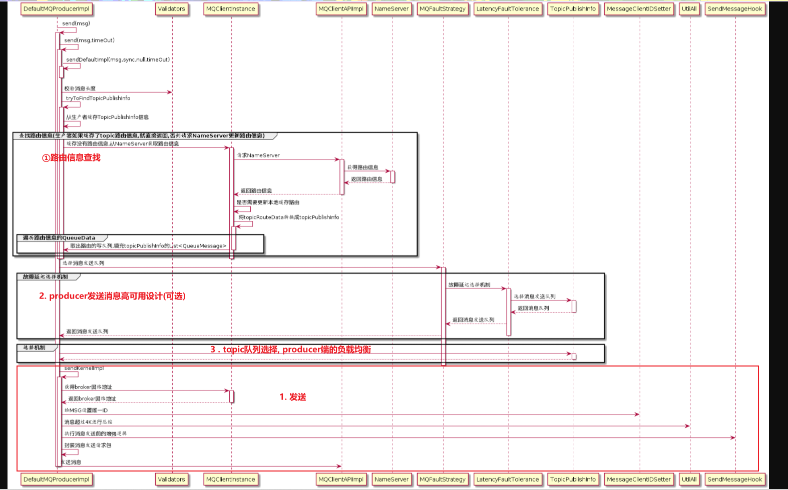
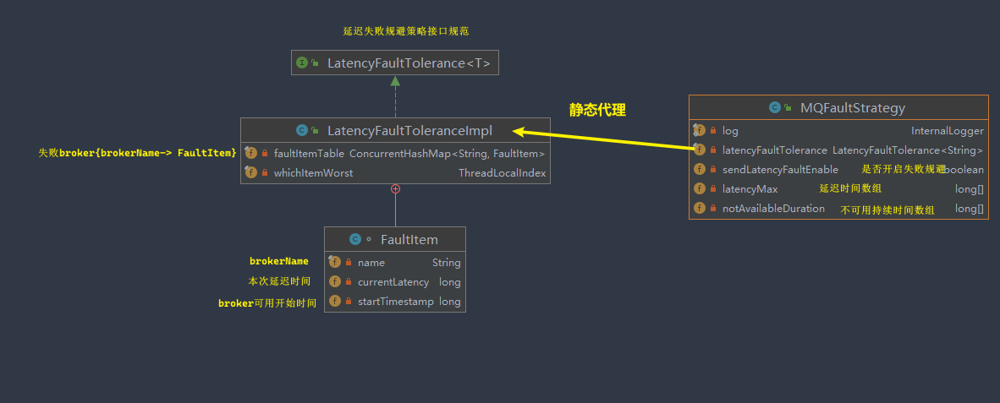

## 1. 核心类:

`org.apache.rocketmq.client.producer.MQProducer`: mq生产者的功能定义接口, 里面定义了生产者所有功能.

`org.apache.rocketmq.client.producer.DefaultMQProducer`: mq生产者组抽象, 所有的生产者功能的入口.

```java
public class DefaultMQProducer extends ClientConfig implements MQProducer {

    /**
     * 封装DefaultMQProducer几乎所有方法的实现
     */
    protected final transient DefaultMQProducerImpl defaultMQProducerImpl;
    private final InternalLogger log = ClientLogger.getLog();

    // 生产者组在概念上聚合了完全相同角色的生产者实例, 这对于事务消息十分重要.
    // 对于非事务消息，只要它在每个进程中是唯一的就可以了。
    private String producerGroup;

    /**
     * 在发送消息之前没有预先创建主题, broker又开启了允许自动创建主题, producer就可以使用这个字段去获取路由信息.
     */
    private String createTopicKey = TopicValidator.AUTO_CREATE_TOPIC_KEY_TOPIC;

    // 使用默认主题,创建队列的时候, 默认队列数量
    private volatile int defaultTopicQueueNums = 4;

    // 超时时间(毫秒), 4.3.0版本之前表示的是单次(重试)发送的重试时间, 4.3.0之后表示的是一次消息发送的总体时间.
    // 举个例子: 4.3.0之后, 假设一次消息发送不成功,重试了10次, 那么这个3000ms就是这11次尝试的总体时间
    private int sendMsgTimeout = 3000;

    // 超过4M的单条消息,会被压缩
    private int compressMsgBodyOverHowmuch = 1024 * 4;

    // 同步发送模式下, 消息发送失败默认重试次数. 可能导致消息重复, 需要开发人员解决消息重复问题
    private int retryTimesWhenSendFailed = 2;

    // 异步发送模式下, 消息发送失败默认重试次数.
    private int retryTimesWhenSendAsyncFailed = 2;

    // 消息发送失败, 是否发送给其他broker
    private boolean retryAnotherBrokerWhenNotStoreOK = false;
    
    // 单条消息最大长度. 网络中消息格式: Topic.length() + Body.length() + 20(日志开销) + 消息属性所占用的长度
    // broker端也有这个设置, 客户端的设置不应该超过broker端的配置, 即 客户端的配置应该 小于等于 broker端的设置  
    private int maxMessageSize = 1024 * 1024 * 4; // 4M
    /**
     * Interface of asynchronous transfer data
     */
    private TraceDispatcher traceDispatcher = null;
	
    // ... 省略方法
}
```

`org.apache.rocketmq.client.impl.producer.DefaultMQProducerImpl`: mq生产者组所有功能的实现类, 以组合的方式封装在`DefaultMQProducer`中

```java
public class DefaultMQProducerImpl implements MQProducerInner {
    private final InternalLogger log = ClientLogger.getLog();
    private final Random random = new Random();
    private final DefaultMQProducer defaultMQProducer;
    // 已经发送过的topic缓存
    private final ConcurrentMap<String/* topic */, TopicPublishInfo> topicPublishInfoTable =
        new ConcurrentHashMap<String, TopicPublishInfo>();
    private final ArrayList<SendMessageHook> sendMessageHookList = new ArrayList<SendMessageHook>();
    private final ArrayList<EndTransactionHook> endTransactionHookList = new ArrayList<EndTransactionHook>();
    private final RPCHook rpcHook;
    private final BlockingQueue<Runnable> asyncSenderThreadPoolQueue;
    private final ExecutorService defaultAsyncSenderExecutor;
    private final ScheduledExecutorService scheduledExecutorService = Executors.newSingleThreadScheduledExecutor(new ThreadFactory() {
        @Override
        public Thread newThread(Runnable r) {
            return new Thread(r, "RequestHouseKeepingService");
        }
    });
    protected BlockingQueue<Runnable> checkRequestQueue;
    protected ExecutorService checkExecutor;
    private ServiceState serviceState = ServiceState.CREATE_JUST;
    // 真正的生产者实例
    private MQClientInstance mQClientFactory;
    private ArrayList<CheckForbiddenHook> checkForbiddenHookList = new ArrayList<CheckForbiddenHook>();
    private int zipCompressLevel = Integer.parseInt(System.getProperty(MixAll.MESSAGE_COMPRESS_LEVEL, "5"));
    // 失败策略功能封装,producer端负载均衡就是在这个类中
    private MQFaultStrategy mqFaultStrategy = new MQFaultStrategy();
    private ExecutorService asyncSenderExecutor;
}
```

`org.apache.rocketmq.client.impl.producer.DefaultMQProducerImpl.MQClientInstance`: producer/consumer实例抽象, 表示不同的producer/consumer实例

```java
public class MQClientInstance {
    private final static long LOCK_TIMEOUT_MILLIS = 3000;
    private final InternalLogger log = ClientLogger.getLog();
    private final ClientConfig clientConfig;
    private final int instanceIndex;
    // 实例id,本质上是 进程id
    private final String clientId;
    private final long bootTimestamp = System.currentTimeMillis();
    // 生产者组缓存,实际上只会缓存groupName下,最新创建的DefualtMQProducerImpl对象
    private final ConcurrentMap<String/* group */, MQProducerInner> producerTable = new ConcurrentHashMap<String, MQProducerInner>();
    // 消费者组缓存
    private final ConcurrentMap<String/* group */, MQConsumerInner> consumerTable = new ConcurrentHashMap<String, MQConsumerInner>();
    // mq命令对象缓存
    private final ConcurrentMap<String/* group */, MQAdminExtInner> adminExtTable = new ConcurrentHashMap<String, MQAdminExtInner>();
    private final NettyClientConfig nettyClientConfig;
    private final MQClientAPIImpl mQClientAPIImpl;
    private final MQAdminImpl mQAdminImpl;
    // topic路由信息缓存
    private final ConcurrentMap<String/* Topic */, TopicRouteData> topicRouteTable = new ConcurrentHashMap<String, TopicRouteData>();
    private final Lock lockNamesrv = new ReentrantLock();
    private final Lock lockHeartbeat = new ReentrantLock();
    // broker地址缓存
    private final ConcurrentMap<String/* Broker Name */, HashMap<Long/* brokerId */, String/* address */>> brokerAddrTable =
        new ConcurrentHashMap<String, HashMap<Long, String>>();
    // broker版本缓存
    private final ConcurrentMap<String/* Broker Name */, HashMap<String/* address */, Integer>> brokerVersionTable =
        new ConcurrentHashMap<String, HashMap<String, Integer>>();
    private final ScheduledExecutorService scheduledExecutorService = Executors.newSingleThreadScheduledExecutor(new ThreadFactory() {
        @Override
        public Thread newThread(Runnable r) {
            return new Thread(r, "MQClientFactoryScheduledThread");
        }
    });
    private final ClientRemotingProcessor clientRemotingProcessor;
    // 拉消息服务,对应consumer
    private final PullMessageService pullMessageService;
    // rebalance机制服务,对应consumer
    private final RebalanceService rebalanceService;
    private final DefaultMQProducer defaultMQProducer;
    private final ConsumerStatsManager consumerStatsManager;
    private final AtomicLong sendHeartbeatTimesTotal = new AtomicLong(0);
    private ServiceState serviceState = ServiceState.CREATE_JUST;
    private Random random = new Random();
}
```

***org.apache.rocketmq.client.impl.MQClientManager***: 这个类主要是对MQ客户端的一个管理, producer和consumer都会从这个类获取到具体的实例.还会对缓存 {clientId -> MQClientInstance}的映射关系

```java
public class MQClientManager {
    private final static InternalLogger log = ClientLogger.getLog();
    private static MQClientManager instance = new MQClientManager();
    private AtomicInteger factoryIndexGenerator = new AtomicInteger();
    // 缓存 {clientId -> MQClientInstance}的映射关系
    private ConcurrentMap<String/* clientId */, MQClientInstance> factoryTable =
        new ConcurrentHashMap<String, MQClientInstance>();

    private MQClientManager() {

    }
    // 懒汉式单例, 使用单例是为了减少对象的创建, 因为不仅仅是producer要使用, consumer也会使用.
    public static MQClientManager getInstance() {
        return instance;
    }

}
```

## 2. producer的创建:

通常都是通过 `DefaultMQProducer`的构造函数来创建:

```java
DefaultMQProducer producer = new DefaultMQProducer("ProducerGroupName");
```

### 1. 创建流程:

***org.apache.rocketmq.client.producer.DefaultMQProducer#DefaultMQProducer()***

```java
	public DefaultMQProducer(final String producerGroup) {
        this(null, producerGroup, null);
    }

    public DefaultMQProducer(final String namespace, final String producerGroup, RPCHook rpcHook) {
        this.namespace = namespace;
        this.producerGroup = producerGroup;
        // 创建功能实现类
        defaultMQProducerImpl = new DefaultMQProducerImpl(this, rpcHook);
    }
```

***org.apache.rocketmq.client.impl.producer.DefaultMQProducerImpl#(DefaultMQProducerImpl)***

```java
    public DefaultMQProducerImpl(final DefaultMQProducer defaultMQProducer, RPCHook rpcHook) {
        this.defaultMQProducer = defaultMQProducer;
        this.rpcHook = rpcHook;

        this.asyncSenderThreadPoolQueue = new LinkedBlockingQueue<Runnable>(50000);
        // 异步发送线程池
        this.defaultAsyncSenderExecutor = new ThreadPoolExecutor(
            Runtime.getRuntime().availableProcessors(),
            Runtime.getRuntime().availableProcessors(),
            1000 * 60,
            TimeUnit.MILLISECONDS,
            this.asyncSenderThreadPoolQueue,
            new ThreadFactory() {
                private AtomicInteger threadIndex = new AtomicInteger(0);

                @Override
                public Thread newThread(Runnable r) {
                    return new Thread(r, "AsyncSenderExecutor_" + this.threadIndex.incrementAndGet());
                }
            });
    }
```

## 3. producer的启动:

***org.apache.rocketmq.client.producer.DefaultMQProducer#start()***: 把producerGroupName加上namespace, 启动defaultMQProducerImpl,traceDispatcher

```java
    public void start() throws MQClientException {
        // 除了设置producerGroup, 还设置了namespace todo 暂时不明白namespace是什么意思
        this.setProducerGroup(withNamespace(this.producerGroup));
        // 启动producer功能实现类
        this.defaultMQProducerImpl.start();
        // todo traceDispatcher不清楚是什么
        if (null != traceDispatcher) {
            try {
                traceDispatcher.start(this.getNamesrvAddr(), this.getAccessChannel());
            } catch (MQClientException e) {
                log.warn("trace dispatcher start failed ", e);
            }
        }
    }
```

***org.apache.rocketmq.client.impl.producer.DefaultMQProducerImpl#start()***

```java
public void start(final boolean startFactory) throws MQClientException {

        switch (this.serviceState) {// 默认serviceState = CREATE_JUST.
            case CREATE_JUST:
                this.serviceState = ServiceState.START_FAILED;

                this.checkConfig();
                // 默认将producer实例名称修改为进程id, 为配置实例名字时, 都是"Defualt", 这里将Default转换成PID#时间戳的形式,
                // 通过时间戳的形式区分同一个进程中不同的client(producer)实例
                if (!this.defaultMQProducer.getProducerGroup().equals(MixAll.CLIENT_INNER_PRODUCER_GROUP)) {
                    this.defaultMQProducer.changeInstanceNameToPID();
                }

                // 创建或者取出producer实例 ---------------- 1 MQClientInstance创建的过程
                this.mQClientFactory = MQClientManager.getInstance().getOrCreateMQClientInstance(this.defaultMQProducer, rpcHook);
                // 缓存当前producer实例所属于的producerGroup ------------------- 2 注册producer消费者组的过程
                boolean registerOK = mQClientFactory.registerProducer(this.defaultMQProducer.getProducerGroup(), this);
                if (!registerOK) {
                    this.serviceState = ServiceState.CREATE_JUST;
                    throw new MQClientException("The producer group[" + this.defaultMQProducer.getProducerGroup()
                        + "] has been created before, specify another name please." + FAQUrl.suggestTodo(FAQUrl.GROUP_NAME_DUPLICATE_URL),
                        null);
                }
                // 把默认的topic配置缓存起来
                this.topicPublishInfoTable.put(this.defaultMQProducer.getCreateTopicKey(), new TopicPublishInfo());

                // 启动MQClientInstance
                if (startFactory) {
                    mQClientFactory.start(); // -------------------- 3 MQClientInstance启动的过程
                }

                log.info("the producer [{}] start OK. sendMessageWithVIPChannel={}", this.defaultMQProducer.getProducerGroup(),
                    this.defaultMQProducer.isSendMessageWithVIPChannel());
                this.serviceState = ServiceState.RUNNING;
                break;
            case RUNNING:
            case START_FAILED:
            case SHUTDOWN_ALREADY:
                throw new MQClientException("The producer service state not OK, maybe started once, "
                    + this.serviceState
                    + FAQUrl.suggestTodo(FAQUrl.CLIENT_SERVICE_NOT_OK),
                    null);
            default:
                break;
        }
    	// ------------ todo
        this.mQClientFactory.sendHeartbeatToAllBrokerWithLock();
		// 启动定时任务, 扫描超时请求, 做一些处理
        this.startScheduledTask(); 

    }
```

> clientID: 
>
> 在4.2.0之前的版本, 只是简单的将instanceName, 改变为了程序进程的PID, 从而同一个进程中的程序所有produce的ClientID都是一样的, 所有producer拿到的MQClient实例都是同一个, 配置文件等都是使用的同一份.
>
> 后续的版本在InstanceName上做了改动, 将默认的instanceName改成了 PID@时间戳的形式, 让同一个进程中不同的producer也拥有不同的clientID, 使用不同的MQclient对象.

1. MQClientInstance创建的过程:

   ***org.apache.rocketmq.client.impl.MQClientManager#getOrCreateMQClientInstance():***

   ```java
       /**
        * 往缓存里面写入,根据写入缓存的返回结果(prev)是否为null返回MQClientInstance实例.
        * 如果 prev != null , 证明缓存中已经存在clientId对应的MQClientInstance,则返回已有实例.
        * 如果 prev == null, 证明缓存中没有clientId对应的MQClientInstance,则返回新创建的实例.
        * @param clientConfig --- defaultMQProducer
        * @param rpcHook --- 回调钩子
        * @return MQClientInstance
        */
       public MQClientInstance getOrCreateMQClientInstance(final ClientConfig clientConfig, RPCHook rpcHook) {
           // clientId = IP@Pid#时间戳@unitName, unitName可选
           String clientId = clientConfig.buildMQClientId();
           MQClientInstance instance = this.factoryTable.get(clientId);
           if (null == instance) {
               instance =
                   // MQClientInstance创建
                   new MQClientInstance(clientConfig.cloneClientConfig(),
                       this.factoryIndexGenerator.getAndIncrement(), clientId, rpcHook);
               MQClientInstance prev = this.factoryTable.putIfAbsent(clientId, instance);
               if (prev != null) {
                   instance = prev;
                   log.warn("Returned Previous MQClientInstance for clientId:[{}]", clientId);
               } else {
                   log.info("Created new MQClientInstance for clientId:[{}]", clientId);
               }
           }
   
           return instance;
       }
   ```

   ***org.apache.rocketmq.client.impl.factory.MQClientInstance#MQClientInstance()***

   ```java
       public MQClientInstance(ClientConfig clientConfig, int instanceIndex, String clientId, RPCHook rpcHook) {
           this.clientConfig = clientConfig;
           this.instanceIndex = instanceIndex;
           this.nettyClientConfig = new NettyClientConfig();
           this.nettyClientConfig.setClientCallbackExecutorThreads(clientConfig.getClientCallbackExecutorThreads());
           this.nettyClientConfig.setUseTLS(clientConfig.isUseTLS());
           this.clientRemotingProcessor = new ClientRemotingProcessor(this);
           // 创建netty client
           this.mQClientAPIImpl = new MQClientAPIImpl(this.nettyClientConfig, this.clientRemotingProcessor, rpcHook, clientConfig);
   
           if (this.clientConfig.getNamesrvAddr() != null) {
               this.mQClientAPIImpl.updateNameServerAddressList(this.clientConfig.getNamesrvAddr());
               log.info("user specified name server address: {}", this.clientConfig.getNamesrvAddr());
           }
   
           this.clientId = clientId;
   
           this.mQAdminImpl = new MQAdminImpl(this);
   
           this.pullMessageService = new PullMessageService(this);
   
           this.rebalanceService = new RebalanceService(this);
           // todo 这里为什么还要创建一个"CLIENT_INNER_PRODUCER_GROUP"组的DefaultMQProducer
           this.defaultMQProducer = new DefaultMQProducer(MixAll.CLIENT_INNER_PRODUCER_GROUP);
           this.defaultMQProducer.resetClientConfig(clientConfig);
   
           this.consumerStatsManager = new ConsumerStatsManager(this.scheduledExecutorService);
   
           log.info("Created a new client Instance, InstanceIndex:{}, ClientID:{}, ClientConfig:{}, ClientVersion:{}, SerializerType:{}",
               this.instanceIndex,
               this.clientId,
               this.clientConfig,
               MQVersion.getVersionDesc(MQVersion.CURRENT_VERSION), RemotingCommand.getSerializeTypeConfigInThisServer());
       }
   ```

2. 注册producer消费者组的过程:

   ***org.apache.rocketmq.client.impl.factory.MQClientInstance#registerProducer()***

   ```java
       /**
        * 存入Producer缓存中, 从这里可以看出来, defaultProducerImpl表示的是一个producerGroup
        * @param group --- 组名
        * @param producer --- defaultProducerImpl
        * @return
        */
       public synchronized boolean registerProducer(final String group, final DefaultMQProducerImpl producer) {
           if (null == group || null == producer) {
               return false;
           }
           // 防止producer group 启动多个进程
           MQProducerInner prev = this.producerTable.putIfAbsent(group, producer);
           if (prev != null) {
               log.warn("the producer group[{}] exist already.", group);
               return false;
           }
   
           return true;
       }
   ```

3. MQClientInstance启动的过程:

   ***org.apache.rocketmq.client.impl.factory.MQClientInstance#Start()***

   ```java
   public void start() throws MQClientException {
   
           synchronized (this) {
               switch (this.serviceState) {
                   case CREATE_JUST:
                       this.serviceState = ServiceState.START_FAILED;
                       // If not specified,looking address from name server
                       // todo rocketmq动态发现namesrvaddr的一个机制,好处是增加namesrv可以不用重启namesrv服务器?
                       if (null == this.clientConfig.getNamesrvAddr()) {
                           this.mQClientAPIImpl.fetchNameServerAddr();
                       }
                       // Start request-response channel,netty客户端启动
                       this.mQClientAPIImpl.start();
                       // Start various schedule tasks, 启动相关定时任务 
                       this.startScheduledTask();
                       // Start pull service, 启动拉消息的服务,针对consumer
                       this.pullMessageService.start();
                       // Start rebalance service, 消费者端consumerqueue和consumer的重新分配服务
                       this.rebalanceService.start();
                       // Start push service, 推消息服务, 这个也是针对consumer的, 向consumer发送消息自然不用再启动一个client
                       this.defaultMQProducer.getDefaultMQProducerImpl().start(false);
                       log.info("the client factory [{}] start OK", this.clientId);
                       this.serviceState = ServiceState.RUNNING;
                       break;
                   case START_FAILED:
                       throw new MQClientException("The Factory object[" + this.getClientId() + "] has been created before, and failed.", null);
                   default:
                       break;
               }
           }
       }
   ```

   1. `startScheduledTask`: 启动相关定时任务

      ```java
          private void startScheduledTask() {
              if (null == this.clientConfig.getNamesrvAddr()) {
                  // 定时动态获取namesrv地址的任务
                  this.scheduledExecutorService.scheduleAtFixedRate(new Runnable() {
      
                      @Override
                      public void run() {
                          try {
                              MQClientInstance.this.mQClientAPIImpl.fetchNameServerAddr();
                          } catch (Exception e) {
                              log.error("ScheduledTask fetchNameServerAddr exception", e);
                          }
                      }
                  }, 1000 * 10, 1000 * 60 * 2, TimeUnit.MILLISECONDS);
              }
      
              // 定时更新topic路由信息的任务,30s一次, 因此producer和consumer都不能实时感知broker的变化
              this.scheduledExecutorService.scheduleAtFixedRate(new Runnable() {
      
                  @Override
                  public void run() {
                      try {
                          MQClientInstance.this.updateTopicRouteInfoFromNameServer();
                      } catch (Exception e) {
                          log.error("ScheduledTask updateTopicRouteInfoFromNameServer exception", e);
                      }
                  }
              }, 10, this.clientConfig.getPollNameServerInterval(), TimeUnit.MILLISECONDS);
      
              // 定时清理broker和给所有broker发送心跳包, 保持一个连接, producer和consumer都要发送
              this.scheduledExecutorService.scheduleAtFixedRate(new Runnable() {
      
                  @Override
                  public void run() {
                      try {
                          MQClientInstance.this.cleanOfflineBroker();
                          MQClientInstance.this.sendHeartbeatToAllBrokerWithLock();
                      } catch (Exception e) {
                          log.error("ScheduledTask sendHeartbeatToAllBroker exception", e);
                      }
                  }
              }, 1000, this.clientConfig.getHeartbeatBrokerInterval(), TimeUnit.MILLISECONDS);
      
              // 针对消费者, 定时持久化所有的消费进度
              this.scheduledExecutorService.scheduleAtFixedRate(new Runnable() {
      
                  @Override
                  public void run() {
                      try {
                          MQClientInstance.this.persistAllConsumerOffset();
                      } catch (Exception e) {
                          log.error("ScheduledTask persistAllConsumerOffset exception", e);
                      }
                  }
              }, 1000 * 10, this.clientConfig.getPersistConsumerOffsetInterval(), TimeUnit.MILLISECONDS);
      
              // 消费者动态调整线程池
              this.scheduledExecutorService.scheduleAtFixedRate(new Runnable() {
      
                  @Override
                  public void run() {
                      try {
                          MQClientInstance.this.adjustThreadPool();
                      } catch (Exception e) {
                          log.error("ScheduledTask adjustThreadPool exception", e);
                      }
                  }
              }, 1, 1, TimeUnit.MINUTES);
          }
      ```

## 4. 发送消息:

### 1. 流程图:



首先以同步消息为例子,展示整个发送流程:

### 2. 发送消息大致流程:

1. producer启动
2. 路由信息查找
3. 发送高可用(失败退避策略, 可选)
4. topic队列选择
5. 发送

消息发送的入口代码:

***DefaultMQProducer#send(Message msg)***: 如果设置了namespace, 就在topic上加上namespace, 然后调用发送功能实现类发送消息

```java
    public SendResult send(
        Message msg) throws MQClientException, RemotingException, MQBrokerException, InterruptedException {
        /*
        * 验证消息:
        * 1. topic: 不能为空, 不能是scheduled_topic_xxx, 不能含有非法字符"^[%|a-zA-Z0-9_-]+$",长度不能超过127
     	* 2. body: 不能为空, 长度不能为0, 长度不能大于4M(默认,可以修改)
        */
        Validators.checkMessage(msg, this);
        msg.setTopic(withNamespace(msg.getTopic()));
        return this.defaultMQProducerImpl.send(msg);
    }
```

***DefaultMQProducerImpl#SendResult send(Message msg)***:

```java
    public SendResult send(
        Message msg) throws MQClientException, RemotingException, MQBrokerException, InterruptedException {
         // 默认3s超时时间
		return send(msg, this.defaultMQProducer.getSendMsgTimeout());
    }

    public SendResult send(Message msg,
        long timeout) throws MQClientException, RemotingException, MQBrokerException, InterruptedException {
        return this.sendDefaultImpl(msg, CommunicationMode.SYNC, null, timeout);
    }
```

***DefaultMQProducerImpl#SendResult sendDefaultImpl(Message msg,final CommunicationMode communicationMode,final SendCallback sendCallback,final long timeout):***

```java
    private SendResult sendDefaultImpl(
        Message msg,
        final CommunicationMode communicationMode, // 发送消息的模式
        final SendCallback sendCallback,
        final long timeout
    ) throws MQClientException, RemotingException, MQBrokerException, InterruptedException {
        // 检查producer当前状态是否是RUNNING
        this.makeSureStateOK();
        Validators.checkMessage(msg, this.defaultMQProducer);
        final long invokeID = random.nextLong();
        long beginTimestampFirst = System.currentTimeMillis();// 第一次发送时间
        long beginTimestampPrev = beginTimestampFirst;// 上次发送时间
        long endTimestamp = beginTimestampFirst;
        // ----------------------------------------------------------- 2. 获取路由信息 ----------------------------------------------------------------- \\
        TopicPublishInfo topicPublishInfo = this.tryToFindTopicPublishInfo(msg.getTopic());
        // 选择发送消息的队列
        if (topicPublishInfo != null && topicPublishInfo.ok()) {
            boolean callTimeout = false;
            MessageQueue mq = null;
            Exception exception = null;
            SendResult sendResult = null;
            // 计算最大重试次数
            int timesTotal = communicationMode == CommunicationMode.SYNC ? 1 + this.defaultMQProducer.getRetryTimesWhenSendFailed() : 1;
            int times = 0;
            String[] brokersSent = new String[timesTotal];
            // 发送重试逻辑
            for (; times < timesTotal; times++) {
                String lastBrokerName = null == mq ? null : mq.getBrokerName();
                // ----------------------------------------------------- 3. 消息队列选择 ----------------------------------------------------------------- \\
                MessageQueue mqSelected = this.selectOneMessageQueue(topicPublishInfo, lastBrokerName);
                if (mqSelected != null) {
                    mq = mqSelected;
                    brokersSent[times] = mq.getBrokerName();
                    try {
                        beginTimestampPrev = System.currentTimeMillis();
                        if (times > 0) {
                            //Reset topic with namespace during resend.
                            msg.setTopic(this.defaultMQProducer.withNamespace(msg.getTopic()));
                        }
                        long costTime = beginTimestampPrev - beginTimestampFirst;
                        if (timeout < costTime) {
                            callTimeout = true;
                            break;
                        }

                        // --------------------------------------------------- 4. 发送消息 --------------------------------------------------------------- \\
                        sendResult = this.sendKernelImpl(msg, mq, communicationMode, sendCallback, topicPublishInfo, timeout - costTime);
                        endTimestamp = System.currentTimeMillis();
                        // 更新mq所属broker因为发送失败需要暂停发送的时间, 用于发送消息负载均衡, 失败退避需要sendLatencyFaultEnable = true
                        this.updateFaultItem(mq.getBrokerName(), endTimestamp - beginTimestampPrev, false);
                        switch (communicationMode) {
                            case ASYNC:
                                return null;
                            case ONEWAY:
                                return null;
                            case SYNC:
                                if (sendResult.getSendStatus() != SendStatus.SEND_OK) {
                                    if (this.defaultMQProducer.isRetryAnotherBrokerWhenNotStoreOK()) {
                                        continue;
                                    }
                                }

                                return sendResult;
                            default:
                                break;
                        }
                    } catch (RemotingException e) {
                        endTimestamp = System.currentTimeMillis();
                        // 更新mq所属broker因为发送失败需要暂停发送的时间, 用于发送消息负载均衡, 失败退避需要sendLatencyFaultEnable = true
                        this.updateFaultItem(mq.getBrokerName(), endTimestamp - beginTimestampPrev, true);
                        log.warn(String.format("sendKernelImpl exception, resend at once, InvokeID: %s, RT: %sms, Broker: %s", invokeID, endTimestamp - beginTimestampPrev, mq), e);
                        log.warn(msg.toString());
                        exception = e;
                        continue;
                    } catch (MQClientException e) {
                        endTimestamp = System.currentTimeMillis();
                        // 更新mq所属broker因为发送失败需要暂停发送的时间, 用于发送消息负载均衡, 失败退避需要sendLatencyFaultEnable = true
                        this.updateFaultItem(mq.getBrokerName(), endTimestamp - beginTimestampPrev, true);
                        log.warn(String.format("sendKernelImpl exception, resend at once, InvokeID: %s, RT: %sms, Broker: %s", invokeID, endTimestamp - beginTimestampPrev, mq), e);
                        log.warn(msg.toString());
                        exception = e;
                        continue;
                    } catch (MQBrokerException e) {
                        endTimestamp = System.currentTimeMillis();
                        // 更新mq所属broker因为发送失败需要暂停发送的时间, 用于发送消息负载均衡, 失败退避需要sendLatencyFaultEnable = true
                        this.updateFaultItem(mq.getBrokerName(), endTimestamp - beginTimestampPrev, true);
                        log.warn(String.format("sendKernelImpl exception, resend at once, InvokeID: %s, RT: %sms, Broker: %s", invokeID, endTimestamp - beginTimestampPrev, mq), e);
                        log.warn(msg.toString());
                        exception = e;
                        switch (e.getResponseCode()) {
                            case ResponseCode.TOPIC_NOT_EXIST:
                            case ResponseCode.SERVICE_NOT_AVAILABLE:
                            case ResponseCode.SYSTEM_ERROR:
                            case ResponseCode.NO_PERMISSION:
                            case ResponseCode.NO_BUYER_ID:
                            case ResponseCode.NOT_IN_CURRENT_UNIT:
                                continue;
                            default:
                                if (sendResult != null) {
                                    return sendResult;
                                }

                                throw e;
                        }
                    } catch (InterruptedException e) {
                        endTimestamp = System.currentTimeMillis();
                        // 更新mq所属broker因为发送失败需要暂停发送的时间, 用于发送消息负载均衡, 失败退避需要sendLatencyFaultEnable = true
                        this.updateFaultItem(mq.getBrokerName(), endTimestamp - beginTimestampPrev, false);
                        log.warn(String.format("sendKernelImpl exception, throw exception, InvokeID: %s, RT: %sms, Broker: %s", invokeID, endTimestamp - beginTimestampPrev, mq), e);
                        log.warn(msg.toString());

                        log.warn("sendKernelImpl exception", e);
                        log.warn(msg.toString());
                        throw e;
                    }
                } else {
                    break;
                }
            }

            if (sendResult != null) {
                return sendResult;
            }

            String info = String.format("Send [%d] times, still failed, cost [%d]ms, Topic: %s, BrokersSent: %s",
                times,
                System.currentTimeMillis() - beginTimestampFirst,
                msg.getTopic(),
                Arrays.toString(brokersSent));

            info += FAQUrl.suggestTodo(FAQUrl.SEND_MSG_FAILED);

            MQClientException mqClientException = new MQClientException(info, exception);
            if (callTimeout) {
                throw new RemotingTooMuchRequestException("sendDefaultImpl call timeout");
            }

            if (exception instanceof MQBrokerException) {
                mqClientException.setResponseCode(((MQBrokerException) exception).getResponseCode());
            } else if (exception instanceof RemotingConnectException) {
                mqClientException.setResponseCode(ClientErrorCode.CONNECT_BROKER_EXCEPTION);
            } else if (exception instanceof RemotingTimeoutException) {
                mqClientException.setResponseCode(ClientErrorCode.ACCESS_BROKER_TIMEOUT);
            } else if (exception instanceof MQClientException) {
                mqClientException.setResponseCode(ClientErrorCode.BROKER_NOT_EXIST_EXCEPTION);
            }

            throw mqClientException;
        }

        validateNameServerSetting();

        throw new MQClientException("No route info of this topic: " + msg.getTopic() + FAQUrl.suggestTodo(FAQUrl.NO_TOPIC_ROUTE_INFO),
            null).setResponseCode(ClientErrorCode.NOT_FOUND_TOPIC_EXCEPTION);
    }
```

#### 2. 路由信息的查找:

##### 1. 获取缓冲或者请求namesrv:

***org.apache.rocketmq.client.impl.producer.DefaultMQProducerImpl#tryToFindTopicPublishInfo()***: 

```java
private TopicPublishInfo tryToFindTopicPublishInfo(final String topic) {
        TopicPublishInfo topicPublishInfo = this.topicPublishInfoTable.get(topic);
        if (null == topicPublishInfo || !topicPublishInfo.ok()) {
            this.topicPublishInfoTable.putIfAbsent(topic, new TopicPublishInfo());
            // 主动拉取topic信息的入口
            this.mQClientFactory.updateTopicRouteInfoFromNameServer(topic);
            topicPublishInfo = this.topicPublishInfoTable.get(topic);
        }

        // 判断topicPublishInfo包含消息队列, 否则用默认topic再去获取一次路由信息, 否则用默认topic再去获取一次路由信息
        if (topicPublishInfo.isHaveTopicRouterInfo() || topicPublishInfo.ok()) {
            return topicPublishInfo;
        } else {
            this.mQClientFactory.updateTopicRouteInfoFromNameServer(topic, true, this.defaultMQProducer);
            topicPublishInfo = this.topicPublishInfoTable.get(topic);
            return topicPublishInfo;
        }
    }
```

> 当缓存没有对应的路由消息,或者路由消息不可用的时候才回去手动拉取

##### 2.namesrv处理请求:

***DefaultRequestProcessor#processRequest***: 根据请求code找到相关processesor和处理该请求的线程池

```java
    @Override
    public RemotingCommand processRequest(ChannelHandlerContext ctx,
        RemotingCommand request) throws RemotingCommandException {
        // ... 省略了校验代码


        switch (request.getCode()) {
			// ... 省略了其他请求类型的case
            case RequestCode.GET_ROUTEINFO_BY_TOPIC:
                return this.getRouteInfoByTopic(ctx, request);
            // ... 省略了其他请求类型的case
            default:
                break;
        }
        return null;
    }
```

***DefaultRequestProcessor#getRouteInfoByTopic(ChannelHandlerContext ctx, RemotingCommand request)***: 从路由元数据中查询出对应topic信息

```java
public RemotingCommand getRouteInfoByTopic(ChannelHandlerContext ctx,
        RemotingCommand request) throws RemotingCommandException {
        final RemotingCommand response = RemotingCommand.createResponseCommand(null);
        final GetRouteInfoRequestHeader requestHeader =
            (GetRouteInfoRequestHeader) request.decodeCommandCustomHeader(GetRouteInfoRequestHeader.class);
        // 封装路由信息
        TopicRouteData topicRouteData = this.namesrvController.getRouteInfoManager().pickupTopicRouteData(requestHeader.getTopic());

        if (topicRouteData != null) {
            // 开启了顺序消息的话, 去查topic对应顺序消息的kv配置
            if (this.namesrvController.getNamesrvConfig().isOrderMessageEnable()) {
                String orderTopicConf =
                    this.namesrvController.getKvConfigManager().getKVConfig(NamesrvUtil.NAMESPACE_ORDER_TOPIC_CONFIG,
                        requestHeader.getTopic());
                topicRouteData.setOrderTopicConf(orderTopicConf);
            }

            byte[] content = topicRouteData.encode();
            response.setBody(content);
            response.setCode(ResponseCode.SUCCESS);
            response.setRemark(null);
            return response;
        }

        response.setCode(ResponseCode.TOPIC_NOT_EXIST);
        response.setRemark("No topic route info in name server for the topic: " + requestHeader.getTopic()
            + FAQUrl.suggestTodo(FAQUrl.APPLY_TOPIC_URL));
        return response;
    }
```

##### 3. 更新路由信息:

***org.apache.rocketmq.client.impl.factory.MQClientInstance#updateTopicRouteInfoFromNameServer()***

```java
 public boolean updateTopicRouteInfoFromNameServer(final String topic, boolean isDefault,
        DefaultMQProducer defaultMQProducer) {
        try {
            if (this.lockNamesrv.tryLock(LOCK_TIMEOUT_MILLIS, TimeUnit.MILLISECONDS)) {
                try {
                    TopicRouteData topicRouteData;
                    if (isDefault && defaultMQProducer != null) {
                        // ----------------------------- 获取默认topic的路由信息 ---------------------------------- \\
                        topicRouteData = this.mQClientAPIImpl.getDefaultTopicRouteInfoFromNameServer(defaultMQProducer.getCreateTopicKey(),
                            1000 * 3);
                        if (topicRouteData != null) {
                            for (QueueData data : topicRouteData.getQueueDatas()) {
                                int queueNums = Math.min(defaultMQProducer.getDefaultTopicQueueNums(), data.getReadQueueNums());
                                // 默认topic路由信息中读写数量是一样的.
                                data.setReadQueueNums(queueNums);
                                data.setWriteQueueNums(queueNums);
                            }
                        }
                    } else {
                        // ----------------------------- 获取默认非默认topic的路由信息 ---------------------------------- \\
                        topicRouteData = this.mQClientAPIImpl.getTopicRouteInfoFromNameServer(topic, 1000 * 3);
                    }

                    if (topicRouteData != null) {
                        TopicRouteData old = this.topicRouteTable.get(topic);
                        boolean changed = topicRouteDataIsChange(old, topicRouteData);
                        if (!changed) {
                            changed = this.isNeedUpdateTopicRouteInfo(topic);
                        } else {
                            log.info("the topic[{}] route info changed, old[{}] ,new[{}]", topic, old, topicRouteData);
                        }

                        // 路由信息更新
                        if (changed) {
                            TopicRouteData cloneTopicRouteData = topicRouteData.cloneTopicRouteData();
                            // 更新broker信息
                            for (BrokerData bd : topicRouteData.getBrokerDatas()) {
                                this.brokerAddrTable.put(bd.getBrokerName(), bd.getBrokerAddrs());
                            }

                            // 更新生产者发送的topic信息
                            {
                                TopicPublishInfo publishInfo = topicRouteData2TopicPublishInfo(topic, topicRouteData);
                                publishInfo.setHaveTopicRouterInfo(true);
                                Iterator<Entry<String, MQProducerInner>> it = this.producerTable.entrySet().iterator();
                                while (it.hasNext()) {
                                    Entry<String, MQProducerInner> entry = it.next();
                                    MQProducerInner impl = entry.getValue();
                                    if (impl != null) {
                                        impl.updateTopicPublishInfo(topic, publishInfo);
                                    }
                                }
                            }

                            // 更新消费者订阅topic的信息
                            {
                                Set<MessageQueue> subscribeInfo = topicRouteData2TopicSubscribeInfo(topic, topicRouteData);
                                Iterator<Entry<String, MQConsumerInner>> it = this.consumerTable.entrySet().iterator();
                                while (it.hasNext()) {
                                    Entry<String, MQConsumerInner> entry = it.next();
                                    MQConsumerInner impl = entry.getValue();
                                    if (impl != null) {
                                        impl.updateTopicSubscribeInfo(topic, subscribeInfo);
                                    }
                                }
                            }
                            log.info("topicRouteTable.put. Topic = {}, TopicRouteData[{}]", topic, cloneTopicRouteData);
                            // 路由数据更新
                            this.topicRouteTable.put(topic, cloneTopicRouteData);
                            return true;
                        }
                    } else {
                        log.warn("updateTopicRouteInfoFromNameServer, getTopicRouteInfoFromNameServer return null, Topic: {}. [{}]", topic, this.clientId);
                    }
                } catch (MQClientException e) {
                    if (!topic.startsWith(MixAll.RETRY_GROUP_TOPIC_PREFIX)) {
                        log.warn("updateTopicRouteInfoFromNameServer Exception", e);
                    }
                } catch (RemotingException e) {
                    log.error("updateTopicRouteInfoFromNameServer Exception", e);
                    throw new IllegalStateException(e);
                } finally {
                    this.lockNamesrv.unlock();
                }
            } else {
                log.warn("updateTopicRouteInfoFromNameServer tryLock timeout {}ms. [{}]", LOCK_TIMEOUT_MILLIS, this.clientId);
            }
        } catch (InterruptedException e) {
            log.warn("updateTopicRouteInfoFromNameServer Exception", e);
        }

        return false;
    }
```

> producer和consumer的路由缓存实际上是有延迟的, 因为他们都是默认间隔30s从namesrv那里将路由信息拉取下来, 缓存在本地.然后发送消息的时候首先是从缓存中获取到对应topic的路由消息.当没有对应的路由消息,或者路由消息不可用的时候才回去手动拉取

***客户端路由消息的封装***:

***已发布topic信息***

```java
public class TopicPublishInfo {
    // 标记是否还是顺序消息
    private boolean orderTopic = false;
    // 标记是否存在路由信息
    private boolean haveTopicRouterInfo = false;
    // 队列信息
    private List<MessageQueue> messageQueueList = new ArrayList<MessageQueue>();
    // 线程内索引共享, 用于队列选择
    private volatile ThreadLocalIndex sendWhichQueue = new ThreadLocalIndex();
    // 路由信息
    private TopicRouteData topicRouteData;
}
```

***路由信息***

```java
public class TopicRouteData extends RemotingSerializable {
    // 顺序消息配置
    private String orderTopicConf;
    // 队列信息
    private List<QueueData> queueDatas;
    // broker信息
    private List<BrokerData> brokerDatas;
    // 过滤服务器信息
    private HashMap<String/* brokerAddr */, List<String>/* Filter Server */> filterServerTable;
}
```

**生产者路由信息处理:**

***MQClientInstance#topicRouteData2TopicPublishInfo(final String topic, final TopicRouteData route)***

```java
public static TopicPublishInfo topicRouteData2TopicPublishInfo(final String topic, final TopicRouteData route) {
        TopicPublishInfo info = new TopicPublishInfo();
        info.setTopicRouteData(route);
        // 处理顺序消息的配置信息,主要是封装消息要发送到哪些队列里面去
        if (route.getOrderTopicConf() != null && route.getOrderTopicConf().length() > 0) {
            String[] brokers = route.getOrderTopicConf().split(";");
            for (String broker : brokers) {
                String[] item = broker.split(":");
                int nums = Integer.parseInt(item[1]);
                for (int i = 0; i < nums; i++) {
                    MessageQueue mq = new MessageQueue(topic, item[0], i);
                    info.getMessageQueueList().add(mq);
                }
            }

            info.setOrderTopic(true);
        } else {
            // 非顺序消息的处理
            List<QueueData> qds = route.getQueueDatas();
            Collections.sort(qds);
            // 筛选出
            for (QueueData qd : qds) {
                if (PermName.isWriteable(qd.getPerm())) {
                    BrokerData brokerData = null;
                    // 获取可写队列对应broker
                    for (BrokerData bd : route.getBrokerDatas()) {
                        if (bd.getBrokerName().equals(qd.getBrokerName())) {
                            brokerData = bd;
                            break;
                        }
                    }

                    if (null == brokerData) {
                        continue;
                    }
                    // 排除没有master的broker主从集群
                    if (!brokerData.getBrokerAddrs().containsKey(MixAll.MASTER_ID)) {
                        continue;
                    }
                    // 将可写队列存入发布topic信息中
                    for (int i = 0; i < qd.getWriteQueueNums(); i++) {
                        MessageQueue mq = new MessageQueue(topic, qd.getBrokerName(), i);
                        info.getMessageQueueList().add(mq);
                    }
                }
            }

            info.setOrderTopic(false);
        }

        return info;
    }
```

#### 3. 队列选择:

***DefaultMQProducerImpl#selectOneMessageQueue(final TopicPublishInfo tpInfo, final String lastBrokerName)***:

```java
public MessageQueue selectOneMessageQueue(final TopicPublishInfo tpInfo, final String lastBrokerName) {
    return this.mqFaultStrategy.selectOneMessageQueue(tpInfo, lastBrokerName);
}
```

***MQFaultStrategy#selectOneMessageQueue(final TopicPublishInfo tpInfo, final String lastBrokerName)***:

```java
public MessageQueue selectOneMessageQueue(final TopicPublishInfo tpInfo, final String lastBrokerName) {
        // 判断是否开启发送失败退避
        if (this.sendLatencyFaultEnable) {
            /**
             * 所谓失败退避，是指对之前失败的，按一定的时间做退避(延迟)。例如，如果上次请求的latency超过550Lms，
             * 就退避3000Lms；超过1000L，就退避60000L；如果关闭，采用随机递增取模的方式选择一个队列（MessageQueue）来发送消息，
             * latencyFaultTolerance机制是实现消息发送高可用的核心关键所在。
             */
            try {
                // 通过threadLocal递增获取一个随机数
                int index = tpInfo.getSendWhichQueue().incrementAndGet(); // ---------------------------- 说明
                // 去尝试topic路由信息中所有的队列, 看看能不能找到一个能发送的队列
                for (int i = 0; i < tpInfo.getMessageQueueList().size(); i++) {
                    int pos = Math.abs(index++) % tpInfo.getMessageQueueList().size();
                    if (pos < 0)
                        pos = 0;
                    MessageQueue mq = tpInfo.getMessageQueueList().get(pos);
                    // 判断队列所在broker是否过了退避时间,如果过了就可以向其发送, 则返回队列
                    if (latencyFaultTolerance.isAvailable(mq.getBrokerName()))
                        return mq;
                }
                // 从需要规避的brocker队列里面选择一个出来, 选不出来就返回空
                final String notBestBroker = latencyFaultTolerance.pickOneAtLeast();
                int writeQueueNums = tpInfo.getQueueIdByBroker(notBestBroker);
                if (writeQueueNums > 0) {
                    final MessageQueue mq = tpInfo.selectOneMessageQueue();
                    if (notBestBroker != null) {
                        mq.setBrokerName(notBestBroker);
                        mq.setQueueId(tpInfo.getSendWhichQueue().incrementAndGet() % writeQueueNums);
                    }
                    return mq;
                } else {
                    latencyFaultTolerance.remove(notBestBroker);
                }
            } catch (Exception e) {
                log.error("Error occurred when selecting message queue", e);
            }

            return tpInfo.selectOneMessageQueue(); 
        }

        return tpInfo.selectOneMessageQueue(lastBrokerName);
    }
```

##### 1. 发送高可用

- 开启延迟退避策略:

  producer端的发送高可用设计中有一个错误退避策略(`需要sendLatencyFaultEnable=true`), `错误退避策略`: 当某个broker发送失败, 对其设置一个不可用持续时间, 在这个时间内不向其发送数据.

  

  > 这里采用了一个门面模式, 由MQFaultStrategy类通过静态代理, 充当 延迟失败退避策略 的门面类, 代理这个策略所有的功能. 同时也负责 消息发送时队列负载均衡

  `退避时间计算逻辑`: 实现逻辑在`MQFaultStartegy`里面, `单位, 毫秒ms`

  ```java
  public class MQFaultStrategy {
      // 最接近发送消息延迟时间的可能数据
      private long[] latencyMax = {50L, 100L, 550L, 1000L, 2000L, 3000L, 15000L};
      // 最大规避时间
      private long[] notAvailableDuration = {0L, 0L, 30000L, 60000L, 120000L, 180000L, 600000L};
  	
      // ..... 省略部分代码
      
      // 根据当前发送耗时currentLatency, 从后往前遍历 letanceyMax数组, 找到最接近currentLatency的一个值的index.
  	// 然后this.notAvailableDuration[index]就是退避时间
  	private long computeNotAvailableDuration(final long currentLatency) {
          for (int i = latencyMax.length - 1; i >= 0; i--) {
              if (currentLatency >= latencyMax[i])
                  return this.notAvailableDuration[i];
          }
  
          return 0;
      }
  }
  ```

  `计算退避时间完整过程:`

  ***DefaultMQProducerImpl#sendDefaultImpl(Message msg,final CommunicationMode communicationMode,final SendCallback sendCallback,final long timeout)***

  ```java
  private SendResult sendDefaultImpl(
          Message msg,
          final CommunicationMode communicationMode, // 发送消息的模式
          final SendCallback sendCallback,
          final long timeout
      ) throws MQClientException, RemotingException, MQBrokerException, InterruptedException {
  		
      	// ... 省略了无关代码
          
      	final long invokeID = random.nextLong();
          long beginTimestampFirst = System.currentTimeMillis();// 开始发送时间
          long beginTimestampPrev = beginTimestampFirst;// 发送之前时间记录
          long endTimestamp = beginTimestampFirst;
  		
      	// ... 省略了无关代码
  
          // 选择发送消息的队列
          if (topicPublishInfo != null && topicPublishInfo.ok()) {
              boolean callTimeout = false;
  			
              // ... 省略了无关代码
  			
              // 计算最大重试次数
              int timesTotal = communicationMode == CommunicationMode.SYNC ? 1 + this.defaultMQProducer.getRetryTimesWhenSendFailed() : 1;
              int times = 0;
              String[] brokersSent = new String[timesTotal];
              for (; times < timesTotal; times++) {
                  String lastBrokerName = null == mq ? null : mq.getBrokerName();
                  // 消息队列选择
                  MessageQueue mqSelected = this.selectOneMessageQueue(topicPublishInfo, lastBrokerName);
                  if (mqSelected != null) {
                      mq = mqSelected;
                      brokersSent[times] = mq.getBrokerName();
                      try {
                          beginTimestampPrev = System.currentTimeMillis();
  						// ... 省略了无关代码
  
                          // 发送消息
                          sendResult = this.sendKernelImpl(msg, mq, communicationMode, sendCallback, topicPublishInfo, timeout - costTime);
                          endTimestamp = System.currentTimeMillis();
                          // 更新mq所属broker因为发送耗时过长需要暂停发送的时间, 用于发送消息负载均衡, 失败退避需要sendLatencyFaultEnable = true
                          this.updateFaultItem(mq.getBrokerName(), endTimestamp - beginTimestampPrev, false);
  						// ... 省略了无关代码
                      } catch (RemotingException e) {
                          endTimestamp = System.currentTimeMillis();
                          // 更新mq所属broker因为发送失败需要暂停发送的时间, 用于发送消息负载均衡, 失败退避需要sendLatencyFaultEnable = true
                          this.updateFaultItem(mq.getBrokerName(), endTimestamp - beginTimestampPrev, true);
                          log.warn(String.format("sendKernelImpl exception, resend at once, InvokeID: %s, RT: %sms, Broker: %s", invokeID, endTimestamp - beginTimestampPrev, mq), e);
                          log.warn(msg.toString());
                          exception = e;
                          continue;
                      } catch (MQClientException e) {
                          endTimestamp = System.currentTimeMillis();
                          // 更新mq所属broker因为发送失败需要暂停发送的时间, 用于发送消息负载均衡, 失败退避需要sendLatencyFaultEnable = true
                          this.updateFaultItem(mq.getBrokerName(), endTimestamp - beginTimestampPrev, true);
                          log.warn(String.format("sendKernelImpl exception, resend at once, InvokeID: %s, RT: %sms, Broker: %s", invokeID, endTimestamp - beginTimestampPrev, mq), e);
                          log.warn(msg.toString());
                          exception = e;
                          continue;
                      } catch (MQBrokerException e) {
                          endTimestamp = System.currentTimeMillis();
                          // 更新mq所属broker因为发送失败需要暂停发送的时间, 用于发送消息负载均衡, 失败退避需要sendLatencyFaultEnable = true
                          this.updateFaultItem(mq.getBrokerName(), endTimestamp - beginTimestampPrev, true);
                          log.warn(String.format("sendKernelImpl exception, resend at once, InvokeID: %s, RT: %sms, Broker: %s", invokeID, endTimestamp - beginTimestampPrev, mq), e);
                          log.warn(msg.toString());
                          exception = e;
                          // ... 省略了无关代码
                      } catch (InterruptedException e) {
                          endTimestamp = System.currentTimeMillis();
                          // 更新mq所属broker因为发送失败需要暂停发送的时间, 用于发送消息负载均衡, 失败退避需要sendLatencyFaultEnable = true
                          this.updateFaultItem(mq.getBrokerName(), endTimestamp - beginTimestampPrev, false);
                          log.warn(String.format("sendKernelImpl exception, throw exception, InvokeID: %s, RT: %sms, Broker: %s", invokeID, endTimestamp - beginTimestampPrev, mq), e);
                          log.warn(msg.toString());
  
                          log.warn("sendKernelImpl exception", e);
                          log.warn(msg.toString());
                          throw e;
                      }
                  } else {
                      break;
                  }
              }
  
             // ... 省略了无关代码
      }
  ```

  ***DefaultMQProducerImpl# updateFaultItem(final String brokerName, final long currentLatency, boolean isolation)***

  ```java
      public void updateFaultItem(final String brokerName, final long currentLatency, boolean isolation) {
          this.mqFaultStrategy.updateFaultItem(brokerName, currentLatency, isolation);
      }
  ```

  ***MQFaultStrategy#updateFaultItem(final String brokerName, final long currentLatency, boolean isolation)***: 

  ```java
      /**
       * 
       * @param brokerName --- brokerName
       * @param currentLatency --- 当前发送请求
       * @param isolation --- 是否隔离, 即时候采用最长规避时间(10分钟)作为brokerName代表的broker不可用
       */
      public void updateFaultItem(final String brokerName, final long currentLatency, boolean isolation) {
          if (this.sendLatencyFaultEnable) {
              long duration = computeNotAvailableDuration(isolation ? 30000 : currentLatency);
              this.latencyFaultTolerance.updateFaultItem(brokerName, currentLatency, duration); // 退避时间计算逻辑
          }
      }
  ```

  ***LatencyFaultToleranceImpl#updateFaultItem(final String name, final long currentLatency, final long notAvailableDuration)***: 

  faultItemTable缓存了 {brokerName -> FaultItem}的关系映射, FaultItem中保存了brokerName代表的主从broker的可用开始时间

  ```java
      public void updateFaultItem(final String name, final long currentLatency, final long notAvailableDuration) {
          FaultItem old = this.faultItemTable.get(name);
          if (null == old) {
              final FaultItem faultItem = new FaultItem(name);
              faultItem.setCurrentLatency(currentLatency);
              faultItem.setStartTimestamp(System.currentTimeMillis() + notAvailableDuration);
  
              old = this.faultItemTable.putIfAbsent(name, faultItem);
              if (old != null) {
                  old.setCurrentLatency(currentLatency);
                  old.setStartTimestamp(System.currentTimeMillis() + notAvailableDuration);
              }
          } else {
              old.setCurrentLatency(currentLatency);
              old.setStartTimestamp(System.currentTimeMillis() + notAvailableDuration);
          }
      }
  ```

  `开启延迟退避队列的选择:`

  1. 从不需要退避的broker中尝试获取队列
  2. 尝试获取失败, 从需要退避broker缓存中选择一个队列出来
  3. 仍然获取失败, 就从所有队列中选择一个broker中的队列.

  ```java
   		// 判断是否开启发送失败退避
          if (this.sendLatencyFaultEnable) {
              try {
                  // 通过threadLocal递增获取一个随机数
                  int index = tpInfo.getSendWhichQueue().incrementAndGet();
                  // 去尝试topic路由信息中所有的队列, 看看能不能找到一个能发送的队列
                  for (int i = 0; i < tpInfo.getMessageQueueList().size(); i++) {
                      int pos = Math.abs(index++) % tpInfo.getMessageQueueList().size();
                      if (pos < 0)
                          pos = 0;
                      MessageQueue mq = tpInfo.getMessageQueueList().get(pos);
                      // 判断队列所在broker是否过了退避时间,如果过了就可以向其发送, 则返回队列
                      if (latencyFaultTolerance.isAvailable(mq.getBrokerName()))
                          return mq;
                  }
                  // 从需要规避的brocker队列里面选择一个出来, 选不出来就返回空
                  final String notBestBroker = latencyFaultTolerance.pickOneAtLeast();// ----------------- 	说明
                  int writeQueueNums = tpInfo.getQueueIdByBroker(notBestBroker);
                  if (writeQueueNums > 0) {
                      final MessageQueue mq = tpInfo.selectOneMessageQueue();
                      if (notBestBroker != null) {
                          mq.setBrokerName(notBestBroker);
                          mq.setQueueId(tpInfo.getSendWhichQueue().incrementAndGet() % writeQueueNums);
                      }
                      return mq;
                  } else {
                      latencyFaultTolerance.remove(notBestBroker);
                  }
              } catch (Exception e) {
                  log.error("Error occurred when selecting message queue", e);
              }
  
              return tpInfo.selectOneMessageQueue(); 
          }
  
  ```

  说明2: `latencyFaultTolerance.pickOneAtLeast();` 正常获取不需要退避的broker中的队列不成功的时候, 通过这个方法从要规避的broker缓存中选择一个不是最合适的broker来发送消息, 如果没有要退避的broker就返回null

  ```java
  public String pickOneAtLeast() {
          final Enumeration<FaultItem> elements = this.faultItemTable.elements();
          List<FaultItem> tmpList = new LinkedList<FaultItem>();
          while (elements.hasMoreElements()) {
              final FaultItem faultItem = elements.nextElement();
              tmpList.add(faultItem);
          }
  
          if (!tmpList.isEmpty()) {
              Collections.shuffle(tmpList);
              Collections.sort(tmpList);
              final int half = tmpList.size() / 2;
              if (half <= 0) {
                  return tmpList.get(0).getName();
              } else {
                  final int i = this.whichItemWorst.incrementAndGet() % half;
                  return tmpList.get(i).getName();
              }
          }
          return null;
      }
  ```

> 关于是否要开启失败退避:
>
> 由于开启了失败退避, 在某一个时间间隔内不会向某个broker进行消息的发送, 从而会将消息发送到其他消息, 造成其他broker的压力增大, 从而会导致部分消费端无法消费到消息，增大其他消费者的处理压力，导致整体消费性能的下降. 
>
> broker繁忙基本都是瞬时的, 通常与操作系统PageCache内核管理有关, 很快就会恢复,  一般不需要开启 失败退避策略.

- 没有开启延时退避策略:

  1. 当没有上次发送brokerName数据的时候, 从所有broker中选择一个队列

  2. 存在上次发送brokerName数据时, 从非上次发送broker中选择一个队列

     如果无法从非上次发送broker中选择出队列, 就从所有broker中选择一个队列

  ***TopicPublishInfo#selectOneMessageQueue(final String lastBrokerName)***

  ```java
  public MessageQueue selectOneMessageQueue(final String lastBrokerName) {
          if (lastBrokerName == null) {
              return selectOneMessageQueue();
          } else {
              for (int i = 0; i < this.messageQueueList.size(); i++) {
                  int index = this.sendWhichQueue.incrementAndGet();
                  int pos = Math.abs(index) % this.messageQueueList.size();
                  if (pos < 0)
                      pos = 0;
                  MessageQueue mq = this.messageQueueList.get(pos);
                  if (!mq.getBrokerName().equals(lastBrokerName)) {
                      return mq;
                  }
              }
              return selectOneMessageQueue();
          }
      }
  ```

- 发送消息重试逻辑:

  同步消息: 通过for循环控制的消息重试

  异步消息: 通过sendCallBack中发送完成的时候对响应结果处理有没有异常来做消息重试

  oneway: 没有重投

- 发送端高可用总结:

  当开启退避策略, 在退避时间内 需要退避的broker是无法接受到消息, 通过屏蔽这些发送延迟高的broker达到发送端高可用的目的

  当没有开启退避策略, 通过排除上次发送过的broker, 来避免持续往一个broker里面发送消息, 从而避免某个broker不可用造成消息持续丢失.

  所有消息的发送都会有一定数量的重试.

##### 2. 发送端负载均衡:

发送端的负载均衡(`轮询`)是通过 生成一个随机数, 每次发送递增1这个随机数, 然后`index % writeQueueNums` 得出可写队列下标, 从而获取到可写队列.

说明: `tpInfo.getSendWhichQueue().incrementAndGet();`

在topicInfo里面使用`ThreadLocalIndex`封装了一个`sendWhichQueue`对象, 在使用的时候调用`sendWhichQueue.incrementAndGet()`从threadLocal中获取出本次消息发送 队列的索引.然后通过 `Math.abs(index++) % tpInfo.getMessageQueueList().size()` 确定候选队列. 

> 使用ThreadLocal的原因: 
>
> 1. selectOneMessageQueue方法在某次发送消息的过程中可能调用多次, 线程内部共享threadLocal变量可以尽可能的让每次得到的index不同,又不会被其他线程影响

```java
public class TopicPublishInfo {
    // .... 省略无关代码
    
    // 线程内索引共享, 用于队列选择
    private volatile ThreadLocalIndex sendWhichQueue = new ThreadLocalIndex();
	
    // .... 省略无关代码
}

// 获取随机数
public class ThreadLocalIndex {
    private final ThreadLocal<Integer> threadLocalIndex = new ThreadLocal<Integer>();
    private final Random random = new Random();

    public int incrementAndGet() {
        Integer index = this.threadLocalIndex.get();
        if (null == index) {
            index = Math.abs(random.nextInt());
            this.threadLocalIndex.set(index);
        }

        this.threadLocalIndex.set(++index);
        return Math.abs(index);
    }
}

// 选择队列
public MessageQueue selectOneMessageQueue(final String lastBrokerName) {
        if (lastBrokerName == null) {
            return selectOneMessageQueue();
        } else {
            for (int i = 0; i < this.messageQueueList.size(); i++) {
                int index = this.sendWhichQueue.incrementAndGet();
                int pos = Math.abs(index) % this.messageQueueList.size();
                if (pos < 0)
                    pos = 0;
                MessageQueue mq = this.messageQueueList.get(pos);
                if (!mq.getBrokerName().equals(lastBrokerName)) {
                    return mq;
                }
            }
            return selectOneMessageQueue();
        }
    }
```

#### 4. 发送:

***DefaultMQProducerImpl# sendKernelImpl(final Message msg,final MessageQueue mq,final CommunicationMode communicationMode,final SendCallback sendCallback,final TopicPublishInfo topicPublishInfo,final long timeout)***

```java
String brokerAddr = this.mQClientFactory.findBrokerAddressInPublish(mq.getBrokerName());
        if (null == brokerAddr) {
            tryToFindTopicPublishInfo(mq.getTopic());
            brokerAddr = this.mQClientFactory.findBrokerAddressInPublish(mq.getBrokerName());
        }

        SendMessageContext context = null;
        if (brokerAddr != null) {
            brokerAddr = MixAll.brokerVIPChannel(this.defaultMQProducer.isSendMessageWithVIPChannel(), brokerAddr);

            byte[] prevBody = msg.getBody();
            try {
                //for MessageBatch,ID has been set in the generating process
                if (!(msg instanceof MessageBatch)) {
                    MessageClientIDSetter.setUniqID(msg);
                }

                boolean topicWithNamespace = false;
                if (null != this.mQClientFactory.getClientConfig().getNamespace()) {
                    msg.setInstanceId(this.mQClientFactory.getClientConfig().getNamespace());
                    topicWithNamespace = true;
                }

                int sysFlag = 0;
                boolean msgBodyCompressed = false;
                if (this.tryToCompressMessage(msg)) {
                    sysFlag |= MessageSysFlag.COMPRESSED_FLAG;
                    msgBodyCompressed = true;
                }

                final String tranMsg = msg.getProperty(MessageConst.PROPERTY_TRANSACTION_PREPARED);
                if (tranMsg != null && Boolean.parseBoolean(tranMsg)) {
                    sysFlag |= MessageSysFlag.TRANSACTION_PREPARED_TYPE;
                }

                if (hasCheckForbiddenHook()) {
                    CheckForbiddenContext checkForbiddenContext = new CheckForbiddenContext();
                    checkForbiddenContext.setNameSrvAddr(this.defaultMQProducer.getNamesrvAddr());
                    checkForbiddenContext.setGroup(this.defaultMQProducer.getProducerGroup());
                    checkForbiddenContext.setCommunicationMode(communicationMode);
                    checkForbiddenContext.setBrokerAddr(brokerAddr);
                    checkForbiddenContext.setMessage(msg);
                    checkForbiddenContext.setMq(mq);
                    checkForbiddenContext.setUnitMode(this.isUnitMode());
                    this.executeCheckForbiddenHook(checkForbiddenContext);
                }

                if (this.hasSendMessageHook()) {
                    context = new SendMessageContext();
                    context.setProducer(this);
                    context.setProducerGroup(this.defaultMQProducer.getProducerGroup());
                    context.setCommunicationMode(communicationMode);
                    context.setBornHost(this.defaultMQProducer.getClientIP());
                    context.setBrokerAddr(brokerAddr);
                    context.setMessage(msg);
                    context.setMq(mq);
                    context.setNamespace(this.defaultMQProducer.getNamespace());
                    String isTrans = msg.getProperty(MessageConst.PROPERTY_TRANSACTION_PREPARED);
                    if (isTrans != null && isTrans.equals("true")) {
                        context.setMsgType(MessageType.Trans_Msg_Half);
                    }

                    if (msg.getProperty("__STARTDELIVERTIME") != null || msg.getProperty(MessageConst.PROPERTY_DELAY_TIME_LEVEL) != null) {
                        context.setMsgType(MessageType.Delay_Msg);
                    }
                    this.executeSendMessageHookBefore(context);
                }

                SendMessageRequestHeader requestHeader = new SendMessageRequestHeader();
                requestHeader.setProducerGroup(this.defaultMQProducer.getProducerGroup());
                requestHeader.setTopic(msg.getTopic());
                requestHeader.setDefaultTopic(this.defaultMQProducer.getCreateTopicKey());
                requestHeader.setDefaultTopicQueueNums(this.defaultMQProducer.getDefaultTopicQueueNums());
                requestHeader.setQueueId(mq.getQueueId());
                requestHeader.setSysFlag(sysFlag);
                requestHeader.setBornTimestamp(System.currentTimeMillis());
                requestHeader.setFlag(msg.getFlag());
                requestHeader.setProperties(MessageDecoder.messageProperties2String(msg.getProperties()));
                requestHeader.setReconsumeTimes(0);
                requestHeader.setUnitMode(this.isUnitMode());
                requestHeader.setBatch(msg instanceof MessageBatch);
                // TODO 消费重试部分
                if (requestHeader.getTopic().startsWith(MixAll.RETRY_GROUP_TOPIC_PREFIX)) {
                    String reconsumeTimes = MessageAccessor.getReconsumeTime(msg);
                    if (reconsumeTimes != null) {
                        requestHeader.setReconsumeTimes(Integer.valueOf(reconsumeTimes));
                        MessageAccessor.clearProperty(msg, MessageConst.PROPERTY_RECONSUME_TIME);
                    }

                    String maxReconsumeTimes = MessageAccessor.getMaxReconsumeTimes(msg);
                    if (maxReconsumeTimes != null) {
                        requestHeader.setMaxReconsumeTimes(Integer.valueOf(maxReconsumeTimes));
                        MessageAccessor.clearProperty(msg, MessageConst.PROPERTY_MAX_RECONSUME_TIMES);
                    }
                }

                SendResult sendResult = null;
                switch (communicationMode) {
                    case ASYNC:
                        Message tmpMessage = msg;
                        boolean messageCloned = false;
                        if (msgBodyCompressed) {
                            //If msg body was compressed, msgbody should be reset using prevBody.
                            //Clone new message using commpressed message body and recover origin massage.
                            //Fix bug:https://github.com/apache/rocketmq-externals/issues/66
                            tmpMessage = MessageAccessor.cloneMessage(msg);
                            messageCloned = true;
                            msg.setBody(prevBody);
                        }

                        if (topicWithNamespace) {
                            if (!messageCloned) {
                                tmpMessage = MessageAccessor.cloneMessage(msg);
                                messageCloned = true;
                            }
                            msg.setTopic(NamespaceUtil.withoutNamespace(msg.getTopic(), this.defaultMQProducer.getNamespace()));
                        }

                        long costTimeAsync = System.currentTimeMillis() - beginStartTime;
                        if (timeout < costTimeAsync) {
                            throw new RemotingTooMuchRequestException("sendKernelImpl call timeout");
                        }
                        sendResult = this.mQClientFactory.getMQClientAPIImpl().sendMessage(
                            brokerAddr,
                            mq.getBrokerName(),
                            tmpMessage,
                            requestHeader,
                            timeout - costTimeAsync,
                            communicationMode,
                            sendCallback,
                            topicPublishInfo,
                            this.mQClientFactory,
                            this.defaultMQProducer.getRetryTimesWhenSendAsyncFailed(),
                            context,
                            this);
                        break;
                    case ONEWAY:
                    case SYNC:
                        long costTimeSync = System.currentTimeMillis() - beginStartTime;
                        if (timeout < costTimeSync) {
                            throw new RemotingTooMuchRequestException("sendKernelImpl call timeout");
                        }
                        sendResult = this.mQClientFactory.getMQClientAPIImpl().sendMessage(
                            brokerAddr,
                            mq.getBrokerName(),
                            msg,
                            requestHeader,
                            timeout - costTimeSync,
                            communicationMode,
                            context,
                            this);
                        break;
                    default:
                        assert false;
                        break;
                }

                if (this.hasSendMessageHook()) {
                    context.setSendResult(sendResult);
                    this.executeSendMessageHookAfter(context);
                }

                return sendResult;
            } // .... 省略异常catch 
            } finally {
                msg.setBody(prevBody);
                msg.setTopic(NamespaceUtil.withoutNamespace(msg.getTopic(), this.defaultMQProducer.getNamespace()));
            }
        }

        throw new MQClientException("The broker[" + mq.getBrokerName() + "] not exist", null);
    }
```

producer消息发送流程结束.之后就是调用`getMQClientAPIImpl().sendMessage()`进行netty客户端发送消息

