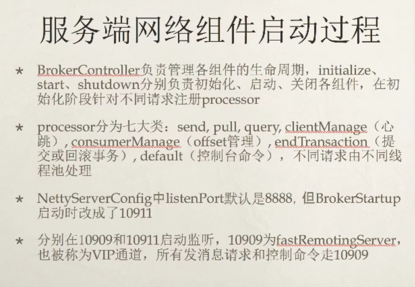

     关注点:

1. rocketmq的线程模型是如何设计的
2. 哪些请求走了10909端口,哪些请求走了10911端口
3. 如何实现长连接
4. 如何实现同步,异步调用超时控制



## 1. 线程模型:

rocketmq的线程模型,大体上是采用了 netty的主从reactor模型, 只不过与netty不同的是, rocketmq对不同功能的任务都采用的不同的线程池来处理, 从而提高效率.

**Netty的线程模型:** 


**RocketMQ线程模型:**


`主reactor`(eventLoopGroupBoss): 负责监听 TCP网络连接请求，建立好连接(OP_ACCEPT)，创建SocketChannel, 将建立好的连接交给`从reactor`并注册到selector上。

`从reactor`(eventLoopGroupSelector): 主要负责处理网络I/O事件, OP_READ, OP_WRITE, OP_CONNENT等, 获取到网络数据.

`netty_workers`(defaultEventExecutorGroup): ssl连接建立,SSL验证、fileRegionEncoder,心跳, 编码, 解码、心跳、连接管理, 业务请求饭费等通信操作都交给这个线程池处理.`各handler是在不同的线程中完成各自的操 作`

`biz_workers`(xxxExcutor): rocketMq根据不同类型的业务功能,创建了多个线程来执行不同的业务功能.

> 与netty线程模型相比:
>
> netty为了实现i/o多路复用, 和保证在处理不同连接请求整个处理链路是线程安全的, 对于注册在同一个eventLoop上的不同连接的i/o操作都采取串行执行的方式, 且业务功能和网络I/O操作都是在同一个线程中完成
>
> rocketmq将网络I/O操作和业务功能进行了分离, 采用不同的线程池来处理业务功能, 然后通过加锁保证线程安全

## 2. 核心实现类:

核心实现类类图:


**核心配置:**

***NettyServerConfig***: nettyServerConfig中设置了一些通信相关的默认属性, 在broker.conf中还有许多的配置信息, 通过broker启动时会将配置参数注入到 nettyServerConfig中.

```java
public class NettyServerConfig implements Cloneable {
    // nameserver监听端口, 会被初始化成9876
    private int listenPort = 8888;
    
    // ------------------------  线程模型中线程池线管配置 --------------------------------
    // netty worker线程数量,即 nettyReactor模型中的从reactor线程池
    // IO线程池个数，主要是NameServer、Broker端解析请求、返回相应的线程个数，这类线程主要是处理网路请求的，
    // 解析请求包，然后转发到各个业务线程池完成具体的操作，然后将结果返回给调用方
    private int serverSelectorThreads = 3;
    // netty 业务线程池线程数量
    private int serverWorkerThreads = 8;
    // netty public任务线程池线程数量, Netty网络设计，根据业务类型会创建不同的线程池，
    // 比如处理消息发送、消息消费、心跳检测等。如果该业务类型未注册线程池，则由public线程池执行。
    private int serverCallbackExecutorThreads = 0;

    // send oneway消息并发读信号量(broker端的一个参数)
    private int serverOnewaySemaphoreValue = 256;
    // 异步消息发送最大并发读(broker端参数)
    private int serverAsyncSemaphoreValue = 64;
    // 网络连接最大空闲时间, 单位秒
    private int serverChannelMaxIdleTimeSeconds = 120;
    // 网络socket发送缓冲区大小
    private int serverSocketSndBufSize = NettySystemConfig.socketSndbufSize;
    // 网络socket接收缓冲区大小
    private int serverSocketRcvBufSize = NettySystemConfig.socketRcvbufSize;
    // netty池化缓冲区分配器是否开启
    private boolean serverPooledByteBufAllocatorEnable = true;
    // 是否使用epoll io模型
    private boolean useEpollNativeSelector = false;


	// 省略了一些列的get set
}
```

***NettyClientConfig***: netty客户端的配置类, 同样在producer,broker,consumer等启动的时候会注入一些通信配置

```java
public class NettyClientConfig {
    /**
     * 处理channelPipeline里面handler的线程数量
     */
    private int clientWorkerThreads = NettySystemConfig.clientWorkerSize;
    // netty public任务线程池线程数量, Netty网络设计，根据业务类型会创建不同的线程池，
    // 比如处理消息发送、消息消费、心跳检测等。如果该业务类型未注册线程池，则由public线程池执行。
    private int clientCallbackExecutorThreads = Runtime.getRuntime().availableProcessors();
    private int clientOnewaySemaphoreValue = NettySystemConfig.CLIENT_ONEWAY_SEMAPHORE_VALUE;
    private int clientAsyncSemaphoreValue = NettySystemConfig.CLIENT_ASYNC_SEMAPHORE_VALUE;
    private int connectTimeoutMillis = NettySystemConfig.connectTimeoutMillis;
    // channel超时时间间隔
    private long channelNotActiveInterval = 1000 * 60;

    /**
     * IdleStateEvent will be triggered when neither read nor write was performed for
     * the specified period of this time. Specify {@code 0} to disable
     */
    // 最大空闲时间
    private int clientChannelMaxIdleTimeSeconds = NettySystemConfig.clientChannelMaxIdleTimeSeconds;
    // 发送缓冲区
    private int clientSocketSndBufSize = NettySystemConfig.socketSndbufSize;
    // 接受缓冲区
    private int clientSocketRcvBufSize = NettySystemConfig.socketRcvbufSize;
    private boolean clientPooledByteBufAllocatorEnable = false;
    private boolean clientCloseSocketIfTimeout = NettySystemConfig.clientCloseSocketIfTimeout;

    private boolean useTLS;

}
```

### 1. 服务端:

#### 1. NettyRemotingServer:

关键属性:

```java
public class NettyRemotingServer extends NettyRemotingAbstract implements RemotingServer {
    private static final InternalLogger log = InternalLoggerFactory.getLogger(RemotingHelper.ROCKETMQ_REMOTING);
    // --------------------------- 配置信息相关 ---------------------------------------
    private final NettyServerConfig nettyServerConfig;
    private int port = 0;

    // --------------------------- 通信组件 ---------------------------------------
    // 启动器
    private final ServerBootstrap serverBootstrap;
    // netty bossGroup,主要负责I/O事件OP_ACCEPT
    private final EventLoopGroup eventLoopGroupBoss;
    // neety workerGroup,主要负责I/O事件OP_CONNECT, OP_READ, OP_WRITE
    private final EventLoopGroup eventLoopGroupSelector;
    private final ChannelEventListener channelEventListener;
    // public业务执行线程池
    private final ExecutorService publicExecutor;

    // --------------------------- 通信业务线程池 ---------------------------------------
    // 通信业务消息发送、消息消费、心跳检测,编解码,功能业务转发等
    private DefaultEventExecutorGroup defaultEventExecutorGroup;

    // --------------------------- handler ---------------------------------------
    private HandshakeHandler handshakeHandler;
    private NettyEncoder encoder;
    private NettyConnectManageHandler connectionManageHandler;
    private NettyServerHandler serverHandler;

}
```

在broker,namesrv初始化的时候,都会通过`NettyRemotingServer`的构造函数,初始化netty服务端, 等待通信.

```java
// namesrv初始化:
NamesrvStartup#main(String[] args)
    -> NamesrvStartup#main0(String[] args)
    	-> NamesrvStartup#start(final NamesrvController controller)
    		-> NamesrvController#initialize()
    			-> NettyRemotingServer#NettyRemotingServer(final NettyServerConfig nettyServerConfig, final ChannelEventListener channelEventListener)
    
// broker初始化;
BrokerStartup#main(String[] args)
    -> BrokerStartup#createBrokerController(String[] args)
    	-> BrokerController#initialize()
    		-> NettyRemotingServer#NettyRemotingServer(final NettyServerConfig nettyServerConfig, final ChannelEventListener channelEventListener)
    		   
```

broker在初始化过程中, 一共初始化了`remotingServer(10911端口)`和`fastRemotingServer(10909端口)`两个netty服务端.

```java
this.remotingServer = new NettyRemotingServer(this.nettyServerConfig, this.clientHousekeepingService);
fastConfig.setListenPort(nettyServerConfig.getListenPort() - 2);
this.fastRemotingServer = new NettyRemotingServer(fastConfig, this.clientHousekeepingService);
```

`NettyRemotingServer`构造函数: 主要做了四件事:

1. 初始化netty启动器, 保存nettyServerConfig, 保存网络I/O事件监听器
2. 创建网络I/O事件, netty通信业务功能使用的公共线程池`publicExecutor`(如果没有单独配置线程池就会使用这个线程池)
3. 根据当前程序运行的平台是否支持使用`epoll`选择`nettyServerChannel`使用的类型, 支持(并且使用epoll设置为了true)使用`EpollEventLoopGroup`,不支持使用 `NioEventLoopGroup`
4. 加载`ssl`相关的上下文

```java
public NettyRemotingServer(final NettyServerConfig nettyServerConfig,
        final ChannelEventListener channelEventListener) {
    	// ------------------------------------- 1. 初始化netty启动器, 保存nettyServerConfig, 保存网络I/O事件监听器 -----------------------------------------------\\
        // 主要是设置了oneway和async两种消息的并发信号量
        super(nettyServerConfig.getServerOnewaySemaphoreValue(), nettyServerConfig.getServerAsyncSemaphoreValue());
        this.serverBootstrap = new ServerBootstrap();
        this.nettyServerConfig = nettyServerConfig;
        this.channelEventListener = channelEventListener;

    	// ------------------------------------- 2. 创建网络I/O事件, netty通信业务功能使用的公共线程池publicExecutor -----------------------------------------------\\
        // 如果配置文件没有配置netty 共用线程池线程数量的话,将其设置为4
        int publicThreadNums = nettyServerConfig.getServerCallbackExecutorThreads();
        if (publicThreadNums <= 0) {
            publicThreadNums = 4;
        }
        // 创建public线程池
        this.publicExecutor = Executors.newFixedThreadPool(publicThreadNums, new ThreadFactory() {
            private AtomicInteger threadIndex = new AtomicInteger(0);

            @Override
            public Thread newThread(Runnable r) {
                return new Thread(r, "NettyServerPublicExecutor_" + this.threadIndex.incrementAndGet());
            }
        });

    	// ------------------------------------- 3. 判断当前环境是否支持epoll, 选择channel类型 -----------------------------------------------\\
        if (useEpoll()) {
            // 使用epoll
            // 创建bossGroup
            this.eventLoopGroupBoss = new EpollEventLoopGroup(1, new ThreadFactory() {
                private AtomicInteger threadIndex = new AtomicInteger(0);

                @Override
                public Thread newThread(Runnable r) {
                    return new Thread(r, String.format("NettyEPOLLBoss_%d", this.threadIndex.incrementAndGet()));
                }
            });

            // 创建worker group, 默认3个线程
            this.eventLoopGroupSelector = new EpollEventLoopGroup(nettyServerConfig.getServerSelectorThreads(), new ThreadFactory() {
                private AtomicInteger threadIndex = new AtomicInteger(0);
                private int threadTotal = nettyServerConfig.getServerSelectorThreads();

                @Override
                public Thread newThread(Runnable r) {
                    return new Thread(r, String.format("NettyServerEPOLLSelector_%d_%d", threadTotal, this.threadIndex.incrementAndGet()));
                }
            });
        } else {
            // 不使用epoll
            // boss
            this.eventLoopGroupBoss = new NioEventLoopGroup(1, new ThreadFactory() {
                private AtomicInteger threadIndex = new AtomicInteger(0);

                @Override
                public Thread newThread(Runnable r) {
                    return new Thread(r, String.format("NettyNIOBoss_%d", this.threadIndex.incrementAndGet()));
                }
            });

            // worker,默认3个线程
            this.eventLoopGroupSelector = new NioEventLoopGroup(nettyServerConfig.getServerSelectorThreads(), new ThreadFactory() {
                private AtomicInteger threadIndex = new AtomicInteger(0);
                private int threadTotal = nettyServerConfig.getServerSelectorThreads();

                @Override
                public Thread newThread(Runnable r) {
                    return new Thread(r, String.format("NettyServerNIOSelector_%d_%d", threadTotal, this.threadIndex.incrementAndGet()));
                }
            });
        }
        //------------------------------------------------ 4. 加载ssl上下文,创建sslHandler使用的 ----------------------------------------------\\
        loadSslContext();
    }
```

判断平台是否支持eppoll,或者是否手动开启使用epoll: 通常是建议将`nettyServerConfig.isUseEpollNativeSelector()`设置为true

```java
    private boolean useEpoll() {
        return RemotingUtil.isLinuxPlatform()
            && nettyServerConfig.isUseEpollNativeSelector() // 手动配置是否开启epoll
            && Epoll.isAvailable();
    }
```

***Netty服务端启动***

无论是namesrv还是broker,都会调用`NettyRemotingServer#start()`来启动netty服务端:

```java
    @Override
    public void start() {
        // 初始化处理编解码等通信功能的线程池,默认8个线程
        this.defaultEventExecutorGroup = new DefaultEventExecutorGroup(
            nettyServerConfig.getServerWorkerThreads(),
            new ThreadFactory() {

                private AtomicInteger threadIndex = new AtomicInteger(0);

                @Override
                public Thread newThread(Runnable r) {
                    return new Thread(r, "NettyServerCodecThread_" + this.threadIndex.incrementAndGet());
                }
            });
        // 创建pipeLine中的一些共享handler,包括业务handler
        prepareSharableHandlers();

        ServerBootstrap childHandler =
            this.serverBootstrap.group(this.eventLoopGroupBoss, this.eventLoopGroupSelector)
                .channel(useEpoll() ? EpollServerSocketChannel.class : NioServerSocketChannel.class)
                .option(ChannelOption.SO_BACKLOG, 1024)// socket队列参数,操作系统会取 传入值和默认值 的较小值
                .option(ChannelOption.SO_REUSEADDR, true)
                .option(ChannelOption.SO_KEEPALIVE, false)// 显示声明长连接关闭, todo rocketmq使用长连接, 为什么在启动的时候会显式关闭
                .childOption(ChannelOption.TCP_NODELAY, true)
                .childOption(ChannelOption.SO_SNDBUF, nettyServerConfig.getServerSocketSndBufSize())// 发送消息socket缓冲区大小
                .childOption(ChannelOption.SO_RCVBUF, nettyServerConfig.getServerSocketRcvBufSize())// 接受消息socket缓冲区大小
                .localAddress(new InetSocketAddress(this.nettyServerConfig.getListenPort()))
                /*
                将网络I/O事件(使用eventLoopGroupSelector)与通信处理事件(使用defaultEventExecutorGroup)使用的线程池分离开来.
                pipeline的管理: 即一条消息从入站到出站,需要经历哪些处理器处理.

                 */
                .childHandler(new ChannelInitializer<SocketChannel>() {
                    @Override
                    public void initChannel(SocketChannel ch) throws Exception {
                        ch.pipeline()
                            .addLast(defaultEventExecutorGroup, HANDSHAKE_HANDLER_NAME, handshakeHandler)
                            .addLast(defaultEventExecutorGroup,
                                encoder,
                                new NettyDecoder(),
                                new IdleStateHandler(0, 0, nettyServerConfig.getServerChannelMaxIdleTimeSeconds()),
                                connectionManageHandler,
                                serverHandler
                            );
                    }
                });

        // 设置池化byteBuf
        if (nettyServerConfig.isServerPooledByteBufAllocatorEnable()) {
            childHandler.childOption(ChannelOption.ALLOCATOR, PooledByteBufAllocator.DEFAULT);
        }

        try {
            ChannelFuture sync = this.serverBootstrap.bind().sync();
            InetSocketAddress addr = (InetSocketAddress) sync.channel().localAddress();
            this.port = addr.getPort();
        } catch (InterruptedException e1) {
            throw new RuntimeException("this.serverBootstrap.bind().sync() InterruptedException", e1);
        }

        if (this.channelEventListener != null) {
            this.nettyEventExecutor.start();
        }

        // 定时任务扫描请求响应缓存,清除一些响应超时的请求,然后执行回调
        this.timer.scheduleAtFixedRate(new TimerTask() {

            @Override
            public void run() {
                try {
                    NettyRemotingServer.this.scanResponseTable();
                } catch (Throwable e) {
                    log.error("scanResponseTable exception", e);
                }
            }
        }, 1000 * 3, 1000);
    }
```

### 2. 客户端:

#### 1. NettyRemotingClient:

```java
public class NettyRemotingClient extends NettyRemotingAbstract implements RemotingClient {
    private static final long LOCK_TIMEOUT_MILLIS = 3000;

    private final NettyClientConfig nettyClientConfig;
    private final Bootstrap bootstrap = new Bootstrap();
    // i/o事件
    private final EventLoopGroup eventLoopGroupWorker;
    private final Lock lockChannelTables = new ReentrantLock();
    // channel缓存
    private final ConcurrentMap<String /* addr */, ChannelWrapper> channelTables = new ConcurrentHashMap<String, ChannelWrapper>();

    private final Timer timer = new Timer("ClientHouseKeepingService", true);

    private final AtomicReference<List<String>> namesrvAddrList = new AtomicReference<List<String>>();
    private final AtomicReference<String> namesrvAddrChoosed = new AtomicReference<String>();
    private final AtomicInteger namesrvIndex = new AtomicInteger(initValueIndex());
    private final Lock namesrvChannelLock = new ReentrantLock();
    // 处理回调,以及broker发送来的消息, client没有设置处理rocketmq业务功能的专业线程池
    private final ExecutorService publicExecutor;

    /**
     * Invoke the callback methods in this executor when process response.
     */
    private ExecutorService callbackExecutor;
    private final ChannelEventListener channelEventListener;
    // 通信事件处理
    private DefaultEventExecutorGroup defaultEventExecutorGroup;
}
```

**初始化:**

netty客户端在 broker,producer,consumer启动时都会初始化`NettyRemotingClient`: 

broker:

```java
BrokerStartup#createBrokerController(String[] args)
    -> BrokerController#BrokerController(final BrokerConfig brokerConfig,final NettyServerConfig nettyServerConfig,final NettyClientConfig nettyClientConfig,
        final MessageStoreConfig messageStoreConfig)
    	-> BrokerOuterAPI#BrokerOuterAPI(final NettyClientConfig nettyClientConfig)
    		-> NettyRemotingClient#NettyRemotingClient(final NettyClientConfig nettyClientConfig)
```

producer:

```java
DefaultMQProducer#start()
    -> DefaultMQProducerImpl#start(final boolean startFactory)
    	-> MQClientManager#getOrCreateMQClientInstance(final ClientConfig clientConfig, RPCHook rpcHook)
    		-> MQClientInstance#MQClientInstance(ClientConfig clientConfig, int instanceIndex, String clientId, RPCHook rpcHook)
    			-> MQClientAPIImpl#MQClientAPIImpl(final NettyClientConfig nettyClientConfig, final ClientRemotingProcessor clientRemotingProcessor,
        		   RPCHook rpcHook, final ClientConfig clientConfig)
    				-> NettyRemotingClient#NettyRemotingClient(final NettyClientConfig nettyClientConfig, final ChannelEventListener channelEventListener)
```

consumer: 基本与producer一致

***初始化:***

```java
    public NettyRemotingClient(final NettyClientConfig nettyClientConfig,
        final ChannelEventListener channelEventListener) {
        // 设置异步/oneway并发量
        super(nettyClientConfig.getClientOnewaySemaphoreValue(), nettyClientConfig.getClientAsyncSemaphoreValue());
        this.nettyClientConfig = nettyClientConfig;
        this.channelEventListener = channelEventListener;
        // 公共线程线程数量
        int publicThreadNums = nettyClientConfig.getClientCallbackExecutorThreads();
        if (publicThreadNums <= 0) {
            publicThreadNums = 4;
        }

        this.publicExecutor = Executors.newFixedThreadPool(publicThreadNums, new ThreadFactory() {
            private AtomicInteger threadIndex = new AtomicInteger(0);

            @Override
            public Thread newThread(Runnable r) {
                return new Thread(r, "NettyClientPublicExecutor_" + this.threadIndex.incrementAndGet());
            }
        });

        this.eventLoopGroupWorker = new NioEventLoopGroup(1, new ThreadFactory() {
            private AtomicInteger threadIndex = new AtomicInteger(0);

            @Override
            public Thread newThread(Runnable r) {
                return new Thread(r, String.format("NettyClientSelector_%d", this.threadIndex.incrementAndGet()));
            }
        });

        if (nettyClientConfig.isUseTLS()) {
            try {
                sslContext = TlsHelper.buildSslContext(true);
                log.info("SSL enabled for client");
            } catch (IOException e) {
                log.error("Failed to create SSLContext", e);
            } catch (CertificateException e) {
                log.error("Failed to create SSLContext", e);
                throw new RuntimeException("Failed to create SSLContext", e);
            }
        }
    }
```

***启动:***

```java
@Override
    public void start() {
        // 通信业务处理线程池
        this.defaultEventExecutorGroup = new DefaultEventExecutorGroup(
            nettyClientConfig.getClientWorkerThreads(),
            new ThreadFactory() {

                private AtomicInteger threadIndex = new AtomicInteger(0);

                @Override
                public Thread newThread(Runnable r) {
                    return new Thread(r, "NettyClientWorkerThread_" + this.threadIndex.incrementAndGet());
                }
            });
        // 初始化启动器
        Bootstrap handler = this.bootstrap.group(this.eventLoopGroupWorker).channel(NioSocketChannel.class)
            .option(ChannelOption.TCP_NODELAY, true)
            .option(ChannelOption.SO_KEEPALIVE, false)
            .option(ChannelOption.CONNECT_TIMEOUT_MILLIS, nettyClientConfig.getConnectTimeoutMillis())
            .option(ChannelOption.SO_SNDBUF, nettyClientConfig.getClientSocketSndBufSize())
            .option(ChannelOption.SO_RCVBUF, nettyClientConfig.getClientSocketRcvBufSize())
            .handler(new ChannelInitializer<SocketChannel>() {
                @Override
                public void initChannel(SocketChannel ch) throws Exception {
                    ChannelPipeline pipeline = ch.pipeline();
                    if (nettyClientConfig.isUseTLS()) {
                        // 动态添加sslHandler
                        if (null != sslContext) {
                            pipeline.addFirst(defaultEventExecutorGroup, "sslHandler", sslContext.newHandler(ch.alloc()));
                            log.info("Prepend SSL handler");
                        } else {
                            log.warn("Connections are insecure as SSLContext is null!");
                        }
                    }
                    pipeline.addLast(
                        defaultEventExecutorGroup,
                        new NettyEncoder(),
                        new NettyDecoder(),
                        new IdleStateHandler(0, 0, nettyClientConfig.getClientChannelMaxIdleTimeSeconds()),
                        new NettyConnectManageHandler(),
                        new NettyClientHandler());
                }
            });

        this.timer.scheduleAtFixedRate(new TimerTask() {
            @Override
            public void run() {
                try {
                    NettyRemotingClient.this.scanResponseTable();
                } catch (Throwable e) {
                    log.error("scanResponseTable exception", e);
                }
            }
        }, 1000 * 3, 1000);

        if (this.channelEventListener != null) {
            this.nettyEventExecutor.start();
        }
    }
```

## 3. Netty通信事件handler:

`HandshakeHandler(入站)`: 入站第一个handler, 根据是否建立ssl连接逻辑, 为服务端动态创建sslHandler,FileRegionHandler, 然后将自己移除.

`SSLHandler(出入站)`: 第一个入栈,最后一个出站,对消息进行加密解密.

`FileRegionEncoder(出站)`: rocketmq使用了FileRegion实现零拷贝,在开启ssl的时候, 需要通过`sslHandler`进行加密但是需要的类型是`ByteBuf`, `FileRegionEncoder`充当一个中间类型转换的作用. 

`NettyEncoder(出站)`: 继承`MessageToByteEncoder`, 消息出站编码, 按照协议拼接报文

`NettyDecoder(入站)`: 继承`LengthFieldBasedFrameDecoder`, 根据长度字段解析数据包, 解决拆包粘包问题

`IdleStateHandler(出入站)`: netty心跳机制, 通过定时任务定时调度, 探测是否有空闲连接进行检查, 如果发现空闲的, 传给`NettyConnectManageHandler`来处理`IDEL`事件.

`NettyConnectManageHandler(出入站)`: 连接管理, 主要是用来关闭连接.

`NettyServerHandler(入站)`: rocketmq业务分发的handler,根据请求编码, 找到对应处理器和线程池.


### 1. HandshakeHandler:

主要是用来处理 broker与producer,consumer namesrv和broker之间关于ssl验证的一个功能.大致逻辑为:
客户端第一次连接过上来的时候, 获取客户端发来的消息中第一个字节,然后分三种情况

  1. 客户端消息第一个字节 == HANDSHAKE_MAGIC_CODE, 判断服务端对于ssl的一个模式:
       1. DISABLED: 服务端不支持ssl连接, 所有的ssl连接都会被拒绝掉, 然后造成连接关闭
       2. PERMISSIVE: ssl连接是可选操作, 即如果客户端需要ssl连接, 那么服务端会对ssl连接进行处理,switch中没有break,透传到case ENFORCING.
       3. ENFORCING: 服务端强制要求ssl连接, 所有非ssl连接都会被拒绝掉, 然后造成连接关闭
  2. 客户端消息第一个字节 != HANDSHAKE_MAGIC_CODE,并且服务端强制开启了ssl连接, 直接关闭该连接
  3. 客户端消息第一个字节 != HANDSHAKE_MAGIC_CODE,服务端没有强制开启了ssl连接, 不做处理

> ssl连接成功建立, 为了后续消息入站时不再次进行判断是否需要ssl连接, 会将`HandshakeHandler`从pipeline中移出掉.

```java
        @Override
        protected void channelRead0(ChannelHandlerContext ctx, ByteBuf msg) throws Exception {

            // mark the current position so that we can peek the first byte to determine if the content is starting with
            // TLS handshake
            msg.markReaderIndex();

            byte b = msg.getByte(0);

            if (b == HANDSHAKE_MAGIC_CODE) {
                switch (tlsMode) {
                    case DISABLED:
                        // 服务端不支持ssl连接, 所有的ssl连接都会被拒绝掉, 连接关闭
                        ctx.close();
                        log.warn("Clients intend to establish an SSL connection while this server is running in SSL disabled mode");
                        break;
                    case PERMISSIVE:
                        //ssl连接是可选操作, 即如果客户端需要ssl连接, 那么服务端会对ssl连接进行处理,switch中没有break,透传到case ENFORCING.
                    case ENFORCING:
                        if (null != sslContext) {
                            // 这里确定是建立ssl连接,添加上sslHandler,和FileRegionEncoder两个处理器,处理后续连接中消息ssl的相关功能
                            ctx.pipeline()
                                .addAfter(defaultEventExecutorGroup, HANDSHAKE_HANDLER_NAME, TLS_HANDLER_NAME, sslContext.newHandler(ctx.channel().alloc()))
                                .addAfter(defaultEventExecutorGroup, TLS_HANDLER_NAME, FILE_REGION_ENCODER_NAME, new FileRegionEncoder());
                            log.info("Handlers prepended to channel pipeline to establish SSL connection");
                        } else {
                            ctx.close();
                            log.error("Trying to establish an SSL connection but sslContext is null");
                        }
                        break;

                    default:
                        log.warn("Unknown TLS mode");
                        break;
                }
            } else if (tlsMode == TlsMode.ENFORCING) {
                ctx.close();
                log.warn("Clients intend to establish an insecure connection while this server is running in SSL enforcing mode");
            }

            // reset the reader index so that handshake negotiation may proceed as normal.
            msg.resetReaderIndex();

            try {
                // Remove this handler
                ctx.pipeline().remove(this);
            } catch (NoSuchElementException e) {
                log.error("Error while removing HandshakeHandler", e);
            }

            // Hand over this message to the next .
            ctx.fireChannelRead(msg.retain());
        }
    }
```

> SslHandler: `public class SslHandler extends ByteToMessageDecoder implements ChannelOutboundHandler` 出入站编码解码器, 对消息加密解密的过程
>
> FileRegionEncoder: `public class FileRegionEncoder extends MessageToByteEncoder<FileRegion>` 出站编码器, 对消息进行类型转换, 以支持sshandler在入站时的解码工作
>
> 关于ssl相关后面补充.

### 2. 其他handler:

**TODO**

## 4. 长连接实现的方法:

方法一:

使用操作系统提供的长连接, 要开启`SO_KEEPALIVE`还需要配置内核参数:

1. tcp_keepalive_time: 最大保火时长
2. tcp_keepalive_probes: 超过最大保活时长后发送探测包的次数
3. tcp_keepalive_intvl: 探测包发送的时间间隔

> java代码中只能配置,`SO_KEEPALIVE`参数, 默认为false.

方法二:

程序自主维护心跳和空闲连接检查

方法三:

使用支持长连接的通信协议

## 5. 发送方式不同的netty处理:

### 1. 获取channel:

>  这一步无论是那种发送方式,都需要执行的一步

***NettyRemotingClient#getAndCreateChannel()***

```java
// addr 为空表示需要从namesrv获取broker的地址,因此获取是去获取namesrv的channel
private Channel getAndCreateChannel(final String addr) throws RemotingConnectException, InterruptedException {
        // 没有传入addr, 无法送缓存获取, 需要从namesrv中获取
        if (null == addr) {
            return getAndCreateNameserverChannel();
        }
        // 缓存中有addr对应channel,就获取缓存中的channel
        ChannelWrapper cw = this.channelTables.get(addr);
        if (cw != null && cw.isOK()) {
            return cw.getChannel();
        }
        // 缓存中没有就创建一个channel
        return this.createChannel(addr);
    }

//namesrv的选择实际上是从设置好的namesrvAddr中轮询一个出来通信,缓存在namesrvAddrChoosed里面
 private Channel getAndCreateNameserverChannel() throws RemotingConnectException, InterruptedException {
        // 获取当前producer连接到的namesrv地址
        String addr = this.namesrvAddrChoosed.get();
        // 尝试去缓存里面拿到一次
        if (addr != null) {
            ChannelWrapper cw = this.channelTables.get(addr);
            if (cw != null && cw.isOK()) {
                return cw.getChannel();
            }
        }

        // 通过namesrv地址无法获取到channel,就从namesrvAddrChoosed获取已经选择过的addr去尝试获取一个channel
        final List<String> addrList = this.namesrvAddrList.get();
        if (this.namesrvChannelLock.tryLock(LOCK_TIMEOUT_MILLIS, TimeUnit.MILLISECONDS)) {
            try {
                addr = this.namesrvAddrChoosed.get();
                if (addr != null) {
                    ChannelWrapper cw = this.channelTables.get(addr);
                    if (cw != null && cw.isOK()) {
                        return cw.getChannel();
                    }
                }
                // 从所有namesrv地址缓存里面轮询(获取上一次获取过的下一个)获取一个addr地址
                // 然后创建channel
                if (addrList != null && !addrList.isEmpty()) {
                    for (int i = 0; i < addrList.size(); i++) {
                        int index = this.namesrvIndex.incrementAndGet();
                        index = Math.abs(index);
                        index = index % addrList.size();
                        String newAddr = addrList.get(index);

                        this.namesrvAddrChoosed.set(newAddr);
                        log.info("new name server is chosen. OLD: {} , NEW: {}. namesrvIndex = {}", addr, newAddr, namesrvIndex);
                        Channel channelNew = this.createChannel(newAddr);
                        if (channelNew != null) {
                            return channelNew;
                        }
                    }
                    throw new RemotingConnectException(addrList.toString());
                }
            } finally {
                this.namesrvChannelLock.unlock();
            }
        } else {
            log.warn("getAndCreateNameserverChannel: try to lock name server, but timeout, {}ms", LOCK_TIMEOUT_MILLIS);
        }

        return null;
    }
```

***NettyRemotingClient#createChannel()***

```java
    /**
     * 创建channel
     * @param addr --- 目标地址
     * @return
     * @throws InterruptedException
     */
    private Channel createChannel(final String addr) throws InterruptedException {
        // 尝试从channel缓存中获取, 能用就不去创建
        ChannelWrapper cw = this.channelTables.get(addr);
        if (cw != null && cw.isOK()) {
            return cw.getChannel();
        }
        
        // todo 加锁是为了创建新channel不发生多线程问题?
        if (this.lockChannelTables.tryLock(LOCK_TIMEOUT_MILLIS, TimeUnit.MILLISECONDS)) {
            try {
                // 再次尝试从channel缓存中获取
                boolean createNewConnection;
                cw = this.channelTables.get(addr);
                if (cw != null) {
                    // 如果channel能用就返回channel
                    // 如果正在获取channelFutrue中, 就标记不创建新连接, (todo 也就是正在创建channel中,不创建新连接?)
                    // 否则就移除addr的缓存信息, 重新创建新channel
                    if (cw.isOK()) {
                        return cw.getChannel();
                    } else if (!cw.getChannelFuture().isDone()) {
                        createNewConnection = false;
                    } else {
                        this.channelTables.remove(addr);
                        createNewConnection = true;
                    }
                } else {
                    // 没有从缓存中拿到channel
                    createNewConnection = true;
                }
                
                // 需要创建新连接
                if (createNewConnection) {
                    ChannelFuture channelFuture = this.bootstrap.connect(RemotingHelper.string2SocketAddress(addr));
                    log.info("createChannel: begin to connect remote host[{}] asynchronously", addr);
                    cw = new ChannelWrapper(channelFuture);
                    this.channelTables.put(addr, cw);
                }
            } catch (Exception e) {
                log.error("createChannel: create channel exception", e);
            } finally {
                this.lockChannelTables.unlock();
            }
        } else {
            log.warn("createChannel: try to lock channel table, but timeout, {}ms", LOCK_TIMEOUT_MILLIS);
        }
        
        // 等待创建出来的新channel可用之后再返回
        if (cw != null) {
            ChannelFuture channelFuture = cw.getChannelFuture();
            if (channelFuture.awaitUninterruptibly(this.nettyClientConfig.getConnectTimeoutMillis())) {
                if (cw.isOK()) {
                    log.info("createChannel: connect remote host[{}] success, {}", addr, channelFuture.toString());
                    return cw.getChannel();
                } else {
                    log.warn("createChannel: connect remote host[" + addr + "] failed, " + channelFuture.toString(), channelFuture.cause());
                }
            } else {
                log.warn("createChannel: connect remote host[{}] timeout {}ms, {}", addr, this.nettyClientConfig.getConnectTimeoutMillis(),
                    channelFuture.toString());
            }
        }

        return null;
    }
```

### 2. 同步发送:

***NettyRemotingClient#invokeSync()***: 主要是在`发送前后`做一些扩展操作, 判断获取channenl是否超时, 校验channel是否可用.  

```java
    public RemotingCommand invokeSync(String addr, final RemotingCommand request, long timeoutMillis)
        throws InterruptedException, RemotingConnectException, RemotingSendRequestException, RemotingTimeoutException {
        long beginStartTime = System.currentTimeMillis();
        // 创建或者从channel缓存中拿到一个channel
        final Channel channel = this.getAndCreateChannel(addr); // ................... 1. 获取需要的channel
        if (channel != null && channel.isActive()) {
            try {
                // 发送之前的一些处理
                doBeforeRpcHooks(addr, request);
                // 计算发送是否超时,主要是判断获取channel是否超时
                long costTime = System.currentTimeMillis() - beginStartTime;
                if (timeoutMillis < costTime) {
                    throw new RemotingTimeoutException("invokeSync call timeout");
                }
                RemotingCommand response = this.invokeSyncImpl(channel, request, timeoutMillis - costTime);
                doAfterRpcHooks(RemotingHelper.parseChannelRemoteAddr(channel), request, response);
                return response;
            } catch (RemotingSendRequestException e) {
                log.warn("invokeSync: send request exception, so close the channel[{}]", addr);
                this.closeChannel(addr, channel);
                throw e;
            } catch (RemotingTimeoutException e) {
                if (nettyClientConfig.isClientCloseSocketIfTimeout()) {
                    this.closeChannel(addr, channel);
                    log.warn("invokeSync: close socket because of timeout, {}ms, {}", timeoutMillis, addr);
                }
                log.warn("invokeSync: wait response timeout exception, the channel[{}]", addr);
                throw e;
            }
        } else {
            this.closeChannel(addr, channel);
            throw new RemotingConnectException(addr);
        }
    }
```

***NettyRemotingAbstract#invokeSyncImpl()***: 

主要做: 

1. 以请求id为key, 缓存响应
2. 将请求数据写入channel传向下一个handler
3. 使用countDownLatch等待响应.
4. 将消息发送到channel中去

```java
public RemotingCommand invokeSyncImpl(final Channel channel, final RemotingCommand request,
        final long timeoutMillis)
        throws InterruptedException, RemotingSendRequestException, RemotingTimeoutException {
        final int opaque = request.getOpaque();

        try {
            // 封装响应future
            final ResponseFuture responseFuture = new ResponseFuture(channel, opaque, timeoutMillis, null, null);
            // 缓存响应
            this.responseTable.put(opaque, responseFuture);
            final SocketAddress addr = channel.remoteAddress();
            channel.writeAndFlush(request).addListener(new ChannelFutureListener() {
                @Override
                public void operationComplete(ChannelFuture f) throws Exception {
                    if (f.isSuccess()) {
                        responseFuture.setSendRequestOK(true);
                        return;
                    } else {
                        responseFuture.setSendRequestOK(false);
                    }

                    responseTable.remove(opaque);
                    responseFuture.setCause(f.cause());
                    responseFuture.putResponse(null);
                    log.warn("send a request command to channel <" + addr + "> failed.");
                }
            });
            // 同步发送,阻塞等待
            RemotingCommand responseCommand = responseFuture.waitResponse(timeoutMillis);
            if (null == responseCommand) {
                if (responseFuture.isSendRequestOK()) {
                    throw new RemotingTimeoutException(RemotingHelper.parseSocketAddressAddr(addr), timeoutMillis,
                        responseFuture.getCause());
                } else {
                    throw new RemotingSendRequestException(RemotingHelper.parseSocketAddressAddr(addr), responseFuture.getCause());
                }
            }

            return responseCommand;
        } finally {
            this.responseTable.remove(opaque);
        }
    }
```

***ResponseFuture*** : 同步等待的实现, 使用一个只有1次的countDownLatch进行同步

```java
public class ResponseFuture {
	private final CountDownLatch countDownLatch = new CountDownLatch(1);
    // 同步
    public RemotingCommand waitResponse(final long timeoutMillis) throws InterruptedException {
        this.countDownLatch.await(timeoutMillis, TimeUnit.MILLISECONDS);
        return this.responseCommand;
    }
	// 放行
    public void putResponse(final RemotingCommand responseCommand) {
        this.responseCommand = responseCommand;
        this.countDownLatch.countDown();
    }
}
```

### 3. 异步发送:

异步发送开始的代码和同步发送基本一致, 区别在于: 

1. 用`InvokeCallback`代替了`dodoAfterRpcHooks`钩子函数, 
2. 不会等待服务端的响应, 通过客户端扫描响应缓存的周期任务来获取响应结果
3. 客户端会对异步发送进行限流

***NettyRemotingClient#invokeAsync()***

```java
    @Override
    public void invokeAsync(String addr, RemotingCommand request, long timeoutMillis, InvokeCallback invokeCallback)
        throws InterruptedException, RemotingConnectException, RemotingTooMuchRequestException, RemotingTimeoutException,
        RemotingSendRequestException {
        long beginStartTime = System.currentTimeMillis();
        final Channel channel = this.getAndCreateChannel(addr);
        if (channel != null && channel.isActive()) {
            try {
                doBeforeRpcHooks(addr, request);
                long costTime = System.currentTimeMillis() - beginStartTime;
                if (timeoutMillis < costTime) {
                    throw new RemotingTooMuchRequestException("invokeAsync call timeout");
                }
                this.invokeAsyncImpl(channel, request, timeoutMillis - costTime, invokeCallback);
            } catch (RemotingSendRequestException e) {
                log.warn("invokeAsync: send request exception, so close the channel[{}]", addr);
                this.closeChannel(addr, channel);
                throw e;
            }
        } else {
            this.closeChannel(addr, channel);
            throw new RemotingConnectException(addr);
        }
    }
```

***NettyRemotingAbstract#invokeAsyncImpl()***: 异步发送的实现
主要做:

1. 通过信号量并发控制控制发送的速度
2. 以requestId为key缓存响应结果.
3. 将消息发送到channel中去

```java
    public void invokeAsyncImpl(final Channel channel, final RemotingCommand request, final long timeoutMillis,
        final InvokeCallback invokeCallback)
        throws InterruptedException, RemotingTooMuchRequestException, RemotingTimeoutException, RemotingSendRequestException {
        long beginStartTime = System.currentTimeMillis();
        final int opaque = request.getOpaque();
        // 信号量控制并发度
        boolean acquired = this.semaphoreAsync.tryAcquire(timeoutMillis, TimeUnit.MILLISECONDS);
        if (acquired) {
            final SemaphoreReleaseOnlyOnce once = new SemaphoreReleaseOnlyOnce(this.semaphoreAsync);
            long costTime = System.currentTimeMillis() - beginStartTime;
            if (timeoutMillis < costTime) {
                once.release();
                throw new RemotingTimeoutException("invokeAsyncImpl call timeout");
            }

            final ResponseFuture responseFuture = new ResponseFuture(channel, opaque, timeoutMillis - costTime, invokeCallback, once);
            // 异步是通过缓存responseFuture,过后遍历确认发送结果
            this.responseTable.put(opaque, responseFuture);
            try {
                // 发送给第一个出站handler
                channel.writeAndFlush(request).addListener(new ChannelFutureListener() {
                    @Override
                    public void operationComplete(ChannelFuture f) throws Exception {
                        if (f.isSuccess()) {
                            responseFuture.setSendRequestOK(true);
                            return;
                        }
                        requestFail(opaque);
                        log.warn("send a request command to channel <{}> failed.", RemotingHelper.parseChannelRemoteAddr(channel));
                    }
                });
            } catch (Exception e) {
                responseFuture.release();
                log.warn("send a request command to channel <" + RemotingHelper.parseChannelRemoteAddr(channel) + "> Exception", e);
                throw new RemotingSendRequestException(RemotingHelper.parseChannelRemoteAddr(channel), e);
            }
        } else {
            if (timeoutMillis <= 0) {
                throw new RemotingTooMuchRequestException("invokeAsyncImpl invoke too fast");
            } else {
                String info =
                    String.format("invokeAsyncImpl tryAcquire semaphore timeout, %dms, waiting thread nums: %d semaphoreAsyncValue: %d",
                        timeoutMillis,
                        this.semaphoreAsync.getQueueLength(),
                        this.semaphoreAsync.availablePermits()
                    );
                log.warn(info);
                throw new RemotingTimeoutException(info);
            }
        }
    }
```

### 4. oneway:

与同步,异步都差不多, 区别:

1. 有限流操作
2. 没有响应相关操作(回调,钩子, 或者缓存响应
3. 请求会被标记为onewayRpc

***NettyRemotingClient#invokeOneway()***

```java
    @Override
    public void invokeOneway(String addr, RemotingCommand request, long timeoutMillis) throws InterruptedException,
        RemotingConnectException, RemotingTooMuchRequestException, RemotingTimeoutException, RemotingSendRequestException {
        final Channel channel = this.getAndCreateChannel(addr);
        if (channel != null && channel.isActive()) {
            try {
                doBeforeRpcHooks(addr, request);
                this.invokeOnewayImpl(channel, request, timeoutMillis);
            } catch (RemotingSendRequestException e) {
                log.warn("invokeOneway: send request exception, so close the channel[{}]", addr);
                this.closeChannel(addr, channel);
                throw e;
            }
        } else {
            this.closeChannel(addr, channel);
            throw new RemotingConnectException(addr);
        }
    }
```

***NettyRemotingAbstract#invokeOnewayImpl()***: oneway实现

主要做:

1. 标记请求为onewayRpc
2. 限流
3. 将消息发送到channel中去

```java
    public void invokeOnewayImpl(final Channel channel, final RemotingCommand request, final long timeoutMillis)
        throws InterruptedException, RemotingTooMuchRequestException, RemotingTimeoutException, RemotingSendRequestException {
        request.markOnewayRPC();
        // 限流
        boolean acquired = this.semaphoreOneway.tryAcquire(timeoutMillis, TimeUnit.MILLISECONDS);
        if (acquired) {
            final SemaphoreReleaseOnlyOnce once = new SemaphoreReleaseOnlyOnce(this.semaphoreOneway);
            try {
                channel.writeAndFlush(request).addListener(new ChannelFutureListener() {
                    @Override
                    public void operationComplete(ChannelFuture f) throws Exception {
                        once.release();
                        if (!f.isSuccess()) {
                            log.warn("send a request command to channel <" + channel.remoteAddress() + "> failed.");
                        }
                    }
                });
            } catch (Exception e) {
                once.release();
                log.warn("write send a request command to channel <" + channel.remoteAddress() + "> failed.");
                throw new RemotingSendRequestException(RemotingHelper.parseChannelRemoteAddr(channel), e);
            }
        } else {
            if (timeoutMillis <= 0) {
                throw new RemotingTooMuchRequestException("invokeOnewayImpl invoke too fast");
            } else {
                String info = String.format(
                    "invokeOnewayImpl tryAcquire semaphore timeout, %dms, waiting thread nums: %d semaphoreOnewayValue: %d",
                    timeoutMillis,
                    this.semaphoreOneway.getQueueLength(),
                    this.semaphoreOneway.availablePermits()
                );
                log.warn(info);
                throw new RemotingTimeoutException(info);
            }
        }
    }
```

## 6. 未完成事项:

1. 各种handler的源码阅读
2. rocketmq消息在网络中编码格式
3. RemotingCommand协议
