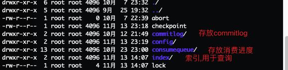

## 1. 存储架构图


rocketmq将消息存储于 `${user}/store`路径下面:



说明:

- abort：该文件在Broker启动后会自动创建，正常关闭Broker，该文件会自动消失。若在没有启动Broker的情况下，发现这个文件是存在的，则说明之前Broker的关闭是非正常关闭。
- checkpoint：其中存储着commitlog、consumequeue、index文件的最后刷盘时间戳
- commitlog：其中存放着commitlog文件，而消息是写在commitlog文件中的
- config：存放着Broker运行期间的一些配置数据
- consumequeue：其中存放着consumequeue文件，消息队列就存放在这个目录中
- index：其中存放着消息索引文件indexFile
- lock：运行期间使用到的全局资源锁

### 1. commitLog文件夹:


`commitLog文件夹`: 消息主体以及元数据的主题, 存储消息的主题内容, 一条消息的长度不是固定的, 但是默认情况下, `一个commitLog文件固定大小1GB`.commitlog文件名表示的是 该commitlog文件内第一条消息在磁盘上的物理偏移量.

<font color=red>**同一条消息不会分割开存储在两个commitlog文件中,也就是说, 当发现消息的大小比commitlog剩余容量(默认一个commitlog文件只能存储1g的数据), 就会去创建一个新的commitlog文件来存放该消息**</font>

> rocketmq源码中: 1个commitLog文件由一个`MappedFile`对象表示, 整个commitlog文件夹, 使用 `MappedFileQueue`表示.
>
> rocketmq所有的消息都是按照写入磁盘的先后顺序依次写入commitlog文件, 不会对消息进行topic的区分.

单个commitlog文件中消息存放示意图:


***Message结构***:

| 字段                      | 字段含义                                                 | 字段大小(字节)   |
| ------------------------- | -------------------------------------------------------- | ---------------- |
| msgSize                   | 代表该消息的大小(整个消息的长度,不仅仅指消息体)          | 4                |
| MagicCode                 | 魔数                                                     | 4                |
| BodeCRC                   | 消息体完整性校验信息                                     | 4                |
| queueId                   | 消息队列id                                               | 4                |
| flag                      | 为了兼容老版本消息格式?                                  | 4                |
| QueueOffset               | 消息队列的逻辑偏移量(这条消息应该放在消息队列的哪个位置) | 8                |
| Physical                  | 消息在磁盘中的物理偏移量                                 | 8                |
| sysflag                   | Compressed/MultiTages/prepared/commit/rollback           | 4                |
| BornTimeStamp             | producer端生成消息的时间                                 | 8                |
| BornHost                  | 发送消息的producer地址(ip:port)                          | 8                |
| StoreTimeStamp            | 消息存放的时间                                           | 8                |
| StoreHostAddress          | 消息存放的broker(ip:port)                                | 8                |
| ReconsumeTime             | 消费重试的次数(与消息是否称为DLM有个关)                  | 8                |
| PreperedTransactionOffset | 预提交消息的偏移量                                       | 8                |
| messagebodyLength         | 消息体大小                                               | 4                |
| messagebogy               | 消息内容                                                 | bodyLength       |
| topicLength               | topic长度                                                | 1                |
| topic                     | topic                                                    | topicLength      |
| propertiesLength          | 属性长度                                                 | 2                |
| properties                | 属性                                                     | propertiesLength |

## 2. 消息入口:

消息在进入broker后, 会在`NettyServerHandler`中, 根据requestId获取到处理 消息发送请求的处理器和线程池, 然后在sendMessageProcessor的processRequest/asyncProcessRequest方法中开始broker端处理发送消息的过程

***SendMessageProcessor#processRequest***: 这是同步请求处理的入口

```java
    public RemotingCommand processRequest(ChannelHandlerContext ctx,
                                          RemotingCommand request) throws RemotingCommandException {
        RemotingCommand response = null;
        try {
            response = asyncProcessRequest(ctx, request).get();
        } catch (InterruptedException | ExecutionException e) {
            log.error("process SendMessage error, request : " + request.toString(), e);
        }
        return response;
    }
```

***SendMessageProcessor#asyncProcessRequest()***: 异步发送消息的入口

```java
    public void asyncProcessRequest(ChannelHandlerContext ctx, RemotingCommand request, RemotingResponseCallback responseCallback) throws Exception {
        asyncProcessRequest(ctx, request).thenAcceptAsync(responseCallback::callback, this.brokerController.getSendMessageExecutor());
    }
```

***SendMessageProcessor#asyncProcessRequest(ChannelHandlerContext ctx,RemotingCommand request)***:

这个方法里面主要是对请求做了一个分发, 不同的请求分发到不同的地方去处理, 然后对生产者发送来的消息进行了requestHeader的校验

```java
    public CompletableFuture<RemotingCommand> asyncProcessRequest(ChannelHandlerContext ctx,
                                                                  RemotingCommand request) throws RemotingCommandException {
        final SendMessageContext mqtraceContext;
        switch (request.getCode()) {
            case RequestCode.CONSUMER_SEND_MSG_BACK:
                // 消费端重试消息
                return this.asyncConsumerSendMsgBack(ctx, request);
            default:
                SendMessageRequestHeader requestHeader = parseRequestHeader(request);
                if (requestHeader == null) {
                    return CompletableFuture.completedFuture(null);
                }

                // 以后做一些扩展的预留,todo 消息轨迹?
                mqtraceContext = buildMsgContext(ctx, requestHeader);
                this.executeSendMessageHookBefore(ctx, request, mqtraceContext);

                if (requestHeader.isBatch()) {
                    return this.asyncSendBatchMessage(ctx, request, mqtraceContext, requestHeader);
                } else {
                    return this.asyncSendMessage(ctx, request, mqtraceContext, requestHeader);
                }
        }
    }
```

以单条消息为例: `在4.9.1版本中所有broker发送消息请求都是走的asyncSendMessage`这个接口, `无论是异步, 同步,单向`, `putMessage接口`已经没用了

asyncSendMessage主要是做了以下几件事情:

1. 创建respones: `preSend(ctx, request, requestHeader)`
2. 消息合法性校验:  在`preSend()`方法里面 `super.msgCheck(ctx, requestHeader, response);`
3. 将消息实例化成对象, 便于存储过程中操作: 实例化成`MessageExtInner`.
4. 根据响应结果设置响应码: `handlePutMessageResultFuture`.

```java
// org.apache.rocketmq.broker.processor.SendMessageProcessor#asyncSendMessage
private CompletableFuture<RemotingCommand> asyncSendMessage(ChannelHandlerContext ctx, RemotingCommand request,
                                                                SendMessageContext mqtraceContext,
                                                                SendMessageRequestHeader requestHeader) {
        // 消息校验, 以及创建response
        final RemotingCommand response = preSend(ctx, request, requestHeader);
        final SendMessageResponseHeader responseHeader = (SendMessageResponseHeader)response.readCustomHeader();

        if (response.getCode() != -1) {
            return CompletableFuture.completedFuture(response);
        }

        final byte[] body = request.getBody();

        int queueIdInt = requestHeader.getQueueId();
        TopicConfig topicConfig = this.brokerController.getTopicConfigManager().selectTopicConfig(requestHeader.getTopic());

        // 没有指定要使用的队列,系统随机指定一个队列来使用
        if (queueIdInt < 0) {
            queueIdInt = randomQueueId(topicConfig.getWriteQueueNums());
        }
        // 构建broker内消息实例
        MessageExtBrokerInner msgInner = new MessageExtBrokerInner();
        msgInner.setTopic(requestHeader.getTopic());
        msgInner.setQueueId(queueIdInt);

        // TODO 消息多次消费失败,进入死信队列的入口
        if (!handleRetryAndDLQ(requestHeader, response, request, msgInner, topicConfig)) {
            return CompletableFuture.completedFuture(response);
        }

        // ------------------------------------------- 开始构建broker内消息实例 ----------------------------------------------\\
        msgInner.setBody(body);
        msgInner.setFlag(requestHeader.getFlag());
        Map<String, String> origProps = MessageDecoder.string2messageProperties(requestHeader.getProperties());
        // 存储消息原始的属性, 比如: tag, keys, unikey等
        MessageAccessor.setProperties(msgInner, origProps);
        // 客户端生成消息的时间
        msgInner.setBornTimestamp(requestHeader.getBornTimestamp());
        // 发送消息的producer地址
        msgInner.setBornHost(ctx.channel().remoteAddress());
        // 存储消息的broker地址
        msgInner.setStoreHost(this.getStoreHost());
        // 设置消息的重试次数
        msgInner.setReconsumeTimes(requestHeader.getReconsumeTimes() == null ? 0 : requestHeader.getReconsumeTimes());
        String clusterName = this.brokerController.getBrokerConfig().getBrokerClusterName();
        // 设置消息的property, 标记消息所在的broker集群名字
        MessageAccessor.putProperty(msgInner, MessageConst.PROPERTY_CLUSTER, clusterName);
        // 对消息的properties进行一些优化处理, 然后转换成字符串存起来
        if (origProps.containsKey(MessageConst.PROPERTY_WAIT_STORE_MSG_OK)) {
            // There is no need to store "WAIT=true", remove it from propertiesString to save 9 bytes for each message.
            // It works for most case. In some cases msgInner.setPropertiesString invoked later and replace it.
            String waitStoreMsgOKValue = origProps.remove(MessageConst.PROPERTY_WAIT_STORE_MSG_OK);
            msgInner.setPropertiesString(MessageDecoder.messageProperties2String(msgInner.getProperties()));
            // Reput to properties, since msgInner.isWaitStoreMsgOK() will be invoked later, 后面可能还会调用msgInner.isWaitStoreMsgOK() 判断
            origProps.put(MessageConst.PROPERTY_WAIT_STORE_MSG_OK, waitStoreMsgOKValue);
        } else {
            msgInner.setPropertiesString(MessageDecoder.messageProperties2String(msgInner.getProperties()));
        }

        CompletableFuture<PutMessageResult> putMessageResult = null;
        String transFlag = origProps.get(MessageConst.PROPERTY_TRANSACTION_PREPARED);
        // broker端处理事物消息的入口, todo
        if (transFlag != null && Boolean.parseBoolean(transFlag)) {
            if (this.brokerController.getBrokerConfig().isRejectTransactionMessage()) {
                response.setCode(ResponseCode.NO_PERMISSION);
                response.setRemark(
                        "the broker[" + this.brokerController.getBrokerConfig().getBrokerIP1()
                                + "] sending transaction message is forbidden");
                return CompletableFuture.completedFuture(response);
            }
            // 事物消息中 prepare消息
            putMessageResult = this.brokerController.getTransactionalMessageService().asyncPrepareMessage(msgInner);
        } else {
            // 非事物消息, rollback, commit消息, 都走这里
            putMessageResult = this.brokerController.getMessageStore().asyncPutMessage(msgInner);
        }
        // handlePutMessageResultFuture 是对消息结果编码的统一.
        return handlePutMessageResultFuture(putMessageResult, response, request, msgInner, responseHeader, mqtraceContext, ctx, queueIdInt);
    }
```

- 创建本次请求的响应对象response:

  ```java
  // org.apache.rocketmq.broker.processor.SendMessageProcessor#preSend
      private RemotingCommand preSend(ChannelHandlerContext ctx, RemotingCommand request,
                                      SendMessageRequestHeader requestHeader) {
          final RemotingCommand response = RemotingCommand.createResponseCommand(SendMessageResponseHeader.class);
  
          response.setOpaque(request.getOpaque());
          // 设置响应的扩展字段
          response.addExtField(MessageConst.PROPERTY_MSG_REGION, this.brokerController.getBrokerConfig().getRegionId());
          response.addExtField(MessageConst.PROPERTY_TRACE_SWITCH, String.valueOf(this.brokerController.getBrokerConfig().isTraceOn()));
  
          log.debug("Receive SendMessage request command {}", request);
          // startAcceptSendRequestTimeStamp 开始接收消息的时间
          final long startTimestamp = this.brokerController.getBrokerConfig().getStartAcceptSendRequestTimeStamp();
  
          if (this.brokerController.getMessageStore().now() < startTimestamp) {
              // 如果存储服务中保存的时间, 小于开始接收消息的时间, 直接返回
              response.setCode(ResponseCode.SYSTEM_ERROR);
              response.setRemark(String.format("broker unable to service, until %s", UtilAll.timeMillisToHumanString2(startTimestamp)));
              return response;
          }
  
          response.setCode(-1);
          super.msgCheck(ctx, requestHeader, response);
          // 这个地方应该是之前提取代码提取多了的代码
          if (response.getCode() != -1) {
              return response;
          }
  
          return response;
      }
  ```

- 校验消息的合法性: `super.msgCheck(ctx, requestHeader, response);`

  主要是校验了:

  1. broker是否可写, topic是否是顺序消息: 顺序消息topic, 且当前broker不可写, 就无需继续校验, 表示本次发送消息失败.
  2. 校验topic合法性: 空topic, topic长度过长, topic含有非`^[%|a-zA-Z0-9_-]+$`字符,都表示topic非法
  3. 校验topic是否是预留topic: rocketmq为了实现某些功能预留了一些topic, 不允许客户端使用, 比如: 事物消息prepare阶段的topic`RMQ_SYS_TRANS_OP_HALF_TOPIC`
  4. 检查topic在broker中是否存在路由消息: 没有就去创建, 创建不成功, 就返回, 告知客户端topic不存在
  5. 校验消息要分发到的队列是否合法: 就是看队列是否存在, 如果大于读写队列之间数量最大值, 就表示队列不合法

  ```java
  // org.apache.rocketmq.broker.processor.AbstractSendMessageProcessor#msgCheck    
  protected RemotingCommand msgCheck(final ChannelHandlerContext ctx,
          final SendMessageRequestHeader requestHeader, final RemotingCommand response) {
          // 校验broker读写权限,topic是否是顺序消息topic
          if (!PermName.isWriteable(this.brokerController.getBrokerConfig().getBrokerPermission())
              && this.brokerController.getTopicConfigManager().isOrderTopic(requestHeader.getTopic())) {
              response.setCode(ResponseCode.NO_PERMISSION);
              response.setRemark("the broker[" + this.brokerController.getBrokerConfig().getBrokerIP1()
                  + "] sending message is forbidden");
              return response;
          }
          // 校验topic的合法性, 不能为空, 长度不能过长, 不能有非法字符
          if (!TopicValidator.validateTopic(requestHeader.getTopic(), response)) {
              return response;
          }
          // rocketmq为某些功能预留了topicName, 不能被客户端使用的, 这里就是判断是否还是预留的topic, 是就直接返回
          if (TopicValidator.isNotAllowedSendTopic(requestHeader.getTopic(), response)) {
              return response;
          }
  
          TopicConfig topicConfig =
              this.brokerController.getTopicConfigManager().selectTopicConfig(requestHeader.getTopic());
          if (null == topicConfig) {
              int topicSysFlag = 0;
              //todo unitMode是什么意思?
              if (requestHeader.isUnitMode()) {
                  // 重试topic的判断
                  if (requestHeader.getTopic().startsWith(MixAll.RETRY_GROUP_TOPIC_PREFIX)) {
                      topicSysFlag = TopicSysFlag.buildSysFlag(false, true);
                  } else {
                      topicSysFlag = TopicSysFlag.buildSysFlag(true, false);
                  }
              }
  
              log.warn("the topic {} not exist, producer: {}", requestHeader.getTopic(), ctx.channel().remoteAddress());
              // 创建topic,并注册broker信息
              topicConfig = this.brokerController.getTopicConfigManager().createTopicInSendMessageMethod(
                  requestHeader.getTopic(),
                  requestHeader.getDefaultTopic(),
                  RemotingHelper.parseChannelRemoteAddr(ctx.channel()),
                  requestHeader.getDefaultTopicQueueNums(), topicSysFlag);
  
              // 创建不成功,topic信息仍然为null,
              if (null == topicConfig) {
                  // 如果是重试消息的话,会重新创建topic消息,然后再注册一次broker
                  if (requestHeader.getTopic().startsWith(MixAll.RETRY_GROUP_TOPIC_PREFIX)) {
                      topicConfig =
                          this.brokerController.getTopicConfigManager().createTopicInSendMessageBackMethod(
                              requestHeader.getTopic(), 1, PermName.PERM_WRITE | PermName.PERM_READ,
                              topicSysFlag);
                  }
              }
              // 还是没有创建成功, 就认为topic不存在, 响应给客户端
              if (null == topicConfig) {
                  response.setCode(ResponseCode.TOPIC_NOT_EXIST);
                  response.setRemark("topic[" + requestHeader.getTopic() + "] not exist, apply first please!"
                      + FAQUrl.suggestTodo(FAQUrl.APPLY_TOPIC_URL));
                  return response;
              }
          }
          // 判断队列是否合法
          int queueIdInt = requestHeader.getQueueId();
          int idValid = Math.max(topicConfig.getWriteQueueNums(), topicConfig.getReadQueueNums());
          if (queueIdInt >= idValid) {
              String errorInfo = String.format("request queueId[%d] is illegal, %s Producer: %s",
                  queueIdInt,
                  topicConfig.toString(),
                  RemotingHelper.parseChannelRemoteAddr(ctx.channel()));
  
              log.warn(errorInfo);
              response.setCode(ResponseCode.SYSTEM_ERROR);
              response.setRemark(errorInfo);
  
              return response;
          }
          return response;
      }
  ```


消息合法了, 也封装成broker内部消息实例了, 然后就是根据是否是prepare消息, 进入不同的阶段, 以普通消息(`rollback,commit,非事务消息`)为例:

`this.brokerController.getMessageStore().asyncPutMessage(msgInner)`:  这里只是对消息存储服务状态进行检查, 检查topic, properties的长度是否过长,然后就交给消息存储实现类 `commitlog`处理.

```java
// org.apache.rocketmq.store.DefaultMessageStore#asyncPutMessage
@Override
    public CompletableFuture<PutMessageResult> asyncPutMessage(MessageExtBrokerInner msg) {
        // 检查storeService的状态
        PutMessageStatus checkStoreStatus = this.checkStoreStatus();
        if (checkStoreStatus != PutMessageStatus.PUT_OK) {
            return CompletableFuture.completedFuture(new PutMessageResult(checkStoreStatus, null));
        }
        // 检查topic,properties
        PutMessageStatus msgCheckStatus = this.checkMessage(msg);
        if (msgCheckStatus == PutMessageStatus.MESSAGE_ILLEGAL) {
            return CompletableFuture.completedFuture(new PutMessageResult(msgCheckStatus, null));
        }

        long beginTime = this.getSystemClock().now();
        // 进入消息存储逻辑层了
        CompletableFuture<PutMessageResult> putResultFuture = this.commitLog.asyncPutMessage(msg);

        putResultFuture.thenAccept((result) -> {
            long elapsedTime = this.getSystemClock().now() - beginTime;
            if (elapsedTime > 500) {
                log.warn("putMessage not in lock elapsed time(ms)={}, bodyLength={}", elapsedTime, msg.getBody().length);
            }
            this.storeStatsService.setPutMessageEntireTimeMax(elapsedTime);

            if (null == result || !result.isOk()) {
                this.storeStatsService.getPutMessageFailedTimes().incrementAndGet();
            }
        });

        return putResultFuture;
    }
```


## 3. commitlog:

### 1. 核心类介绍:

***DefaultMessageStore***:

```java
public class DefaultMessageStore implements MessageStore {
    private static final InternalLogger log = InternalLoggerFactory.getLogger(LoggerName.STORE_LOGGER_NAME);

    private volatile boolean shutdown = true;
    boolean shutDownNormal = false;
    private AtomicLong printTimes = new AtomicLong(0);
    private final RunningFlags runningFlags = new RunningFlags();
    private final SystemClock systemClock = new SystemClock();
    private FileLock lock;
    private RandomAccessFile lockFile;
    // 文件刷盘点
    private StoreCheckpoint storeCheckpoint;
    // broker配置信息
    private final BrokerConfig brokerConfig;
    // 消息存储配置
    private final MessageStoreConfig messageStoreConfig;
    // broker状态数据统计类
    private final BrokerStatsManager brokerStatsManager;

    // 消息队列缓存表, 按照topic分组, 即 topic下有哪些队列
    private final ConcurrentMap<String/* topic */, ConcurrentMap<Integer/* queueId */, ConsumeQueue>> consumeQueueTable;
    // commitlog文件分发请求缓存表,实际上就是index, consumequeue的分发
    private final LinkedList<CommitLogDispatcher> dispatcherList;
    /**
     * CommitLog文件存储实现类
     */
    private final CommitLog commitLog;
    // 消息拉取长轮询模式消息到达监听器
    private final MessageArrivingListener messageArrivingListener;
    // 堆外暂存放池
    private final TransientStorePool transientStorePool;


    private final ScheduledExecutorService scheduledExecutorService =
        Executors.newSingleThreadScheduledExecutor(new ThreadFactoryImpl("StoreScheduledThread"));

    private final ScheduledExecutorService diskCheckScheduledExecutorService =
            Executors.newSingleThreadScheduledExecutor(new ThreadFactoryImpl("DiskCheckScheduledThread"));
    // --------------------------------- 存储服务类 ---------------------------------------- \\
    // 消息队列文件刷盘服务
    private final FlushConsumeQueueService flushConsumeQueueService;
    // 清理commitlog文件服务
    private final CleanCommitLogService cleanCommitLogService;
    // 清理consumeQueue服务
    private final CleanConsumeQueueService cleanConsumeQueueService;
    // 索引实现
    private final IndexService indexService;
    // mappedFile创建服
    private final AllocateMappedFileService allocateMappedFileService;
    // commitlog消息分发服务, 根据commitlog文件构建ConsumerQueue, indexFile文件
    private final ReputMessageService reputMessageService;
    // 存储ha机制服务
    private final HAService haService;
    // 消息服务调度服务
    private final ScheduleMessageService scheduleMessageService;
    // 消息存储服务
    private final StoreStatsService storeStatsService;
}
```


### . commitlog;

逻辑层次:

