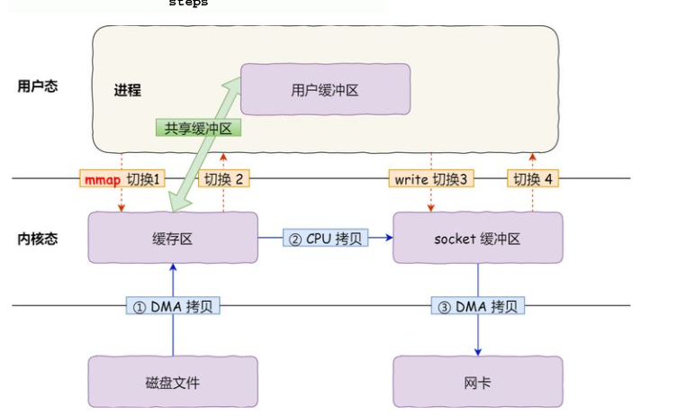

笔记记录:

# 1. commitLog

1. 每一个commitlog文件对应一个MappedFile对象

2. commitLog中Message的格式:

   

3. 存储分层关系:

   

34:100

# 2. consumequeue

consumequeue处理的流程：

# 3. 索引的构建：

1:03:36

以时间戳命名，仍然是使用一个mappedFile表示，索引本质就是一个hash表

# 4. 消息查询

# 5. 其他文件

lock文件：当主从broker使用相同文件目录的时候， 表示某个文件正在被使用

abort文件： 当broker不是安全退出就会生成这个文件，用于broker启动的时候恢复数据

checkpoint： 记录commitlog，index等文件变动的时间点。

# 2.1 内存映射：

工作流程:

1. 通过putRequestAndReturnMappedFile方法将 请求存入requestQueue,然后await等待请求的处理
2. allocateMappedFile里面有一个mmapOeration方法,一直后处理请求
3. 当优先级高的请求处理完了,就countDown通知等待的线程, 表示完成mappedFIle的创建

mappedfile的初始化

有两种创建文件的方式(绿色一种, 橘色一种), 写入的方式也就有两种

1. 绿色: 通过nio中fileChannl实现mmap, 实现mmapedFile, 
2. 橘色: 直接通过对外内存池获取一个`writeBuffer` , 然后再通过filechannel实现mmap

mmap映射形成之后, 在物理内存中一开始是没有数据的, 真正建立好映射的步骤为:

`mmapedbyteBuffer对应的是一个虚拟内存地址, 没有直接的物理内存地址来与之对应, 通过这个buffer去写入消息, 会先通过虚拟地址查找物理内存, 会发现物理内存中没有这些数据造成缺页, 然后就会去磁盘中读数据, 将数据放在物理内存中将物理内存地址与虚拟内存地址形成映射` 

预热的原因: 提前解决从磁盘中读取数据存入物理内存中这一步骤, 提前写入数据创建物理内存形成虚拟内存的映射关系

mlock的目的在于: 防止操作系统因为内存不够用对之前预热好的内存空间回收掉, 一直将预热好的内存空间保留, 从而将磁盘与内存之间的映射关系保留下来

madvise的目的在于: todo?

mmap:

1. 使用mmap()调用优化掉一次`cpu拷贝`:

   1. mmap()调用的效果: 通过内存映射,将内核空间的地址映射到用户空间,`达到内核空间和用户空间共享数据的效果`,从而减少一次从`内核空间拷贝数据到用户空间的cpu拷贝开销`

      

      

      

      过程总结:

      - 四次上下文切换:
        1. 向操作系统发起mmap()调用,`从用户空间切换到内核空间`
        2. mmap()调用完成,返回用户空间执行用户进程后续操作,`从内核空间切换到用户空间`
        3. 向操作系统发起write请求, `从用户空间切换到内核空间`
        4. write请求完成,继续执行用户进程其他任务, `从内核空间切换到用户空间`
      - 三次数据拷贝:
        1. I/O硬件向内核空间缓冲区的DMA拷贝
        2. 由于内核空间和用户空间共享数据, `无需再像用户空间复制数据`,在write的时候`直接`从内核缓冲区通过cpu拷贝数据到socket缓冲区
        3. socket缓冲区向网卡的DMA拷贝
   
   # 目录结构
   
   