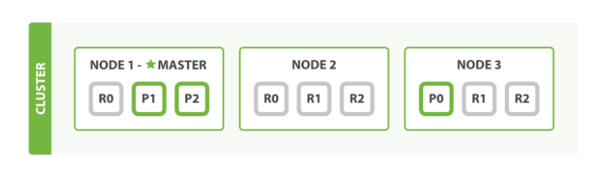

## 1. es概述:

### 1. 什么是es:

Elasticsearch 是一个分布式、可扩展、实时的搜索与数据分析引擎。

Elasticsearch 不仅仅只是全文搜索，es还提供结构化搜索(`es没有将信息存储为类似列数据库的行关系, 而是将数据序列化为json文档的复杂数据结构`)、数据分析、复杂的人类语言处理、地理位置和对象间关联关系等。

ElasticSearch 是一个开源的高扩展的分布式全文搜索引擎, 能够近乎实时的存储, 检索数据; 本身扩展性能好, 可以扩展到上百台服务器上, 处理PB级别数据.

`es是基于lucene构建, 使用java开发, 支持Restful风格查询请求的搜索引擎`


### 2. 什么是全文搜索:

全文检索（Full-Text Retrieval）是指以文本作为检索对象，找出含有指定词汇的文本。全面、准确和快速是衡量全文检索系统的关键指标。

全文检索是计算机程序通过扫描文章中的每一个词，对必要的词建立一个索引，指明该词在文章中出现的次数和位置。当用户查询时根据建立的索引查找，类似于通过字典的检索字表查字的过程。

将非结构化数据中的一部分信息提取出来，重新组织，使其变得有一定结构，然后对此有一定结构的数据进行搜索，从而达到搜索相对较快的目的。这部分从非结构化数据中提取出的然后重新组织的信息，我们称之**`索引`**。

例如：字典。字典的拼音表和部首检字表就相当于字典的索引，对每一个字的解释是非结构化的，如果字典没有音节表和部首检字表，在茫茫辞海中找一个字只能顺序扫描。然而字的某些信息可以提取出来进行结构化处理，比如读音，就比较结构化，分声母和韵母，分别只有几种可以一一列举，于是将读音拿出来按一定的顺序排列，每一项读音都指向此字的详细解释的页数。我们搜索时按结构化的拼音搜到读音，然后按其指向的页数，便可找到我们的非结构化数据——也即对字的解释。

**这种先建立索引，再对索引进行搜索的过程就叫全文检索(Full-text Search)。**

关于全文检索，我们要知道：1，只处理文本。2，不处理语义。3，搜索时英文不区分大小写。4，结果列表有相关度排序。5,并且可以对结果具有过滤高亮的功能

### 3. es和solr:

es和solr都是在lucene的基础上构建的搜索引擎,Lucene是apache下的一个开放源代码的全文检索引擎工具包。提供了完整的查询引擎和索引引擎，部分文本分析引擎.


## 2. es安装:

> es自带了jdk的, 一定要使用自带的jdk, 高版本的es依赖的jdk版本比较高

### 2.1 单机: 

#### 2.1.1 安装: 

**1、上传ElasticSearch安装包**

```shell
alt+p # 打开sftp窗口
# 上传es安装包
put e:/software/elasticsearch-7.4.0-linux-x86_64.tar.gz
```


**2、执行解压操作 ，如下图**

```shell
 # 将elasticsearch-7.4.0-linux-x86_64.tar.gz解压到opt文件夹下. -C 大写
 tar -zxvf elasticsearch-7.4.0-linux-x86_64.tar.gz  -C /opt
```

**3、创建普通用户**

因为安全问题，Elasticsearch 不允许root用户直接运行，所以要创建新用户，在root用户中创建新用户,执行如下命令：

```shell
useradd pounds  # 新增pounds用户
passwd  pounds  # 为pounds用户设置密码
```

**5、为新用户授权，如下图**

```shell
chown -R pounds:pounds /opt/elasticsearch-7.4.0 #文件夹所有者
```


将 /opt/elasticsearch-7.4.0文件夹授权给pounds用户，由上图可见，我们的文件夹权限赋给了pounds

**6、修改elasticsearch.yml文件**

```shell
vim /opt/elasticsearch-7.4.0/config/elasticsearch.yml 
```

```shell
# ======================== Elasticsearch Configuration =========================
cluster.name: my-application
node.name: node-1
network.host: 0.0.0.0
http.port: 9200
cluster.initial_master_nodes: ["node-1"]
```

`cluster.name`：配置elasticsearch的集群名称，默认是elasticsearch。建议修改成一个有意义的名称

`node.name`：节点名，elasticsearch会默认随机指定一个名字，建议指定一个有意义的名称，方便管理

`network.host`：设置为0.0.0.0

`http.port`：Elasticsearch的http访问端口

`cluster.initial_master_nodes`：初始化新的集群时需要此配置来选举master

> ps: 
>
> 1. 注意两个端口号, `9300(es默认的es集群结点之间内部通信的tcp端口号)/9200(http请求端口号)`:

**7、修改配置文件**

新创建的pounds用户最大可创建文件数太小，最大虚拟内存太小，切换到root用户，编辑下列配置文件， 添加类似如下内容

```shell
# 切换到root用户
su root 

#1. ===最大可创建文件数太小=======
vim /etc/security/limits.conf 
# 在文件末尾中增加下面内容
pounds soft nofile 65536
pounds hard nofile 65536
# =====
vim /etc/security/limits.d/20-nproc.conf
# 在文件末尾中增加下面内容
pounds soft nofile 65536
pounds hard nofile 65536
*  hard    nproc     4096
# 注：* 代表Linux所有用户名称	

#2. ===最大虚拟内存太小=======
vim /etc/sysctl.conf
# 在文件中增加下面内容
vm.max_map_count=655360
# 重新加载，输入下面命令：
sysctl -p
```

**8、启动elasticsearch**

```shell
su pounds  # 切换到pounds用户启动
cd /opt/elasticsearch-7.4.0/bin
./elasticsearch #启动
```


通过上图我们可以看到elasticsearch已经成功启动

#### 2.1.2 验证:

**1、在访问elasticsearch前，请确保防火墙是关闭的，执行命令：**

```shell
#暂时关闭防火墙
systemctl  stop  firewalld

# 或者

#永久设置防火墙状态
systemctl enable firewalld.service  #打开防火墙永久性生效，重启后不会复原 
systemctl disable firewalld.service #关闭防火墙，永久性生效，重启后不会复原 
```

浏览器输入http://192.168.149.135:9200/，如下图


此时elasticsearch已成功启动：

```
重点几个关注下即可:
number" : "7.4.0"   表示elasticsearch版本
lucene_version" : "8.2.0"  表示lucene版本
name ： 默认启动的时候指定了 ES 实例名称
cluster_name ： 默认名为 elasticsearch
```

### 2.2 集群:

集群安装采用的是docker-compose, 不采用的话修改配置文件逐一启动就行:

#### 2.2.1 创建文件:


#### 2.2.2 编写配置文件:

```yml
cluster.name: es-test-cluster
node.name: es-node1
network.bind_host: 0.0.0.0
network.publish_host: 172.21.0.11
http.port: 9201
transport.tcp.port: 9301
http.cors.enabled: true
http.cors.allow-origin: "*"
node.master: true
node.data: true
discovery.zen.ping.unicast.hosts: ["172.21.0.11:9301","172.21.0.12:9302","172.21.0.13:9303"]
cluster.initial_master_nodes: ["es-node1", "es-node2","es-node3"]
discovery.zen.minimum_master_nodes: 2
bootstrap.memory_lock: true
path.data: /es/data
path.logs: /es/logs
```

```yml
cluster.name: es-test-cluster
node.name: es-node2
network.bind_host: 0.0.0.0
network.publish_host: 172.21.0.12
http.port: 9202
transport.tcp.port: 9302
http.cors.enabled: true
http.cors.allow-origin: "*"
node.master: true
node.data: true
discovery.zen.ping.unicast.hosts: ["172.21.0.11:9301","172.21.0.12:9302","172.21.0.13:9303"]
cluster.initial_master_nodes: ["es-node1", "es-node2","es-node3"]
discovery.zen.minimum_master_nodes: 2
bootstrap.memory_lock: true
path.data: /es/data
path.logs: /es/logs
```

```yml
cluster.name: es-test-cluster
node.name: es-node3
network.bind_host: 0.0.0.0
network.publish_host: 172.21.0.13
http.port: 9203
transport.tcp.port: 9303
http.cors.enabled: true
http.cors.allow-origin: "*"
node.master: true
node.data: true
discovery.zen.ping.unicast.hosts: ["172.21.0.11:9301","172.21.0.12:9302","172.21.0.13:9303"]
cluster.initial_master_nodes: ["es-node1", "es-node2","es-node3"]
discovery.zen.minimum_master_nodes: 2
bootstrap.memory_lock: true
path.data: /es/data
path.logs: /es/logs
```

```yml
server.name: kibana
server.host: "0"
elasticsearch.hosts: [ "http://es-node1:9201", "http://es-node2:9202", "http://es-node3:9203" ]
xpack.monitoring.ui.container.elasticsearch.enabled: false
# 语言变为中文
i18n.locale: "zh-CN"
```

#### 2.2.3 compose配置:

```yml
version: "3.5"
services:
  es-node1:
    image: elasticsearch:7.14.1
    hostname: es-node1
    container_name: es-node1
    expose:
      - "9001"
    ports:
      - "9201:9201"
      - "9301:9301"
    volumes:
      - ./node1/conf/nodes-9201.yml:/usr/share/elasticsearch/config/elasticsearch.yml
      - ./node1/data:/es/data
      - ./node1/logs:/es/logs
    environment:
      - cluster.name=es-cluster
      - bootstrap.memory_lock=true
      - "ES_JAVA_OPTS=-Xms256m -Xmx256m"
    ulimits:
      memlock:
        soft: -1
        hard: -1
    networks:
      es-cluster-network:
        ipv4_address: 172.21.0.11
  es-node2:
    image: elasticsearch:7.14.1
    hostname: es-node2
    container_name: es-node2
    expose:
      - "9002"
    ports:
      - "9202:9202"
      - "9302:9302"
    volumes:
      - ./node2/conf/nodes-9202.yml:/usr/share/elasticsearch/config/elasticsearch.yml
      - ./node2/data:/es/data
      - ./node2/logs:/es/logs
    environment:
      - cluster.name=es-cluster
      - bootstrap.memory_lock=true
      - "ES_JAVA_OPTS=-Xms256m -Xmx256m"
    ulimits:
      memlock:
        soft: -1
        hard: -1
    networks:
      es-cluster-network:
        ipv4_address: 172.21.0.12
  es-node3:
    image: elasticsearch:7.14.1
    hostname: es-node3
    container_name: es-node3
    expose:
      - "9003"
    ports:
      - "9203:9203"
      - "9303:9303"
    volumes:
      - ./node3/conf/nodes-9203.yml:/usr/share/elasticsearch/config/elasticsearch.yml
      - ./node3/data:/es/data
      - ./node3/logs:/es/logs
    environment:
      - cluster.name=es-cluster
      - bootstrap.memory_lock=true
      - "ES_JAVA_OPTS=-Xms256m -Xmx256m"
    ulimits:
      memlock:
        soft: -1
        hard: -1
    networks:
      es-cluster-network:
        ipv4_address: 172.21.0.13  
  kibana:
    image: kibana:7.14.1
    container_name: kibana
    ports:
      - "5601:5601"
    volumes:
      - ./kibana.yml:/usr/share/kibana/config/kibana.yml
    environment:
      - ELASTICSEARCH_URL=http://es-node1:9201
    networks:
      - es-cluster-network
    depends_on:
      - es-node1
      - es-node2
      - es-node3
  logstash:
    image: logstash:7.14.1
    container_name: logstash
    networks:
      - es-cluster-network
    environment:
      - "LS_JAVA_OPTS=-Xms256m -Xmx256m"
    depends_on:
      - es-node1
      - es-node2
      - es-node3
networks:
  es-cluster-network:
    name: es-cluster-network
    driver: bridge
    ipam:
      driver: default
      config:
      - subnet: 172.21.0.0/16
        gateway: 172.21.0.1
```

#### 2.2.4 注意事项:

1. `networkes`: 在配置网络的时候, 应该尽量加上`name属性`, 不然容易造成容器之间网络不通

2. 如果容器挂载的时候出现权限问题, 这里是宿主机除了问题, 不是容器的问题,在宿主机中加上读写权限.如: `chmod -R 777 文件夹`

3. docker退出代码 137是宿主机内存不足, 需要给宿主机扩容.

4. 启动是时候可能出现:

   ```java
   [1]: max virtual memory areas vm.max_map_count [65530] is too low, increase to at least [262144]（elasticsearch用户拥有的内存权限太小，至少需要262144）
   ```

   处理办法:

   ```bash
   # 修改配置sysctl.conf
   [root@localhost ~]# vi /etc/sysctl.conf
   # 添加下面配置：
   vm.max_map_count=262144
   # 重新加载：
   [root@localhost ~]# sysctl -p
   # 最后重新启动elasticsearch，即可启动成功。
   ```
   
5. 安装插件:

   以安装ik分词器为例子: 

   1. docker-compose中文件挂载 `- ./node2/plugins:/usr/share/elasticsearch/plugins`, 这一句后面的是容器镜像默认的插件存放的文件夹, 即`/usr/share/elasticsearch/plugins`. 

      这个默认插件路径可以通过`path.plugins`配置项在es.yaml配置文件中设置

   2. 将需要安装的插件放在上面挂载的文件夹中, `注意要是编译后的插件包, 而不是source包`

   3. 一定要重启es实例!一定要重启es实例!一定要重启es实例!

## 3. es基础概念:

### 3.1 数据结构相关:

#### 3.1.1 索引(index):

Elasticsearch 添加数据时需要用到 *索引* —— 保存相关数据的地方。 `索引实际上是指向一个或者多个物理分片的逻辑命名空间`。

一个索引就是一个拥有几分相似特征的文档的集合。比如说，可以有一个客户数据的索引，另一个产品目录的索引，还有一个订单数据的索引。

一个索引由一个名字来标识（必须全部是小写字母），并且要对这个索引中的文档进行索引、搜索、更新和删除的时候，都要使用到这个名字。在一个集群中，可以定义任意多的索引。

#### 3.1.2 分片(shard)/副本(replicas):

- `分片(shard)`: 一个 *分片* 是一个底层的 *工作单元* ，它仅保存了全部数据中的一部分, `一个分片是一个 Lucene 的index`，以及它本身就是一个完整的搜索引擎.

  一个分片可以是 *主* 分片或者 *副本* 分片。 索引内任意一个文档都归属于一个主分片，所以主分片的数目决定着索引能够保存的最大数据量。

  Elasticsearch 是利用分片将数据分发到集群内各处的。分片是数据的容器，文档保存在分片内，分片又被分配到集群内的各个节点里。 当你的集群规模扩大或者缩小时， Elasticsearch 会自动的在各节点中迁移分片，使得数据仍然均匀分布在集群里。

- `副本(replicas)`: 索引副本. 同样也是以分片的形式,分布在不同的结点上.`副本分片作为硬件故障时保护数据不丢失的冗余备份，并为搜索和返回文档等读操作提供服务`。

> 一个主分片最大能够存储 `Integer.MAX_VALUE - 128` 个文档
>
> 主分片和副本分片都是在索引创建的时候指定, `ES默认5:1 5个主分片，每个分片，1个副本分片`
>
> ```sense
> PUT /blogs
> {
> "settings" : {
>    "number_of_shards" : 3,
>    "number_of_replicas" : 1
> }
> }
> ```
>
> `非必要情况下, 不要修改主分片数量,副本分片可以随意修改`
>
> 如果一定要修改的话, 官方建议:
>
> ```java
> 1 按照需要创建一个新的索引；
> 2 reindex把索引现有的数据同步到新索引中；
> 3 别名绑定新创建的索引上；
> ```
>
> 从ES6.1开始，ES 支持split操作，可以在线操作扩大shard的数量（注意：操作期间也需要对index锁写）
>
> 从ES7.0开始，split时候，不再需要加参数 index.number_of_routing_shards在 这个split的过程中， 它会先复制全量数据，然后再去做删除多余数据的操作，需要注意磁盘空间的占用。

`关于分片大小`: lucene的一个index最多能存储20亿个文档. 因此一个分片也就只能存放20亿个文档. es官方建议一个分片的大小在`10G-50G`之间, 太多会影响查询效率, 副本修复时耗时长, 分片太小的话会导致索引的分片数目很多, 查询时带来的 fanin-fanout太大

#### 3.1.3 类型(type):

~~每个文档都有与之对应的类型（type）定义。这允许用户在一个索引中存储多种文档类型，并为不同文档提供类型提供不同的映射~~

> 这个概念在6.x版本逐渐弱化, 7.x版本直接本删除了

#### 3.1.4 文档(document):

在应用程序中对象很少只是一个简单的键和值的列表。通常，它们拥有更复杂的数据结构，可能包括日期、地理信息、其他对象或者数组等。

使用关系型数据库的行和列存储，当于是把一个表现力丰富的对象塞到一个非常大的电子表格中：为了适应表结构，必须设法将这个对象扁平化: `通常一个字段对应一列—而且每次查询时又需要将其重新构造为对象。`

es是面向文档的, 即 es在存储对象的时候, 不会将对象进行扁平化的拆分, 而是`通过 json序列化的方式, 将整个数据对象当做一个文档存储`. 

#### 3.1.5 映射(mapping):

文档中各个字段如何被es处理是通过mapping这个概念来定义的, mapping可以定义字段的类型, 字段使用的分词器, 字段如何被分词器分割成词条.

#### 3.1.6 倒排索引:

`正排索引:` 根据文档id,获取文档内容

`倒排索引:` 将数据的内容按照一定的规则分割成不同的词条, 根据词条找到最相关的文档id.


### 3.2 其他:

1. 恢复(recovery):

   代表数据恢复或叫数据重新分布，es在有节点加入或退出时会根据机器的负载对索引分片进行重新分配;

   挂掉的节点重新启动时也会进行数据恢复。

2. 近实时(NRT):

   Elasticsearch 是一个接近实时的搜索平台。这意味着，从索引一个文档直到这个文档能够被搜索到有一个很小的延迟（通常是 1 秒）。

3. 数据源(river):

   代表es的一个数据源，也是其它存储方式（如：数据库）同步数据到es的一个方法。

   它是以插件方式存在的一个es服务，通过读取river中的数据并把它索引到es中，官方的river有couchDB的，RabbitMQ的，Twitter的，Wikipedia的，river这个功能其实用的不多。

4. `网关(gateway)`:

   代表es索引的持久化存储方式，es默认是先把索引存放到内存中，当内存满了时再持久化到硬盘。这个es集群关闭再重新启动时，就会从gateway中读取索引数据。

   es支持多种类型的gateway，有本地文件系统（默认），分布式文件系统，Hadoop的HDFS和amazon的s3云存储服务。

5. `自动发现(discovery.zen)`:

   代表es的自动发现节点机制，es是一个基于p2p的系统，它先通过广播寻找存在的节点，再通过多播协议来进行节点之间的通信，同时也支持点对点的交互.

   5.X关闭广播，需要自定义通讯的主机

6. `通信（Transport)`

   代表es内部节点或集群与客户端的交互方式，默认内部是使用tcp协议进行交互，同时它支持http协议（json格式）、thrift、servlet、memcached、zeroMQ等的传输协议（通过插件方式集成）。

   `节点间通信端口默认：9300-9400`

## 4. es配置文件:

```yaml
# 配置的集群名称，默认是elasticsearch，es服务会通过广播方式自动连接在同一网段下的es服务，通过多播方式进行通信，同一网段下可以有多个集群，通过集群名称这个属性来区分不同的集群。
cluster.name: elasticsearch

# 节点名，当前配置所在机器的节点名，你不设置就默认随机指定一个name列表中名字，该name列表在es的jar包中config文件夹里name.txt文件中，其中有很多作者添加的有趣名字。
node.name: "Franz Kafka"

# 指定该节点是否有资格被选举成为node，默认是true，es是默认集群中的第一台机器为master，如果这台机挂了就会重新选举master。
node.master: true

# 指定该节点是否存储索引数据，默认为true。
node.data: true

node.ingest: true

# 设置默认索引分片个数，默认为5片。
index.number_of_shards: 5

# 设置默认索引副本个数，默认为1个副本。
index.number_of_replicas: 1

# 设置配置文件的存储路径，默认是es根目录下的config文件夹。
path.conf: /path/to/conf

# 设置索引数据的存储路径，默认是es根目录下的data文件夹，可以设置多个存储路径，用逗号隔开，例：
path.data: /path/to/data
path.data: /path/to/data1,/path/to/data2

# 设置临时文件的存储路径，默认是es根目录下的work文件夹。
path.work: /path/to/work

# 设置日志文件的存储路径，默认是es根目录下的logs文件夹
path.logs: /path/to/logs

# 设置插件的存放路径，默认是es根目录下的plugins文件夹
path.plugins: /path/to/plugins

# 设置为true来锁住内存。因为linux物理内存执行效率比虚拟内存高很多, 当jvm开始swapping(就是开始使用虚拟内存)时es的效率会降低，所以要保证它不swap，可以把ES_MIN_MEM和ES_MAX_MEM两个环境变量设置成同一个值，并且保证机器有足够的物理内存内存分配给es。同时也要允许elasticsearch的进程可以锁住内存，linux下可以通过`ulimit -l unlimited`命令。
bootstrap.mlockall: true

# 设置绑定的ip地址，可以是ipv4或ipv6的，默认为0.0.0.0。
network.bind_host: 192.168.0.1

# 设置其它节点和该节点交互的ip地址，如果不设置它会自动判断，值必须是个真实的ip地址。
network.publish_host: 192.168.0.1

# 这个参数是用来同时设置bind_host和publish_host上面两个参数。
network.host: 192.168.0.1
# 设置节点间交互的tcp端口，默认是9300。
transport.tcp.port: 9300

# 设置是否压缩tcp传输时的数据，默认为false，不压缩
transport.tcp.compress: true

# 设置对外服务的http端口，默认为9200。
http.port: 9200

# 设置内容的最大容量，默认100mb
http.max_content_length: 100mb

# 是否使用http协议对外提供服务，默认为true，开启。
http.enabled: false

# gateway的类型，默认为local即为本地文件系统，可以设置为本地文件系统，分布式文件系统，hadoop的HDFS，和amazon的s3服务器，其它文件系统的设置方法下次再详细说。
gateway.type: local

# 设置集群中N个节点启动时进行数据恢复，默认为1。
gateway.recover_after_nodes: 1

# 设置初始化数据恢复进程的超时时间，默认是5分钟。
gateway.recover_after_time: 5m

# 设置这个集群中节点的数量，默认为2，一旦这N个节点启动，就会立即进行数据恢复。
gateway.expected_nodes: 2

# 初始化数据恢复时，并发恢复线程的个数，默认为4。
cluster.routing.allocation.node_initial_primaries_recoveries: 4

# 添加删除节点或负载均衡时并发恢复线程的个数，默认为4。
cluster.routing.allocation.node_concurrent_recoveries: 2

# 设置数据恢复时限制的带宽，如入100mb，默认为0，即无限制。
indices.recovery.max_size_per_sec: 0

# 设置这个参数来限制从其它分片恢复数据时最大同时打开并发流的个数，默认为5。
indices.recovery.concurrent_streams: 5

# 设置这个参数来保证集群中的节点可以知道其它N个有master资格的节点。默认为1，对于大的集群来说，可以设置大一点的值（2-4）
discovery.zen.minimum_master_nodes: 1

# 设置集群中自动发现其它节点时ping连接超时时间，默认为3秒，对于比较差的网络环境可以高点的值来防止自动发现时出错。
discovery.zen.ping.timeout: 3s

# 设置是否打开多播发现节点，默认是true。
discovery.zen.ping.multicast.enabled: false

# 设置集群中master节点的初始列表，可以通过这些节点来自动发现新加入集群的节点。
discovery.zen.ping.unicast.hosts: ["host1", "host2:port", "host3[portX-portY]"]

# 下面是一些查询时的慢日志参数设置
index.search.slowlog.level: TRACE
index.search.slowlog.threshold.query.warn: 10s
index.search.slowlog.threshold.query.info: 5s
index.search.slowlog.threshold.query.debug: 2s
index.search.slowlog.threshold.query.trace: 500ms

index.search.slowlog.threshold.fetch.warn: 1s
index.search.slowlog.threshold.fetch.info: 800ms
index.search.slowlog.threshold.fetch.debug: 500ms
index.search.slowlog.threshold.fetch.trace: 200ms

```

> `注意不管是多少节点的es集群都要求, master节点的数量要 满足 master候选节点数量 >= (集群节点数量/2)+1.`
>
> 即 discovery.zen.minimum_master_nodes: 1 这个配置要满足上述要求

## 5. es集群:

### 5.1 Cluster:

多个es程序实例组成的一个集群, 其中包含一个主节点, 多个从节点.

es是一个去中心化的集群, 对于连接集群的客户端来讲, 是没有主节点这一概念的, 无论连接哪个节点与整个集群通信都是没有区别的.


### 5.2 es集群角色:

es集群中的所有节点都保存了集群状态

- `master node`: `主节点`, 该节点不和应用创建连接.

  作用: master节点控制整个集群的元数据.只有master节点可以修改节点的状态信息, 以及元数据的处理.

  元数据, 比如:

  1. 索引的分片信息, 主副本信息
  2. 分片的结点分配信息, 路由分配
  3. index, type, Mapping
  4. setting配置等.

  当一个节点被选举成为 *主* 节点时， 它将负责管理集群范围内的所有变更，例如增加、删除索引，或者增加、删除节点等。 而主节点并不需要涉及到文档级别的变更和搜索等操作，所以当集群只拥有一个主节点的情况下，即使流量的增加它也不会成为瓶颈。

  > master节点不占用磁盘i/o和cpu, 内存使用量一般, 没有data节点高

- `master eligible node`: `master候选节点`, 配置中`node.master: true`就表是设置该节点为master候选节点, 表示该节点可以被选举为主节点, 从而控制集群.

- `data node`: `数据节点`, 配置中`node.data: true`就表示该节点为data节点.

  作用: 

  data节点用于建立index, 接受客户端连接, 搜索请求. 

  data节点是es中真正存储数据的节点, 在每个节点都是最优配置下, 该节点决定es的性能.

  data节点的分片执行查询语句获得查询结果后将结果反馈给Coordinating节点，在查询的过程中非常消耗硬件资源，如果在分片配置及优化没做好的情况下，进行一次查询非常缓慢(硬件配置也要跟上数据量)。

  保存包含索引文档的分片数据，执行CRUD、搜索、聚合相关的操作。属于：内存、CPU、IO密集型，对硬件资源要求高。

- `coordinating node`: `协调节点`, es集群中所有节点都是协调节点, 如果一个节点将node.master，node.data，node.ingest全部设置为false, 那么该节点就是专门的协调节点, 专用于接受client的搜索请求, 专用协调节点是不存储数据的.

  作用: 搜索请求的分发和结果聚合.

- `ingest node`: `ingest 节点可以看作是数据前置处理转换的节点`，支持 pipeline管道 设置，可以使用 ingest 对数据进行过滤、转换等操作，类似于 logstash 中 filter 的作用，功能相当强大。

  作用: 节点接收到数据之后，根据请求参数中指定的管道流 id，找到对应的已注册管道流，对数据进行处理，然后将处理过后的数据，按照 Elasticsearch 标准的 indexing 流程继续运行。

- `tribe node`: `tribe节点`可以通过tribe.*相关参数来设置，它是一种特殊的coordinate node，可以连接到多个es集群上去，然后对多个集群执行搜索等操作。tribe还可以写数据，但是这里有一个限制，就是写的索引只能是一个集群所有；如果写入两个集群同名索引，那么只能成功写入一个，至于写入哪一个可以通过配置偏好实现。可以通过配置指明tribe只能读，不能写。

实际上, 一个节点在默认情况下会同时扮演: master, data, ingest以及coordinate

| 节点类型               | 配置项      | 默认值                                          |
| ---------------------- | ----------- | ----------------------------------------------- |
| master/master eligible | node.master | true                                            |
| data                   | node.data   | true                                            |
| ingest                 | node.ingest | true                                            |
| coordinate             | 无          | 将上面三个全部设置为false, 节点就是专用协调节点 |

关于是否配置专用节点的建议:

对于3-5个节点的小集群来讲, 通常会让节点同时扮演`master`和`data`节点角色. 这样就可以将任何请求发送给任何节点, 并且所有节点都具有集群状态的副本, 知道如何路由请求

通常只有大型集群才会去配置专有`master`或者`data`, 甚至是`coordinate`. 原因是: 路由节点从数据节点消除了聚合/查询的请求解析和最终阶段, 并且允许数据节点专注于处理数据. 小集群达不到能够处理的请求量是达不到需要路由节点的量.

> es中节点角色分别由`node.master, node.ingest, node.data`这三个配置项控制, `默认都是true`, 且`每个节点都是协调节点`.
>
> 特别的: tribe节点需要 通过`tribe.*`配置项来设置

### 5.3 集群状态:

#### 5.3.1 查询集群状态:

```http
# 查询API: GET _cat/health?v
```

结果:

```java
epoch      timestamp cluster    status node.total node.data shards pri relo init unassign pending_tasks max_task_wait_time active_shards_percent
1646494753 15:39:13  es-cluster green           3         3     46  23    0    0        0             0                  -                100.0%
```

`status就是表示集群的状态信息`

集群的几种状态:

1. `green`: 所有的主分片和副本分片都是active状态
2. `yellow`: 所有主分片处于active状态, 至少有一个副本分片缺失, 此时集群所有功能都能正常使用, 数据不会丢失, 搜索结果依然完整, 集群可用性减弱. --- 可以给维护人员一个及时处理的告警提示
3. `red`: 至少有一个主分片(以及其副本分片)缺失, 此时部分数据不能使用, 搜索结果不完整, 分配到该分片的写入请求会出现异常. --- 必须要处理了.

出现yellow的几种情况:

1. 集群只有一个es节点, 并且es中只有一个kibana内建的索引数据.
2. es默认每个index分配5主5副本, 为了防止主副本在同一个机器上时因为机器出问题造成主副分片同时不可用, es要求同一个index的主副分片不能在同一个机器上, 如果再同一个机器上集群就会变为yellow
3. 当前服务中, Kibana内建的index是1个primary shard和1个replica shard, 由于只有1个node,所以只有primary shard被分配和启动了, 而replica shard没有被成功分配(没有其他node可用).

## 6. es版本升级:

[滚动升级](https://www.elastic.co/guide/en/elasticsearch/reference/7.17/rolling-upgrades.html)

### 6.1 滚动升级:

滚动升级允许Elasticsearch集群每次升级一个节点，这样升级不会中断服务。 不支持在同一个集群中运行多个版本的Elasticsearch，因为无法从升级后的节点复制碎片到运行旧版本的节点。

在升级时将集群中的节点划分为以下两组，并按照以下顺序进行升级:  

1. 非候选节点为一组, 通过`GET /_nodes/_all,master:false`可以查找出所有非候选节点 或者 手动找出`配置项 node.master: false`的所有节点.
2. 剩下的 候选节点为一组. `GET /_nodes/master:true` 获取所有的候选节点.

按照上面这个顺序升级, 可以保证非候选节点至少和候选节点的版本一样新. `高版本的节点总是可以加入到主节点为低版本的集群中, 反之不行.`最后升级候选节点可以保证无论主节点是否已经升级, 非候选节点都能成功加入到集群中来. `如果先更新候选节点的话, 低版本的非候选节点在他们更新成功之前可能存在无法加入到集群中来的风险`

滚动升级支持的版本:

1. 同一个大版本之间的小版本升级, 比如: 7.a 升级到 7.b
2. 5.6 到 6.8
3. 6.8 到 7.17.0

6.7及以前的版本升级到7.17 需要重启集群


### 6.2 准备工作:

一旦开始将集群升级到7.17.0版，就必须完成升级。一旦集群包含7.17.0版本的节点，它可能会对其内部状态进行无法恢复的更改。如果无法完成升级，则应放弃部分升级的群集，在升级之前部署版本的空群集，并从快照恢复其内容。

1. 检查弃用日志，看看是否使用了任何弃用的特性，并相应地更新代码。  
2. 检查破坏性的更改，并对7.17.0版本的代码和配置进行必要的更改。  
3. 如果您使用任何插件，请确保每个插件都有一个与Elasticsearch 7.17.0版本兼容的版本。  
4. 在升级生产集群之前，请在一个隔离的环境中测试升级。  
5. 通过快照备份您的数据!  


### 6.3 开始升级

#### 6.3.1 关闭分片分配:

当关闭一个数据节点, 分配处理会等待``index.unassigned.node_left.delayed_timeout(默认一分钟)`时长后, 开始复制该节点上的分片到其他节点, 这个过程可能会造成大量的磁盘I/O. 由于很快会启动该节点, 所以分片分配这个过程就是不必要的. 命令如下:

```http
POST _cluster/setting
{
	"persistent": {
		"cluster.routing.allocation.enable": "primaries"
	}
}
```

#### 6.3.2 停止不必要的索引 并执行同步写入.(可选操作)

虽然可以在升级期间继续索引，但暂时停止非必要的索引并执行同步刷新，则碎片恢复速度会快得多。

```http
POST _flush/synced
```

执行同步刷新的时候要注意, 响应状态可能是成功的, 但是停止索引操作, 可能会造成异常结果保存同步刷新请求体中返回. 如果有异常就需要重新执行操作.

`同步刷新已弃用，将在8.0中移除`。刷新与Elasticsearch 7.6或更高版本上的同步刷新具有相同的效果。

#### 6.3.3 暂停机器学习和数据供给相关的操作.(可选)

#### 6.3.4 关闭该节点:

- If you are running Elasticsearch with `systemd`:

  ```sh
  sudo systemctl stop elasticsearch.service
  ```

- If you are running Elasticsearch with SysV `init`:

  ```sh
  sudo -i service elasticsearch stop
  ```

- If you are running Elasticsearch as a daemon:

  ```sh
  kill $(cat pid)
  ```

#### 6.3.5 更新该节点:

1. 使用Debian或RPM包升级:

   使用rpm或dpkg安装新包。所有文件都安装在操作系统的适当位置，Elasticsearch配置文件不会被覆盖.

2. 使用zip包更新:

   - 如果没有使用自定义的配置文件和data文件夹, 需要将zip解压在原安装路径以外的路径下.

   - 设置环境变量`ES_PATH_CONF`来指定自定义的配置文件和jvm.options文件.如果没有使用自定义配置, 直接将原来的配置文件复制到新的安装路径下.

   - 在`config/elasticsearch.yaml`中设置`path.data`指定数据路径,之前没有设置的话, 复制原来的数据文件夹到新的安装路径下.

     > 如果使用了监控特性，升级es时需要使用原来的数据文件夹。监控通过使用存储在数据目录中的持久UUID标识惟一的Elasticsearch节点。

   - 在`config/elasticsearch.yaml`中设置`path.logs`指定日志路径,之前没有设置的话, 复制原来的数据文件夹到新的安装路径下.

> 生产环境建议使用rpm或者debian的方式升级.
>
> 在滚动升级的时候, 建议取消`cluster.initial_master_nodes`的设置.每个升级的节点都加入一个现有的集群，因此不需要集群引导。但是必须设置每个节点的`discovery.seed_hosts` 或者 `discovery.seed_providers`属性

#### 6.3.6 升级插件:

#### 6.3.7 启动节点:

启动新升级的节点，通过`查看日志文件`或`_cat/nodes`确认节点是否加入集群:

```http
GET _cat/nodes
```

#### 6.3.8 开启分片分配:

```http
PUT _cluster/settings
{
  "persistent": {
    "cluster.routing.allocation.enable": null
  }
}
```

#### 6.3.9 等待分片分配完毕:

通过下面这个命令检查,等待“status”字段切换为green。一旦节点变成green，所有的主碎片和复制碎片都被分配了。

```console
GET _cat/health?v=true
```

> 在滚动升级期间, 高版本节点的主分片不能将副本分片分配给低版本的结点(数据结构可能不同).只有一个节点升级好了的时候, 副本分片会处于未分配状态, 集群的status值为`yellow`, 在这种情况下，只要没有初始化或重新定位分片，就可以继续进行(注意看init和relo字段)。有另外的结点更新完毕, 集群status就会变为`green`

如果分片数据没有同步写入的话可能需要一定的时间来恢复.通过下面这个命令就可以查看恢复状态:

```http
GET _cat/recovery
```

#### 6.3.10 重复这个操作


## 7 使用技巧:

### 7.1 平滑迁移:

场景: 需要给索引字段进行修改, 比如添加/删除/类型修改等操作

操作流程:

- 原来的`index_v1`

  ```json
  { 
      "settings": { 
          "number_of_shards": 3, 
          "number_of_replicas": 1 , 
          "analysis" : { 
              "analyzer" : { 
                  "ik" : { 
                      "tokenizer" : "ik_max_word" 
                  } 
              } 
          } 
      },
      "mappings": { 
          "properties": { 
              "id": { 
                  "type": "keyword" 
              }, 
              "title": { 
                  "type": "text", 
                  "analyzer": "ik_max_word" 
              }, 
              "content": {
                  "type": "text", 
                  "analyzer": "ik_max_word" 
              },
              "viewCount": { 
                  "type": "integer" 
              },
              "creatDate": { 
                  "type": "date", 
                  "format": "yyyy-MM-dd HH:mm:ss||yyyy-MM-dd||epoch_millis" 
              }, 
              "tags": { 
                  "type": "keyword" 
              }
          } 
      } 
  }
  ```

- 将别名`my_index` 指向索引 `index_v1`

  ```http
  PUT /index_v1/_alias/my_index
  ```

- 根据需要创建新索引 `index_v2`

  ```json
  PUT /index_v2
  { 
      "settings": { 
          "number_of_shards": 3, 
          "number_of_replicas": 1 , 
          "analysis" : { 
              "analyzer" : { 
                  "ik" : { 
                      "tokenizer" : "ik_max_word" 
                  } 
              } 
          } 
      },
      "mappings": { 
          "properties": { 
              "id": { 
                  "type": "keyword" 
              }, 
              "title": { 
                  "type": "text", 
                  "analyzer": "ik_max_word" 
              }, 
              "content": {
                  "type": "text", 
                  "analyzer": "ik_max_word" 
              },
              "viewCount": { 
                  "type": "integer" 
              },
              "creatDate": { 
                  "type": "date", 
                  "format": "yyyy-MM-dd HH:mm:ss||yyyy-MM-dd||epoch_millis" 
              }, 
              "tags": { 
                  "type": "keyword" 
              },
              "owner": { // 新增字段
                  "type": "keyword",
                  "analyzer": "ik_max_word" 
              }
          } 
      } 
  }
  ```

- 数据迁移, reindex `index_v1` 到 `index_v2`

  ```json
  POST _reindex
  {
    "source": {
      "index": "index_v1"
    },
    "dest": {
      "index": "index_v2"
    }
  }
  ```

- 将`index_v1`从 别名`my_index` 的映射关系中删除.

  ```json
  POST /_aliases
  {
      "actions": [
          { "remove": { "index": "index_v1", "alias": "my_index" }},
          { "add":    { "index": "index_v2", "alias": "my_index" }}
      ]
  }
  ```

> 1. `在实际使用中, 操作索引一定是通过索引的别名来操作的.比如, 当需要查询index_v1(别名my_index)在程序中使用的index名称是my_index, 而不是index_v1` 这样做的目的是可以随时随地的通过reindex操作, 对index的mapping进行修改.
> 2. 通过这几个步骤就实现了平滑切换 零停机, 这里面切换别名的操作是原子性的 所以不用担心数据搜索错乱的问题

### 7.2 使用模板预设mapping:

由于es的动态映射机制, 有的时候es动态映射出来的mapping结构并不是我们索想要的结果. 比如: integer类型在es中会被映射为long类型, 同时long类型是不能被分词的. `如果存入es的数据有一定映射要求就可以使用动态模板`

Dynamic field mappings默认情况下是根据elasticsearch支持的数据类型来推测参数值的类型，而`动态模板允许您定义自定义映射规则`，根据自定义的规则来推测字段值所属的类型，从而添加字段类型映射。

`设置模板语句`:

```json
PUT /_template/模板名称
{ 
	"order": 0, // 模板优先级 
	"template": "sample_info*", // 模板匹配的index名字, 匹配出来的index都是用这个模板中的设置, 这个模板匹配的索引为 以sample_info开头的所有索引
    "settings": {...}, // 索引设置 
    "mappings": {
        "doc": {           
			"dynamic_templates": [                          
				  {                                               
					 "string_as_keyword": {                   
							"match_mapping_type": "string", 
							"mapping": {                      
							  "type": "keyword"             
							}                                   
						}                                       
					}                                           
				],                                              
 			"properties": {     
				 "TRANSAMOUNT": {       
				 	"type": "double"   
				 },
				 "consumeTime": {       
				 	"type": "integer"   
				 },
				 "transTime": {       
				 	"type": "date",   
				 	"format": "yyyy-MM-dd HH:mm:ss||yyyy-MM-dd||epoch_millis" 
				 }
 			}  
 		}      
    }, // 索引中各字段的映射定义 
    "aliases": {...} // 索引的别名 
}
```

其中, `dynamic_templates`就是设置动态模板的地方, 一般格式为:

```json
"dynamic_templates": [      // @1
    {
      "my_template_name": {    // @2
        ...  match conditions ...    // @3
        "mapping": { // @4
          "type":  {dynamic_type}, // @5
          "analyzer": "{name}" // @6
      	}              
      }
    },
    ...
  ]
```

代码@1：在类型映射时通过dynamic_templates属性定义动态映射模板，其类型为数组。
代码@2：`my_template_name`定义动态映射模板名称。
代码@3：匹配条件，其定义方式包括：

- match_mapping_type(字段类型检测)： 设置匹配的数据类型, 匹配的是es JSON解析之后的类型, 比如: `match_mapping_type：long`, es JSON解析后所有的long类型都会使用这个模板
- match/unmatch(字段名字检测): 匹配字段名字. 比如: `match: long_*`, 表示以long_开头的字段都适用于这个模板. `当match和unmatch同时出现的时候, 是并且关系`.
- match_pattern(比较模式): match比较的模式, 比如: `match_pattern: "regex"`, 表示match使用正则表达式进行匹配.
- path_match/path_unmatch(字段路径检测): 字段的全路径进行检测, 比如: `path_match":   "name.*`, 表示name下所有字段, `当path_match和path_unmatch同时出现的时候, 是并且的关系`.

代码@4：匹配@3的字段使用的类型映射定义（映射参数为类型映射中支持的参数)

代码@5: {name}是个占位符, 表示该模板匹配到的字段的名称

代码@6: {dynamic_type}是个占位符, 表示改模板匹配到的类型

## 8. es原理:

### 8.1 分片演示:

为了方便演示, 一个索引在es集群中的存储添加索引(三个主分片, 每个主分片复制一份)

```http
PUT /blogs
{
   "settings" : {
      "number_of_shards" : 3,
      "number_of_replicas" : 1
   }
}
```

1. 没有索引时:

   es节点中没有索引:


2. 单机有索引:

   

   此时集群健康 `GET /_cluster/health` 数据为:

   ```json
   {
     "cluster_name": "elasticsearch",
     "status": "yellow", 
     "timed_out": false,
     "number_of_nodes": 1,
     "number_of_data_nodes": 1,
     "active_primary_shards": 3,
     "active_shards": 3,
     "relocating_shards": 0,
     "initializing_shards": 0,
     "unassigned_shards": 3, 
     "delayed_unassigned_shards": 0,
     "number_of_pending_tasks": 0,
     "number_of_in_flight_fetch": 0,
     "task_max_waiting_in_queue_millis": 0,
     "active_shards_percent_as_number": 50
   }
   ```

   > yellow是因为此时的副本分片处于`未分配状态`, 出于高可用考虑, es认为 主分片和副本分片在同一个节点上是没有意义的.


3. 两个节点:

   

   当第二个节点加入到集群后，3个 *副本分片* 将会分配到这个节点上——每个主分片对应一个副本分片.这意味着当集群内任何一个节点出现问题时，我们的数据都完好无损。

   所有新近被索引的文档都将会保存在主分片上，然后被并行的复制到对应的副本分片上。这就保证了既可以从主分片又可以从副本分片上获得文档。

4. 三个节点:

   

   `Node 1` 和 `Node 2` 上各有一个分片被迁移到了新的 `Node 3` 节点，现在每个节点上都拥有2个分片，而不是之前的3个。 这表示每个节点的硬件资源（CPU, RAM, I/O）将被更少的分片所共享，每个分片的性能将会得到提升。

   分片是一个功能完整的搜索引擎，它拥有使用一个节点上的所有资源的能力。 我们这个拥有6个分片（3个主分片和3个副本分片）的索引可以最大扩容到6个节点，每个节点上存在一个分片，并且每个分片拥有所在节点的全部资源。

5. 如果调大副本分片数量: 

   `将副本分片数量调整到2`

   ```sense
   PUT /blogs/_settings
   {
      "number_of_replicas" : 2
   }
   ```

   

6. 某个节点宕机后:

   假设`node1`宕机了, es内部的选举机制会选举一个新的主节点, 假设`node2`被选举成主节点, 由于主分片`P1,P`2丢失了, 那么主节点会将对应的副本分片(`r1,r2`)提升为主分片.

   

   当node1宕机, node2还没有被选举成主节点的时候, 集群的状态是 `red`, 因为不是所有的主分片都是可用的.

   当node2选举出来了, 并且把r1,r2提升成主分片后, 集群的状态就会变成 `yellow`, 因为副本分片的数量不足, 之前设置的是2个副本分片

7. node重新加入集群后:

   如果重新启动 `Node 1` ，集群可以将缺失的副本分片再次进行分配, 如果 `Node 1` 依然拥有着之前的分片，它将尝试去重用它们，同时`仅从主分片复制发生了修改的数据文件`。

   

