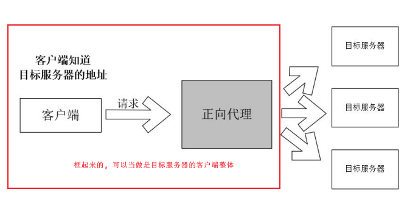
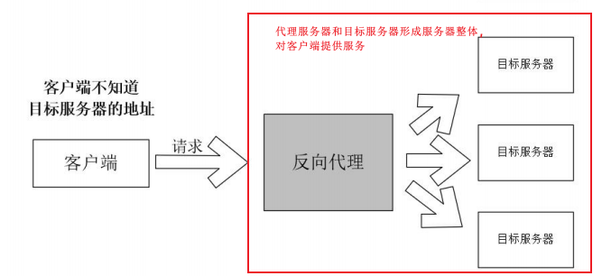
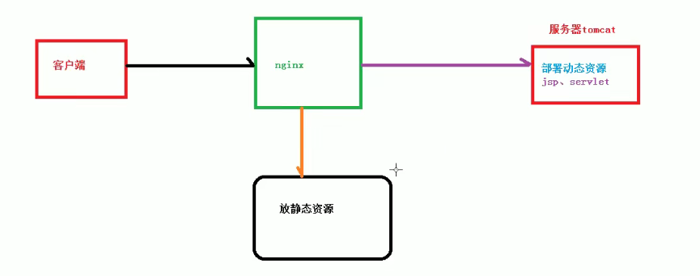
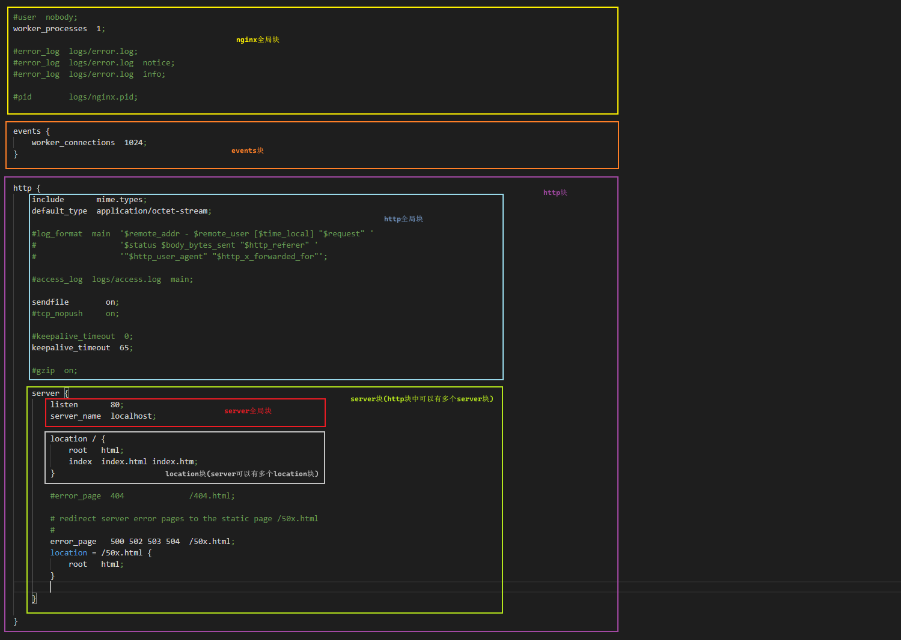
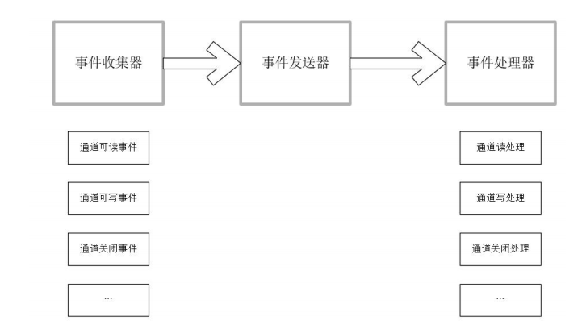
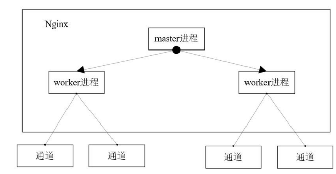
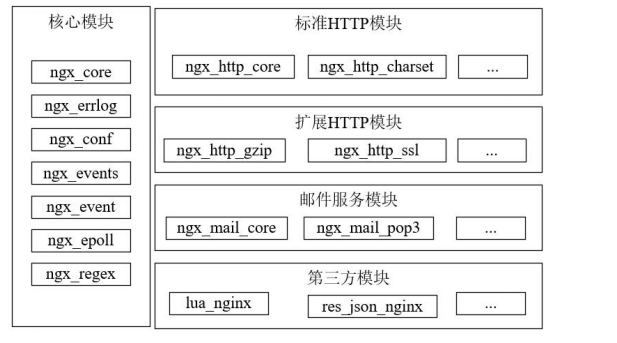
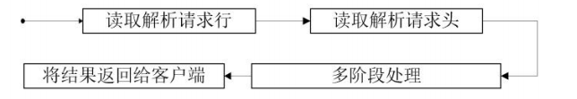
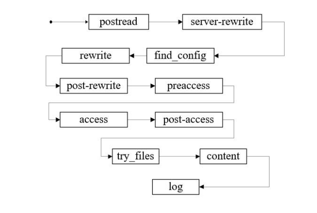

## 1. Nginx概述:

nginx是一个高性能的http和反向代理web服务器(也可以正向代理).Nginx具有高稳定性, 丰富的功能集, 内存消耗少, 并发能力强的特点.

Nginx主要的社区分支:

- Nginx官方版本:

  更新迭代比较快, 并且分别提供免费和商业两个版本, 官方版本有报告表示: 能够支持最高 5w 个并发连接数

- Tengine:

  淘宝网发起的web服务器项目.在nginx的基础上针对高并发网站的需求添加了很多高级功能和特性. 其目的是打造一个高性能, 稳定, 安全和易用的web平台

- OpenResty:

  在Nginx的基础上嵌入了LuaJIT VM, 实现了高性能服务端解决方案. OpenResty是基于nginx和lua的高性能web平台, 其内部集成了大量的lua库, 第三方模块以及大多数依赖项,用于方便地搭建能够处理高并发, 扩展型极高的动态web引用, web服务和动态网关. OpenResty的目标是让Web服务直接跑在Nginx服务内部，充分利用Nginx的非阻塞I/O模型，不仅仅对HTTP客户端请求，甚至于对远程后端诸如MySQL、PostgreSQL、Memcached以及Redis等都进行一致的高性能响应。

  从而将Nginx有效地变成一个强大的通用Web应用平台，使得Web开发人员和系统工程师可以使用Lua脚本语言调动Nginx支持的各种C以及Lua模块，快速构造出足以胜任10K乃至1000K以上单机并发连接的高性能Web应用系统。 

​	

## 2. Nginx的用途

### 1. web服务器:

nginx作为http服务器, 有以下基本特性:

- 能够处理静态文件, 索引文件, 以及自动所以; 打开文件描述符缓冲
- 无缓存的反向代理加速, 简单的负载均衡 和 容错.
- 模块化的结构
- 支持SSL和TLSSNI.
- nignx支持poll模型, 最高支持5w 个并发连接数.
- nginx采用分阶段资源分配技术, 让其内存占用非常的低, nginx官方表示保持10000个没有活动的连接, 仅占用2.5M内存.

### 2. 正向代理:

正向代理: 客户端通过访问正向代理服务器, 正向代理服务器代表客户端去请求目标服务器,从而实现客户端访问原本无法访问的目标服务器.

> 正向代理, 客户端在发送请求的时候是直到目标服务器地址的, 但是不直接请求目标服务器. `比如: vpn`



### 3. 反向代理:

反向代理: 正向代理代表客户端请求目标服务器, 而反向代理代表的是目标服务器接受客户端的请求.

> 方向代理, 客户端在发送请求的时候, 实际上是不需要知道(或者说是服务端不希望客户端知道)目标服务器的地址, 客户端请求的是代理服务器地址.



### 4. 负载均衡:

负载均衡: nginx支持通过一定的分发策略将请求到nginx的请求, 分发到不同的服务器上面, 从而提高效率.

### 5. 动静分离:

动静分离: 为了加快网站的解析速度，可以把动态页面和静态页面由不同的服务器来解析，加快解析速度。降低原来单个服务器的压力。`即动态页面,与静态页面由不同的服务器进行解析`



## 3. Nginx安装:

http://nginx.org/en/download.html, 官网下载, 上传服务器, tar命令解压

### OpenResty安装:

https://openresty.org/cn/installation.html

1. 安装前的准备:

   在安装前, 确保已经安装了 nginx需要的依赖 `perl 5.6.1+`, `libpcre`, `libssl` ,通过`ldconfig`可以在系统环境路径能看到即可

   安装`perl 5.6.1+`, `libpcre`, `libssl`:

   - ubuntu:

     ```bash
     apt-get install libpcre3-dev libssl-dev perl make build-essential curl
     
     # 可能会提示缺少zlib依赖
     apt-get install zlib1g-dev
     ```

   - centos:

     ```bash
     yum install pcre-devel openssl-devel gcc curl
     ```

2. 安装OpenResty: `源码编译安装的方式安装`

   - 官网下载源码: wget https://openresty.org/download/openresty-version.tar.gz
   
   - 安装:
   
     ```bash
     # 默认安装路径为 /usr/local/openresy
     ./configure
     
     make && make install
     ```
   
     > 其中./configure就是配置安装,主要是用于编译的时候,加入需要的模块. 设置安装路径等配置
     >
     > `./configure --help`可以查看可以配置些什么东西
   
3. 设置开机启动:

   - 创建nginx服务: vi /lib/systemd/system/nginx.service

     ```bash
       Description=nginx
       
       After=network.target
       
       [Service]
       
       Type=forking
       
       ExecStart=/usr/local/openresty/nginx/sbin/nginx
       
       ExecReload=/usr/local/openresty/nginx/sbin/nginx -s reload
       
       ExecStop=/usr/local/openresty/nginx/sbin/nginx -s quit
       
       PrivateTmp=true
       
       [Install]
       
       WantedBy=multi-user.target
     ```

   - 启动nginx并加入nginx:

     ```bash
     systemctl start nginx.service
     
     systemctl enable nginx.service
     ```


## 4. Nginx常用命令:

为了方便给nginx配置环境变量 

```bash
vim /etc/profile
# 将nginx可执行文件所在的路径加入path
export PATH=$PATH:/usr/local/openresty/nginx/sbin/
```

### 常用命令和参数:

```bash
  -?,-h         : this help                                                              # 帮助
  -v            : show version and exit													 # 查看版本
  -V            : show version and configure options then exit							 # 查看版本和当前配置参数
  -t            : test configuration and exit											 # 测试nginx配置文件是否正确
  -T            : test configuration, dump it and exit									 # 测试配置文件,并输出当前配置
  -q            : suppress non-error messages during configuration testing				 # 在配置测试期间只显示错误信息
  -s signal     : send signal to a master process: stop, quit, reopen, reload			 # 向nginx发送单个指令: 立即退出, 退出, 重新打开, 重新加载
  -p prefix     : set prefix path (default: /usr/local/openresty/nginx/)                 # 设置nginx所在路径
  -e filename   : set error log file (default: logs/error.log)							 # 指定error输出到filename
  -c filename   : set configuration file (default: conf/nginx.conf)						 # 指定配置文件为filename
  -g directives : set global directives out of configuration file						 # 启动时指定全局配置项的命令

```

> quit和stop的区别: quit会执行完当前nginx已经接受的请求, sotp不会

```
平滑升级nginx
```

1.kill -s SIGUSR2  <nginx master pid> 会将nginx.pid重命名为nginx.pid.oldbin

2.使用命令启动nginx

3.使用kill -s SIGQUIT <旧版本的master pid> 关闭旧版本服务

### 通过脚本启动OpenResty

```sh
#!/bin/bash 
# 设置Openresty的安装目录 
OPENRESTRY_PATH="/usr/local/openresty" 
# 设置Nginx项目的工作目录,存放nginx运行数据的目录 
PROJECT_PATH="/work/develop/LuaDemoProject/src/" 
# 设置 项目的配置文件 
# PROJECT_CONF="nginx-location-demo.conf" 
PROJECT_CONF="nginx.conf" 
echo "OPENRESTRY_PATH:$OPENRESTRY_PATH" 
echo "PROJECT_PATH:$PROJECT_PATH" 
# 查找Nginx所有的进程id 
pid=$(ps -ef | grep -v 'grep' | egrep nginx| awk '{printf $2 " "}') 
#echo "$pid" 
if [ "$pid" != "" ]; then 
    # 如果已经在执行，则提示 
    echo "openrestry/nginx is started already, and pid is $pid, operating failed!" 
else
    # 如果没有执行，则启动 
    $OPENRESTRY_PATH/nginx/sbin/nginx -p ${PROJECT_PATH} \ 
                                      -c ${PROJECT_PATH}/conf/${PROJECT_CONF} 
    pid=$(ps -ef | grep -v 'grep' | egrep nginx| awk '{printf $2 " "}') 
    echo "openrestry/nginx starting succeeded!" 
    echo "pid is $pid " 
fi
```

## 5. Nginx配置文件:

配置文件的路径: ``

### 1. 配置文件构成:



- `nginx全局块`: 从配置文件开始到 events快之间的内容, 主要会设置一些影响nginx服务器整体运行的配置指令, 主要包括陪u子运行nginx服务器的用户组, 允许生成的worker process数量, 进程PID存放路径, 日志存放路径和类型, 以及配置文件的引入等等.
- `events块`: events开头的花括号括起来的指令, events所涉及的指令, 主要是影响nginx服务器与用户的网络连接, 常用的设置包括是否开启多worker process下的网络连接进行序列化, 是否允许同时接受多个网络连接, 选取那种时间驱动模型来处理请求, 每个worker process可以同时支持的最大连接数等
- `http块`: http主要功能配置, 比如代理,缓存和日志定义等巨大多数功能和第三方模块的配置都在这里.包含`http全局块`和`多个server块`
  - `http全局块`: 配置的指令包括文件引入,mime-type定义, 日志定义, 连接超时时间,单链接请求数上限等 
  - `server块`: server块和虚拟主机有密切关系, 虚拟主机从用户角度来看, 和一台独立的硬件主机是完全一样的.server块同样有`server全局块`和多个`location块`.
    - `server全局块`: 常见的配置是本虚拟主机的监听配置和本虚拟主机的名称或者ip
    - `location块`: 主要作用是基于nginx接受到请求字符串(uri, 对虚拟主机名称之外的字符串)根据正则进行匹配,对特定的请求进行不同的处理 --- 地址定向, 数据缓存, 应答控制等等, 许多第三方模块也在这里.

> 1. event模块主要是与nginx服务器的性能相关, 需要根据实际考虑.

## 6. Nginx的核心原理:

1. 线程模型:

   nginx采用的是 单Reactor多worker的线程模型. 基本单元为: `事件收集器`, `事件发送器`, `事件处理器`:

   - 事件收集器: 负责收集客户端和worker进程的各种I/O请求.

   - 事件发送器: 负责将I/O事件发送给事件处理器.

   - 事件处理器: 负责处理事件的业务逻辑.

     

2. nginx的两类进程:

   nginx在工作的时候会以`daemon`方式在后台工作, 后台进程有两类: master进程和worker进程.

   

   根据nginx的启动方式不同, 生成进程的数量也不同:

   1. 单进程启动: 此时系统中仅有一个进程, 其既是master进程又是worker进程.
   2. 多进程启动: 此时系统中就会有多个进程, 一个master, 至少一个worker进程.

   `master进程`的作用:

   1. 负责监听socket, 将socket中接收到的I/O ,交给worker进程继续监听
   2. 负责调度worker进程, 比如: 加载配置, 启动worker进程, 接受来自外界的信号, 向worker进程发送i/o信号, 监控worker进程的运行状态.

   `worker进程`的作用:

   1. worker进程主要是用来处理网络事件, 当一个Worker进程在accept一条连接通道之后，就开始读取请求、解析请求、处理请求，处理完成产生数据后，再返回给客户端，最后才断开连接通道

      如果启动了多个Worker进程，则每个Worker子进程独自尝试accept已连接的Socket监听通道， accept操作默认会上锁，优先使用操作系统的共享内存原子锁，如果操作系统不支持则使用文件上锁。

3. nginx的模块化设计:

   什么是Nginx模块呢？在Nginx的实现中，一个模块它包含一系列的命令（cmd）和这些命令相对应的处理函数（cmd→handler）。Nginx的Worker进程执行过程中会通过配置文件的配置指令，定位到对应的功能模块的某个命令（cmd），然后调用命令对应的处理函数来完成相应的处理。

   

4. nginx请求处理流程:

   nginx中http请求的处理流,大致为4步:

   1. 读取解析请求行
   2. 读取解析请求头
   3. 多阶段处理, 也就是执行handler处理器列表
   4. 返回结果

   

   多阶段处理是nginx的核心流程, 一共分为了11个阶段, `类似于Netty的pipleline, 链式处理`. 顺序如下:

   

   > 第三方模块的处理器也在这个阶段: 
   >
   > （1）用Memcache进行页面缓存的第三方模块。 
   >
   > （2）用Redis集群进行页面缓存的第三方模块。 
   >
   > （3）执行Lua脚本的第三方模块。

   - post-read阶段: 在这个阶段注册的处理器不多, 比如: ngx_realip处理器, 这个处理器主要是用来修改请求真正发起的ip地址(有的请求可能是从正向代理发送出来的, 将真正的ip地址约定好封装在请求头里面)

     ```conf
     # 这里的配置就是将来自 192.168.0.100的所有请求ip设置成请求头中`X-My-IP`对应的值 
     server { 
     	listen 8080; 
     	set_real_ip_from 192.168.0.100; 
     	real_ip_header X-My-IP; 
     	location /test {
         echo "from: $remote_addr "; 
         }
     }
     ```

   - server-rewrite阶段: 在请求uri与location匹配之前, 通过这个阶段可以修改uri.`大部分配置在server块中的配置, 都是运行在这个阶段`

   - find-config阶段: 主要是根据uri去查找匹配的location路由表达式.这个阶段不支持Nginx模块注册处理程序.这个阶段请求还没有与location关联起来, 所以location内的配置是没有用的

   - rewrite结点: rewrite阶段也叫请求地址重写阶段，可以注册在rewrite阶段的指令，首先是ngx_rewrite模块的指令，比如break、if、return、rewrite、set等。其次，第三方ngx_lua模块中的set_by_lua指令和rewrite_by_lua指令也能在此阶段注册。

   - post-rewrite阶段: 请求地址URI重写提交（post）阶段，防止递归修改uri造成死循环（一个请求执行10次就会被Nginx认定为死循环），该阶段只能由Nginx HTTP Core（ngx_http_core_module）模块实现

   - preeaccess阶段: 访问权限检查准备阶段, 控制访问频率的ngx_limit_req模块和限制并发度ngx_limit_zone模块的相关指令, 就注册在此阶段.

   - access阶段: 访问权限检查阶段，配置指令多是执行访问控制类型的任务，比如检查用户的访问权限、检查用户的来源IP地址是否合法等。在此阶段能注册的指令有：HTTP标准模块ngx_http_access_module模块的指令、第三方ngx_auth_request模块的指令、第三方ngx_lua模块的access_by_lua指令等。

     ```conf
     server { 
     	#.... 
     	#拒绝全部 
     	location = /denyall { 
     		deny all; 
     	}
     	# 允许来源IP属于192.168.0.0/24网段或127.0.0.1的请求 
     	# 其他来源IP全部拒绝。 
     	location = /allowsome { 
     		allow 192.168.0.0/24; 
     		allow 127.0.0.1; 
     		deny all; 
     		echo "you are ok"; 
     	} 
     	#....
     }
     如果同一个location块配置了多个allow/deny配置项，access阶段的配置项之间是按顺序匹配的， 匹配成功一个便跳出。
     ```

   - post-access阶段: 访问权限检查提交阶段.如果请求不被允许访问Nginx服务器，该阶段负责向用户返回错误响应。在access阶段可能存在多个访问控制模块的指令注册，post-access阶段的satisfy配置指令可以用于控制它们彼此之间的协作方式。

     ```conf
     #satisfy指令进行协调 
     location = /satisfy-demo { 
     	satisfy any; 
     	access_by_lua "ngx.exit(ngx.OK)"; # 控制访问模块
     	deny all; # 控制访问模块
     	echo "you are ok"; 
     }
     statisfy any: 表示控制访问模块中 只要通过其中一种验证就算验证通过.
     statisfy all: 表示控制访问模块中 必须要所有的验证都要通过才算通过.
     ```

   - try-files阶段: 如果http请求访问静态文件资源，try_files配置项可以使这个请求顺序地访问多个静态文件资源，直到某个静态文件资源符合选取条件。这个阶段只有一个标准配置指令try_files，并不支持Nginx模块注册处理程序。

     try_files指令接受多个参数 `空格分割`, 每个参数都指定了一个URI, 则nginx会在try-files阶段, 依次把前n-1个参数映射为文件系统上的对象, 然后检查这些对象是否存在.一旦发现某个文件存在, 就表示查找成功, nginx就会try-files阶段把当前请求的uri改为该对象对应的参数uri(不会带`/`,也不会发生内部跳转).如果前n-1个参数所对应的文件系统对象都不存在,try-files阶段会立即发起`内部跳转`, 跳转到最后一个参数指定的URI.

     ```conf
     
     	# root指令把“查找文件的根目录”配置为 /var/www/ 
     	root /var/www/; 
         location = /try_files-demo { 
             try_files /foo /bar /last; 
         }
         #对应到前面try_files的最后一个URI 
         location /last { 
             echo "uri: $uri "; 
         } 
     ```

   - content阶段: 大部分HTTP模块会介入内容产生阶段，是所有请求处理阶段中重要的阶段。Nginx的echo指令，第三方ngx_lua模块的content_by_lua指令都是注册在此阶段。

     >这里要注意的是，每一个location只能有一个“内容处理程序”，因此，当在location中同时使用多个模块的content阶段指令时，只有其中一个模块能成功注册成为“内容处理器”。例如echo和content_by_lua如果同时注册，最终只会有一个生效，但具体是哪一个生效，结果是不稳定的。

   - log阶段: 记录日志

5. location路由规则:

   nginx的server模块中location模块主要是用于处理请求应该按照何种路由规则快速的去定位资源.

   | 匹配规则符号: | 描述                                                         |
   | ------------- | ------------------------------------------------------------ |
   | =             | 精确匹配                                                     |
   | ^~            | 前缀匹配(前缀都满足, 匹配度最高的表示成功匹配),`nginx默认匹配规则` |
   | ~             | 正则匹配, 区分大小写                                         |
   | ~*            | 正则匹配, 不区分大小写                                       |
   | !~            | 区分大小写的正则匹配, 符合正则表达式的uri会被排除            |
   | !~*           | 不区分大小写的正则匹配, 符合正则表达式的uri会被排除          |
   | @             | 给location命名, 通常用于nginx内部重定向, 类似于 `goto`       |
   | /             | 特殊的匹配, `仅仅匹配根路径`                                 |

   路由规则:

   1. 遍历uri前缀所有匹配的location,判断是否有 `=` 修饰的精确匹配location, 有就返回该location
   2. 如果前缀匹配的location中,没有`=`精确匹配的,则找到匹配度最高的`即最长前缀`,记录下来, 并判断最长前缀location是否是由 `^~`修饰,如果是,返回该location.
   3. 如果也没有`~^`修饰的location, 那么开始正则匹配, 按照location在配置文件中出现的顺序从上到下一次匹配, 一旦满足正则要求就停止,返回location.
   4. 如果所有正则匹配都没有匹配上面就返回之前记录的最长前缀location.

   伪代码:

   ```java
   public Location getMatchLocation(){
       Location maxPrefixLocation = prefixLocationList.get(0)
       for (Location location : prefixLocationList){
           if (location.getModifier().equals("=") && location.getPath().equals(uri)){
               return location;
           }
           if (location.getPath().lenght > maxPrefixLocation) {
               maxPrefixLocation = location;
           }
       }
       
       if (maxPrefixLocation.getModifier().equals("^~")) {
           return maxPrefixLocation;
       }
       // regularLocationList这个是按照location在config中出现的顺序进入集合的.
       for (Location location : regularLocationList) {
           if (location.getPath().match(uri)){
               return location;
           }
       }
       return maxPrefixLocation;
   }
   ```

   

## 7. 常用配置:

### 2. events 事件驱动配置:

- woerker_connections: 配置worker进程能够创建的最大连接数. 参数为上限.
- use: 配置I/O多路复用的模型, 常用的有 `select,epoll`.在linux上推荐使用epoll模型.
- accept_mutex: 配置woker创建连接的时候是否上互斥锁. 如果不上锁, 当有新请求过来的时候会唤醒所有worker, 造成惊群效应.

### 3. server配置:

- listen: 可以只监听端口, 也可以监听ip:port, 还可以通过default_server字段设置默认server.

- server_name: 虚拟主机的名字, 用于定位server块.

  通过`server_name`可以设置服务器名字, 服务器名字可能是 `固定名称`, `通配符名名称`, `正则表达式`

  `server_name`不同设置方式的优先级不同:

  1. 固定名字优先级最高
  2. 后缀通配符名字,`*.example.com`
  3. 前缀通配符名字, `com.example.*`
  4. 正则表达式名字, 多个正则表达式都成功匹配的时候, 优先级由 server_name 在配置文件中出现的顺序从上到下依次降低.

  > server_name是匹配的请求头上面的`Host`字段, 如果没有`Host`或者没有匹配上则会将请求发送到listen指令中带有default_server的server上.

## 8. 使用示例:

### 1. 反向代理:

- proxy_pass指令: 指定目标资源路径.

  > 如果目标资源路径为 `通信协议://ip:port`, 这时通过nginx发出的请求为 `通信协议://ip:port/资源路径`
  >
  > 如果目标资源路径为 `通信协议://ip:port/`, 这时通过nginx发出的请求为 `通信协议://ip:port/location匹配的路径/资源路径`
  >
  > 如果目标资源路径为 `通信协议://ip:port/任意前缀`, 这时会将实例请求uri中与location匹配的前缀截去后,拼接在目标资源路径上.

  实例:

  ```conf
      # 模拟目标主机
      server { 
          listen 8080 ; 
          server_name localhost; 
          default_type 'text/html'; 
          charset utf-8; 
  
          location / { 
              echo "-uri= $uri" 
                  "-host= $host" 
                  "-remote_addr= $remote_addr" 
                  "-proxy_add_x_forwarded_for= $proxy_add_x_forwarded_for" 
                  "-http_x_forwarded_for= $http_x_forwarded_for" ; 
          } 
      }
      
      # 模拟代理服务器
      server { 
          listen 80 default; 
          server_name localhost; 
          default_type 'text/html'; 
          
          charset utf-8; 
          location / { 
              echo "默认根路径匹配: /"; 
          }
  
          # 目标资源路径以 / 结尾
          location /test_endwith_root{
              proxy_pass http://127.0.0.1:8080/;
              # 测试: curl 127.0.0.1:80/test_endwith_root/aaa.html
  			# 结果: 
  				-uri= /aaa.html 
  				-host= 127.0.0.1 
  				-remote_addr= 127.0.0.1 
  				-proxy_add_x_forwarded_for= 127.0.0.1 
  				-http_x_forwarded_for=
          }
  
          # 目标资源路径不以 / 结尾
          location /test_endwithout_root{
              proxy_pass http://127.0.0.1:8080;
              # 测试: curl 127.0.0.1:80/test_endwithout_root/aaa.html
              # 结果: 
              	-uri= /test_endwithout_root/aaa.html 
              	-host= 127.0.0.1 
              	-remote_addr= 127.0.0.1 
              	-proxy_add_x_forwarded_for= 127.0.0.1 
              	-http_x_forwarded_for= 
          }
  
          # 目标资源路径以 任意后缀 结尾
          location /test_endwith_any-suffix{
              proxy_pass http://127.0.0.1:8080/suffix/;
              # 测试: curl  127.0.0.1:80/test_endwith_any-suffix/aaa.html
              # 结果:
              	-uri= /suffix/aaa.html 
              	-host= 127.0.0.1 
              	-remote_addr= 127.0.0.1 
              	-proxy_add_x_forwarded_for= 127.0.0.1 
              	-http_x_forwarded_for=
          }
  
          # 目标资源路径以 任意后缀 结尾
          location /test_endwith_aaaa{
              proxy_pass http://127.0.0.1:8080/suffixaaaa-;
              # 测试:
              # 结果:
              	-uri= /suffixaaaa-/aaa.html 
              	-host= 127.0.0.1 
              	-remote_addr= 127.0.0.1 
              	-proxy_add_x_forwarded_for= 127.0.0.1 
              	-http_x_forwarded_for=
          }
      }
  
  
  configure arguments: --prefix=/usr/local/openresty/nginx --with-cc-opt=-O2 --add-module=../ngx_devel_kit-0.3.1 --add-module=../echo-nginx-module-0.62 --add-module=../xss-nginx-module-0.06 --add-module=../ngx_coolkit-0.2 --add-module=../set-misc-nginx-module-0.32 --add-module=../form-input-nginx-module-0.12 --add-module=../encrypted-session-nginx-module-0.08 --add-module=../srcache-nginx-module-0.32 --add-module=../ngx_lua-0.10.20 --add-module=../ngx_lua_upstream-0.07 --add-module=../headers-more-nginx-module-0.33 --add-module=../array-var-nginx-module-0.05 --add-module=../memc-nginx-module-0.19 --add-module=../redis2-nginx-module-0.15 --add-module=../redis-nginx-module-0.3.7 --add-module=../rds-json-nginx-module-0.15 --add-module=../rds-csv-nginx-module-0.09 --add-module=../ngx_stream_lua-0.0.10 --with-ld-opt=-Wl,-rpath,/usr/local/openresty/luajit/lib --add-module=/home/pounds/soft/ngx_http_proxy_connect_module --with-stream --with-stream_ssl_module --with-stream_ssl_preread_module --with-http_ssl_module
  ```

  
